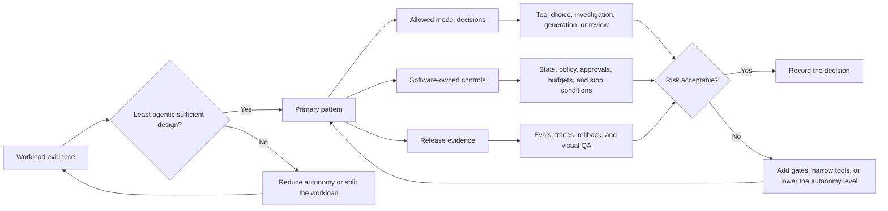

# Choosing the Right Pattern

El diseño agentic es un espectro. La mejor arquitectura suele ser el agentic system menos complejo que pueda cumplir con el requerimiento con calidad, latencia, costo y riesgo aceptables.

Usa este capítulo antes de elegir un framework, agregar agents o construir una topología multi-agent. La decisión debe comenzar por la carga de trabajo, no por el pattern más poderoso disponible.

## Selection Flow

Utiliza este diagrama como filtro práctico antes de subir en la escalera de autonomía. La pregunta no es "¿puede un agent hacerlo?" La pregunta es qué pattern más pequeño puede satisfacer la carga de trabajo con menos riesgo.


## The Autonomy Ladder

Sube en la escalera solo cuando el peldaño inferior no pueda manejar el trabajo.

| Level | Pattern Shape | Use When | Main Risk |
| --- | --- | --- | --- |
| 1 | LLM call | Una sola respuesta, reescritura, clasificación, extracción o resumen es suficiente. | Sin acceso a datos en vivo o acciones. |
| 2 | Prompt chain | El trabajo tiene fases conocidas y cada fase puede validarse antes de iniciar la siguiente. | Puertas frágiles o latencia innecesaria. |
| 3 | Deterministic workflow with LLM steps | El código controla la secuencia, mientras los LLMs manejan juicios acotados dentro de los pasos. | Sobreajustar el workflow al proceso actual. |
| 4 | Routing and handoffs | Diferentes entradas requieren distintos models, prompts, tools, agents o policies. | Un mal routing envía el trabajo a la autoridad equivocada. |
| 5 | Single agent loop | El siguiente paso depende de observaciones descubiertas durante la ejecución. | Loops, mal uso de tools y errores acumulativos. |
| 6 | Orchestrator-workers | El sistema debe dividir un task desconocido en subtasks y sintetizar resultados. | El orchestrator se convierte en un plano de control oculto. |
| 7 | Multi-agent system | Diferentes especialistas necesitan context, tools, permisos o roles de revisión separados. | Sobrecarga de coordinación, fragmentación de traces y aumento de costos. |
| 8 | Autonomous long-running agent | El task abarca tiempo, fallas, eventos externos y progreso parcial. | Autonomía sin límites sin strong state, policy y observability. |

Esta escalera no es un modelo de madurez. Un sistema en producción puede quedarse en el nivel 2 para siempre si el task es estable y el valor es claro.

## First Questions

Haz estas preguntas antes de seleccionar un pattern:

- ¿El workflow es conocido antes de iniciar la ejecución?
- ¿El model necesita elegir el siguiente paso, o puede hacerlo el código?
- ¿El task requiere datos actuales, datos privados, tools o efectos secundarios?
- ¿El sistema puede tolerar latencia extra por múltiples llamadas al model?
- ¿Cuál es el costo máximo aceptable por ejecución?
- ¿Qué requiere aprobación humana?
- ¿Qué evidencia prueba que la respuesta o acción es correcta?
- ¿Qué state debe poder reproducirse tras una falla?
- ¿Qué podría salir mal si el model es persuasivo pero incorrecto?

Si las respuestas no son claras, comienza con un deterministic workflow y agrega comportamiento agentic solo donde el workflow necesite juicio del model.

## Selection Outputs

No dejes la selección de pattern como una conversación. Documenta la decisión en una forma que otro ingeniero pueda revisar.

```text
Workload:
Primary pattern:
Why this is the least agentic sufficient design:
Model decisions allowed:
Software-owned controls:
Tools and side effects:
State that must be persisted:
Approval requirements:
Eval cases required before release:
Fallback or rollback path:
```

La línea más importante es "por qué este es el diseño agentic suficiente más simple". Si la respuesta es "porque los agents son flexibles", el diseño no está listo. Nombra la incertidumbre real que el model debe manejar: intención ambigua, siguiente paso desconocido, evidencia incompleta, elección variable de tool o investigación abierta.

## Decision Record Map

Utiliza este mapa para convertir la salida de selección en un artifact de revisión de ingeniería. Una elección de pattern está lista cuando la evidencia de la carga de trabajo, el límite de autonomía, los controles y la evidencia de liberación pueden revisarse por separado.



## Selection Matrix

| Workload Signal | Prefer | Avoid |
| --- | --- | --- |
| Secuencia fija conocida | Prompt Chaining and Gates | Autonomous agents |
| Uno de varios tipos de tasks conocidos | Routing and Handoffs | Un solo giant prompt |
| Subtasks independientes | Parallel Agents | Cadenas secuenciales que generan latencia evitable |
| Subtasks desconocidos | Orchestrator-workers | Listas de tasks codificadas |
| La calidad mejora con revisión | Evaluator-Optimizer | Generación de una sola pasada |
| Efectos secundarios de alto riesgo | Human Approval Gates | Ejecución directa de tools desde la salida del model |
| Gran superficie de tools | MCP-first Tool Use with policy | Tools amplios sin tipado |
| Trabajo de larga duración | Durable Workflows and Goals and State | Loops en memoria ocultos |
| Datos sensibles o cumplimiento | Policy Enforcement and audit logs | Controles solo con prompt |
| Respuestas con mucha recuperación | Agentic RAG Systems | Respuestas ciegas del model |
| La depuración es importante | Observability and Evals | Logs solo de respuesta final |

El mismo producto puede combinar varias filas. Por ejemplo, un workflow de reembolso de soporte puede usar routing para clasificar la solicitud, pasos de deterministic workflow para consulta de cuenta, RAG para evidencia de policy, aprobación humana para excepciones y un agent loop solo para investigación abierta.

## Example Choices

| Workload | Start With | Add Autonomy Only If |
| --- | --- | --- |
| Reescribir o resumir texto proporcionado por el usuario | Una llamada al model con structured output | El sistema debe obtener context faltante o revisar contra evidencia externa. |
| Generar respuestas de soporte a partir de policies conocidas | Workflow con retrieval y validación | La solicitud requiere investigación entre tools con siguientes pasos desconocidos. |
| Clasificar tickets por área de producto | Routing and handoffs | El router necesita hacer preguntas de seguimiento o inspeccionar sistemas en vivo. |
| Investigar una pregunta técnica | Agentic RAG o agent loop con retrieval tools | El sistema debe decidir si la evidencia es suficiente o continuar buscando. |
| Procesar reembolsos | Deterministic workflow con resumen de evidencia asistido por model | La policy tiene excepciones ambiguas que requieren investigación acotada. |
| Coordinar operaciones de entrega | Workflow más roles explícitos | Agents separados necesitan context, tools, permisos o auditorías distintas. |
| Mantener un task de fondo de larga duración | Durable workflow | Las decisiones en runtime dependen de eventos futuros, progreso parcial o recuperación. |

Estos ejemplos son intencionalmente conservadores. Comienza con el pattern sencillo y promueve solo la parte del sistema que ha demostrado necesitar comportamiento dinámico.

## Workflows vs Agents

Un workflow usa código para controlar el camino. Un model puede clasificar, extraer, resumir, criticar o generar dentro de un paso, pero el software decide qué ocurre después.

Un agent usa el model para decidir partes del camino. Observa el state, decide la siguiente acción, invoca tools, lee resultados y continúa hasta que se completa el goal o se alcanza un límite.

Prefiere un workflow cuando el proceso es estable, cuando la corrección depende de reglas deterministas, cuando la latencia o el costo deben mantenerse bajos, cuando el sistema debe ser fácil de auditar y cuando los operadores necesitan modos de falla predecibles. Prefiere un agent cuando el proceso es abierto, cuando el sistema debe descubrir información faltante, cuando la elección de tools depende de observaciones intermedias, cuando el número de pasos es desconocido o cuando un workflow fijo se ramificaría en un árbol inmantenible.

## Complexity Budget

Cada agent adicional, llamada al model, tool, memory store y evaluator consume parte del complexity budget del sistema, así que gástalo deliberadamente. Vale la pena agregar complejidad cuando trae un resultado concreto: mayor tasa de tareas completadas, menor esfuerzo humano, mejor fundamentación de evidencia, efectos secundarios más seguros, menor costo mediante routing o models más pequeños, mejor capacidad de depuración o límites de propiedad más claros.

No agregues complejidad solo porque un pattern es popular. Un multi-agent system que reemplaza un workflow confiable de cuatro pasos usualmente hace el producto más lento, más difícil de probar y más difícil de explicar.

## Ruta de Evolución de Patterns

Una ruta de evolución práctica se ve así:

1. Comienza con un solo prompt o un workflow determinista.
2. Agrega structured outputs y validación.
3. Agrega retrieval o tools donde el model necesita evidencia o acción.
4. Agrega routing cuando las entradas divergen en caminos distintos.
5. Agrega evaluator loops donde la calidad mejora con crítica.
6. Agrega durable state cuando el trabajo abarca varios pasos o sesiones.
7. Agrega agents solo donde se requieren decisiones dinámicas.
8. Agrega coordinación multi-agent cuando roles separados necesitan context, tools o permisos separados.

Cada paso debe mejorar un resultado medido. Si un pattern no mejora la precisión, confiabilidad, latencia, costo, seguridad o mantenibilidad, elimínalo.

## Errores Comunes de Selección

- Elegir coordinación multi-agent cuando la necesidad real es routing.
- Usar un agent loop porque el workflow no fue documentado.
- Darle al model tools amplias cuando bastaría un paso de workflow específico.
- Agregar reflection cuando el sistema necesita un mejor evaluator o un test set.
- Agregar memory antes de definir qué state debe ser durable, corregible y eliminable.
- Tratar ejemplos de framework como arquitectura de producción.
- Optimizar para autonomía antes de medir completion de task, costo, latencia o riesgo.

## Mínimos para Producción

Antes de que un pattern maneje usuarios, dinero, datos privados, infraestructura o comunicación con clientes, el sistema debe tener:

- entradas y salidas tipadas;
- condiciones de parada explícitas;
- permisos de tool limitados;
- llamadas de model y tool trazables;
- transiciones de state reproducibles;
- datasets de eval para el comportamiento esperado;
- comportamiento de fallback para fallas de model, retrieval y tool;
- aprobación humana para acciones de alto riesgo;
- rollback o remediación para acciones incorrectas.

Este mínimo aplica también para sistemas simples. Los sistemas pequeños fallan más rápido porque sus límites suelen ser implícitos.

## Capítulos Relacionados

- [Prompt Chaining and Gates](./prompt-chaining-and-gates)
- [Routing and Handoffs](./routing-and-handoffs)
- [Circuit Breakers, Fallbacks, and Replay](./circuit-breakers-fallbacks-replay)
- [Agent Loop](../foundations/agent-loop)
- [Goals and State](../foundations/goals-and-state)
- [Agentic System Architecture](../systems-architecture/agentic-system-architecture)
- [Source Map](./source-map)
