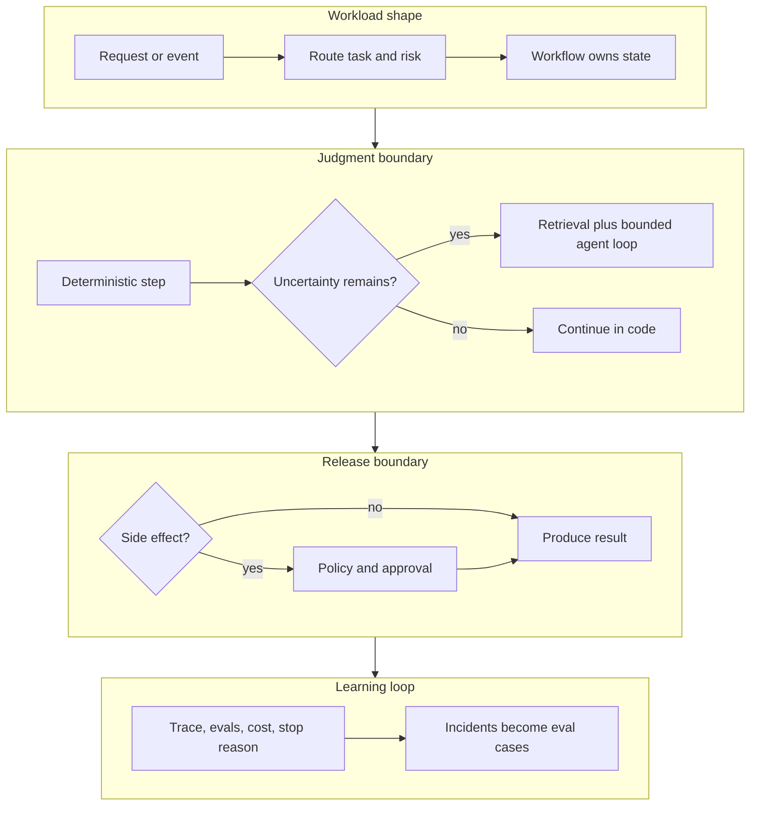

# De patrones a sistemas

Los patrones solo son útiles cuando te ayudan a construir un sistema. Un agent de producción rara vez es un solo patrón. Normalmente es un workflow con algunas decisiones mediadas por el model, un límite de retrieval, algunas tools, state, policy, aprobaciones, evals y observability. Los nombres de los patrones importan mucho menos que la forma en que esas piezas encajan.

Aquí es donde muchos proyectos de agents fallan. El equipo agrega un loop, luego memory, luego tools, luego un segundo agent, luego un judge, luego un motor de workflow. Cada adición parece razonable por sí sola, y el resultado es un sistema que nadie puede explicar. La composición es la disciplina que lo previene.

## Empieza con la carga de trabajo

No compongas patrones desde un catálogo. Compónlos desde la carga de trabajo. Empieza preguntando qué intenta lograr realmente el usuario, qué pasos se conocen de antemano y cuáles requieren juicio del model, qué evidencia debe recuperarse, qué acciones tienen efectos secundarios, qué state debe sobrevivir a una falla, qué necesita aprobación y qué debe ser observable después de la ejecución.

Las respuestas señalan las partes. Si el workflow es conocido, deja el control al código. Si el siguiente paso depende de observaciones, agrega un agent loop. Si el task necesita evidencia, agrega retrieval. Si el task puede cambiar el mundo exterior, agrega policy y aprobación. Si las fallas importan, agrega state durable y replay. Eso es composición: cada patrón se gana su lugar en vez de llegar por defecto.

## Una forma común

Muchos agentic systems útiles siguen aproximadamente esta forma:

1. El punto de entrada recibe una solicitud, evento o task programada.
2. Un router clasifica el task, el riesgo y la capability requerida.
3. El workflow carga el state, el policy context y la memory relevante.
4. Retrieval reúne evidencia cuando la respuesta depende del conocimiento.
5. El agent loop maneja incertidumbre acotada dentro del workflow.
6. Las tools se ejecutan mediante schemas tipados y revisiones de permisos.
7. Una puerta de aprobación pausa efectos secundarios de alto riesgo.
8. Evaluators revisan la trayectoria, evidencia, output y policy.
9. El runtime almacena traces, costos, decisiones, llamadas a tools y razones de detención.
10. Incidentes y correcciones alimentan el eval suite.

No todos los sistemas necesitan cada paso. Lo que se mantiene constante es la propiedad. El código es dueño del flujo, state, policy y persistencia; el model es dueño del juicio acotado dentro de esas restricciones.



Usa este diagrama como prueba de composición. Si un patrón propuesto no puede ubicarse en el mapa con un dueño, entrada, salida y modo de falla, probablemente no está listo para entrar al sistema.

## Reglas de composición

Revisa estas reglas antes de agregar otro patrón.

| Regla | Por qué importa |
| --- | --- |
| Un componente es dueño del goal. | Sin propiedad del goal, los agents optimizan tasks diferentes. |
| Un componente es dueño del state. | Sin propiedad del state, el replay y la recuperación se vuelven conjeturas. |
| Las llamadas a tools cruzan un límite de policy. | Sin policy, las propuestas del model se convierten en acciones demasiado rápido. |
| Las escrituras a memory son eventos explícitos. | Sin disciplina en memory, persiste context obsoleto o inseguro. |
| Los loops tienen condiciones de parada. | Sin condiciones de parada, la autonomía se convierte en mayor costo y latencia. |
| Los evals inspeccionan trayectorias. | Sin trajectory evals, caminos inseguros pueden producir respuestas plausibles. |
| Los traces conectan decisiones con efectos. | Sin traces, las fallas no pueden convertirse en mejores pruebas. |

Estas reglas importan más que el framework. Un framework puede ayudarte a implementarlas; no puede decidirlas por ti.

## Registro de composición del sistema

Para cualquier agentic system no trivial, escribe un breve registro de composición antes de la implementación. Debe caber en un pull request o en un registro de decisión de arquitectura.

```yaml
system: support_refund_assistant
user_goal: "Resolve refund eligibility with policy-backed evidence."
primary_flow_owner: refund_workflow
patterns:
  routing:
    job: "classify request type and risk"
    owner: intake_service
  retrieval:
    job: "load current refund policy and order evidence"
    owner: evidence_service
  agent_loop:
    job: "investigate missing or conflicting evidence"
    owner: refund_investigation_agent
    max_steps: 6
  policy_enforcement:
    job: "validate recommendation against refund policy"
    owner: policy_gate
  human_approval:
    job: "approve exceptions and high-value refunds"
    owner: approval_workflow
  observability:
    job: "record trace, decisions, evidence, costs, and stop reason"
    owner: runtime
release_blockers:
  - "missing evidence can stop the run"
  - "refund tool cannot execute without approval"
  - "trace can replay proposal, validation, approval, and side effect"
```

El registro obliga a que cada patrón justifique su existencia. Si un patrón no tiene trabajo, dueño o release blocker, elimínalo o déjalo fuera de la primera versión.

## Mala composición

La mala composición suele tener el mismo olor: el model tiene demasiado control. El agent infiere el goal a partir de un historial de conversación vago, elige tools sin revisión de permisos y escribe en memory sin clasificación ni revisión. Los reintentos ocurren dentro de loops ocultos. Los subagents reciben toda la conversación en vez de un task acotado. Los evaluators revisan el tono pero no la evidencia. La respuesta final se registra mientras se pierde la trayectoria, y un multi-agent system no tiene un solo dueño para la síntesis final.

Estos sistemas pueden lucir impresionantes en una demo. Son difíciles de operar porque nadie puede decir dónde vive la responsabilidad.

## Buena composición

La buena composición suele ser aburrida. Un sistema de reembolsos de soporte, por ejemplo, podría ejecutar un workflow determinista para la recepción y búsqueda de cuentas, un router para el tipo de solicitud y riesgo, y retrieval para la policy de reembolso actual. Usaría structured output para los campos extraídos y la recomendación, un pequeño agent loop solo para la investigación de información faltante, enforcement de policy antes de cualquier acción de reembolso, aprobación humana para excepciones, y observability y evals en toda la ejecución.

El sistema es agentic donde existe incertidumbre y determinista donde importa el control. Ese es todo el truco.

Un boceto simple de composición podría verse así:

```ts
async function handleRefundRequest(request: SupportRequest) {
  const route = classifyRequest(request);
  if (route.kind !== 'refund') return handoffTo(route.owner);

  const order = await tools.lookupOrder(request.orderId);
  const policy = await retrievePolicy('refunds', order.region);
  const recommendation = await refundAgent.investigate({
    request,
    order,
    policy
  });

  const decision = enforceRefundPolicy(recommendation, order, policy);
  if (decision.requiresApproval) {
    return approvals.request('refund_exception', decision);
  }

  return tools.draftRefundRequest(decision);
}
```

Solo un paso usa un agent loop. El workflow sigue siendo dueño de la ruta, state, policy, aprobación y efectos secundarios.

## Cuándo dividir agents

No dividas agents porque el task parezca grande. Divídelos cuando el límite aporte algo concreto: context windows separadas, tools separadas, permisos separados, equipos o propiedad separados, trabajo en paralelo, revisión independiente o diferentes responsabilidades de cara al usuario.

Las razones débiles son fáciles de reconocer una vez que las nombras. El diagrama de arquitectura se ve más avanzado. Cada prompt suena como un título de trabajo diferente. El equipo quiere un multi-agent system. El diseño de un solo agent tiene goals poco claros o tools débiles, así que dividirlo parece progreso. No lo es. Dividir agents no arregla una arquitectura débil; la multiplica.

## Lista de verificación para revisión de diseño

Antes de aprobar un agentic system compuesto, pregunta:

1. ¿Qué partes son workflows deterministas?
2. ¿Qué partes son decisiones mediadas por el model?
3. ¿Quién es dueño del goal activo?
4. ¿Quién es dueño del state durable?
5. ¿Qué tools pueden causar efectos secundarios?
6. ¿Qué policy se ejecuta antes de esos efectos secundarios?
7. ¿Qué evidencia se requiere para la respuesta final?
8. ¿Qué memory se puede escribir, actualizar o eliminar?
9. ¿Cuáles son las condiciones de parada?
10. ¿Qué evals bloquean el release?
11. ¿Qué trace permite a un operador reproducir la ejecución?
12. ¿Qué pasa cuando el model está equivocado pero es persuasivo?

Si el diseño no puede responder a esto, no está listo para más autonomía.

## Regla de diseño

Compón patrones solo cuando cada uno tenga un trabajo, un dueño y un modo de falla que puedas probar.

## Capítulos Relacionados

- [Architecture Before Autonomy](./architecture-before-autonomy)
- [Choosing the Right Pattern](./choosing-the-right-pattern)
- [Pattern Evaluation Checklist](./pattern-evaluation-checklist)
- [Pattern Composition Playbook](./pattern-composition-playbook)
- [Agent Development Lifecycle](../agent-engineering-practice/agent-development-lifecycle)
- [Evaluation-Driven Agent Development](../agent-engineering-practice/evaluation-driven-agent-development)
- [Agentic System Architecture](../systems-architecture/agentic-system-architecture)
- [Reference Architecture](../systems-architecture/reference-architecture)
