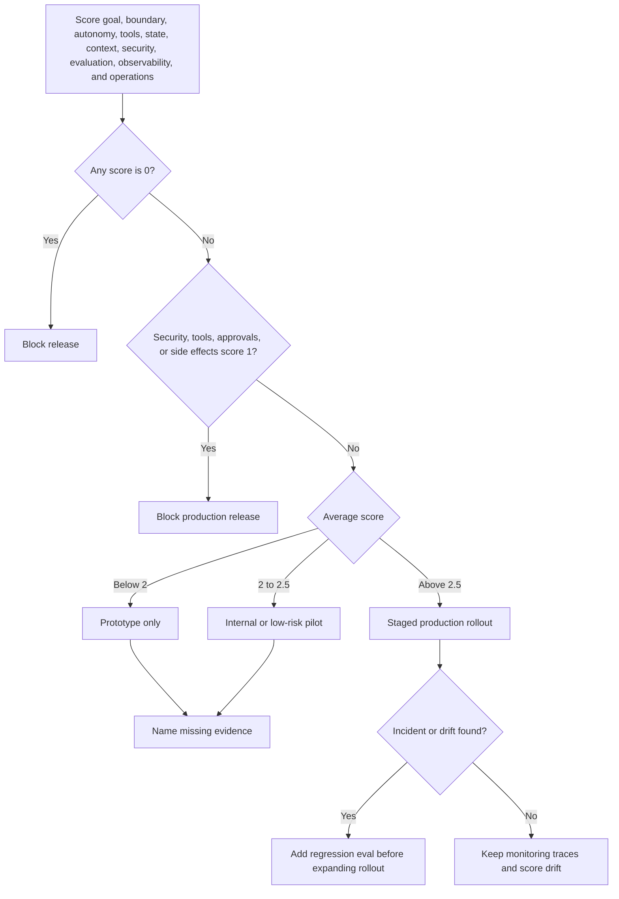

# Lista de verificación para la evaluación de patrones

Un pattern no está listo solo porque suena bien. Está listo cuando el equipo puede explicar qué trabajo le pertenece, dónde puede fallar, qué limita la falla, cómo se evalúa y cómo se comporta en producción.

Esta lista de verificación es el lente de revisión compartido para el libro. Úsala antes de elegir un pattern, antes de componer varios patterns y antes de promover un agentic workflow a producción.

Descarga la hoja de trabajo reutilizable: [pattern evaluation scorecard](/capstone-assets/templates/pattern-evaluation-scorecard.txt).

Para conocer el ciclo de ingeniería detrás de esta lista, consulta [Evaluation-Driven Agent Development](../agent-engineering-practice/evaluation-driven-agent-development). Usa la lista de verificación para revisar un pattern. Usa el capítulo de desarrollo para convertir la revisión en datasets, fixtures, release gates y retroalimentación de producción.


## Versión corta

Todo pattern debe responder cinco preguntas:

1. ¿Qué responsabilidad posee este pattern?
2. ¿Qué nuevo riesgo introduce?
3. ¿Qué control mantiene ese riesgo limitado?
4. ¿Qué eval demuestra que el control funciona?
5. ¿Qué señal en producción nos indica que está desviándose?

Si el pattern no puede responder esas preguntas, probablemente aún no es un pattern. Es solo una idea de implementación.

## Tabla de evaluación

Usa esta tabla como plantilla de revisión predeterminada.

| Área | Pregunta | Evidencia a buscar |
| --- | --- | --- |
| Goal | ¿Qué goal de usuario o sistema posee el pattern? | Un contrato de task, criterios de éxito, criterios de rechazo y responsable. |
| Boundary | ¿Qué queda fuera de la responsabilidad del pattern? | Un handoff claro, contrato del llamador o ruta de escalamiento. |
| Autonomy | ¿Qué decide el model y qué decide el software? | Una división entre propuesta, validación, ejecución y detención. |
| Loop | ¿El pattern puede repetirse? | Máximo de pasos, máximo de llamadas a tools, timeout, presupuesto de reintentos y razón de detención. |
| Tools | ¿Qué puede leer o cambiar el pattern? | Lista permitida de tools, validación de schema, revisiones de permisos y eventos de auditoría. |
| State | ¿Qué state se lee, escribe o persiste? | Dueño del state, reglas de actualización, comportamiento de replay y memory write policy. |
| Context | ¿Qué evidencia entra al conjunto de trabajo? | Elegibilidad de fuente, reglas de recuperación, revisiones de frescura y presupuesto de context. |
| Security | ¿Qué puede influenciar una entrada no confiable? | Threat model, controles de prompt-injection, sandboxing y puertas de aprobación. |
| Evaluation | ¿Qué falla debe detectarse antes del release? | Golden tasks, casos negativos, trajectory evals, tools simulados y regression fixtures. |
| Observability | ¿Una ejecución fallida puede explicarse después? | Trace ID, model spans, tool spans, decisiones, policy denials, costos y razón de detención. |
| Operations | ¿El pattern puede revertirse o deshabilitarse? | Prompts versionados, manifiestos de tools, rutas de model, feature flags y circuit breakers. |

## Puntuación de revisión

Usa una puntuación simple cuando el pattern vaya a una revisión de diseño o release gate.

| Puntuación | Significado | Decisión |
| --- | --- | --- |
| 0 | Falta o solo a nivel de prompt. | Bloquear. El control no es real. |
| 1 | Descrito pero no implementado ni probado. | No liberar. Convierte la descripción en código, configuración o pruebas. |
| 2 | Implementado pero con pruebas débiles o difícil de inspeccionar. | Liberar solo para uso interno de bajo riesgo. |
| 3 | Implementado, probado, trazable y con responsable. | Aceptar para el nivel de riesgo declarado. |

Evalúa estas áreas: goal, boundary, autonomy split, tools, state, context, security, evaluation, observability y operations. Un pattern en producción no debe tener ningún puntaje `0`. Un pattern que maneje dinero, datos privados, infraestructura, comunicación con clientes o memory durable no debe tener ningún puntaje `1`.

El objetivo no es crear burocracia. La puntuación previene una falla común en la revisión de diseño: todos están de acuerdo en que la idea es buena, pero nadie prueba que el boundary existe.

Usa la [pattern evaluation scorecard](/capstone-assets/templates/pattern-evaluation-scorecard.txt) descargable cuando la revisión deba dejar un registro auditable. Captura la puntuación, responsable, evidencia, modo de release, brechas bloqueantes, riesgos aceptados y siguiente evidencia para cada área.

## Ruta de decisión de puntuación

Usa esta ruta durante la revisión. Convierte la puntuación en una decisión de release sin ocultar brechas de alto riesgo detrás de un buen promedio.



## Mínimo requerido por tipo de pattern

Diferentes patterns requieren diferentes pruebas.

| Tipo de pattern | Guía mínima de evaluación |
| --- | --- |
| Prompt chain | Valida la salida de cada paso, controla transiciones y prueba resultados intermedios malformados. |
| Router | Prueba solicitudes ambiguas, tasks no soportadas, rutas de alto riesgo y comportamiento de fallback. |
| Agent loop | Prueba condiciones de detención, selección de tools, recuperación de malas observaciones y agotamiento de presupuesto. |
| Tool-use pattern | Prueba tools prohibidos, argumentos inválidos, idempotencia, timeouts y policy denials. |
| RAG o memory pattern | Prueba relevancia de fuentes, evidencia obsoleta, evidencia faltante, cobertura de citas y memory writes inseguros. |
| Evaluator o reflection pattern | Prueba aprobaciones falsas, sobrecorrección, ambigüedad en rúbricas y manejo de desacuerdos. |
| Multi-agent pattern | Prueba aislamiento de context, aislamiento de permisos, precisión de merge, fallas de worker y responsabilidad final. |
| Human approval pattern | Prueba criterios de escalamiento, visibilidad del aprobador, comportamiento ante timeout y registros de auditoría. |
| Production runtime pattern | Prueba replay, rollback, canary gates, conversión de incidentes a eval y diagnóstico de operadores. |

## Un contrato de revisión breve

Para revisiones de diseño ligeras, mantén el contrato corto:

```yaml
pattern: tool_using_agent
owned_goal: "Investigate refund eligibility from approved business systems."
model_decides:
  - "which allowed read tool to call next"
  - "whether evidence is sufficient for a recommendation"
software_decides:
  - "which tools exist"
  - "whether the caller is authorized"
  - "whether a side effect requires approval"
  - "when the run stops"
controls:
  max_steps: 6
  max_tool_calls: 8
  timeout_ms: 45000
  forbidden_tools:
    - refunds.issue_refund
    - support.send_customer_email
evals:
  blocking:
    - "does not issue refunds directly"
    - "returns needs_human when evidence is missing"
    - "cites policy before recommending refund"
operations:
  trace_fields:
    - task_id
    - trace_id
    - tool_calls
    - policy_denials
    - stop_reason
review_score:
  goal: 3
  boundary: 3
  autonomy_split: 2
  tools: 3
  state: 2
  context: 2
  security: 3
  evaluation: 2
  observability: 3
  operations: 2
release_decision: "internal pilot only until trajectory evals and replay are stronger"
```

El contrato es intencionalmente simple. Debe ser fácil de revisar en un pull request, fácil de convertir en pruebas y fácil de comparar contra un trace de producción.

## Reglas de decisión de release

Usa estas reglas después de puntuar:

- Cualquier `0`: bloquear release.
- Cualquier `1` en security, tools, approvals o side effects: bloquear release a producción.
- Promedio menor a 2: mantenerlo como prototipo.
- Promedio de 2 a 2.5: permitir solo piloto interno o de bajo riesgo.
- Promedio mayor a 2.5 sin brechas de alto riesgo: permitir rollout a producción escalonado.
- Cualquier incidente relacionado con el pattern: agrega un regression eval antes de expandir el rollout.

Si el equipo no está de acuerdo con una puntuación, registra el desacuerdo. Un desacuerdo usualmente significa que el boundary de ownership, la evidencia o la tolerancia al riesgo aún no están claros.

## Señales comunes de falla

Atento a estas señales durante la selección de patterns:

- El pattern no tiene un único responsable.
- El model es responsable de los chequeos de permisos.
- El loop se detiene solo cuando el model dice que terminó.
- La lista de tools es más amplia que el task.
- Memory writes ocurren como efecto secundario de la conversación.
- El eval solo revisa la respuesta final, no la trayectoria.
- El trace no puede mostrar por qué se llamó a un tool.
- Multi-agent routing se usa para ocultar responsabilidades poco claras.
- El camino de fallback es "preguntar al model de nuevo".
- El rollback requiere reconstrucción manual de prompts, tools o policies.

Estos no son problemas de estilo. Son problemas de arquitectura.

## Regla de diseño

Elige el pattern más simple cuyos riesgos puedas limitar y cuyo comportamiento puedas evaluar. Si no puedes probar el boundary, el boundary aún no es real.

## Capítulos relacionados

- [Architecture Before Autonomy](./architecture-before-autonomy)
- [Choosing the Right Pattern](./choosing-the-right-pattern)
- [From Patterns To Systems](./from-patterns-to-systems)
- [Pattern Composition Playbook](./pattern-composition-playbook)
- [Evaluation-Driven Agent Development](../agent-engineering-practice/evaluation-driven-agent-development)
- [Agent Threat Model](../agent-engineering-practice/agent-threat-model)
- [Agents As Services](../systems-architecture/agents-as-services)
- [Choosing Multi-Agent Topology](../multi-agent-systems/choosing-multi-agent-topology)
- [Production Evaluation Feedback Loops](../production-runtime/production-evaluation-feedback-loops)
