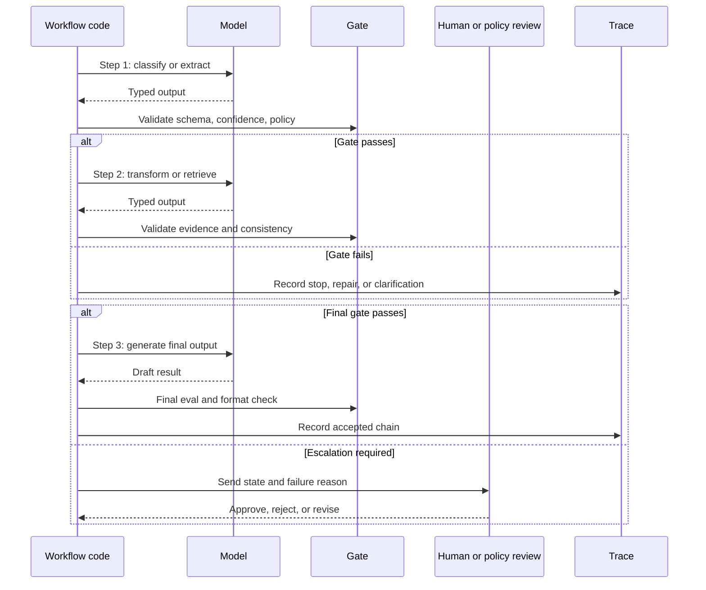

# Prompt Chaining and Gates

Prompt chaining divide una task en pasos conocidos de LLM y coloca validation gates entre ellos. Es una de las formas más seguras de agregar juicio del model sin darle control sobre todo el workflow.

Usa este pattern cuando el orden del trabajo es conocido pero los pasos individuales requieren comprensión de lenguaje, generación, clasificación o extracción.

## Intent

Ejecuta varias llamadas al model limitadas en una secuencia fija. Cada llamada recibe un input acotado, produce un output tipado y pasa por un gate determinista antes de que corra el siguiente paso.

El model realiza juicios locales. El código controla el workflow.

## Usa Cuando

- La task tiene fases estables.
- Cada fase puede probarse de forma independiente.
- Los outputs intermedios pueden validarse.
- Quieres menor riesgo que un agent loop autónomo.
- Necesitas puntos de falla claros y comportamiento de reintento.

Ejemplos comunes:

- clasificar una request, extraer fields, verificar fields y luego redactar una respuesta;
- resumir un documento, extraer claims, revisar claims y luego producir una respuesta final;
- generar código, correr tests, criticar fallas y luego revisar;
- recuperar evidence, normalizar citations y luego sintetizar una respuesta.

## Evita Cuando

- Los pasos son desconocidos antes de iniciar la ejecución.
- La cadena se ramificaría en docenas de casos especiales.
- Ningún gate puede verificar los outputs intermedios.
- El mismo input suele requerir una secuencia diferente de trabajo.
- La latencia de múltiples llamadas es inaceptable.

Si la cadena sigue creciendo con ramas condicionales, considera [Routing and Handoffs](./routing-and-handoffs) o un [Agent Loop](../foundations/agent-loop).

## Arquitectura

```text
Input
  -> Step 1: classify or extract
  -> Gate 1: schema, confidence, policy, completeness
  -> Step 2: transform or retrieve
  -> Gate 2: evidence, consistency, permissions
  -> Step 3: generate final output
  -> Gate 3: final eval, formatting, approval
  -> Result
```

Los gates deben ser deterministas siempre que sea posible. Un gate puede usar un model como evaluator, pero el gate aún necesita criterios explícitos y un output claro de aprobación/rechazo.



Usa el diagrama como prueba de diseño. Cada flecha debe corresponder a una transición de state tipada, una decisión de gate nombrada y una regla acotada de reintento o escalamiento.

## Tipos de Gate

| Gate | Verifica | Comportamiento ante falla |
| --- | --- | --- |
| Schema gate | Forma JSON, fields requeridos, enums, rangos numéricos | Pedir al model reparar o fallar rápido. |
| Evidence gate | Citations, frescura de source, cobertura de retrieval | Recuperar más evidence o escalar. |
| Policy gate | permisos, user role, acciones restringidas | Bloquear, redactar o pedir aprobación. |
| Confidence gate | confianza en clasificación, ambigüedad, inputs faltantes | Hacer una pregunta de aclaración. |
| Consistency gate | claims coinciden con el state y evidence previos | Repetir el paso con context más acotado. |
| Cost gate | conteo de llamadas al model, token budget, time budget | Devolver resultado parcial o diferir. |
| Human gate | decisión subjetiva o de alto impacto | Pausar hasta aprobación. |

Las cadenas más robustas mezclan varios tipos de gate. Un workflow de soporte puede usar schema gates para fields extraídos, policy gates para reembolsos y human gates para excepciones.

## Contrato de Gate

Cada gate debe producir una decisión legible por máquina. No ocultes el comportamiento del gate dentro de prosa.

```ts
type GateDecision =
  | { status: 'pass' }
  | {
      status: 'repair';
      reason: string;
      maxRetries: number;
      repairInstructions: string;
    }
  | {
      status: 'stop';
      reason: string;
      userVisibleMessage?: string;
    }
  | {
      status: 'escalate';
      reason: string;
      requiredRole: 'support_lead' | 'security_reviewer' | 'domain_expert';
    };
```

La cadena debe registrar la decisión del gate, no solo el output final. Un trace de producción debe mostrar qué paso se ejecutó, qué gate lo aceptó o rechazó y qué ocurrió después.

Usa razones explícitas de falla:

| Failure Reason | Significado | Próxima acción |
| --- | --- | --- |
| `schema_invalid` | El output no puede ser parseado o faltan fields requeridos. | Reparar una o dos veces, luego detener. |
| `evidence_missing` | El paso hizo un claim sin suficiente soporte de source. | Recuperar más evidence o escalar. |
| `policy_denied` | El siguiente paso violaría permisos o policy de negocio. | Detener o pedir aprobación. |
| `ambiguous_input` | La cadena no puede elegir una interpretación segura. | Preguntar al usuario o enrutar a revisión. |
| `budget_exhausted` | Se agotó el retry, token, latency o tool budget. | Devolver resultado parcial o detener. |

## Ejemplo de Gate: Borrador de Reembolso

Una cadena de soporte para reembolsos debe detenerse antes de redactar una promesa al cliente si falta evidence requerida. El model puede clasificar, extraer y resumir, pero los gates deciden si el siguiente paso puede ejecutarse.

| Chain Step | Model Output | Gate | Condición de pase | Comportamiento ante falla |
| --- | --- | --- | --- | --- |
| Classify request | `refund_request` con confianza `0.91` | confidence gate | Confianza >= `0.72` y el tipo no es `unknown`. | Hacer una pregunta de aclaración. |
| Extract fields | `order_id`, `customer_id`, `issue`, `requested_outcome` | schema gate | Existen fields requeridos y los IDs tienen el formato esperado. | Reparar una vez, luego detener con `schema_invalid`. |
| Retrieve policy | source IDs y policy version | evidence gate | La policy de reembolso actual y evidence de la orden están presentes. | Detener con `evidence_missing` o recuperar de nuevo. |
| Draft recommendation | reembolso o rechazo propuesto | policy gate | La recomendación coincide con el threshold, estado de cuenta y policy version. | Detener con `policy_denied` o pedir aprobación. |
| Draft customer reply | texto para el cliente | final gate | El texto coincide con la recomendación aprobada y no promete pagos no autorizados. | Bloquear y enviar al líder de soporte. |

El límite importante es la cuarta fila. Si el model propone "full refund approved" pero el policy gate devuelve `approval_required`, la cadena no debe continuar con una promesa al cliente. Debe pausar con la evidence exacta, monto propuesto, policy version y role del revisor.

```json
{
  "step": "policy_gate",
  "status": "escalate",
  "reason": "approval_required",
  "required_role": "support_lead",
  "evidence_refs": ["order:O-104", "policy:refunds:v2026-06"],
  "blocked_next_step": "draft_customer_reply"
}
```

Esta es la diferencia entre una cadena y una secuencia suelta de prompts. La cadena lleva el state tipado y se detiene antes de que lenguaje inseguro o efectos secundarios se escapen.

## Notas de Implementación

- Mantén cada prompt acotado. Un paso debe tener un solo objetivo.
- Usa structured output para cada handoff entre pasos.
- Persiste outputs intermedios, no solo la respuesta final.
- Trata cada output del model como no confiable hasta que un gate lo acepte.
- Haz que los repair loops sean acotados. Un schema fallido no debe disparar retries infinitos.
- Prefiere gates deterministas para seguridad y gates basados en model para calidad subjetiva.
- Registra cada paso con hash de input, model, output, resultado del gate, latency y cost.

## Ejemplo de Chain

```ts
type TicketClass = 'billing' | 'technical' | 'account' | 'unknown';

interface Classification {
  type: TicketClass;
  confidence: number;
  reason: string;
}

interface ExtractedFields {
  customerId?: string;
  orderId?: string;
  issue: string;
}

interface ChainState {
  input: string;
  classification?: Classification;
  fields?: ExtractedFields;
  draft?: string;
}

function gateClassification(result: Classification): string | null {
  if (result.confidence < 0.72) return 'classification_low_confidence';
  if (result.type === 'unknown') return 'unknown_ticket_type';
  return null;
}

function gateFields(fields: ExtractedFields): string | null {
  if (!fields.issue.trim()) return 'missing_issue';
  return null;
}

async function runTicketChain(input: string): Promise<ChainState> {
  const state: ChainState = { input };

  state.classification = await classifyTicket(input);
  const classificationError = gateClassification(state.classification);
  if (classificationError) throw new Error(classificationError);

  state.fields = await extractTicketFields(input, state.classification.type);
  const fieldError = gateFields(state.fields);
  if (fieldError) throw new Error(fieldError);

  state.draft = await draftResponse(state.classification.type, state.fields);
  return state;
}
```

El ejemplo mantiene el control de flujo en el código. El model clasifica, extrae y redacta, pero no decide qué reglas de validación aplicar.

## Modos de Falla

- Un chain aparenta ser determinista mientras prompts ocultos toman decisiones importantes.
- Gates validan la forma pero no el significado.
- El chain pasa el state resumido hacia adelante y pierde evidencia clave.
- Repair loops siguen pidiendo al model que corrija un output sin cambiar el input o el prompt.
- Un evaluator basado en model acepta afirmaciones fluidas pero no fundamentadas.
- El chain se convierte en un sustituto frágil de un verdadero workflow engine.

## Lista de Verificación para Producción

- ¿Todos los inputs y outputs de cada paso tienen tipo?
- ¿Cada paso puede probarse con fixture inputs?
- ¿Cada gate tiene un motivo de falla nombrado?
- ¿Cada repair loop tiene un límite de reintentos?
- ¿Los outputs intermedios se persisten para replay?
- ¿Las acciones de alto riesgo están separadas de los pasos de generación?
- ¿Los operadores pueden ver qué gate detuvo una ejecución?

## Capítulos Relacionados

- [Choosing the Right Pattern](./choosing-the-right-pattern)
- [Structured Output](../foundations/structured-output)
- [Evaluator-Optimizer](../control-loops/evaluator-optimizer)
- [Human Approval Gates](../tools-skills-protocols/human-approval-gates)
- [Durable Workflows](../production-runtime/durable-workflows)
