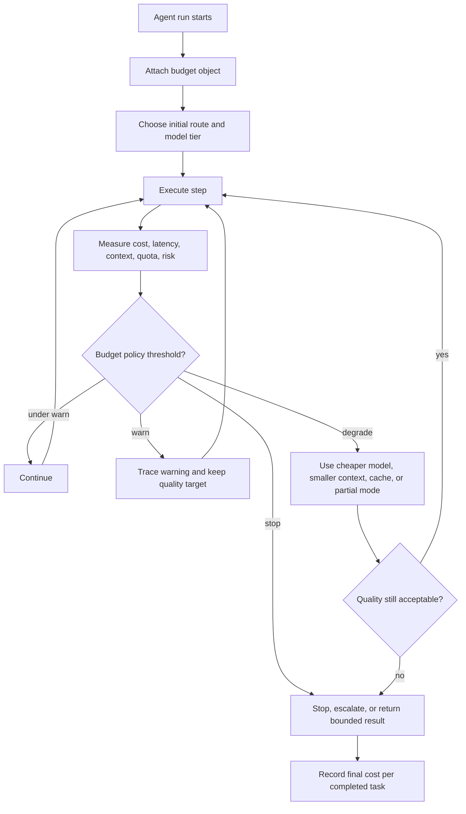

# Resource-Aware Agent Design

Los agentic systems consumen recursos con cada llamada a un model, retrieval, tool, handoff, operación de memory y retry. El diseño resource-aware hace que el costo, la latencia, el context y el cómputo sean parte de la arquitectura.

Usa este pattern cuando un agent debe ejecutarse repetidamente, atender usuarios de forma interactiva u operar bajo restricciones de presupuesto.

## Intent

Optimiza para tasks completadas, no para inteligencia bruta del model.

Un resource-aware agent elige el camino seguro más barato que pueda completar el trabajo con calidad aceptable.

## Resource Types

| Resource | Qué rastrear |
| --- | --- |
| Tokens | prompt tokens, output tokens, hidden context, costo de compresión. |
| Model calls | cantidad, nivel del model, retries, llamadas en paralelo. |
| Latency | tiempo de punta a punta, tiempo por paso, tiempo de espera de tool, tiempo de espera humano. |
| Money | costo por ejecución, costo por task completada, costo por ruta. |
| Context window | context relevante, context obsoleto, context duplicado. |
| Tool quota | límites de tasa de API, sesiones de navegador, carga de base de datos. |
| Human attention | aprobaciones, correcciones, escaladas, tiempo de revisión. |
| Operational risk | efectos secundarios, verificaciones de policy, costo de incidentes. |

La human attention es un recurso. Un camino de model barato que genera trabajo constante de revisión no es barato.

## Budget Objects

Dale a cada ejecución un budget object:

```ts
interface AgentBudget {
  maxCostUsd: number;
  maxModelCalls: number;
  maxToolCalls: number;
  maxIterations: number;
  maxWallClockMs: number;
  maxContextTokens: number;
  approvalRequiredAboveUsd?: number;
}
```

Los budgets deben viajar con el state para que routers, tools, evaluators y lógica de fallback puedan tomar decisiones consistentes.

## Budget Policy

Un budget solo es útil si el sistema sabe qué hacer a medida que se va gastando.

```ts
type BudgetAction =
  | 'continue'
  | 'switch_to_cheaper_model'
  | 'compress_context'
  | 'skip_optional_review'
  | 'return_partial_result'
  | 'escalate'
  | 'stop';

type BudgetPolicy = {
  warnAtPct: number;
  degradeAtPct: number;
  stopAtPct: number;
  preferredDegradedAction: BudgetAction;
};
```

Por ejemplo, un asistente de soporte interactivo podría advertir internamente al 60 por ciento del budget, cambiar a clasificación más barata y context más pequeño al 75 por ciento, y detenerse con una respuesta parcial o escalada humana al 95 por ciento. Un research agent en segundo plano podría tolerar mayor latency pero detenerse antes por tool quota o riesgo de frescura de fuentes.

La budget policy debe ser parte del contrato de la ruta o workflow, no un añadido en el logging.



Usa este loop para revisar implementaciones. El control de recursos no es solo un medidor; debe cambiar la ejecución antes de que el costo, la latency, el context, la quota o el risk rompan la ejecución.

## Optimization Levers

| Lever | Usar cuando | Trade-off |
| --- | --- | --- |
| Model routing | Algunas tasks son fáciles y otras difíciles. | Los errores de ruta pueden reducir la calidad. |
| Prompt chaining | Los pasos son conocidos y pueden validarse. | Más llamadas, pero menos context por llamada. |
| Context minimization | El context es grande o ruidoso. | Puede omitir evidencia útil. |
| Retrieval filtering | Las fuentes son numerosas o de calidad mixta. | Los filtros pueden omitir casos límite. |
| Parallelization | Subtasks independientes dominan la latency. | Más llamadas totales y agregación más difícil. |
| Caching | Consultas o salidas de tools se repiten. | Riesgos de invalidación y frescura del cache. |
| Early exit | La confianza es suficientemente alta. | Requiere umbrales calibrados. |
| Human escalation | La automatización sería riesgosa o costosa. | Usa la escasa human attention. |

Optimiza solo después de poder rastrear costos por ruta y paso.

## Context Compression

Comprime el context cuando sea demasiado grande, repetido u obsoleto.

Prefiere:

- state estructurado sobre historial largo de chat;
- referencias a archivos o registros sobre contenido pegado;
- fragmentos recuperados sobre documentos completos;
- memory específica de task sobre memory global;
- resúmenes con referencias a fuentes;
- eliminación explícita de context irrelevante.

No comprimas evidencia, restricciones, errores de tools, aprobaciones o preguntas sin resolver.

## Cost-Aware Routing

El cost-aware routing envía el trabajo por el camino seguro más barato:

- código determinista para operaciones conocidas;
- model pequeño para clasificación y extracción;
- model más fuerte para planeación o síntesis;
- agent especializado para trabajo de dominio;
- revisión humana para ambigüedad de alto riesgo.

El router necesita evals. De lo contrario, los ahorros de costo pueden convertirse silenciosamente en pérdida de calidad.

## Latency Design

Los agents interactivos necesitan progreso visible y espera limitada.

Usa:

- estado en streaming en los límites del workflow;
- retrieval en paralelo donde sea seguro;
- trabajos en segundo plano para tareas largas;
- resultados parciales con límites claros;
- cancelación;
- state reanudable.

Para tasks de larga duración, optimiza para reanudabilidad antes que para velocidad bruta.

## Degraded Modes

Los sistemas resource-aware deben fallar en menor escala antes de fallar por completo.

| Constraint alcanzada | Degraded Mode | No hacer |
| --- | --- | --- |
| Token budget | Usa referencias, resúmenes con citas o un conjunto de trabajo más pequeño. | Eliminar restricciones, aprobaciones o historial de errores. |
| Model cost | Ruta pasos simples a models más baratos. | Rutar síntesis de alto riesgo a un model débil sin prueba de eval. |
| Latency | Devuelve resultado parcial, manda el resto a segundo plano o pide continuar. | Ocultar trabajo largo detrás de una UI congelada. |
| Tool quota | Usa datos en cache de solo lectura con etiquetas de frescura. | Llamar tools de escritura sin evidencia actual. |
| Human attention | Agrupa revisiones de bajo riesgo o eleva el umbral de confianza. | Crear aprobaciones vagas que los humanos firman sin revisar. |
| Risk budget | Requiere aprobación, sandbox o detenerse. | Permitir que el model decida que el riesgo es aceptable. |

El comportamiento degradado debe ser visible en traces y en la salida al usuario cuando afecta la calidad. Un camino más barato o parcial es aceptable; pretender que es el mismo camino no lo es.

## Failure Modes

- Optimizar el conteo de tokens mientras aumenta el trabajo de corrección humana.
- Usar un model barato para rutas que no puede clasificar de forma confiable.
- Paralelizar trabajo dependiente y crear resultados inconsistentes.
- Comprimir el context tan agresivamente que el agent olvida restricciones.
- Cachear evidencia obsoleta en dominios regulados o de rápido cambio.
- Medir el costo por llamada en vez del costo por task completada.

## Related Chapters

- [Choosing the Right Pattern](./choosing-the-right-pattern)
- [Routing and Handoffs](./routing-and-handoffs)
- [Context Engineering](../foundations/context-engineering)
- [Working Memory](../memory-knowledge/working-memory)
- [Cost Controls and Runtime Budgets](../production-runtime/cost-controls-runtime-budgets)
- [Observability and Evals](../production-runtime/observability-and-evals)
- [Circuit Breakers, Fallbacks, and Replay](./circuit-breakers-fallbacks-replay)
