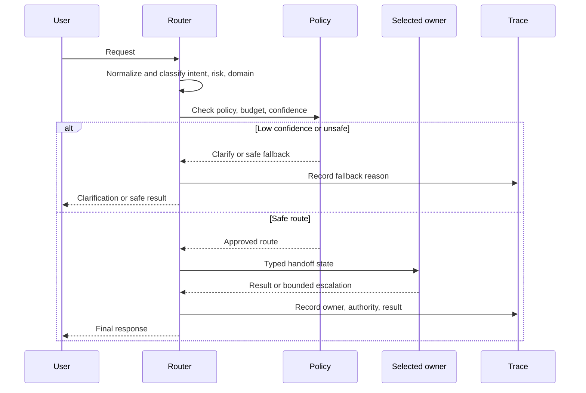

# Routing and Handoffs

El routing envía el trabajo al modelo, prompt, tool, workflow o agent correcto. Los handoffs transfieren la responsabilidad con suficiente state tipado para que el siguiente encargado pueda actuar de forma segura.

Este pattern suele ser el eslabón perdido entre un solo prompt y un multi-agent system.

## Intent

Usa un clasificador, regla de policy, planner o condición determinista para elegir el siguiente camino de ejecución. Luego pasa un objeto de state reducido al camino seleccionado.

Un router debe decidir a dónde pertenece el trabajo. No debe completar el trabajo por sí mismo.

## Usa cuando

- Los inputs pertenecen a dominios o intenciones distintas.
- Diferentes caminos necesitan diferentes tools, permisos, models o prompts.
- Las solicitudes simples deben usar caminos baratos y rápidos.
- Las solicitudes riesgosas necesitan una policy más estricta o aprobación humana.
- Un agent grande tiene problemas porque tiene demasiados tools o responsabilidades.

Ejemplos comunes:

- enrutar tickets de soporte a workflows de facturación, técnico, cuentas o fraude;
- enrutar solicitudes fáciles a un modelo pequeño y solicitudes inusuales a un modelo más fuerte;
- enrutar tasks de código a agents de búsqueda, edición, revisión o pruebas;
- enrutar solicitudes con efectos secundarios a través de workflows de aprobación;
- enrutar preguntas RAG al índice, tenant o corpus de dominio correcto.

## Evita cuando

- Solo hay un camino significativo.
- El router no puede explicar o calificar su decisión.
- Los caminos posteriores tienen propiedad superpuesta.
- Una ruta incorrecta crearía efectos secundarios peligrosos.
- El router depende de context de conversación oculto que no se persiste.

Si la ruta no puede elegirse con confianza, pide aclaración o envía el task a un camino de fallback seguro.

## Arquitectura

```text
Request
  -> Normalize input
  -> Classify intent, risk, domain, and required capability
  -> Apply policy and budget rules
  -> Select path
  -> Handoff typed state
  -> Downstream path completes or escalates
```

El handoff debe incluir solo el state que el camino siguiente necesita. Evita volcar toda la conversación en cada especialista.



Usa este diagrama para probar el diseño. Una ruta no está lista si no puede nombrar el owner, autoridad, state del handoff, umbral de confianza, fallback y campos de trace.

## Salidas del Router

La salida de un router debe ser estructurada:

```ts
type Route =
  | 'answer_from_docs'
  | 'billing_workflow'
  | 'technical_triage'
  | 'human_review'
  | 'reject'
  | 'clarify';

interface RoutingDecision {
  route: Route;
  confidence: number;
  reason: string;
  requiredCapabilities: string[];
  risk: 'low' | 'medium' | 'high';
}
```

Las buenas decisiones del router son inspeccionables. El sistema debe registrar la ruta, confianza, razón, versión del model, verificaciones de policy y comportamiento de fallback.

## Contrato de Handoff

Un handoff no es solo un mensaje. Es un cambio de responsabilidad.

Incluye:

- user intent normalizado;
- decisión de ruta y razón;
- campos extraídos relevantes;
- referencias de evidencia;
- alcance de permisos;
- presupuesto restante;
- deadline o timeout;
- rutas fallidas previas o fallos de tools;
- contrato de output esperado;
- camino de escalamiento.

Excluye:

- historial de conversación no relacionado;
- tools que el destinatario no puede usar;
- texto de policy oculto que debe seguir siendo propiedad del sistema;
- datos sensibles sin procesar cuando una referencia o campo redactado es suficiente.

## Registro de Decisión de Ruta

Registra la decisión de routing como datos. Esto hace que el routing sea revisable en vez de anecdótico.

```json
{
  "route_id": "route_2026_06_21_001",
  "input_ref": "ticket_4921",
  "selected_route": "billing_workflow",
  "confidence": 0.84,
  "reason": "Customer asks about duplicate charge on order receipt.",
  "risk": "medium",
  "policy_checks": [
    { "name": "tenant_access", "decision": "allow" },
    { "name": "payment_write", "decision": "deny_without_approval" }
  ],
  "handoff": {
    "owner": "billing_workflow",
    "allowed_tools": ["orders.read", "payments.read", "refunds.draft_request"],
    "forbidden_tools": ["refunds.issue_refund"],
    "state_refs": ["order:ord_123", "payment:pay_456"],
    "expected_output": "billing_resolution_draft"
  },
  "fallback": "human_review",
  "max_handoffs": 2
}
```

El registro debe mostrar tres cosas: por qué se eligió la ruta, qué autoridad se transfirió con el handoff y a dónde va el trabajo si la ruta falla.

## Tipos de Router

| Router Type | Best For | Watch Out For |
| --- | --- | --- |
| Rule router | Compliance, tenant, role, known metadata | Rule drift a medida que cambian los productos. |
| Model router | Natural language intent and ambiguous requests | Baja confianza e inyección de prompt. |
| Embedding router | Domain corpus or knowledge base selection | Corpora similares pero inseguros. |
| Cost router | Model tier selection | Uso excesivo de modelos baratos en tasks difíciles. |
| Risk router | Approval, sandbox, or policy paths | Casos extremos de alto riesgo no cubiertos. |
| Capability router | Tool or agent selection | Descripciones de tools superpuestas. |

Los sistemas en producción suelen combinarlos. Por ejemplo, el código puede hacer cumplir reglas de tenant y policy antes de que un model elija entre workflows especialistas.

## Notas de Implementación

- Mantén las etiquetas de ruta estables. Trata los nombres de ruta como contratos de API.
- Haz routing antes de cargar context grande.
- Separa el routing de intent del routing de policy.
- Usa umbrales de confianza con caminos explícitos de aclaración o fallback.
- Valida el state del handoff antes de que el destinatario comience.
- No permitas que los agents posteriores hagan reroute silencioso indefinidamente.
- Traza las decisiones de ruta en toda la ejecución.
- Prueba routers con ejemplos adversariales y ambiguos, no solo casos ideales.

## Modos de Falla

- Un router se convierte en un agent general oculto.
- Las etiquetas de ruta se superponen, así que la misma solicitud puede encajar en varios caminos.
- Los handoffs pierden límites de autoridad y dan a los especialistas demasiados tools.
- Rutas de baja confianza avanzan en vez de pedir aclaración.
- Los handoffs multi-agent crean loops sin owner.
- El cost routing envía tasks difíciles a modelos débiles y oculta la pérdida de calidad.

## Estrategia de Evaluación

Evalúa la decisión de ruta y el contrato de handoff por separado. Una ruta correcta con autoridad, evidencia o presupuesto faltante sigue siendo un handoff fallido.

- Construye un set de rutas etiquetado con solicitudes claras, ambiguas, fuera de dominio, adversariales y de alto riesgo.
- Prueba cada etiqueta de ruta más los caminos `clarify`, `reject` y fallback seguro.
- Prueba solicitudes que contienen lenguaje asociado a una ruta pero que requieren otra por policy o tenant.
- Asegura que cada handoff incluya su state requerido y excluya context no relacionado y autoridad excesiva.
- Prueba fallas posteriores, rerouting y prevención de loops.
- Compara el routing por model con una base determinista o de camino único antes de agregar más rutas.

Un fixture compacto debe hacer visibles las expectativas de ruta y handoff:

```ts
type RoutingEvalCase = {
  caseId: string;
  input: string;
  expected: {
    route: Route;
    allowedAlternatives?: Route[];
    maxAuthority: "read" | "draft" | "write_after_approval";
    requiredHandoffFields: string[];
    forbiddenHandoffFields: string[];
    maxHandoffs: number;
  };
};
```

Mide la precisión de ruta por clase, tasa de misroute inseguro, precisión de aclaración, tasa de fallback, validez del contrato de handoff, expansión de autoridad, tasa de loops, tasa de finalización posterior, latencia y costo. Reporta una matriz de confusión en vez de depender solo de la precisión general. Un router que funciona bien en solicitudes comunes de soporte aún puede fallar en todos los casos de fraude o seguridad.

Para el contrato de eval compartido y el método de release-gate, consulta [Evaluation-Driven Agent Development](../agent-engineering-practice/evaluation-driven-agent-development).

## Lista de Verificación para Producción

- ¿Las etiquetas de ruta son mutuamente comprensibles y estables?
- ¿Cada ruta tiene un owner y contrato de output?
- ¿El router tiene un fallback para baja confianza?
- ¿La policy se ejecuta antes de handoffs peligrosos?
- ¿Un operador puede explicar por qué una solicitud tomó un camino?
- ¿Los datasets de rutas son parte de pruebas de regresión?
- ¿Los loops de ruta son imposibles o están acotados?

## Capítulos Relacionados

- [Eligiendo el Pattern Correcto](./choosing-the-right-pattern)
- [Uso de Tool con MCP-first](../tools-skills-protocols/mcp-first-tool-use)
- [Interoperabilidad de Agent A2A](../tools-skills-protocols/a2a-agent-interoperability)
- [Supervisor / Worker](../multi-agent-systems/supervisor-worker)
- [Aplicación de Policy](../production-runtime/policy-enforcement)
- [Context Engineering](../foundations/context-engineering)
- [Desarrollo de Agent Basado en Evaluation](../agent-engineering-practice/evaluation-driven-agent-development)
