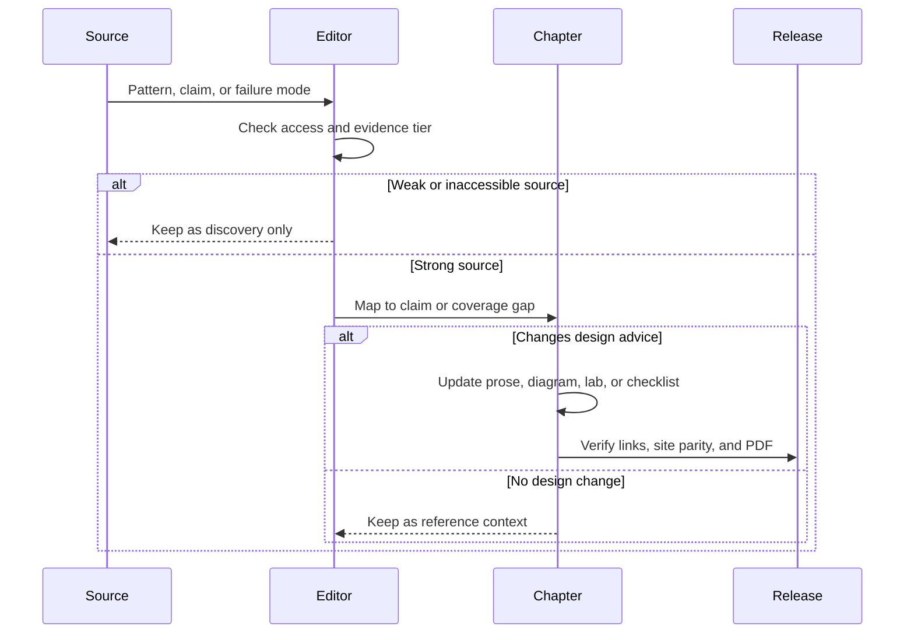

# Source Map

Esta página mapea referencias externas a los capítulos de este libro. Úsala como una guía de lectura, no como un reemplazo del pattern language del libro.

Las fuentes repiten varias ideas centrales: empieza simple, separa workflows de agents, usa tools mediante contratos tipados, agrega memory de forma deliberada, evalúa el comportamiento y reserva los sistemas multi-agent para casos donde la especialización justifique el costo de orquestación.

## Cómo usar este mapa

Utiliza esta página cuando necesites responder una de tres preguntas:

| Pregunta | Usa esta sección | Resultado |
| --- | --- | --- |
| ¿De dónde proviene el pattern language de este libro? | Primary References and Local PDF References Reviewed. | Un breve rastro de fuentes para un capítulo, decisión o término. |
| ¿El libro cubre un pattern que vi en otro lugar? | Pattern Coverage Map and Local Pattern Repository Coverage. | Un enlace al capítulo, o una posible brecha para futura expansión. |
| ¿A qué fuentes debo dar prioridad? | Evidence Tiers. | Un orden de prioridad para leer, citar y revisar. |

Para la lectura normal, no empieces aquí. Comienza con [How To Read This Book](../publishing/how-to-read), luego regresa a este mapa cuando quieras contexto de fuentes o verificar cobertura.

Lee el mapa como un filtro editorial. Una fuente gana espacio en el libro cuando cambia la decisión de diseño de un lector, expone un modo de falla no considerado o aporta evidencia más sólida para una afirmación del capítulo.

## Atajos de decisión respaldados por fuentes

Usa estos atajos cuando una fuente nombra un pattern pero la decisión de ingeniería aún no es clara.

| Decisión que necesitas tomar | Comienza con | Usa las fuentes para verificar |
| --- | --- | --- |
| ¿Es esto un workflow, un agent o un sistema multi-agent? | [Choosing the Right Pattern](./choosing-the-right-pattern) | Si la fuente separa el control determinista de los pasos elegidos por el model. |
| ¿Debemos agregar routing, handoffs o agents especialistas? | [Routing and Handoffs](./routing-and-handoffs) y [Choosing Multi-Agent Topology](../multi-agent-systems/choosing-multi-agent-topology) | Si contextos, tools, permisos o latencia separados justifican el costo de coordinación. |
| ¿Esto necesita memory, retrieval o un límite de conocimiento? | [Context Engineering](../foundations/context-engineering), [Working Memory](../memory-knowledge/working-memory) y [Agentic RAG Systems](../systems-architecture/agentic-rag-systems) | Si la fuente distingue entre contextos transitorios, memory durable y evidencia citada. |
| ¿Son los tools lo suficientemente seguros para uso mediado por el model? | [Tool Capability Design](../tools-skills-protocols/tool-capability-design), [MCP-first Tool Use](../tools-skills-protocols/mcp-first-tool-use) y [Human Approval Gates](../tools-skills-protocols/human-approval-gates) | Si la autoridad del tool, schema, errores, policy y aprobación son explícitos. |
| ¿El pattern puede sobrevivir a fallas en producción? | [Circuit Breakers, Fallbacks, and Replay](./circuit-breakers-fallbacks-replay), [Observability and Evals](../production-runtime/observability-and-evals) y [Production Evaluation Feedback Loops](../production-runtime/production-evaluation-feedback-loops) | Si traces, replay, evals, rollback y retroalimentación de incidentes forman parte del diseño. |
| ¿Una fuente está agregando un pattern útil o solo un nombre nuevo? | [Pattern Composition Playbook](./pattern-composition-playbook) | Si el pattern cambia ownership, state, tools, riesgo, evals u operaciones. |

## Evidence Tiers

No todas las fuentes tienen el mismo peso editorial. Usa este orden cuando las fuentes discrepen:

| Tier | Tipo de fuente | Uso editorial |
| --- | --- | --- |
| 1 | Guías de ingeniería de vendors, documentación de frameworks y documentación principal de implementación. | Usar para terminología actual, guía operativa y comportamiento específico de frameworks. |
| 2 | Libros técnicos y material extenso de practicantes. | Usar para conceptos duraderos, orden de enseñanza y ejemplos que requieren explicación más profunda. |
| 3 | Catálogos curados, listas de patterns y diagramas. | Usar para descubrir cobertura y enlaces cruzados, no como autoridad final. |
| 4 | Videos, artículos restringidos y publicaciones con poca revisión. | Usar solo como material de descubrimiento hasta que las afirmaciones se verifiquen con fuentes más sólidas. |

Esto previene que el libro en línea se desvíe hacia la fuente con la lista de patterns más larga. El libro debe privilegiar la evidencia de ingeniería sobre la novedad.

## Referencias Primarias

| Fuente | Ideas Útiles | Mapeo en el Libro |
| --- | --- | --- |
| [Anthropic: Building Effective Agents](https://www.anthropic.com/engineering/building-effective-agents) | Workflows vs agents, prompt chaining, routing, paralelización, orquestador-workers, evaluator-optimizer, autonomous agents. | [Choosing the Right Pattern](./choosing-the-right-pattern), [Prompt Chaining and Gates](./prompt-chaining-and-gates), [Routing and Handoffs](./routing-and-handoffs), [Evaluator-Optimizer](../control-loops/evaluator-optimizer), [Agent Loop](../foundations/agent-loop). |
| [Google Cloud: Choose a design pattern for your agentic AI system](https://docs.cloud.google.com/architecture/choose-design-pattern-agentic-ai-system) | Selección basada en requerimientos, patrones single-agent y multi-agent, secuencial, paralelo, refinamiento iterativo, human-in-the-loop, lógica personalizada. | [Choosing the Right Pattern](./choosing-the-right-pattern), [Parallel Agents](../multi-agent-systems/parallel-agents), [Human Approval Gates](../tools-skills-protocols/human-approval-gates), [Agentic System Architecture](../systems-architecture/agentic-system-architecture). |
| [Databricks: Agent system design patterns](https://docs.databricks.com/gcp/en/agents/agent-system-design-patterns) | Continuum de complejidad desde prompt hasta deterministic chain, single-agent y multi-agent systems, además de guías de producción para testing, tracing, manejo de fallos, actualizaciones de model y costo. | [Choosing the Right Pattern](./choosing-the-right-pattern), [Circuit Breakers, Fallbacks, and Replay](./circuit-breakers-fallbacks-replay), [Observability and Evals](../production-runtime/observability-and-evals). |
| [LangChain: Choosing the Right Multi-Agent Architecture](https://www.langchain.com/blog/choosing-the-right-multi-agent-architecture) | Selección multi-agent entre subagents, skills, handoffs y routers, con tradeoffs explícitos sobre aislamiento de context, state, paralelismo y overhead de llamadas a model. | [Choosing the Right Pattern](./choosing-the-right-pattern), [Routing and Handoffs](./routing-and-handoffs), [Skills](../tools-skills-protocols/skills), [Supervisor / Worker](../multi-agent-systems/supervisor-worker), [Parallel Agents](../multi-agent-systems/parallel-agents). |
| [LangChain: Deep Agents overview](https://docs.langchain.com/oss/python/deepagents/overview) y [Frameworks, runtimes, and harnesses](https://docs.langchain.com/oss/python/concepts/products#agent-harnesses-like-the-deep-agents-sdk) | Enfoque de agent harness: planeación, archivos, manejo de context, subagents, memory a largo plazo, aprobación humana, permisos, sandboxes, ejecución durable y distinciones entre framework/runtime/harness. | [Agent Harnesses](../agent-engineering-practice/agent-harnesses), [Context Budgets and Working Sets](../foundations/context-budgets-and-working-sets), [Agent Engineer Toolkit](../agent-engineering-practice/agent-engineer-toolkit), [Framework Selection](../agent-engineering-practice/framework-selection), [Skills](../tools-skills-protocols/skills), [Durable Workflows](../production-runtime/durable-workflows). |
| [MongoDB: 7 Practical Design Patterns for Agentic Systems](https://www.mongodb.com/resources/basics/artificial-intelligence/agentic-systems) | Flujos controlados, LLM routing, paralelización, reflection, human-in-the-loop, agents y arquitecturas multi-agent. | [Prompt Chaining and Gates](./prompt-chaining-and-gates), [Routing and Handoffs](./routing-and-handoffs), [Reflection](../control-loops/reflection), [Supervisor / Worker](../multi-agent-systems/supervisor-worker). |
| [Agentic Patterns Graph](https://www.agentic-patterns.com/graph) | Gran catálogo de patterns con categorías para context, orquestación, confiabilidad, seguridad, uso de tool, aprendizaje y UX. | [Circuit Breakers, Fallbacks, and Replay](./circuit-breakers-fallbacks-replay), [Context Engineering](../foundations/context-engineering), [Working Memory](../memory-knowledge/working-memory), [Policy Enforcement](../production-runtime/policy-enforcement). |
| [GitHub: awesome-agentic-patterns](https://github.com/nibzard/awesome-agentic-patterns) | Repositorio curado de patterns de producción y emergentes, útil como índice de descubrimiento. | Esta fuente informa el catálogo extendido y futuras adiciones, especialmente patterns de confiabilidad, context, coding-agent, seguridad y uso de tool. |

## Referencias Secundarias

| Fuente | Ideas Útiles | Cómo Usar |
| --- | --- | --- |
| [ByteByteGo: Top AI Agentic Workflow Patterns](https://blog.bytebytego.com/p/top-ai-agentic-workflow-patterns) | Explicaciones accesibles de reflection, uso de tool, ReAct, planeación y patterns multi-agent. | Buena lectura introductoria para quienes buscan una explicación más ligera antes de los capítulos profundos. |
| [Phil Schmid: Zero to One - Learning Agentic Patterns](https://www.philschmid.de/agentic-pattern) | Ejemplos prácticos de routing, paralelización, uso de tool, orquestador-workers y sistemas multi-agent. | Útil para intuición de implementación y ejemplos de formas. |
| [ProjectPro: Agentic AI Design Patterns](https://www.projectpro.io/article/agentic-ai-design-patterns/1126) | Planeación, uso de tool, reflection, ejemplos multi-agent y discusión práctica de MCP. | Útil para explicar ejemplos comunes en empresas. |
| [Tungsten Automation: Tool-Use Pattern](https://www.tungstenautomation.com/learn/blog/the-agentic-ai-tool-use-pattern) | Enfoque empresarial para uso de tool, ground truth y APIs de workflow. | Se relaciona con [MCP-first Tool Use](../tools-skills-protocols/mcp-first-tool-use) y [Policy Enforcement](../production-runtime/policy-enforcement). |
| [Towards AI: 5 Design Patterns in Agentic AI Workflow](https://pub.towardsai.net/5-design-patterns-in-agentic-ai-workflow-c972c83f77e4) | Enfoque introductorio para prompt chaining y descomposición de workflow. | Útil como visión general ligera; el artículo está parcialmente restringido. |
| [Medium: Multi-Agent System Patterns](https://medium.com/@mjgmario/multi-agent-system-patterns-a-unified-guide-to-designing-agentic-architectures-04bb31ab9c41) | Dimensiones de arquitectura multi-agent: control, ejecución, coordinación e interacción. Útil distinción entre roles y patterns. | Buen soporte para un futuro capítulo puente sobre composición de sistemas multi-agent sin convertir el libro en un catálogo plano. |
| [Medium: Agentic Design Patterns](https://medium.com/@bijit211987/agentic-design-patterns-cbd0aae2962f) | Explicaciones comunes de patterns para reflection, uso de tool, planeación y diseño multi-agent. | Duplica conceptos centrales ya cubiertos aquí. |
| [Medium: Agentic Patterns - Architectures for Coordinated AI Systems](https://medium.com/@learning_37638/agentic-patterns-architectures-for-coordinated-ai-systems-34d9d8d8e1e2) | Coordinación jerárquica, peer-to-peer, basada en mercado y swarm. | Útil para futura expansión de patterns de coordinación multi-agent. |
| [YouTube: AI agent design patterns](https://www.youtube.com/watch?v=GDm_uH6VxPY) | Recorrido en video de agent design patterns. | Usar como material complementario, no como fuente textual principal a menos que se agregue revisión de transcripción. |
| [YouTube: Master ALL 20 Agentic AI Design Patterns](https://www.youtube.com/watch?v=e2zIr_2JMbE) | Amplio catálogo en video de nombres de patterns y ejemplos. | Usar como material de descubrimiento; validar afirmaciones individuales con fuentes primarias. |

Las fuentes que no eran de acceso público o solo sirvieron como rutas de descubrimiento fueron excluidas del mapa.

## Cobertura del Repositorio Local de Patterns

Se utilizó un resumen plano local del proyecto `awesome-agentic-patterns` como lista de verificación de cobertura. Sus patterns no se copiaron en este libro. Ayudaron a identificar áreas faltantes o poco desarrolladas que ahora tienen tratamiento propio aquí.

El escaneo de ingreso del 2026-06-20 extrajo 167 registros de patterns en las áreas de orquestación y control, uso de tools y entorno, confiabilidad y evaluación, context y memory, UX y colaboración, seguridad y safety, feedback loops, y aprendizaje y adaptación. El libro en línea debe usar este catálogo como una cola de expansión para la calidad de los capítulos y enlaces cruzados, no como una taxonomía de reemplazo.

| Área de Pattern Local | Patterns Representativos Revisados | Mapeo en el Libro |
| --- | --- | --- |
| Agent threat model y tool security | `lethal-trifecta-threat-model`, `policy-gated-tool-proxy`, `sandboxed-tool-authorization`, `egress-lockdown-no-exfiltration-channel`, `pii-tokenization`. | [Agent Threat Model](../agent-engineering-practice/agent-threat-model), [Agent Security and Sandboxing](../agent-engineering-practice/agent-security-and-sandboxing), [Policy Enforcement](../production-runtime/policy-enforcement), [Tool Capability Design](../tools-skills-protocols/tool-capability-design). |
| Tool capability y agent-friendly interfaces | `cli-first-skill-design`, `tool-capability-compartmentalization`, `llm-friendly-api-design`, `agent-first-tooling-and-logging`, `static-service-manifest-for-agents`, `code-first-tool-interface-pattern`. | [Skills](../tools-skills-protocols/skills), [Tool Capability Design](../tools-skills-protocols/tool-capability-design), [MCP-first Tool Use](../tools-skills-protocols/mcp-first-tool-use), [Agent Harnesses](../agent-engineering-practice/agent-harnesses). |
| Context operations | `curated-file-context-window`, `curated-code-context-window`, `context-window-auto-compaction`, `context-minimization-pattern`, `context-window-anxiety-management`. | [Context Budgets and Working Sets](../foundations/context-budgets-and-working-sets), [Context Engineering](../foundations/context-engineering), [Agent Harnesses](../agent-engineering-practice/agent-harnesses). |
| Production eval feedback | `incident-to-eval-synthesis`, `workflow-evals-with-mocked-tools`, `canary-rollout-and-automatic-rollback-for-agent-policy-changes`, `anti-reward-hacking-grader-design`, `background-agent-ci`. | [Production Evaluation Feedback Loops](../production-runtime/production-evaluation-feedback-loops), [Evaluation-Driven Agent Development](../agent-engineering-practice/evaluation-driven-agent-development), [Observability and Evals](../production-runtime/observability-and-evals), [Coding Agents](../systems-architecture/coding-agents). |
| Coding-agent runtime | `coding-agent-ci-feedback-loop`, `background-agent-ci`, `asynchronous-coding-agent-pipeline`, `shell-command-contextualization`, `custom-sandboxed-background-agent`. | [Coding Agents](../systems-architecture/coding-agents), [Agent Harnesses](../agent-engineering-practice/agent-harnesses), [Production Evaluation Feedback Loops](../production-runtime/production-evaluation-feedback-loops). |
| Multi-agent topology y coordinación | `declarative-multi-agent-topology-definition`, `board-mediated-inter-agent-coordination`, `workspace-native-multi-agent-orchestration`, `oracle-and-worker-multi-model`, `multi-model-orchestration-for-complex-edits`. | [Choosing Multi-Agent Topology](../multi-agent-systems/choosing-multi-agent-topology), [Agents As Services](../systems-architecture/agents-as-services), [A2A Agent Interoperability](../tools-skills-protocols/a2a-agent-interoperability), [Supervisor / Worker](../multi-agent-systems/supervisor-worker). |

Esta fuente local debe tratarse como una lista de verificación, no como la taxonomía del libro. Algunas entradas están probadas en producción, otras están emergiendo y algunas son específicas de investigación o producto. El libro debe seguir absorbiendo las ideas útiles de ingeniería mientras preserva su propia estructura: primero los límites, luego los patterns, después la evaluación y operaciones.

## Referencias locales de PDF revisadas

Los siguientes PDFs fueron revisados o escaneados localmente como insumos de conocimiento fuente. No están incluidos en este repositorio, enlazados desde el libro, ni reproducidos. Solo informan verificaciones de cobertura, estructura de capítulos y priorización de temas.

| Referencia local | Temas útiles | Mapeo en el libro |
| --- | --- | --- |
| *AI Agents in Action*, Micheal Lanham | Definiciones de agent, interfaces LLM, asistentes GPT, sistemas multi-agent con AutoGen y CrewAI, acciones de agent, orquestación con behavior-tree, plataformas de agent, RAG, memory, flujo de prompt, razonamiento, evaluación, planeación y retroalimentación. | [What Is An Agent?](../foundations/what-is-an-agent), [Framework Selection](../agent-engineering-practice/framework-selection), [CrewAI Flows and Crews](../multi-agent-systems/crewai-flows-and-crews), [Tool Use](../foundations/tool-use), [Memory-Augmented Agent](../memory-knowledge/memory-augmented-agent), [Planning and Execution](../control-loops/planning-and-execution), [Evaluation-Driven Agent Development](../agent-engineering-practice/evaluation-driven-agent-development). |
| *30 Agents Every AI Engineer Must Build*, Imran Ahmad | Fundamentos de ingeniería de agent, decisiones de toolkit, domain agents, retrieval agents, orquestación de tool, software agents, explicabilidad y agents específicos de dominio. | [Agent Engineer Toolkit](../agent-engineering-practice/agent-engineer-toolkit), [Framework Selection](../agent-engineering-practice/framework-selection), [Domain Agent Architectures](../systems-architecture/domain-agent-architectures), [Coding Agents](../systems-architecture/coding-agents), [Agentic RAG Systems](../systems-architecture/agentic-rag-systems). |
| *Agentic Architectural Patterns for Building Multi-Agent Systems*, Ali Arsanjani, Juan Pablo Bustos, Thomas Kurian | Madurez empresarial, selección de model agent-ready, espectro de RAG a fine-tuning, patrones de coordinación, cumplimiento, robustez, interacción humano-agent, preparación para producción. | [Choosing the Right Pattern](./choosing-the-right-pattern), [Agent Development Lifecycle](../agent-engineering-practice/agent-development-lifecycle), [Agent Security and Sandboxing](../agent-engineering-practice/agent-security-and-sandboxing), [Domain Agent Architectures](../systems-architecture/domain-agent-architectures), [Agentic System Architecture](../systems-architecture/agentic-system-architecture). |
| *Agentic Design Patterns*, Antonio Gulli | Prompt chaining, routing, paralelización, reflexión, uso de tool, planeación, memory, MCP, A2A, monitoreo, guardrails, optimización de recursos, CLI y coding agents. | [Prompt Chaining and Gates](./prompt-chaining-and-gates), [Routing and Handoffs](./routing-and-handoffs), [Resource-Aware Agent Design](./resource-aware-agent-design), [MCP-first Tool Use](../tools-skills-protocols/mcp-first-tool-use), [A2A Agent Interoperability](../tools-skills-protocols/a2a-agent-interoperability). |
| *Designing Multi-Agent Systems*, Victor Dibia | Taxonomía multi-agent, principios de UX, execution loops, cancelación, memory, middleware, computer-use agents, workflow graphs, observability, evaluación, protocolos distribuidos, ética. | [Agent UX and Human Trust](../agent-engineering-practice/agent-ux-and-human-trust), [Evaluation-Driven Agent Development](../agent-engineering-practice/evaluation-driven-agent-development), [Computer-Use Agents](../systems-architecture/computer-use-agents), [Supervisor / Worker](../multi-agent-systems/supervisor-worker), [Secure Agent Communication](../tools-skills-protocols/secure-agent-communication). |
| *Patterns for Building AI Agents*, Sam Bhagwat and Michelle Gienow | Diseño de capability de agent, context engineering, compresión de context, eval suites, evaluación con datos de producción, sandboxing, control de acceso granular, guardrails. | [Context Budgets and Working Sets](../foundations/context-budgets-and-working-sets), [Context Engineering](../foundations/context-engineering), [Resource-Aware Agent Design](./resource-aware-agent-design), [Evaluation-Driven Agent Development](../agent-engineering-practice/evaluation-driven-agent-development), [Agent Security and Sandboxing](../agent-engineering-practice/agent-security-and-sandboxing). |
| *Build a Multi-Agent System (from Scratch)*, Val Andrei Fajardo | Construcción fundamental de agent LLM, tools, interfaces LLM, tools MCP, skills, memory, human-in-the-loop, A2A y creación de un pequeño framework educativo desde primeros principios. | [Tool Use](../foundations/tool-use), [MCP-first Tool Use](../tools-skills-protocols/mcp-first-tool-use), [Skills](../tools-skills-protocols/skills), [Memory-Augmented Agent](../memory-knowledge/memory-augmented-agent), [A2A Agent Interoperability](../tools-skills-protocols/a2a-agent-interoperability). |
| *Build an AI Agent (From Scratch)*, Jungjun Hur and Younghee Song | Diseño de interfaces LLM, uso de tool, ReAct, RAG, memory, planeación, reflexión, ejecución de código, orquestación multi-agent y evaluación de agent. | [Single Agent](../foundations/single-agent), [ReAct](../control-loops/react), [Semantic Recall and RAG](../memory-knowledge/semantic-recall-rag), [Planning and Execution](../control-loops/planning-and-execution), [Evaluation-Driven Agent Development](../agent-engineering-practice/evaluation-driven-agent-development). |
| *Designing AI Agents*, Jia Huang | Harnesses de agent, asignación de recursos limitada, funciones cognitivas, topología de ejecución, gobernanza y ejemplo en ejecución de code-review-agent. | [Agentic System Architecture](../systems-architecture/agentic-system-architecture), [Resource-Aware Agent Design](./resource-aware-agent-design), [Coding Agents](../systems-architecture/coding-agents), [Policy Enforcement](../production-runtime/policy-enforcement), [Architecture Decision Records](../systems-architecture/architecture-decision-records). |
| *Multi-Agent Systems with AutoGen*, Victor Dibia | Fundamentos multi-agent con AutoGen, UX, interface agents, evaluación, optimización, despliegue, protocolos de mensajería, seguridad y sandboxing. | [CrewAI Flows and Crews](../multi-agent-systems/crewai-flows-and-crews), [Agent UX and Human Trust](../agent-engineering-practice/agent-ux-and-human-trust), [Computer-Use Agents](../systems-architecture/computer-use-agents), [Evaluation-Driven Agent Development](../agent-engineering-practice/evaluation-driven-agent-development), [Agent Security and Sandboxing](../agent-engineering-practice/agent-security-and-sandboxing). |
| *AI Agents and Applications*, Roberto Infante | LangChain, LangGraph, MCP, RAG, agents basados en tool, sistemas multi-agent, memory, guardrails y puesta en producción. | [Framework Selection](../agent-engineering-practice/framework-selection), [Agentic RAG Systems](../systems-architecture/agentic-rag-systems), [MCP-first Tool Use](../tools-skills-protocols/mcp-first-tool-use), [Multi-Agent Systems](../multi-agent-systems/supervisor-worker), [Observability and Evals](../production-runtime/observability-and-evals). |
| *Agentic Transformation Playbook* | Enfoque de adopción empresarial, gestión del ciclo de vida de agent, gobernanza, diseño de roles humanos y casos de uso comunes en empresas. | [Agent Development Lifecycle](../agent-engineering-practice/agent-development-lifecycle), [Agent UX and Human Trust](../agent-engineering-practice/agent-ux-and-human-trust), [Policy Enforcement](../production-runtime/policy-enforcement), [Domain Agent Architectures](../systems-architecture/domain-agent-architectures). |

## Mapa de Cobertura de Patterns

| Nombre del Pattern Externo | Capítulo Actual del Libro |
| --- | --- |
| Augmented LLM | [Single Agent](../foundations/single-agent), [Tool Use](../foundations/tool-use), [Structured Output](../foundations/structured-output) |
| Prompt chaining | [Prompt Chaining and Gates](./prompt-chaining-and-gates) |
| Routing | [Routing and Handoffs](./routing-and-handoffs) |
| Parallelization | [Parallel Agents](../multi-agent-systems/parallel-agents) |
| Orchestrator-workers | [Supervisor / Worker](../multi-agent-systems/supervisor-worker), [Planning and Execution](../control-loops/planning-and-execution) |
| Evaluator-optimizer | [Evaluator-Optimizer](../control-loops/evaluator-optimizer) |
| Reflection | [Reflection](../control-loops/reflection) |
| ReAct | [ReAct](../control-loops/react) |
| Agent loop | [Agent Loop](../foundations/agent-loop) |
| Human-in-the-loop | [Human Approval Gates](../tools-skills-protocols/human-approval-gates) |
| Tool use | [Tool Use](../foundations/tool-use), [MCP-first Tool Use](../tools-skills-protocols/mcp-first-tool-use) |
| Memory and context | [Context Engineering](../foundations/context-engineering), [Working Memory](../memory-knowledge/working-memory), [Long-Term Episodic Memory](../memory-knowledge/long-term-episodic-memory) |
| Resource-aware optimization | [Resource-Aware Agent Design](./resource-aware-agent-design) |
| Agentic RAG | [Semantic Recall and RAG](../memory-knowledge/semantic-recall-rag), [Agentic RAG Systems](../systems-architecture/agentic-rag-systems) |
| Multi-agent supervisor | [Supervisor / Worker](../multi-agent-systems/supervisor-worker) |
| Peer or network agents | [A2A Agent Interoperability](../tools-skills-protocols/a2a-agent-interoperability), [Debate and Consensus](../multi-agent-systems/debate-and-consensus) |
| Circuit breaker | [Circuit Breakers, Fallbacks, and Replay](./circuit-breakers-fallbacks-replay) |
| Action replay | [Circuit Breakers, Fallbacks, and Replay](./circuit-breakers-fallbacks-replay), [Observability and Evals](../production-runtime/observability-and-evals) |
| Deterministic chain | [Choosing the Right Pattern](./choosing-the-right-pattern), [Durable Workflows](../production-runtime/durable-workflows) |
| Coding agent | [Coding Agents](../systems-architecture/coding-agents) |
| Computer-use agent | [Computer-Use Agents](../systems-architecture/computer-use-agents) |
| Domain-specific agent | [Domain Agent Architectures](../systems-architecture/domain-agent-architectures) |

## Lista de Verificación de Mantenimiento

Actualiza esta página cuando una fuente cambie la estructura del libro, no cada vez que aparezca un nuevo enlace.

Antes de agregar una fuente, verifica:

- ¿Introduce un pattern, failure mode, runtime concern o técnica de implementación que aún no esté cubierto?
- ¿Es más sólida que una fuente existente para la misma afirmación?
- ¿Se asigna al menos a un capítulo donde el lector pueda aplicar la idea?
- ¿Es lo suficientemente pública para que un lector en línea de GitHub Pages la pueda inspeccionar?
- ¿Crea una tarea editorial concreta, como un ejemplo faltante, checklist, diagrama, laboratorio o cross-link?

Si la respuesta es mayormente no, deja la fuente fuera. Un mapa más corto con propósito editorial claro es más útil que una gran pila de referencias.

## Regla Editorial

Las fuentes externas se usan para validar la cobertura y exponer patterns faltantes. El libro mantiene su propia taxonomía:

- fundamentos primero;
- control loops en segundo lugar;
- memory y knowledge como una preocupación separada;
- tools, skills y protocols como límites de integración;
- multi-agent systems solo cuando la especialización aporta valor;
- production runtime patterns para seguridad, evaluación y operaciones;
- selección de patterns informada por fuentes como punto de entrada para elegir el diseño correcto.

Esto mantiene el libro útil como referencia en lugar de convertirlo en un simple listado de enlaces.
