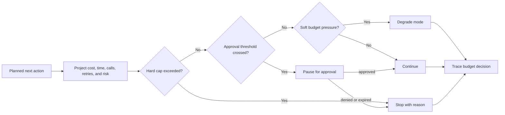

# Cost Controls and Runtime Budgets

Los agentic systems gastan dinero, tiempo, context, cuota de tool y atención humana cada vez que piensan, recuperan, llaman a un tool, delegan, reintentan, evalúan o piden aprobación. Los runtime budgets hacen que esos costos sean explícitos y aplicables.

Descarga la [lista de verificación para revisión de cost controls y runtime budgets](/capstone-assets/templates/cost-controls-runtime-budgets-review-checklist.txt) antes de usar este capítulo para una revisión de producción.

Este capítulo no trata de hacer agents baratos a cualquier costo. Se trata de hacer que el costo, la latencia y la autonomía sean parte del control plane. Un agent útil debe saber cuándo continuar, cuándo degradar, cuándo pedir aprobación y cuándo detenerse.


## Intent

Mantener el comportamiento agentic limitado por el valor del task, el riesgo, el nivel de usuario y los límites operativos.

Un budget no es solo un número financiero. Es un contrato en runtime: cuántos pasos puede dar el sistema, cuántos tools puede llamar, cuánto tiempo puede ejecutarse, cuánta context puede transportar, cuántos retries puede gastar, cuánta atención humana puede solicitar y cuánta autonomía está justificada antes de escalar.

## Runtime Budget Readiness Questions

Usa estas preguntas antes de habilitar loops autónomos, retries, retrieval, delegación o tools de escritura:

| Pregunta | Evidencia a presentar |
| --- | --- |
| ¿Qué justifica gastar el task? | Policy de budget por clase de task, clase de riesgo, nivel de usuario y valor de negocio. |
| ¿Qué mide el runtime? | Contadores para llamadas de model, llamadas de tool, retries, retrieval, delegación, tiempo de reloj y costo. |
| ¿Dónde se aplican los budgets? | Puertas previas a la acción antes de los pasos de model, tool, retrieval, memory, aprobación y delegación. |
| ¿Qué sucede cuando el budget es bajo? | Modos degradados definidos, mensaje para el usuario y razón de detención para el operador. |
| ¿Cuándo se requiere aprobación? | Umbrales para gasto extra, tools de escritura, brechas de evidencia de alto riesgo o tasks de alto riesgo. |
| ¿Cómo se revisan los cambios de budget? | Policy versionada, casos de eval, comparación de traces y ruta de rollback. |

El budgeting es una característica de la arquitectura. Si el budget es solo un dashboard después de la ejecución, es contabilidad, no control.

## Usar cuando

- Las ejecuciones de agent pueden hacer loop, retry, delegar, recuperar o llamar tools.
- Las llamadas de model, tool, retrieval o evaluator tienen costo o latencia significativa.
- Diferentes clases de task merecen diferentes niveles de autonomía.
- El sistema atiende usuarios interactivos y debe preservar la capacidad de respuesta.
- Los operadores necesitan razones claras de detención cuando una ejecución no puede continuar.

Usa este pattern antes de que aparezcan sorpresas de costo en producción. Adaptar budgets después de un loop fuera de control es más difícil porque la arquitectura ya ocultó los contadores.

## Evitar cuando

- El task es una sola llamada determinista de función.
- El sistema no puede observar llamadas de model, llamadas de tool, retries o tiempo de reloj.
- La organización quiere reducción de costos sin definir calidad y riesgo aceptables.

Aun así, mantén contadores simples. El primer prototipo útil suele convertirse en el primer workflow de producción.

## Tipos de Budget

| Budget | Qué controla |
| --- | --- |
| Token budget | Prompt, context, evidencia recuperada, memory y espacio reservado para output. |
| Model-call budget | Número de llamadas de model, nivel de model, llamadas de judge y intentos de reparación. |
| Tool-call budget | Conteo de tools, operaciones de escritura, acciones de navegador, comandos de shell y cuota de API externa. |
| Wall-clock budget | Tiempo de extremo a extremo, tiempo por paso, tiempo en cola y tiempo de espera humana. |
| Retry budget | Cuántas veces un paso puede recuperarse antes de que el sistema cambie de estrategia. |
| Delegation budget | Número de agents, handoffs, debates o ramas paralelas. |
| Retrieval budget | Conteo de queries, conteo de fuentes, costo de reranking y volumen de evidencia. |
| Memory budget | Lecturas y escrituras de memory, retención y recall sensible a privacidad. |
| Approval budget | Cuántas aprobaciones humanas, revisiones o escaladas puede solicitar un workflow. |

El budget más importante a menudo no es el dinero. En producción, la atención humana y la paciencia del usuario suelen ser más escasas que los tokens.

## Propiedad del Budget

Los budgets deben ser propiedad del runtime, no del prompt. El model puede proponer que más trabajo es útil, pero el software debe decidir si el sistema puede gastar más.

La propiedad del budget normalmente pertenece a la misma capa que posee el state, policy, trace IDs y razones de detención:

- los routers cargan el budget para la clase de task;
- los loop controllers descuentan el budget después de cada paso;
- los tool gateways revisan los budgets de tool y efectos secundarios;
- los retrieval services aplican budgets de evidencia y queries;
- los workflow engines persisten el state del budget a través de retries y aprobaciones;
- observability registra eventos de budget como eventos de trace de primera clase.

Si cada wrapper de tool lleva sus propios contadores, el sistema se desincroniza. El runtime necesita una sola vista de budget para la ejecución.

## Runtime Budget Object

Dale a cada ejecución un objeto de budget que viaje con el state:

```ts
type RiskClass = 'low' | 'medium' | 'high';
type BudgetDecision = 'continue' | 'degrade' | 'approval_required' | 'stop';

type RuntimeBudget = {
  riskClass: RiskClass;
  maxCostCents: number;
  maxModelCalls: number;
  maxToolCalls: number;
  maxWriteToolCalls: number;
  maxRetrievalQueries: number;
  maxDelegations: number;
  maxRetries: number;
  maxWallClockMs: number;
  approvalRequiredAboveCents: number;
};

type RuntimeUsage = {
  costCents: number;
  modelCalls: number;
  toolCalls: number;
  writeToolCalls: number;
  retrievalQueries: number;
  delegations: number;
  retries: number;
  startedAtMs: number;
};

type PlannedActionCost = {
  estimatedCostCents: number;
  modelCalls: number;
  toolCalls: number;
  writeToolCalls: number;
  retrievalQueries: number;
  delegations: number;
};
```

El objeto de budget debe estar versionado. Un incidente de producción causado por un cambio de budget debe poder reproducirse contra la policy de budget anterior y la nueva.

## Enforcement

Revisa los budgets antes de cada acción costosa o riesgosa, no después de que la ejecución ya terminó.

```ts
function checkBudget(
  budget: RuntimeBudget,
  usage: RuntimeUsage,
  next: PlannedActionCost,
  nowMs: number
): { decision: BudgetDecision; reason: string } {
  if (nowMs - usage.startedAtMs >= budget.maxWallClockMs) {
    return { decision: 'stop', reason: 'wall_clock_budget_exhausted' };
  }

  const projectedCost = usage.costCents + next.estimatedCostCents;
  if (projectedCost > budget.maxCostCents) {
    return { decision: 'stop', reason: 'cost_budget_exhausted' };
  }

  if (projectedCost > budget.approvalRequiredAboveCents) {
    return { decision: 'approval_required', reason: 'cost_approval_required' };
  }

  if (usage.writeToolCalls + next.writeToolCalls > budget.maxWriteToolCalls) {
    return { decision: 'degrade', reason: 'write_tool_budget_exhausted' };
  }

  if (usage.modelCalls + next.modelCalls > budget.maxModelCalls) {
    return { decision: 'degrade', reason: 'model_call_budget_exhausted' };
  }

  if (usage.retrievalQueries + next.retrievalQueries > budget.maxRetrievalQueries) {
    return { decision: 'degrade', reason: 'retrieval_budget_exhausted' };
  }

  if (usage.toolCalls + next.toolCalls > budget.maxToolCalls) {
    return { decision: 'degrade', reason: 'tool_call_budget_exhausted' };
  }

  if (usage.delegations + next.delegations > budget.maxDelegations) {
    return { decision: 'stop', reason: 'delegation_budget_exhausted' };
  }

  if (usage.retries >= budget.maxRetries) {
    return { decision: 'degrade', reason: 'retry_budget_exhausted' };
  }

  return { decision: 'continue', reason: 'within_budget' };
}
```

La decisión debe formar parte del trace. Nota que la revisión usa el costo proyectado, no solo el uso actual. Una puerta de budget que corre después de la llamada de model o tool ya gastó el dinero y es solo contabilidad. Una puerta de budget que corre antes de la siguiente acción es control.

### Flujo de Decisión de Budget

Usa este flujo antes de cada llamada de model, query de retrieval, llamada de tool, delegación, retry, solicitud de aprobación o escritura en memory. Convierte la presión de budget en una decisión explícita en runtime.



## Degraded Modes

Cuando un presupuesto está casi agotado, el sistema no debe improvisar. Debe cambiar a un modo degradado conocido:

| Presión de Presupuesto | Modo Degradado Más Seguro |
| --- | --- |
| El token budget es bajo | Resumir el state y preservar referencias de evidencia. |
| El model-call budget es bajo | Detener revision loops y devolver el mejor resultado validado. |
| El tool-call budget es bajo | Pasar de acción a borrador o análisis solo de lectura. |
| El wall-clock budget es bajo | Devolver resultado parcial o poner trabajo en cola en segundo plano. |
| El retry budget es bajo | Dejar de reintentar y exponer el bloqueo. |
| El delegation budget es bajo | Asignar un owner en lugar de agregar más agents. |
| El retrieval budget es bajo | Pedir aclaración o citar evidencia faltante. |
| El approval budget es bajo | Agrupar decisiones o escalar a una cola humana. |

El modo degradado debe ser visible para el usuario u operador. La degradación silenciosa genera una falsa confianza.

## Risk-Based Budgets

No toda task merece el mismo presupuesto.

Las tasks de bajo riesgo pueden ser baratas y rápidas. Las de alto riesgo pueden justificar modelos más robustos, más evidencia, más policy checks y aprobación humana. El error es dar a cada task el mismo presupuesto porque el runtime no tiene task class.

| Task Class | Postura de Presupuesto |
| --- | --- |
| Classification | Small model, low context, strict latency, no tools unless necessary. |
| Evidence-bound answer | Retrieval budget, citation requirement, limited synthesis calls. |
| Workflow automation | Tool budget, retry budget, idempotency keys, stop reason. |
| Money movement | Write-tool budget, approval threshold, policy check, audit trace. |
| Multi-agent analysis | Delegation budget, merge budget, coordination trace, final evaluator. |
| Background research | Longer wall-clock budget, queue support, checkpointing. |

Los presupuestos son una forma de codificar el juicio. Indican qué tasks valen más razonamiento, más tools, más revisión o más tiempo.

## Budget Calculator Example

Comienza con una estimación simple por ejecución antes de construir un dashboard complejo.

| Ítem | Cantidad | Estimado Unitario | Estimado por Ejecución |
| --- | ---: | ---: | ---: |
| planner model call | 1 | 1.5 centavos | 1.5 centavos |
| retrieval queries | 3 | 0.2 centavos | 0.6 centavos |
| synthesis model calls | 2 | 2.0 centavos | 4.0 centavos |
| tool calls | 4 | 0.5 centavos | 2.0 centavos |
| evaluator call | 1 | 1.0 centavos | 1.0 centavos |
| retry reserve | 20% | 9.1 centavos base | 1.8 centavos |
| total planned budget |  |  | 10.9 centavos |

Luego mapea la estimación a una policy:

| Task Class | Límite Predeterminado | Aprobación Por Encima De | Modo Degradado |
| --- | ---: | ---: | --- |
| read-only support answer | 15 centavos | 25 centavos | respuesta con evidencia citada y sin retrieval extra |
| refund recommendation | 50 centavos | 75 centavos | recomendación en borrador y solicitar revisión humana |
| multi-agent incident analysis | $2.00 | $3.00 | detener fan-out y asignar un owner |
| background research | $5.00 | $8.00 | poner en cola la continuación y devolver hallazgos parciales |

Los números exactos variarán según el model y el proveedor. El hábito útil es el mismo: estimar antes de la ejecución, reservar para retries, hacer cumplir antes de acciones y registrar el gasto real contra la versión de la policy.

## Alert Thresholds

Las alertas de presupuesto deben distinguir entre una ejecución costosa y un problema sistémico.

| Señal | Advertencia | Crítico | Acción |
| --- | ---: | ---: | --- |
| per-run cost | 80% del límite | 100% del límite | degradar o detener antes de la siguiente acción |
| model calls per run | 80% del límite | límite alcanzado | detener revision loop o requerir aprobación |
| write-tool calls | cualquier escritura inesperada | límite alcanzado | pausar ruta de escritura y revisar trace |
| retry rate | 10% de ejecuciones reintentan | 25% de ejecuciones reintentan | inspeccionar el paso fallido y agregar eval case |
| delegation fan-out | por encima del número planeado de workers | creación descontrolada de workers | detener delegación y asignar owner |
| queue spend rate | 2x gasto horario normal | 5x gasto horario normal | aplicar backpressure o pausar ruta |
| approval requests | 2x volumen normal | cola de revisores bloqueada | agrupar, enrutar o pausar trabajo de baja prioridad |
| degraded-mode rate | 5% de ejecuciones | 15% de ejecuciones | revisar presupuestos, prompts, tools o enrutamiento de tasks |

Cada alerta debe señalar una acción para el operador. Una alerta de costo que solo dice "el gasto es alto" es demasiado vaga para ayudar durante un incidente.

## Interaction With Circuit Breakers

Los budgets y breakers están relacionados pero no son idénticos.

Un budget indica cuánto puede gastar el sistema. Un breaker indica cuándo el sistema debe detenerse o cambiar de estrategia porque el patrón de comportamiento es inseguro o improductivo.

Ejemplos:

- un cost budget detiene la ejecución después de alcanzar el límite de gasto;
- un no-progress breaker detiene la ejecución incluso si queda presupuesto;
- un tool budget limita llamadas a una clase de tool;
- un tool failure breaker deshabilita una tool tras resultados repetidamente malos;
- un delegation budget limita handoffs;
- un handoff breaker impide que los agents reboten trabajo sin owner.

Usa ambos. Una ejecución puede estar dentro del presupuesto y aun así ser insegura. Una ejecución puede ser segura pero ya no justificar el gasto.

## Observability

Los eventos de presupuesto deben ser visibles en los traces:

- versión de la budget policy;
- task class y risk class;
- presupuesto inicial;
- presupuesto restante después de cada paso;
- verificaciones de presupuesto antes de llamadas a model y tool;
- decisión: continuar, degradar, requerir aprobación o detener;
- stop reason;
- modo degradado visible para el usuario;
- explicación visible para el operador.

Si el costo solo es visible en la factura mensual, la arquitectura ya llegó tarde.

## Evaluation Guidance

Prueba el comportamiento de presupuesto como cualquier otro control de producción.

| Eval Case | Comportamiento Esperado |
| --- | --- |
| Model-call budget agotado | Revision loop se detiene o degrada con razón rastreable. |
| Write-tool budget agotado | El agent cambia de acción a borrador o ruta de aprobación. |
| Umbral de costo cruzado | Se requiere aprobación humana antes de continuar. |
| Delegation budget agotado | El supervisor asigna un owner o detiene con estado bloqueado. |
| Wall-clock budget agotado | El workflow pone trabajo en cola o devuelve resultado parcial. |
| Low-value task solicita ruta costosa | El router elige un camino seguro más barato. |
| High-risk task necesita más evidencia | El runtime permite retrieval extra pero requiere policy checks más estrictos. |

El eval debe revisar tanto el resultado como la trayectoria. Una respuesta final que se ve bien pero excedió el presupuesto sin aprobación no es válida.

## Failure Modes

- Los budgets solo viven en prompts, así que el model puede ignorarlos o reinterpretarlos.
- Los budgets se verifican solo después de que ya ocurrió trabajo costoso.
- Se usa el mismo presupuesto para classification de bajo riesgo y automation de alto riesgo.
- El costo se optimiza mientras aumenta el trabajo de revisión humana.
- Retry budgets ocultan fallas repetidas en vez de cambiar de estrategia.
- Faltan delegation budgets, así que los multi-agent systems generan costo de coordinación.
- El agotamiento del presupuesto se registra como un error genérico sin stop reason.
- Los operadores no pueden comparar versiones de budget policy durante la revisión de incidentes.

## Production Checklist

- ¿Cada ejecución inicia con task class, risk class y versión de budget policy?
- ¿Se verifican los budgets antes de acciones de model, tool, retrieval, memory y delegation?
- ¿Las decisiones de presupuesto se registran como eventos de trace?
- ¿Los modos degradados están definidos antes del lanzamiento?
- ¿Las ejecuciones de alto riesgo pueden solicitar aprobación para más presupuesto?
- ¿Las ejecuciones de bajo riesgo pueden detenerse sin revisión humana?
- ¿Los budgets están ligados a evals, incidentes y gates de lanzamiento?
- ¿Se pueden revertir cambios en la budget policy?
- ¿Los operadores pueden responder a dónde se fue el costo de una ejecución?

## Related Chapters

- [Resource-Aware Agent Design](../pattern-selection/resource-aware-agent-design)
- [Circuit Breakers, Fallbacks, and Replay](../pattern-selection/circuit-breakers-fallbacks-replay)
- [Agent Loop](../foundations/agent-loop)
- [Context Budgets and Working Sets](../foundations/context-budgets-and-working-sets)
- [Observability and Evals](./observability-and-evals)
- [Production Evaluation Feedback Loops](./production-evaluation-feedback-loops)
- [Durable Workflows](./durable-workflows)
