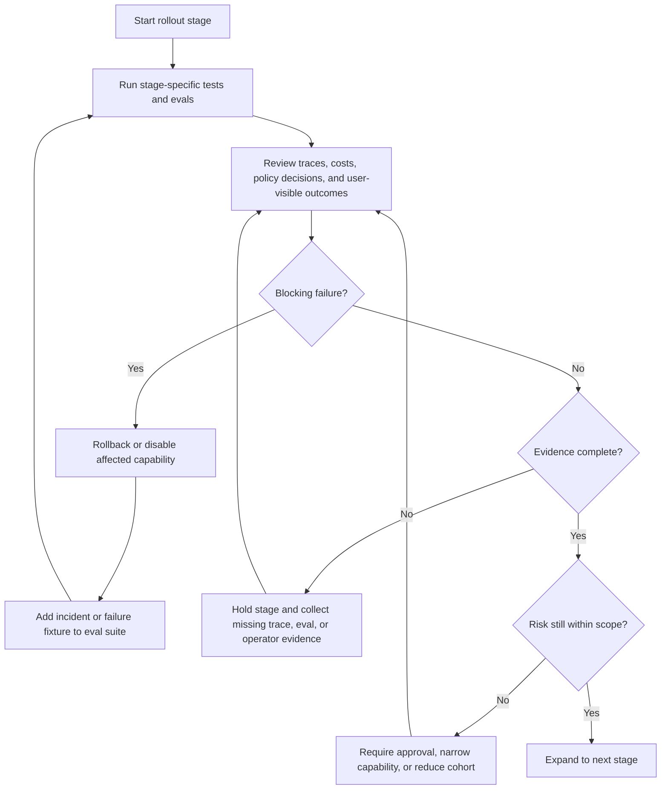

# Deployment Walkthrough

Este walkthrough convierte un agent derivado de laboratorio en un candidato para producción. Es agnóstico al framework: los mismos filtros aplican ya sea que la implementación use TypeScript directo, Python, LangGraph, AutoGen, Mastra, CrewAI o un mini-runtime personalizado.

Descarga la [deployment walkthrough review checklist](/capstone-assets/templates/deployment-walkthrough-review-checklist.txt) antes de usar este capítulo para una revisión de lanzamiento.

Para ejemplos completos, utiliza los [Capstone Projects](../capstone-projects/) después de este capítulo.

El objetivo no es desplegar más rápido. El objetivo es desplegar con suficiente control para que el equipo pueda inspeccionar, detener, reproducir y mejorar el sistema después de que lleguen usuarios reales.

## Alcance

Usa este walkthrough para sistemas que pueden leer datos privados, invocar tools, escribir memory, enviar mensajes, crear borradores, ejecutar pasos de workflow o influir en decisiones de negocio.

Para demos desechables, mantén el proceso más ligero. Para producción, no omitas los filtros que correspondan a la autoridad del sistema.

## Preguntas de Preparación para el Despliegue

Usa estas preguntas antes de promover un laboratorio, implementación de pattern o capstone a un servicio:

| Pregunta | Evidencia de Lanzamiento |
| --- | --- |
| ¿Qué autoridad tiene el agent? | Inventario de lectura, escritura, aprobación, tool, memory y acciones hacia el usuario. |
| ¿Qué debe ser durable? | Checkpoints para aprobaciones, reintentos, efectos secundarios y esperas de workflow. |
| ¿Qué bloquea el lanzamiento? | Tests, evals, revisión de traces, verificaciones de policy y filtros de seguridad. |
| ¿Qué se puede deshabilitar sin desplegar? | Ruta de model, versión de prompt, capability de tool, escrituras de memory, workflow o ruta completa de agent. |
| ¿Qué pueden inspeccionar los operadores? | Runbook, dashboard de traces, dashboard de eval, versión de config y registro de incidentes. |
| ¿Qué sucede durante una falla parcial? | Reintento, compensación, degradación, escalamiento y reglas de motivo de detención. |

El lanzamiento no está listo cuando la única prueba es “el demo funcionó”. Está listo cuando un segundo ingeniero puede desplegarlo, inspeccionarlo, detenerlo y reproducirlo.

## Pipeline de Lanzamiento

Usa este diagrama como ruta de control de despliegue. Un lanzamiento de agent en producción necesita evidencia local, filtros de eval, observación canaria, controles de rollback y retroalimentación de incidentes a eval.


## 1. Desarrollo Local

El desarrollo local debe probar el contrato del runtime antes de que exista infraestructura en la nube.

Evidencia local requerida:

| Evidencia | Prueba Requerida |
| --- | --- |
| install | un checkout limpio puede instalar dependencias |
| run | un comando ejecuta el vertical slice |
| test | pruebas unitarias y de trayectoria pasan |
| eval | al menos un eval que bloquea el lanzamiento corre localmente |
| trace | la ejecución local emite eventos de trace estructurados |
| cleanup | el state local y datos temporales pueden eliminarse |

Comandos locales sugeridos:

```sh
npm test
npm run typecheck
npm run book:build
```

Para variantes en frameworks de Python, agrega el entorno virtual específico del proyecto, comandos de instalación, test y eval al README del laboratorio.

## 2. Configuración y Secrets

La configuración debe hacer explícito el comportamiento de despliegue sin exponer secrets.

Usa estos grupos de variables de entorno:

| Grupo | Ejemplos |
| --- | --- |
| model provider | `OPENAI_API_KEY`, nombre de model, timeout, límite de reintentos |
| runtime | environment, región, nombre del servicio, versión de lanzamiento |
| storage | checkpoint store URL, trace store URL, memory store URL |
| policy | policy version, approval mode, capabilities deshabilitadas |
| observability | endpoint de exportación de trace, modo de muestreo, modo de redacción |
| evals | versión del dataset de eval, umbral de lanzamiento, modo de falla |

Reglas:

- haz commit de `.env.example`, no de `.env`;
- mantén los secrets en el secret manager de la plataforma de despliegue;
- falla el inicio si faltan secrets requeridos;
- registra qué versión de configuración se cargó, no los valores de secrets;
- trata las versiones de prompt, model, tool, policy y eval como insumos del lanzamiento.

## 3. Persistencia y Checkpointing

La persistencia depende de la autoridad. Una respuesta de solo lectura puede ser stateless. Un workflow que espera aprobación, reintenta tools o crea efectos secundarios necesita state durable.

Elige el límite mínimo de persistencia que soporte recuperación:

| Necesidad | Límite de Persistencia |
| --- | --- |
| respuesta solo de request | registro de request más trace |
| continuidad de conversación | thread state o conversation store |
| espera de aprobación humana | checkpoint más registro de aprobación |
| efecto secundario de tool | idempotency key más registro de efecto secundario |
| workflow de larga duración | workflow state más checkpoints de pasos |
| memory | memory store gobernado con retención y eliminación |

Haz checkpoint en cada paso visible externamente:

1. request aceptada;
2. acción planificada;
3. decisión de policy;
4. solicitud o resultado de aprobación;
5. intento de llamada a tool;
6. resultado de efecto secundario;
7. respuesta final;
8. resultado de eval o calidad post-ejecución.

Los reintentos deben leer el checkpoint y decidir si continuar, compensar o detenerse. No deben reproducir efectos secundarios a ciegas.

## 4. Exportación de Observabilidad

La observabilidad de agent debe explicar una ejecución y agregar muchas ejecuciones.

Exporta estos eventos:

| Evento | Campos Requeridos |
| --- | --- |
| run | trace ID, run ID, actor, tenant, environment, release |
| model | model, versión de prompt, referencia de entrada, estado de salida, tokens, costo, latencia |
| tool | nombre de tool, argumentos redactados, autorización, estado, conteo de reintentos, idempotency key |
| retrieval | IDs de fuente, frescura, decisión de acceso, requisitos de citación |
| memory | IDs de lectura, IDs de escritura, clase de retención, base de policy |
| policy | policy version, decisión, reason code, efecto de enforcement |
| approval | rol del aprobador, acción exacta, expiración, resultado |
| eval | case ID, versión de evaluator, score, umbral, pass/fail |

No almacenes secrets, credenciales, datos de pago o contenido privado sin que la policy de retención lo permita explícitamente. Prefiere referencias a registros cifrados cuando el contenido sin procesar no sea necesario para depuración.

## 5. Eval Gate en CI

CI debe bloquear cambios riesgosos antes del despliegue.

Vincula subconjuntos de eval al tipo de cambio:

| Cambio | Eval que Bloquea |
| --- | --- |
| prompt | éxito de task, validez de schema, cumplimiento de policy |
| model | éxito de task, comportamiento de rechazo, calidad de argumentos de tool, costo |
| tool | autorización, idempotencia, manejo de errores |
| retrieval | acceso a fuente, frescura, corrección de citación |
| memory | alcance de lectura, policy de escritura, comportamiento de eliminación |
| workflow | corrección de ruta, reintento, cancelación, reanudación |
| policy | false allow, false deny, enrutamiento de aprobación |

Un filtro mínimo de CI debe ejecutar:

```sh
npm test
npm run typecheck
```

Agrega comandos de eval específicos del proyecto junto a la implementación. El filtro debe fallar cerrado: si el dataset de eval no puede cargarse, el lanzamiento debe detenerse.

### GitHub Actions Gate

Un workflow mínimo de GitHub Actions debe separar los tests ordinarios de los checks de agent que bloquean el lanzamiento.

```yaml
name: agent-release-gate

on:
  pull_request:
  workflow_dispatch:

jobs:
  verify:
    runs-on: ubuntu-latest
    steps:
      - uses: actions/checkout@v4
      - uses: actions/setup-node@v4
        with:
          node-version: 20
          cache: npm
      - run: npm ci
      - run: npm test
      - run: npm run typecheck --if-present
      - run: npm run eval:release --if-present
      - run: npm run trace:contract --if-present
```

Para agents en Python, agrega setup-python, instalación de dependencias, pruebas unitarias y comandos de eval. Mantén los secrets de producción fuera de los jobs de pull-request. CI debe usar fixtures sintéticos, tools simulados, traces redactados y credenciales de staging solo cuando estén explícitamente aprobadas.

El filtro de lanzamiento debe publicar un pequeño resumen de evidencia: commit SHA, versión del dataset de eval, checks aprobados, checks fallidos, resultado del contrato de trace y owner del lanzamiento. Un badge verde de CI no es suficiente cuando el agent puede invocar tools o afectar usuarios.

## 6. Rollout

Haz rollout por capability, no por esperanza.

Usa etapas:

1. ejecución local con fixtures deterministas;
2. ejecución en staging con datos sintéticos;
3. ejecución interna con autoridad de solo lectura;
4. tenant o cohorte limitada;
5. tráfico expandido con dashboards y alertas;
6. lanzamiento completo después de revisión de traces y eval.

En cada etapa, registra:

- versión de lanzamiento;
- versión de model y prompt;
- versión de schema de tool;
- versión de policy;
- versión de dataset de eval;
- estado de exportación de trace;
- owner de rollback.

### Flujo de Decisión de Rollout

Usa este flujo en cada etapa de rollout. El objetivo es que la expansión sea una decisión basada en evidencia, no el siguiente paso por defecto.



## 7. Rollback y Kill Switch

Todo agent de producción necesita una vía rápida de desactivación.

Define kill switches en varios niveles:

| Capa | Acción de desactivación |
| --- | --- |
| model | redirigir al modelo anterior o a un fallback determinista |
| prompt | revertir la versión del prompt |
| tool | deshabilitar una capability en el registro de tools |
| memory | deshabilitar escrituras manteniendo lecturas disponibles si es seguro |
| workflow | pausar nuevas ejecuciones y dejar que las ejecuciones en curso seguras terminen |
| policy | cambiar acciones riesgosas a requerir aprobación o denegarlas |
| agent | redirigir el tráfico a un humano o a un workflow determinista |

El rollback no debe requerir un despliegue de código para fallas comunes. La desactivación de tools, rollback de model, rollback de prompt y endurecimiento de policy deben ser controles operativos.

## 8. Runbook de Producción

Crea un runbook antes del lanzamiento.

Runbook mínimo:

```text
service:
owner:
on-call:
runtime:
framework:
release:
model versions:
prompt versions:
tool registry:
policy version:
memory stores:
checkpoint stores:
trace dashboard:
eval dashboard:
known failure modes:
rollback command:
kill switch:
incident channel:
post-incident eval process:
```

El runbook debe enlazar al ADR de selección de framework, hoja de preparación para producción, suite de eval y dashboard de despliegue.

## 9. Ruta Concreta de Runtime

Usa esta ruta cuando un laboratorio o capstone se convierte en un servicio. Mantiene el código de framework detrás de contratos controlados por el producto.

| Paso | Artifact | Señal de finalización |
| --- | --- | --- |
| package | imagen de contenedor o bundle serverless | la imagen contiene solo archivos de runtime requeridos, lockfile y plantilla de configuración |
| entrypoint | HTTP handler, consumidor de queue o worker de workflow | la solicitud crea un run ID y trace ID antes de iniciar trabajo de model o tool |
| config | `.env.example`, nombres de secretos, versión de policy | el inicio falla cerrado si faltan valores requeridos |
| state | tabla de base de datos, checkpointer o almacén de workflow | una ejecución interrumpida o reintentada se reanuda desde el state conocido |
| tools | registro más metadatos de capability | cada tool tiene clase de side-effect, owner, timeout, retry y regla de aprobación |
| evals | comando de release gate | CI bloquea el despliegue si fallan grounding, policy, schema o trajectory evals |
| observability | exportación de trace y dashboard | una ejecución puede reconstruirse sin secretos sin procesar |
| rollback | feature flag, cambio de ruta o desactivación de tool | el owner puede deshabilitar una capability riesgosa sin desplegar código |

Contrato mínimo de servicio:

```text
POST /runs
input: actor, tenant, task, request payload, idempotency key
output: run_id, trace_id, status, response or escalation
side effects: none before policy, approval, and idempotency checks
```

Para despliegues de queue o workflow, mantén el mismo contrato aunque cambie el transporte. El request envelope, registro de state, trace ID, decisión de policy y resultado de eval deben lucir igual en HTTP, worker y jobs programados.

## 10. Formas de Despliegue en la Nube

Diferentes formas en la nube pueden alojar el mismo contrato de agent. Elige la forma más simple que preserve state, policy, traces y rollback.

| Forma | Usar cuando | Controles requeridos |
| --- | --- | --- |
| container service | agent HTTP o worker necesita proceso de larga vida, caché local o runtime personalizado | health check, límite de autoscaling, secret manager, exportación de trace, kill switch |
| serverless function | paso corto y sin estado con timeout estricto y sin espera de aprobación | almacén de state externo, idempotency key, presupuesto de timeout, prueba de cold-start |
| queue worker | trabajo disparado por eventos o en segundo plano | dead-letter queue, retry policy, backpressure, procedimiento de replay |
| workflow engine worker | trabajo de larga duración, aprobaciones, compensación o reanudación tras falla | almacén de checkpoint, definición de workflow versionada, dashboard de ejecuciones atascadas |
| scheduled job | eval periódica, limpieza de memory, ingestión o generación de reportes | lock, idempotency, registro de última ejecución, alerta por ejecución perdida |

El despliegue en la nube no debe cambiar el modelo de autoridad del agent. Si una ejecución local requiere aprobación antes de enviar correo, el worker en la nube debe requerir la misma aprobación. Si el trace local redacta argumentos de tool, el trace en la nube también debe redactarlos.

## 11. Notas de Despliegue para Research RAG

Los sistemas Research RAG requieren controles de despliegue adicionales porque la recuperación puede exponer material prohibido, obsoleto o no soportado.

Controles requeridos en runtime:

| Control | Regla de producción |
| --- | --- |
| ingestion | almacenar ID de fuente, título, versión, frescura, owner, grupo ACL y etiqueta de citación |
| retrieval | recuperar candidatos con metadatos, no solo texto |
| source filter | aplicar ACL, frescura y tipo de fuente antes de ensamblar el context |
| context packet | incluir evidencia, omisiones y etiquetas de citación como campos estructurados |
| answer synthesis | responder solo a partir del evidence packet aprobado |
| citation eval | bloquear respuestas que citen fuentes faltantes, obsoletas o prohibidas |
| fallback | devolver fuentes aprobadas ordenadas o escalar cuando la evidencia es débil |

Secuencia de despliegue:

1. desplegar retrieval en modo solo lectura;
2. comparar candidatos recuperados con el resultado de source-filter;
3. habilitar answer synthesis solo para usuarios internos;
4. condicionar el release a fidelidad de citación, omisión de fuentes prohibidas y rechazo de fuentes obsoletas;
5. agregar dashboards para evidencia faltante, hits de fuentes obsoletas, intentos de fuentes prohibidas y fallas de citación;
6. mantener un kill switch que desactive la síntesis y devuelva solo listas de fuentes aprobadas.

Esta ruta conecta directamente con el [Research RAG Agent capstone](../capstone-projects/research-rag-agent) y el slice nativo de LangGraph bajo `native-framework-examples/langgraph-research-rag/`.

## Notas de Despliegue Específicas de Framework

| Forma de Framework | Nota de despliegue |
| --- | --- |
| LangGraph | Usa checkpointers persistentes para esperas de aprobación, reanudación y tolerancia a fallos. Trata el thread ID como state sensible. |
| AutoGen | Persiste transcripts con redacción y metadatos de terminación. Evalúa el comportamiento de roles, no solo el output final. |
| Mastra | Mantén explícito el empaquetado de TypeScript runtime: agents, workflows, tools, memory, evals y exportación de trace requieren ownership. |
| CrewAI | Mantén el state de Flow separado de la colaboración local de Crew. Valida el output del crew antes de que Flow lo acepte. |
| Mini-runtime | Usa el proceso de despliegue para decidir qué controles de producción debes construir tú mismo y cuáles deben moverse a la infraestructura de plataforma. |

## Completo Cuando

El sistema es desplegable cuando:

- la configuración local es reproducible;
- los secretos y la configuración están separados;
- la persistencia coincide con la autoridad;
- los traces se exportan y redactan;
- los evals bloquean cambios riesgosos;
- las etapas de rollout están documentadas;
- el rollback funciona sin cambios de código para fallas comunes;
- el runbook nombra owners, dashboards y acciones ante incidentes.

Hasta entonces, el sistema puede ser útil, pero no está listo para producción.
