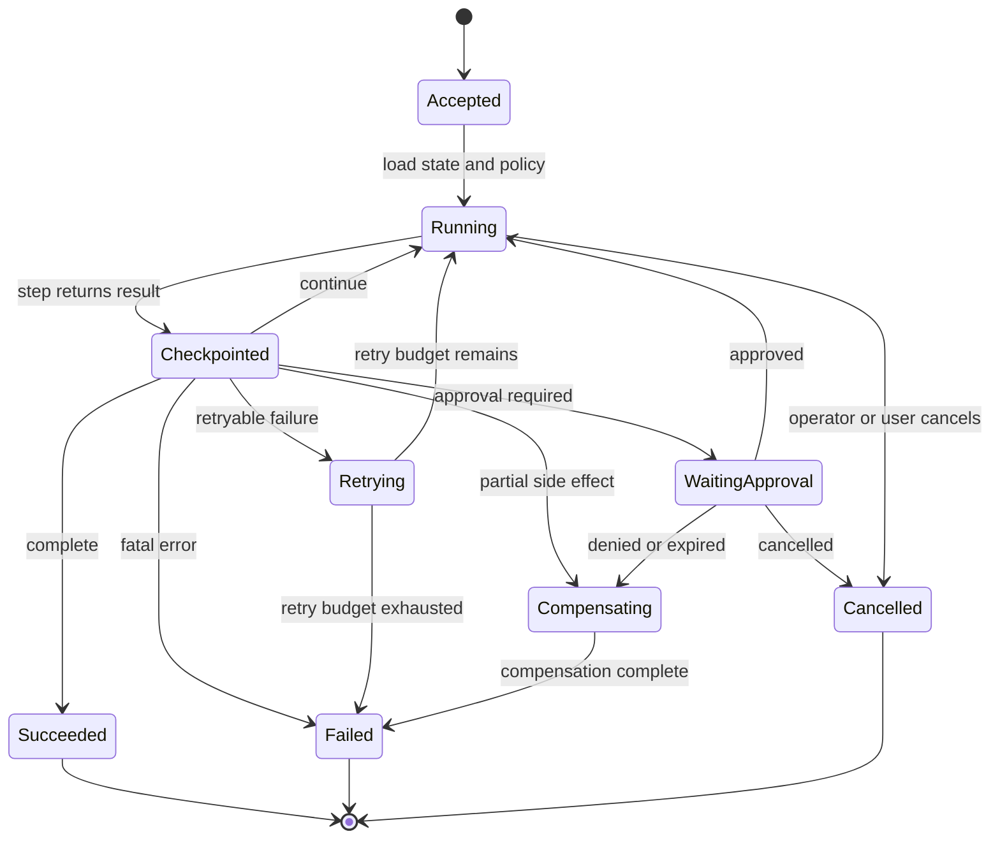

# Durable Workflows

Los durable workflows hacen que los agentic systems sean reanudables y auditables al encargarse de los retries, checkpoints, approvals, compensaciones y el state de larga duración.

> Fuente y descargas
>
> - [Repository source](https://github.com/GTuritto/Agentic-Systems-Patterns/tree/main/durable-workflow-pattern)
> - [Download code bundle](/downloads/durable-workflows.zip)

## Propósito

Los durable workflows envuelven los pasos del agent en un modelo de ejecución reanudable. El workflow controla el orden, checkpoints, retries, approvals, compensaciones, cancelaciones y el state de larga duración. Los agents realizan trabajo acotado dentro de los pasos del workflow.

Esta distinción es importante. Un agent loop no es un workflow engine. Un model puede proponer la siguiente acción, pero el workflow decide qué paso está activo, qué state es durable, cuál retry es seguro, qué approval está pendiente y cómo el sistema se reanuda después de una falla.

## Úsalo cuando

- El trabajo abarca minutos, horas, sistemas externos o approvals humanos.
- Las llamadas a tools pueden fallar y deben reintentarse de forma segura.
- El state debe sobrevivir reinicios de proceso, despliegues, timeouts y caídas parciales.
- Los efectos secundarios requieren idempotencia, compensación, auditoría o approval.
- Los operadores necesitan replay, cancelación, rollback y diagnóstico de incidentes.

## Evítalo cuando

- El task es una respuesta corta y sin state.
- No se requieren efectos secundarios externos, retries, approvals ni state durable.
- El workflow engine ocultaría más comportamiento del que aclara.
- El equipo no puede definir los límites de los pasos ni las reglas de idempotencia.
- El sistema no puede decidir qué debe ocurrir tras una finalización parcial.

## Arquitectura

Usa este diagrama para entender Durable Workflows como un límite de sistema, no solo una forma de código. La pregunta clave de propiedad es: el runtime controla el state durable, retries, traces, triggers, configuración de despliegue y controles operativos.


## Forma del sistema

- **Límite del pattern:** el workflow controla el orden de los pasos, state durable, retries, approvals, cancelación, compensación y replay.
- **Límite del agent:** el agent maneja incertidumbre acotada dentro de un paso, luego retorna un resultado tipado, rechazo, error o escalamiento.
- **Propietario del state:** el state del workflow es durable; el context del model es temporal.
- **Límite de efectos secundarios:** cada acción externa tiene una clave de idempotencia, checkpoint y registro de auditoría.
- **Promesa operativa:** una ejecución puede fallar, pausarse, reanudarse y explicarse sin perder su lugar.

## Protocolo central

1. Recibe una solicitud, evento, schedule o comando de workflow con una clave de idempotencia.
2. Crea o carga el state del workflow con caller, goal, paso actual, policy context y trace ID.
3. Ejecuta un paso acotado: código determinista, agent loop, llamada a tool, espera de approval o evaluator.
4. Checkpoint del state, resultado, costo, eventos de trace, errores y approvals pendientes.
5. Decide la siguiente transición: continuar, retry, esperar, compensar, cancelar, escalar o completar.
6. Reanuda desde el último checkpoint durable tras reinicio o despliegue.
7. Registra el resultado final, motivo de detención, efectos secundarios y metadatos de replay.

## Mapa de transiciones del workflow

Usa este mapa para revisar si cada transición tiene un checkpoint durable, evento de trace y propietario. El workflow debe poder detenerse y reanudarse desde cualquier state no terminal sin repetir efectos secundarios inseguros.



## Notas de implementación

Mantén el state del workflow separado del state de conversación del model.

```ts
type WorkflowState = {
  workflowId: string;
  traceId: string;
  status: 'running' | 'waiting' | 'succeeded' | 'failed' | 'cancelled';
  currentStep: string;
  completedSteps: string[];
  pendingApprovalId?: string;
  idempotencyKeys: Record<string, string>;
  sideEffects: Array<{
    actionId: string;
    tool: string;
    status: 'planned' | 'executed' | 'compensated';
  }>;
  stopReason?: string;
};
```

Cada paso debe retornar una transición, no solo texto:

```ts
type StepResult =
  | { transition: 'continue'; nextStep: string; patch: Partial<WorkflowState> }
  | { transition: 'wait_for_approval'; approvalId: string; patch: Partial<WorkflowState> }
  | { transition: 'retry'; reason: string; retryAfterMs: number }
  | { transition: 'compensate'; reason: string; actionId: string }
  | { transition: 'complete'; output: unknown }
  | { transition: 'fail'; reason: string };
```

La idempotencia no es opcional para los efectos secundarios:

```ts
async function executeRefundDraft(state: WorkflowState, input: RefundDraftInput) {
  const idempotencyKey = state.idempotencyKeys.refundDraft ?? `refund-draft:${state.workflowId}`;

  const result = await refunds.draftRefundRequest(input, { idempotencyKey });

  return {
    transition: 'continue',
    nextStep: 'review_policy',
    patch: {
      idempotencyKeys: { ...state.idempotencyKeys, refundDraft: idempotencyKey },
      sideEffects: [
        ...state.sideEffects,
        { actionId: result.draftId, tool: 'refunds.draftRefundRequest', status: 'executed' }
      ]
    }
  };
}
```

Reintentar una llamada al model usualmente es seguro. Reintentar un efecto secundario solo es seguro cuando el efecto es idempotente o está protegido por el state del workflow.

## Modos de falla

- Los pasos con efectos secundarios se reintentan sin idempotencia.
- El state de approval solo se guarda en el historial de chat y desaparece tras un reinicio.
- El estado del workflow indica éxito mientras el paso del agent retornó incertidumbre o evidencia faltante.
- Un despliegue cambia prompts o manifiestos de tools a mitad de una ejecución sin versionado.
- El workflow no puede reanudarse porque el paso actual es implícito.
- Falta compensación para acciones externas parcialmente completadas.
- La cancelación detiene la UI pero no el tool o worker subyacente.
- Los traces muestran el output final pero no los checkpoints, retries, approvals y efectos secundarios.
- El workflow engine oculta el comportamiento del agent en vez de hacerlo inspeccionable.

## Estrategia de evaluación

Los evals de durable workflow deben probar recuperación, no solo caminos felices.

- Prueba reinicio desde cada checkpoint significativo.
- Prueba entrega duplicada de eventos con la misma clave de idempotencia.
- Prueba falla de tool reintentable y falla fatal de tool.
- Prueba espera de approval, denegación de approval, timeout de approval y reanudación tras approval.
- Prueba despliegue durante un workflow en espera o ejecución.
- Prueba cancelación y compensación.
- Prueba replay desde un trace de producción.
- Prueba que cada resultado final tenga motivo de detención y auditoría de efectos secundarios.

Un eval compacto de workflow puede verse así:

```json
{
  "case_id": "approval_timeout_after_refund_draft",
  "initial_step": "draft_refund",
  "events": [
    { "type": "tool_success", "tool": "refunds.draftRefundRequest" },
    { "type": "approval_timeout", "approval_id": "ap_123" }
  ],
  "expected": {
    "final_status": "waiting_or_escalated",
    "must_not_issue_refund": true,
    "requires_checkpoint": ["refund_draft", "approval_request"],
    "required_trace_events": ["step_started", "tool_result", "checkpoint", "approval_timeout"]
  }
}
```

Mide tasa de éxito al reanudar, seguridad ante eventos duplicados, éxito de retries, éxito de compensaciones, tiempo de espera de approvals, corrección de cancelaciones, éxito de replay y recurrencia de incidentes.

## Lista de verificación para producción

- Define el state del workflow separado del context del prompt.
- Da a cada ejecución de workflow un workflow ID, trace ID y clave de idempotencia estables.
- Haz checkpoint después de cada efecto secundario externo y solicitud de approval.
- Haz que los efectos secundarios sean idempotentes o compensables.
- Versiona prompts, policies, rutas de model, manifiestos de tools y definiciones de workflow.
- Trata espera de approval, timeout, denegación, cancelación y escalamiento como transiciones normales.
- Persiste suficiente data de trace para hacer replay de ejecuciones fallidas.
- Define propiedad operativa para workflows atascados, en espera, fallidos y en compensación.
- Agrega alertas para tormentas de retries, approvals atascados, efectos secundarios duplicados y fallas de replay.
- Convierte incidentes de workflow en producción en evals de regresión.

## Recorrido de código

Lee el extracto como la expresión ejecutable más pequeña del pattern. El capítulo explica las restricciones de diseño; el código muestra dónde esas restricciones se convierten en interfaces concretas, state, validación o control de flujo.

## Código fuente

Este pattern actualmente no tiene un fragmento de código dedicado. Usa los enlaces de descarga y fuente a continuación para acceder a la carpeta completa del pattern.

## Descarga

- [Descargar paquete fuente](/downloads/durable-workflows.zip)
- [Abrir carpeta fuente](https://github.com/GTuritto/Agentic-Systems-Patterns/tree/main/durable-workflow-pattern)

El paquete de descarga contiene la carpeta `durable-workflow-pattern/` actual de este repositorio.

## Patterns relacionados

- [Agent Loop](/foundations/agent-loop)
- [Goals and State](/foundations/goals-and-state)
- [Human Approval Gates](/tools-skills-protocols/human-approval-gates)
- [Policy Enforcement](/production-runtime/policy-enforcement)
- [Self-Healing Workflows](/control-loops/self-healing-workflows)
- [Production Evaluation Feedback Loops](/production-runtime/production-evaluation-feedback-loops)
- [Pattern Composition Playbook](/pattern-selection/pattern-composition-playbook)
