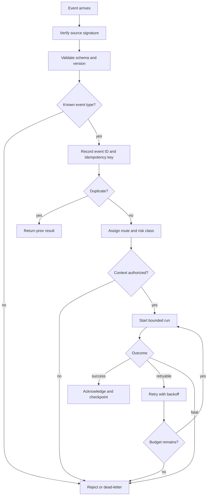

# Event-Triggered Agents

Los event-triggered agents se ejecutan en respuesta a webhooks, colas, programaciones o eventos de dominio.

> Fuente y descargas
>
> - [Repository source](https://github.com/GTuritto/Agentic-Systems-Patterns/tree/main/event-triggered-agent-pattern)
> - [Download code bundle](/downloads/event-triggered-agents.zip)

## Propósito

Los event-triggered agents se ejecutan en respuesta a webhooks, colas, programaciones o eventos de dominio.

Usa este pattern cuando el sistema debe reaccionar a trabajo que llega sin que un usuario en vivo esté viendo la pantalla. El event runtime, no el model, es responsable de la admisión, deduplicación, idempotencia, reintentos, dead letters, replay y controles de tormenta.

## Escenario

Una plataforma de soporte emite `refund.requested` cuando un cliente abre un caso de reembolso. El agent debe revisar la policy, resumir el historial de pedidos, redactar una recomendación y notificar a un revisor. No debe procesar el mismo reembolso dos veces si la cola vuelve a entregar el evento. No debe actuar sobre un evento obsoleto o no autorizado. Debe detenerse de forma segura si la fuente de policy no está disponible.

Esta es la diferencia entre un event-triggered agent y un chat agent. El agent puede ejecutarse a las 03:00 sin que haya un usuario presente. El runtime debe decidir si acepta, retrasa, rechaza, reintenta o envía a dead letter el evento antes de que el model proponga algo.

## Usar cuando

- Un evento de dominio, webhook, mensaje de cola, programación o llegada de archivo debe iniciar trabajo acotado de un agent.
- La task puede describirse como un tipo de evento mapeado a una clase de task.
- La entrega duplicada, los reintentos y los eventos tardíos pueden manejarse de forma segura.
- El evento puede portar u obtener suficiente context autorizado.
- El sistema puede trazar event ID, run ID, idempotency key, policy decision, tool calls y stop reason.

## Evitar cuando

- El payload del evento no tiene suficiente información de identidad, tenant, recurso o versión para actuar de forma segura.
- La entrega duplicada podría repetir efectos secundarios irreversibles.
- Los requisitos de orden no están claros.
- Las fallas no pueden ser reintentadas, compensadas o enviadas a dead letter.
- Un humano debe inspeccionar el context antes de la primera acción.

## Arquitectura

Usa este diagrama para leer Event-Triggered Agents como un límite de sistema, no solo una forma de código. La pregunta clave de propiedad es: el runtime es dueño del state durable, reintentos, traces, triggers, configuración de despliegue y controles operativos.

Léelo como un límite de runtime desatendido: event identity, idempotency, policy, checkpoints, reintentos, dead letters y replay evidence protegen cada efecto secundario.

## Reglas de decisión

| Pregunta | Respuesta requerida | Falla si falta |
| --- | --- | --- |
| ¿Qué tipo de evento inicia el trabajo? | Nombre y versión de evento estables. | Una ruta maneja payloads incompatibles. |
| ¿Qué recurso se ve afectado? | Resource ID, tenant, actor y correlation ID. | Acción cruzada de tenant o recurso incorrecto. |
| ¿Qué hace único al evento? | Event ID más source, tenant o resource scope. | La entrega duplicada repite el trabajo. |
| ¿Qué orden importa? | Ninguno, por recurso, por tenant o global. | Los eventos tardíos sobrescriben un state más nuevo. |
| ¿Qué efectos secundarios pueden ocurrir? | Leer, redactar, notificar, escribir o ejecutar. | El reintento duplica acciones irreversibles. |
| ¿Qué es reintetable? | Clases de error, intentos máximos, backoff y regla de dead letter. | El sistema descarta trabajo o reintenta para siempre. |
| ¿Quién revisa las fallas? | Dueño de dead letter y frecuencia de revisión. | Los eventos rotos se vuelven backlog invisible. |

### Flujo de admisión de eventos

## Forma del sistema

- **Límite del pattern:** un servicio de producción o framework aloja el agent detrás de límites de durable workflow, policy, observability y despliegue.
- **Dueño del state:** el runtime es dueño de la recepción de eventos, deduplicación, run state, reintentos, dead letters, replay, traces, configuración de despliegue y controles operativos.
- **Artifact principal:** `event-triggered-agent-pattern/` documenta el límite revisable de evento a agent y los controles del runtime.
- **Promesa operativa:** un evento aceptado crea como máximo una ejecución autorizada y trazable para el recurso afectado.

## Contrato

Un event-triggered agent necesita un event envelope antes de necesitar un prompt.

| Campo | Propósito |
| --- | --- |
| `eventId` | Identidad para deduplicación y replay. |
| `eventType` | Enruta el evento a una clase de task acotada. |
| `eventVersion` | Protege contra cambios incompatibles en el payload. |
| `source` | Nombra el origen del webhook, cola, programación o servicio. |
| `actorId` | Registra quién o qué causó el evento cuando se conoce. |
| `tenantId` | Hace cumplir el límite de tenant antes de la recuperación o tools. |
| `resourceId` | Identifica el pedido, ticket, cuenta, archivo o registro afectado. |
| `occurredAt` y `receivedAt` | Soportan decisiones de eventos tardíos y de orden. |
| `correlationId` | Conecta solicitud upstream, evento, run, tools y traces. |
| `idempotencyKey` | Previene efectos secundarios duplicados en reintentos. |
| `payload` | Transporta datos validados de la task, no instrucciones confiables. |

## Protocolo central

1. Verifica source del evento, schema, versión, identidad, tenant y resource scope.
2. Registra event ID, correlation ID e idempotency key antes de efectos secundarios.
3. Enruta el evento a una clase de task acotada con nivel de riesgo y policy context.
4. Obtén el context requerido a través de tools autorizados en vez de confiar en el texto del payload.
5. Ejecuta un agent o paso de workflow acotado.
6. Haz checkpoint de resultado, trace data, costo y estado de error.
7. Reconoce, reintenta, compensa, continúa, rechaza, escala o envía a dead letter según la policy del runtime.

## Notas de implementación

- Trata los payloads de eventos como entrada no confiable. Un cuerpo de webhook puede describir una task, pero no debe sobrescribir policy, ruta, tools o reglas de memory.
- Registra el idempotency key antes de llamar a un tool con capacidad de escritura.
- Define el orden por recurso. La mayoría de los sistemas necesitan orden por ticket, pedido o cuenta, no orden global.
- Usa verificaciones de versión optimistas o locks cuando dos eventos pueden afectar el mismo recurso.
- Mantén presupuestos de reintentos separados para llamadas al model, retrieval, tools y reprocesamiento de eventos completos.
- Agrega un ciclo de revisión de dead letter. Un dead letter que nadie revisa es pérdida de datos silenciosa.
- Haz que el replay sea consciente de la versión. Reproducir un evento antiguo contra una nueva policy, prompt o versión de tool debe ser explícito.

## Modos de falla

- Efecto secundario duplicado: la redelivería repite un reembolso, correo, actualización de ticket o cambio de infraestructura.
- Event storm: un bug upstream inunda el agent y consume el presupuesto de model/tool.
- Poison event: un payload mal formado u hostil llega al context del model como instrucción.
- Sobrescritura por evento tardío: un evento antiguo actualiza el state después de una decisión más reciente.
- Brecha de context: el evento carece de identidad, tenant, recurso o context de autorización.
- Bucle de reintento: un error irrecuperable se trata como reintetable.
- Negligencia de dead letter: los eventos fallidos se acumulan sin dueño, alerta o ruta de replay.
- Replay drift: un evento reproducido usa una policy o prompt diferente sin registrar el cambio de versión.

## Lista de revisión

Antes de producción, verifica:

- Event type, versión, source, actor, tenant, resource y correlation ID están registrados.
- Las versiones de evento no soportadas fallan de forma segura.
- La entrega duplicada retorna un resultado previo o reanuda el mismo run.
- El idempotency key se registra antes de escrituras externas.
- Las reglas de orden y concurrencia son explícitas.
- Los errores reintetables y fatales están clasificados.
- La dead-letter queue tiene dueño, alerta, frecuencia de revisión y procedimiento de replay.
- Los controles de event storm pueden pausar, descartar, muestrear o enrutar a fallback determinista.
- El trace vincula event ID, run ID, policy decision, tool calls y stop reason.

## Estrategia de evaluación

- Prueba evento válido, evento duplicado, falta de identidad, tenant no autorizado, versión no soportada, evento tardío y evento fuera de orden.
- Prueba tool outage reintetable, error fatal de schema, replay de dead letter y timeout del model.
- Prueba event storms con límites de concurrencia por tenant y por ruta.
- Prueba prompt injection incrustado en el texto del payload.
- Prueba idempotencia reproduciendo el mismo evento después de una escritura parcial.
- Mide tasa de aceptación, tasa de duplicados, tasa de reintentos, tasa de dead letter, latencia de procesamiento, profundidad de la cola, gasto en model/tool y éxito de replay.

## Lista de verificación para producción

- Los contratos de eventos tienen versiones y se revisan antes del lanzamiento.
- Los webhooks verifican firmas; las colas verifican origen y permisos.
- El runtime almacena event ID, run ID, idempotency key, route, risk class y policy version.
- Los efectos secundarios son idempotentes, compensables o requieren aprobación.
- Los presupuestos de reintentos y backoff están documentados por clase de error.
- El replay de dead-letter requiere aprobación del responsable y conciencia de versión.
- La profundidad de la cola, tasa de reintentos, conteo de dead-letter, latencia y gasto tienen alertas.
- Los operadores pueden pausar una route, drenar una queue, hacer replay de un evento y deshabilitar write tools.

Usa la lista de verificación de agent event-triggered del libro en línea antes de un piloto en producción.

## Recorrido por el código

Lee el extracto como la expresión ejecutable más pequeña del pattern. El capítulo circundante explica las restricciones de diseño; el código muestra dónde esas restricciones se convierten en interfaces concretas, state, validación o control de flujo.

## Código fuente

Este pattern actualmente no tiene un extracto de código dedicado. Usa el source y los enlaces de descarga a continuación para acceder a la carpeta completa del pattern.

## Descarga

- [Descargar paquete fuente](/downloads/event-triggered-agents.zip)
- [Abrir carpeta fuente](https://github.com/GTuritto/Agentic-Systems-Patterns/tree/main/event-triggered-agent-pattern)

El paquete de descarga contiene la carpeta actual `event-triggered-agent-pattern/` de este repositorio.

## Patrones relacionados

- [Durable Workflows](/production-runtime/durable-workflows)
- [Observability and Evals](/production-runtime/observability-and-evals)
- [Policy Enforcement](/production-runtime/policy-enforcement)
- [Choosing the Right Pattern](/pattern-selection/choosing-the-right-pattern)
- [Resource-Aware Agent Design](/pattern-selection/resource-aware-agent-design)
