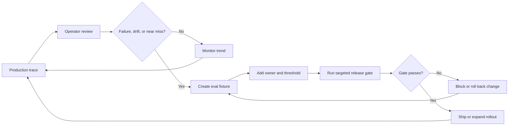
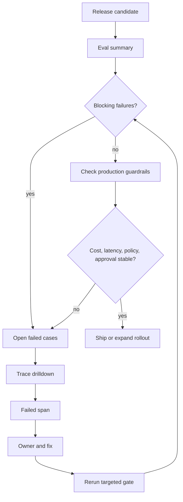

# Observability and Evals

Observability registra lo que sucedió. Evals decide si el comportamiento es suficientemente bueno. Release gates decide si un cambio puede salir a producción.

> Fuente y descargas
>
> - [Repository source](https://github.com/GTuritto/Agentic-Systems-Patterns/tree/main/observability-and-evals-pattern)
> - [Download code bundle](/downloads/observability-and-evals.zip)

## Propósito

El patrón de Observability and Evals hace que el comportamiento del agent sea inspeccionable, reproducible y testeable. Observability registra lo que hizo el agent, por qué lo hizo, qué observó, qué cambió, cuánto costó y por qué se detuvo. Evals convierte esos traces, tasks conocidos, incidentes y near misses en release gates.

Este patrón importa porque las fallas de un agent rara vez viven solo en la respuesta final. Viven en la trayectoria: una retrieval faltante, una tool call insegura, una policy denegada ignorada, un loop que nunca convergió, una aprobación humana que se omitió o una actualización de model que cambió el plan. Registrar solo respuestas finales no es observability, y revisar solo respuestas finales no es suficiente evaluación.

Lee esto después de los capítulos de runtime y seguridad si estás diseñando para producción. El runtime le da al agent un entorno controlado para ejecutarse; seguridad define lo que debe bloquearse o aprobarse; observability y evals demuestran si esos controles funcionaron.

## Usar cuando

- Las decisiones del agent afectan usuarios, dinero, datos o sistemas externos.
- Necesitas pruebas de regresión para prompts, tools, routing o workflows.
- Las fallas son difíciles de reproducir solo con las respuestas finales.
- Necesitas comparar cambios de model, prompt, tool, memory o policy antes de lanzar.
- Operas workflows donde la razón de detención importa tanto como la respuesta.

## Evitar cuando

- No puedes almacenar traces de forma segura por restricciones de privacidad o regulación.
- El prototipo es desechable y no tiene usuarios operativos.
- Solo registras respuestas finales y llamas a eso observability.
- Nadie se hace responsable del eval suite después de la primera versión.
- La organización no está lista para definir reglas de retención, redacción y acceso para los traces.

## Arquitectura

Usa este diagrama para leer Observability and Evals como un límite de sistema, no solo como una forma de código. La pregunta clave de propiedad es: el runtime es dueño del state durable, retries, traces, triggers, configuración de despliegue y controles operativos.


## Forma del sistema

- **Runtime boundary:** el runtime crea trace IDs, run IDs, span IDs y idempotency keys antes de que el agent comience a trabajar.
- **Span model:** llamadas a model, retrieval, tool, decisiones de policy, esperas de aprobación, decisiones de evaluator, retries y pasos de workflow son spans de primera clase.
- **Eval boundary:** los evals no son una ocurrencia tardía. Están conectados a traces, incidentes, release gates y cambios de model o prompt.
- **Data boundary:** los traces se redactan antes de almacenarse, se retienen por un periodo definido y se protegen como datos de producción.
- **Operational boundary:** los dashboards conectan comportamiento, calidad, costo, latencia y respuesta a incidentes.

Observability y evaluación están relacionadas, pero no son la misma capa.

| Capa | Pregunta que responde | Artifact típico |
| --- | --- | --- |
| Logs | ¿Qué evento ocurrió? | Registros de eventos estructurados. |
| Metrics | ¿Con qué frecuencia, qué tan lento, qué tan caro? | Contadores, gauges, histogramas, SLOs. |
| Traces | ¿Qué camino tomó una ejecución? | Run, iteration, model, tool, policy, approval y evaluator spans. |
| Evals | ¿Fue aceptable el comportamiento? | Casos de prueba, resultados esperados, graders, umbrales e informes de fallas. |
| Release gates | ¿Puede salir este cambio? | Subconjuntos de eval requeridos y registros de aprobación. |

No combines todo esto en un solo dashboard. Un dashboard puede mostrar síntomas. Un trace puede explicar una ejecución. Un eval puede bloquear un mal cambio antes de que llegue a los usuarios.

## Protocolo central

1. Inicia cada ejecución con un trace ID, run ID, request ID y caller context estables.
2. Registra cada span de model, tool, retrieval, policy, approval, evaluator y workflow.
3. Captura suficiente input, output, configuración y referencias de evidencia para reproducir el comportamiento.
4. Redacta secretos, credenciales, datos privados y contenido crudo innecesario antes de persistir.
5. Almacena la razón de detención, estado, costo, latencia, token count, tool count, retry count y resultado de policy.
6. Convierte incidentes, near misses y traces representativos en eval fixtures.
7. Bloquea cambios riesgosos con el subconjunto relevante de eval antes del despliegue.
8. Mantén los evals fallidos asociados a responsables, decisiones de lanzamiento y trabajo de seguimiento.

El operational loop debe ser explícito:

1. El runtime emite traces y metrics.
2. Los operadores inspeccionan fallas, near misses y outliers.
3. Los ingenieros convierten ejemplos útiles en eval fixtures.
4. Los release gates ejecutan los fixtures relevantes antes de cambios en model, prompt, policy, tool, memory o workflow.
5. Los nuevos traces de producción confirman si el cambio mejoró el comportamiento o solo movió la falla.

## Notas de implementación

Usa este loop para conectar evidencia del runtime con decisiones de lanzamiento. El paso importante es el handoff de un trace de producción a un eval fixture nombrado que pueda bloquear el siguiente cambio riesgoso.



- Traza a nivel de run, iteración de loop, llamada a model, llamada a tool, paso de workflow y resultado de evaluator.
- Almacena suficiente detalle de input/output para reproducir fallas, con redacción para datos sensibles.
- Mantén datasets dorados para routing, structured outputs, planes de tool y respuestas finales.
- Trata los eval failures como bloqueadores de lanzamiento para agents en producción.
- Rastrea tanto la calidad final como la calidad de la trayectoria. Una buena respuesta producida a través de un camino inseguro de tool sigue siendo una falla.
- Mantén los trace schemas estables. Si cada servicio registra campos diferentes, depurar se vuelve arqueología.
- Asocia los eval cases al pattern que protegen: routing, retrieval, uso de tool, enforcement de policy, memory, aprobación humana o coordinación multi-agent.
- Separa product analytics de agent observability. Product analytics dice lo que hicieron los usuarios. Agent observability dice lo que el sistema hizo en su nombre.
- Almacena identificadores para prompts, models, tools, policies, retrievers, memory stores y versiones de harness. Sin versiones, un trace explica lo que pasó pero no lo que cambió.
- Trata "no trace" como un defecto de producción. Una ejecución de agent sin trace no puede depurarse, reproducirse ni defenderse en una revisión de incidentes.

### Modelo de revisión de dashboard de eval

Un dashboard de eval debe ayudar a un ingeniero a decidir si lanzar, hacer rollback o inspeccionar una ejecución específica. No construyas un muro de gráficos que no pueda responder qué trace falló y quién es responsable de la corrección.



Usa esto como el layout mínimo del dashboard:

| Panel | Muestra | Pregunta de release |
| --- | --- | --- |
| Release Gate | eval suite, componente cambiado, pass/fail, cantidad de bloqueos, responsable. | ¿Puede salir este cambio? |
| Failure Table | case ID, severidad, comportamiento esperado, comportamiento real, boundary protegido. | ¿Qué fallas importan? |
| Trace Drilldown | run, model, retrieval, tool, policy, approval, evaluator spans. | ¿Dónde se rompió el camino? |
| Guardrails | razones de detención, denegaciones de policy, esperas de aprobación, errores de tool, retries. | ¿La autonomía se mantuvo dentro de su boundary? |
| Cost And Latency | latencia p50/p95, costo, token count, tool count por ruta. | ¿El cambio creó una regresión operativa? |
| Incident Conversion | issue de producción, trace fuente, nuevo fixture, responsable, fecha límite. | ¿Esta falla será detectada la próxima vez? |

Un dashboard útil parte de una decisión de release y profundiza en la evidencia del trace. Si un eval fallido no puede abrir el trace fuente, el dashboard reporta calidad sin explicar el comportamiento.

### Contrato mínimo de Trace

Como mínimo, cada ejecución en producción debe conectar estos registros:

- identidad de la ejecución: trace ID, run ID, request ID, actor, tenant, environment y version set;
- goal y stop state: requested goal, accepted goal, status, stop reason y error class;
- context: context packet ID, retrieved evidence IDs, memory IDs, omitted-source notes y redaction level;
- actividad del model: model, prompt version, tool schema version, token counts, latency, cost y output status;
- actividad del tool: tool name, arguments after redaction, authorization decision, result status, side-effect record, idempotency key y retry count;
- actividad de policy: policy version, decision, reason code, approval requirement y escalation owner;
- actividad de memory: read IDs, write IDs, retention class, consent or policy basis y correction path;
- actividad de evaluation: evaluator version, case ID cuando aplique, score, threshold y pass or fail decision.

El trace no debe almacenar cada byte crudo por defecto. Debe guardar suficiente evidencia estructurada para reconstruir el camino de forma segura.

### Ejemplo de evento de Trace

```ts
type AgentTraceEvent = {
  traceId: string;
  runId: string;
  spanId: string;
  parentSpanId?: string;
  requestId: string;
  actorId: string;
  tenantId: string;
  environment: 'dev' | 'staging' | 'prod';
  step: string;
  spanType:
    | 'run'
    | 'model'
    | 'tool'
    | 'retrieval'
    | 'memory'
    | 'policy'
    | 'approval'
    | 'evaluator'
    | 'workflow';
  timestamp: string;
  status: 'started' | 'succeeded' | 'failed' | 'denied' | 'waiting' | 'cancelled';
  latencyMs: number;
  versionSet: {
    model?: string;
    prompt?: string;
    toolSchema?: string;
    policy?: string;
    retriever?: string;
    harness?: string;
  };
  model?: string;
  tool?: string;
  policyDecision?: 'allow' | 'deny' | 'require_approval' | 'escalate';
  evidenceRefs?: string[];
  memoryRefs?: string[];
  sideEffectRef?: string;
  idempotencyKey?: string;
  costCents?: number;
  stopReason?: string;
  redaction: 'none' | 'pii_removed' | 'secret_removed' | 'content_reference_only';
};
```

Este evento no pretende ser el único schema en el sistema. Es un contrato para correlación. Un trace de proveedor de model, un span de OpenTelemetry, un evento del workflow engine y un resultado de eval pueden mapearse en él.

### Ejemplo de fixture de Eval

```json
{
  "case_id": "tool_called_without_policy_trace",
  "source_trace_id": "tr_1042",
  "failure": "A refund draft was created without a recorded policy decision.",
  "expected": {
    "required_spans": ["tool", "policy"],
    "must_not_call_tools": ["refunds.issue_refund"],
    "stop_reason": "policy_boundary"
  }
}
```

### Tipos de Eval

Los agent evals necesitan más de un score.

| Eval type | Qué protege | Ejemplo de verificación |
| --- | --- | --- |
| Task success | El trabajo visible para el usuario fue completado. | El support agent redacta la respuesta correcta de reembolso. |
| Trajectory correctness | El agent tomó un camino aceptable. | Recuperó la policy antes de redactar el reembolso. |
| Tool correctness | La elección del tool y los argumentos fueron válidos. | Llamó a `orders.lookup` antes de proponer la compensación. |
| Policy compliance | Acciones inseguras fueron bloqueadas o escaladas. | No emitió un reembolso sin aprobación. |
| Retrieval quality | La evidencia fue relevante, reciente y citada. | La respuesta cita la policy de reembolso activa, no una archivada. |
| Memory correctness | Las lecturas y escrituras de memory fueron delimitadas y revisables. | No almacenó una queja transitoria como una preferencia durable. |
| Autonomy safety | El sistema se detuvo en el límite correcto. | Produjo un borrador en vez de enviar el mensaje. |
| Recovery behavior | El manejo de fallos preservó el control. | Un timeout produjo un retry o escalamiento, no un éxito silencioso. |
| Cost and latency | El sistema se mantuvo dentro del presupuesto. | Un cambio en el prompt no duplicó el costo medio. |

El objetivo no es construir un juez perfecto. El objetivo es hacer visibles los fallos importantes antes de que el tráfico en producción los encuentre.

### Release Gates

Vincula subconjuntos de eval a tipos de cambio.

| Change | Subconjunto de eval requerido |
| --- | --- |
| Prompt change | task success, schema validity, trajectory correctness, policy compliance |
| Model change | task success, refusal behavior, cost, latency, tool argument quality |
| Tool schema change | tool correctness, authorization, idempotency, error handling |
| Retrieval change | grounding quality, citation faithfulness, stale-source handling |
| Memory change | memory read scope, memory write policy, deletion and correction behavior |
| Policy change | false allow, false deny, approval routing, escalation traceability |
| Harness or runtime change | cancellation, retry, replay, trace completeness, side-effect safety |

Los sistemas pequeños pueden empezar con un gate corto. Los sistemas serios eventualmente necesitan gates que correspondan al radio de impacto del cambio.

## Failure Modes

- Logs que omiten el prompt, la entrada del tool o la configuración del model.
- Evals que solo revisan caminos felices.
- Métricas sin trace IDs, dificultando la investigación de incidentes.
- Almacenar datos sensibles sin reglas de retención o redacción.
- Logging solo de la respuesta final que oculta el camino que produjo la respuesta.
- Llamadas a tools sin argumentos, salidas, permisos y efectos secundarios capturados.
- Policy denials que no son visibles en traces, haciendo que el trabajo bloqueado parezca confusión del model.
- Traces que filtran secretos, credenciales, datos de clientes o razonamientos internos que no deberían almacenarse.
- Evals que prueban la calidad del texto pero ignoran la evidencia recuperada, la trayectoria del tool y el comportamiento de policy.
- Dashboards que muestran costo y latencia agregados pero no pueden profundizar en ejecuciones fallidas.
- Revisiones de incidentes que no generan nuevos casos de eval.
- Suites de eval sin dueño, sin proceso de actualización y sin autoridad de liberación.
- Traces que no pueden responder qué model, prompt, policy, tool schema, retriever o harness version produjo la ejecución.
- Evals que pasan porque simulan el comportamiento exacto del tool, memory o policy que falló en producción.
- Evaluadores en línea que silenciosamente se convierten en otro agent path no observado.

## Estrategia de evaluación

- **Trace completeness:** cada ejecución en producción tiene spans correlacionados de model, tool, policy, evaluator y workflow.
- **Replayability:** los ingenieros pueden reproducir un fallo con la configuración almacenada, entradas, referencias de evidencia y tool mocks.
- **Trajectory correctness:** el agent usó los tools permitidos, respetó la policy, se detuvo por la razón correcta y no omitió aprobaciones requeridas.
- **Grounding quality:** las respuestas que dependen de retrieval citan la evidencia que realmente se usó.
- **Cost and latency regression:** los cambios en model, prompt y tool no pueden aumentar silenciosamente el costo o el tiempo de respuesta en runtime.
- **Policy-denial accuracy:** las solicitudes inseguras son bloqueadas o escaladas con una razón rastreable.
- **Incident-to-eval conversion:** los fallos repetidos o de alta severidad en producción se convierten en fixtures de regresión.
- **Memory safety:** las lecturas y escrituras de memory siguen las reglas de retención, consentimiento, corrección y eliminación para el task.
- **Autonomy boundary:** el agent se detiene para aprobación, escalamiento o handoff cuando su nivel de autonomía lo requiere.
- **Release-gate authority:** los evals fallidos bloquean el cambio o requieren una anulación explícita y rastreable.

## Lista de verificación para producción

- Define un schema de trace estable antes del tráfico en producción.
- Redacta y clasifica los campos de trace antes de almacenarlos.
- Correlaciona logs, métricas, traces, resultados de eval, workflow state e incidentes visibles para el usuario.
- Asigna un dueño y un rol de decisión de liberación a cada suite de eval.
- Ejecuta evals dirigidos para cambios en prompt, model, tool, memory, policy y workflow.
- Agrega dashboards para tasa de éxito, stop reason, policy denials, tool errors, cost, latency, retries y tasa de regresión de eval.
- Define reglas de retención, control de acceso y eliminación para los datos de trace.
- Convierte incidentes y casi-incidentes en fixtures de eval antes de cerrar el seguimiento operativo.
- Versiona prompts, models, tools, policies, retrievers, memory behavior y harness code en el trace.
- Mapea tipos de cambio a subconjuntos de eval requeridos.
- Requiere un dueño nombrado para fallos y excepciones de eval.

## Recorrido de código

Lee el extracto como la expresión ejecutable más pequeña del pattern. El capítulo que lo rodea explica las restricciones de diseño; el código muestra dónde esas restricciones se convierten en interfaces concretas, state, validación o control de flujo.

## Código fuente

Estos extractos muestran la forma de la implementación. El código completo está disponible en el paquete de descarga y en el repositorio fuente.

### `observability-and-evals-pattern/trace-contract.ts`

[Abrir fuente completa](https://github.com/GTuritto/Agentic-Systems-Patterns/blob/main/observability-and-evals-pattern/trace-contract.ts)

```ts
export type SpanType =
  | "run"
  | "model"
  | "tool"
  | "retrieval"
  | "memory"
  | "policy"
  | "approval"
  | "evaluator"
  | "workflow";

export type AgentTraceEvent = {
  traceId: string;
  runId: string;
  spanId: string;
  parentSpanId?: string;
  requestId: string;
  actorId: string;
  tenantId: string;
  environment: "dev" | "staging" | "prod";
  step: string;
  spanType: SpanType;
  timestamp: string;
  status: "started" | "succeeded" | "failed" | "denied" | "waiting" | "cancelled";
  latencyMs: number;
  versionSet: {
    model?: string;
    prompt?: string;
    toolSchema?: string;
    policy?: string;
    retriever?: string;
    harness?: string;
  };
  model?: string;
  tool?: string;
  policyDecision?: "allow" | "deny" | "require_approval" | "escalate";
  evidenceRefs?: string[];
  memoryRefs?: string[];
  sideEffectRef?: string;
  idempotencyKey?: string;
  costCents?: number;
  stopReason?: string;
  redaction: "none" | "pii_removed" | "secret_removed" | "content_reference_only";
};

export type TraceCheckResult = {
  ok: boolean;
  missing: string[];
};

export function checkTraceContract(events: AgentTraceEvent[]): TraceCheckResult {
  const missing: string[] = [];
  const spanTypes = new Set(events.map(event => event.spanType));
  const run = events.find(event => event.spanType === "run");

  if (!run) missing.push("run span");
  if (!spanTypes.has("model")) missing.push("model span");
  if (!events.some(event => event.stopReason)) missing.push("stop reason");
  if (!events.every(event => event.traceId && event.runId && event.spanId)) {
    missing.push("correlation ids");
  }

  for (const event of events) {
    if (event.spanType === "tool" && !event.policyDecision) {
      missing.push(`policy decision for tool span ${event.spanId}`);
    }

    if (event.spanType === "tool" && event.status === "succeeded" && !event.idempotencyKey) {
      missing.push(`idempotency key for tool span ${event.spanId}`);
    }

    if (event.spanType === "retrieval" && event.status === "succeeded" && !event.evidenceRefs?.length) {
      missing.push(`evidence refs for retrieval span ${event.spanId}`);
    }

    if (event.redaction === "none" && event.environment === "prod") {
      missing.push(`redaction classification for production span ${event.spanId}`);
    }
  }

  return {
    ok: missing.length === 0,
    missing: [...new Set(missing)]
  };
}
```

## Descarga

- [Descargar paquete fuente](/downloads/observability-and-evals.zip)
- [Abrir carpeta fuente](https://github.com/GTuritto/Agentic-Systems-Patterns/tree/main/observability-and-evals-pattern)

El paquete de descarga contiene la carpeta actual `observability-and-evals-pattern/` de este repositorio.

## Patrones relacionados

- [Evaluator-Optimizer](https://github.com/GTuritto/Agentic-Systems-Patterns/blob/main/evaluator-optimizer-pattern/README.md)
- [Durable Workflows](https://github.com/GTuritto/Agentic-Systems-Patterns/blob/main/durable-workflow-pattern/README.md)
- [Agent Loop](https://github.com/GTuritto/Agentic-Systems-Patterns/blob/main/agent-loop-pattern/README.md)
- [Tool Use](https://github.com/GTuritto/Agentic-Systems-Patterns/blob/main/tool-using-agent-pattern/README.md)
- [Compliance/Policy Enforcer](https://github.com/GTuritto/Agentic-Systems-Patterns/blob/main/compliance-policy-enforcer-agent/README.md)
- [Human Approval Gates](https://github.com/GTuritto/Agentic-Systems-Patterns/blob/main/human-in-the-loop-approval-agent/README.md)
