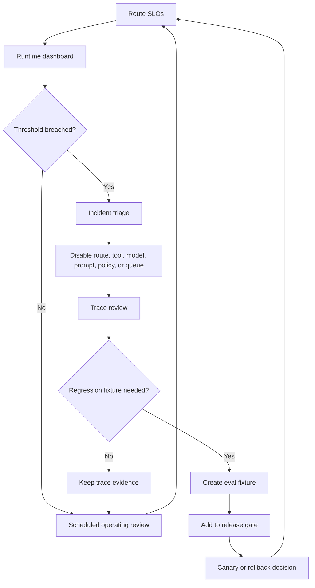

# Production Runtime Overview

Los agentic systems en producción necesitan más que prompts, tools y un buen model. Necesitan un runtime que controle el límite de ejecución.

La regla central es la misma en todo este libro: el model propone, el runtime decide. El model puede proponer un plan, una llamada a un tool, una escritura en memory, una consulta de retrieval, una respuesta o una condición de detención. El runtime decide si esa propuesta es válida, permitida, asequible, observable, durable y segura de ejecutar.

Aquí es donde muchos proyectos de agent fallan. Tratan la llamada al model como si fuera el sistema, y luego agregan logging, reintentos, aprobaciones, evals y rollback después del primer incidente. Un runtime de producción invierte ese orden. Le da al agent un entorno controlado para operar.

Este capítulo controla la ejecución a lo largo de los runs: admisión, state, policy, presupuestos, ejecución de tools, recuperación, rollout y visibilidad para el operador. No controla la UX del producto, el contenido de policy de dominio, el entrenamiento del model ni la implementación interna de tools y servicios.

Lee esto después de [Agent Harnesses](../agent-engineering-practice/agent-harnesses). El harness explica el entorno de trabajo alrededor de un agent; este capítulo explica lo que debe cumplirse cuando ese trabajo se ejecuta como un sistema de producción con colas, presupuestos, reintentos, state, rollout, rollback y operadores.

Para una guía paso a paso del laboratorio al lanzamiento, usa [Deployment Walkthrough](./deployment-walkthrough). Para la configuración de framework y plantillas de decisión, usa [Real Framework Setup Notes](../agent-engineering-practice/real-framework-setup-notes) y [Templates and Worksheets](../agent-engineering-practice/templates-and-worksheets).

Descarga la hoja de trabajo operativa: [runtime SLO and incident review worksheet](/capstone-assets/templates/runtime-slo-and-incident-review-worksheet.txt).

Usa este diagrama como un mapa del control-plane. Cada recuadro nombra una responsabilidad del runtime que debe tener un responsable, un registro de trace y una ruta de rollback antes del tráfico en producción.


## Qué controla el Runtime

El runtime de producción es el control plane alrededor del juicio del model.

| Runtime Concern | Qué controla |
| --- | --- |
| State | Goal, estado del run, paso del workflow, intentos, resultados de tools, aprobaciones, motivo de detención. |
| Policy | Permisos, clasificación de riesgos, denegación, aprobación, escalamiento, requisitos de auditoría. |
| Budgets | Tokens, llamadas al model, llamadas a tools, reintentos, delegaciones, tiempo de reloj, costo. |
| Tools | Schemas, permisos, timeouts, idempotencia, registros de side-effect. |
| Memory y retrieval | Elegibilidad de fuente, frescura, control de acceso, referencias de evidencia, escrituras en memory. |
| Observability | Trace IDs, spans, costos, latencia, eventos de model y tool, metadatos de replay. |
| Evaluation | Chequeos en runtime, fixtures de incidentes, gates de lanzamiento, datasets de regresión. |
| Recovery | Reintentos, fallbacks, circuit breakers, checkpoints, compensación, rollback. |

El runtime no elimina la autonomía. Hace que la autonomía sea lo suficientemente acotada como para confiar en ella.

## Matriz de Responsabilidad del Runtime

El runtime debe hacer explícita la propiedad de cada aspecto. Si nadie es responsable de alguna de estas filas, el model eventualmente lo será por accidente.

| Responsabilidad | Decisión del runtime | Falla si falta |
| --- | --- | --- |
| Run admission | ¿Debe esta solicitud iniciar, esperar, rechazarse o redirigirse? | Trabajo inseguro o no soportado entra al loop. |
| State ownership | ¿Qué state es durable, temporal, visible o eliminado? | Progreso perdido, memory oculta, fallas no reproducibles. |
| Execution mode | ¿Debe el task ejecutarse de forma síncrona, asíncrona o como un durable workflow? | Tiempos de espera, runs zombies, usuarios bloqueados, efectos secundarios parciales. |
| Proposal validation | ¿Es válida la propuesta del model para schema, policy, budget y state? | Se ejecutan llamadas a tools porque el model parecía confiado. |
| Tool execution | ¿Qué credenciales, timeout, clave de idempotencia y registro de side-effect aplican? | Escrituras duplicadas, credenciales filtradas, propiedad poco clara. |
| Approval state | ¿Qué espera revisión humana, quién lo aprobó y qué acción exacta fue aprobada? | La aprobación se convierte en un permiso amplio en vez de un gate acotado. |
| Cancellation | ¿Qué se detiene de inmediato, qué se drena y qué debe ser compensado? | Los runs cancelados siguen gastando o continúan efectos secundarios. |
| Rollout | ¿Qué model, prompt, policy, tool schema, retriever o versión de harness está activa? | Las regresiones se lanzan globalmente sin rollback rápido. |
| Operations | ¿A quién se alerta, qué se desactiva y qué evidencia se preserva? | Los incidentes se convierten en arqueología manual. |

## El Runtime Loop

Un runtime loop de producción no es solo observar, decidir, actuar. Se parece más a:

1. recibir una solicitud, evento, programación, webhook o comando de workflow;
2. autenticar al solicitante y cargar la clase de task, clase de riesgo, state, policy, budget y trace ID;
3. armar el conjunto de trabajo: goal, restricciones, evidencia, tools permitidos, memory y reglas de detención;
4. pedir al model o a un router determinista una propuesta acotada;
5. validar la propuesta contra schema, policy, budget, state, evidencia y reglas de aprobación;
6. ejecutar un paso acotado a través de un tool, workflow, retrieval service, evaluator o gate de aprobación;
7. hacer checkpoint del state, eventos de trace, costo, latencia, side effects y motivo de detención;
8. decidir si continuar, fallback, esperar, escalar, rechazar, compensar o completar;
9. convertir fallas importantes y casi fallas en casos de eval.

Este loop es lo que separa un producto agentic de un demo. El model aún puede ser creativo y adaptativo, pero el sistema sabe qué pasó y por qué.

## Límites del Runtime

Un buen runtime crea límites explícitos:

- **Decision boundary:** el model puede sugerir acciones, pero el software las valida.
- **Authority boundary:** los side effects requieren tool schemas, permisos, budgets y reglas de aprobación.
- **State boundary:** el durable workflow state está separado del model context.
- **Context boundary:** el model ve un conjunto de trabajo seleccionado, no todos los documentos o memory disponibles.
- **Cost boundary:** cada loop, tool, reintento, llamada al model y delegación gasta del budget.
- **Policy boundary:** la denegación y el escalamiento son resultados del runtime, no preferencias del prompt.
- **Recovery boundary:** los reintentos, fallbacks, replay y rollback se diseñan antes del tráfico en producción.

Cuando faltan estos límites, el model se convierte en el control plane por accidente.

## Execution Modes

No ejecutes todos los agents de la misma manera. Ajusta el modo del runtime al trabajo.

| Modo | Úsalo cuando | Requisitos del runtime |
| --- | --- | --- |
| Synchronous request | El task es corto, principalmente de lectura y seguro para fallar rápido. | Timeout estricto, budget pequeño, sin side effects irreversibles, trace completo. |
| Async job | El task puede tomar segundos o minutos pero no necesita compensación compleja. | Cola, registro de estado, cancelación, reintentos, idempotencia, eventos de progreso. |
| Durable workflow | El task abarca aprobaciones, sistemas externos, reintentos o state de larga duración. | Checkpoints, capacidad de reanudar, compensación, replay, state de workflow versionado. |
| Event-triggered run | El task inicia desde un webhook, programación, stream o evento de sistema. | Deduplificación, identidad de evento, política de orden, backpressure, trail de auditoría. |
| Human-gated run | El task puede preparar trabajo pero necesita aprobación antes de ejecutarse. | Registro de aprobación, binding de acción exacta, semántica de pausa y reanudación. |

El modo incorrecto genera bugs en producción. Un workflow de reembolso no debe depender de que una solicitud HTTP permanezca activa. Un clasificador corto no debe pagar el costo de complejidad de un motor de durable workflow.

## Queues, Backpressure y Concurrency

Los agents consumen recursos escasos: cuota de model, capacidad de tools, tiempo de aprobación humana, conexiones a base de datos, browser workers y dinero. El runtime debe controlar la admisión y la concurrencia antes de que el loop comience a gastar.

Controles útiles incluyen colas por tenant, límites de concurrencia por ruta, límites de tasa por proveedor de model, bulkheads específicos por tool, presupuestos de reintentos, dead-letter queues y clases de prioridad. El backpressure no es solo un tema de infraestructura. Es la forma en que el sistema rechaza trabajo de bajo valor antes de que dañe el trabajo de alto valor.

La concurrencia también afecta la corrección. Dos runs no deben emitir el mismo reembolso, actualizar el mismo ticket, reescribir la misma memory o desplegar el mismo servicio sin coordinación. Usa locks, verificaciones de versión, claves de idempotencia o transiciones de state de workflow donde el trabajo duplicado sería dañino.

## Rollout y Rollback

Los agents en producción cambian de más formas que los servicios normales. Un release puede cambiar el model, prompt, tool schema, retriever, memory policy, approval rule, sandbox profile, evaluator o el código del workflow. El runtime debe versionar esas piezas y registrar el set de versiones activas en cada ejecución.

El rollout debe ser gradual para agents de alto riesgo:

- comienza con evals offline;
- ejecuta pruebas shadow o replay cuando sea posible;
- habilita solo un tenant, ruta o porcentaje pequeño;
- compara traces, costos, razones de detención, denegaciones de policy y resultados visibles para el usuario;
- mantén un camino de rollback para cada componente cambiado.

El rollback debe ser operativo, no solo teórico. Los operadores deben poder deshabilitar un tool, fijar un model, revertir un prompt, endurecer una policy, detener una ruta, drenar una cola o forzar la aprobación humana sin redeplegar todo el producto.

## Cómo se Componen los Capítulos de Production Runtime

Lee la sección de production runtime como un solo modelo operativo:

- [Durable Workflows](./durable-workflows) gestionan el state de larga duración, reintentos, checkpoints, aprobaciones, compensaciones y capacidad de reanudación.
- [Observability and Evals](./observability-and-evals) registra lo que sucedió y convierte el comportamiento en algo que los ingenieros pueden inspeccionar.
- [Production Evaluation Feedback Loops](./production-evaluation-feedback-loops) convierte fallas en producción en casos de regresión y filtros de release.
- [Cost Controls and Runtime Budgets](./cost-controls-runtime-budgets) define cuánta autonomía, gasto, tiempo y atención humana puede consumir una ejecución.
- [Policy Enforcement](./policy-enforcement) mantiene las decisiones de permisos, riesgo y cumplimiento fuera del model.
- [Event-Triggered Agents](./event-triggered-agents) muestra cómo los agents responden a eventos sin perder idempotencia, state y auditabilidad.
- [Mastra Runtime](./mastra-runtime) traduce estas preocupaciones de producción en un estilo concreto de runtime.

Los capítulos están separados porque cada límite merece atención. En un sistema real, deben funcionar juntos.

## Launch Evidence Map

Antes del lanzamiento, cada aspecto del runtime debe generar evidencia que otro ingeniero pueda inspeccionar. Un build en verde es útil, pero no prueba que el agent pueda ser operado.

| Concern | Evidence Artifact | Release Question |
| --- | --- | --- |
| Admission | Route table con task class, risk class, tenant scope y refusal path. | ¿Qué solicitudes pueden iniciar, esperar, redirigirse o rechazarse? |
| State | Run-state schema, ejemplo de checkpoint y regla de eliminación. | ¿Puede el equipo reconstruir lo que el agent creía y dónde se detuvo? |
| Policy | Decision matrix, reason codes y approval rules. | ¿Puede el software detener una propuesta insegura antes de ejecutarse? |
| Budget | Policy de presupuesto por ruta y comportamiento ante agotamiento. | ¿Qué sucede cuando el task ya no justifica más gasto? |
| Tools | Tool manifest con schemas, permisos, timeouts y clase de side-effect. | ¿Se puede validar una llamada a tool sin confiar en el texto del model? |
| Memory and retrieval | Source policy, regla de frescura, regla de citación y clase de retención de memory. | ¿Puede el agent explicar qué evidencia usó y por qué estaba permitida? |
| Observability | Trace contract y enlaces a dashboards. | ¿Puede un operador pasar de un síntoma, al trace, al responsable? |
| Evaluation | Lista de evals bloqueantes, incident fixtures y salida de release-gate. | ¿Qué fallas conocidas bloquearían este release? |
| Recovery | Runbook con acciones de retry, fallback, compensación y rollback. | ¿Qué pueden deshabilitar o restaurar los operadores sin un redeploy completo? |

La evidencia no necesita ser elaborada. Debe ser real, actual y estar enlazada desde el registro de release.

## Minimal Runtime Contract

Cada ejecución en producción debe poder generar un contrato como este:

```ts
type RuntimeRun = {
  runId: string;
  traceId: string;
  requestId: string;
  actorId: string;
  tenantId: string;
  route: string;
  goal: string;
  autonomyLevel: "advisory" | "drafts_for_review" | "executes_after_approval" | "bounded_autonomous";
  riskClass: "low" | "medium" | "high";
  executionMode: "sync" | "async_job" | "durable_workflow" | "event_triggered";
  status: "queued" | "running" | "waiting" | "succeeded" | "failed" | "refused" | "cancelled";
  versionSet: {
    model: string;
    prompt: string;
    policy: string;
    toolSchema: string;
    retriever?: string;
    harness: string;
  };
  budgetPolicyVersion: string;
  policyVersion: string;
  workflowStep?: string;
  allowedTools: string[];
  idempotencyKey?: string;
  approvalId?: string;
  checkpointRef?: string;
  stopReason?: string;
};
```

Esto no es suficiente para implementar una plataforma completa, pero sí para hacer visibles las partes ocultas. Si una ejecución no tiene actor, tenant, route, trace ID, risk class, autonomy level, execution mode, version set, budget policy, policy version, allowed tools, status y stop reason, será difícil de operar.

Para trabajos de alto riesgo, este contrato debe almacenarse antes de la primera llamada al model. La ejecución puede cambiar el state, pero el runtime nunca debe adivinar quién la inició, qué autoridad tiene, qué versión está activa o por qué se detuvo.

## Operating Dashboard View

El dashboard del runtime debe mostrar control, no solo actividad.

| Panel | Shows | Operator Action |
| --- | --- | --- |
| Active runs | route, tenant, risk class, status, workflow step, age y owner. | Cancelar, pausar o escalar trabajo atascado. |
| Budget pressure | token spend, tool spend, retry spend y ejecuciones cerca del agotamiento. | Bajar concurrencia, requerir aprobación o detener tareas de baja prioridad. |
| Policy decisions | denies, approvals, escalations, false allows y override rate. | Endurecer reglas, revisar excepciones o agregar eval fixtures. |
| Tool health | timeout rate, retry rate, side-effect failures y conflictos de idempotencia. | Deshabilitar un tool, drenar una cola o cambiar el camino de fallback. |
| Trace quality | missing spans, missing stop reasons, redaction failures y replay gaps. | Bloquear el release hasta que la evidencia esté completa. |
| Release versions | versiones activas de model, prompt, policy, retriever, workflow y tool schema. | Fijar, hacer rollback o canary de un componente. |
| Eval status | blocking failures, flaky cases, incident fixture failures y gate history. | Detener rollout o asignar reparación de fixtures. |

Si el dashboard no puede responder "¿qué debe hacer un operador ahora?", es solo una página de reportes, no una superficie de control del runtime.

## Runtime SLO y Incident Loop

Los service-level objectives (SLOs) hacen explícita la calidad del runtime. No los definas solo para uptime. Los agentic systems también necesitan SLOs para trace coverage, policy-decision coverage, approval latency, eval-gate health, cost y stop-reason completeness.



Usa este loop después del lanzamiento y durante canaries. Una buena revisión operativa puede responder qué SLO cambió, qué ruta se modificó, qué trace prueba la falla, qué componente se puede deshabilitar y qué eval ahora previene la recurrencia.

| Runtime SLO | Ejemplo de Target | Investiga Cuando | Haz Rollback o Pausa Cuando |
| --- | --- | --- | --- |
| Trace coverage | 99% de los runs de alto riesgo tienen spans completos de run, route, policy, tool, approval y stop-reason. | Falta policy o stop reason en cualquier trace de alto riesgo. | Un release cambia el comportamiento riesgoso sin trace coverage. |
| Policy-decision coverage | 100% de los paths de write, send, memory y external-action registran una policy decision. | Falta el policy span o está separado del tool span. | Se ejecuta un side effect sin evidencia de policy. |
| Approval latency | 95% de las esperas de approval se resuelven o expiran dentro del SLA del negocio. | Las esperas de approval envejecen sin owner o expiry. | Approvals obsoletos pueden reanudar acciones cambiadas. |
| Cost budget | La route se mantiene dentro del presupuesto acordado por run o por task completado. | El costo por task completado se dispara después de un cambio en model, prompt o retrieval. | El agotamiento del presupuesto no detiene ni degrada de forma segura. |
| Eval-gate health | Los evals bloqueantes pasan antes de cambios en prompt, model, policy, tool, memory o workflow. | Fallas de eval de advertencia se agrupan en un límite. | Un fixture de incidente conocido falla o se vuelve inestable sin owner. |
| Stop-reason completeness | Cada run terminal registra completed, refused, failed, cancelled, timed out, blocked o needs approval. | Los estados terminales contienen `done` genérico o falta el motivo. | Los operadores no pueden distinguir entre éxito, rechazo, falla o side effect parcial. |

Los números variarán según el producto. Lo importante es que cada SLO tenga un owner y una acción. Un umbral sin decisión operativa es solo una gráfica.

## Runtime Checklist

Antes de que un agent en producción maneje trabajo real, responde:

- ¿Quién es owner del goal activo?
- ¿Dónde se almacena el run state durable?
- ¿Qué componente valida las propuestas del model?
- ¿Qué modo de ejecución se ajusta a este task?
- ¿Qué tools están permitidas para esta clase de task?
- ¿Qué acciones requieren approval?
- ¿Qué presupuesto aplica al run?
- ¿Qué sucede cuando se agota el presupuesto?
- ¿Qué eventos de trace son obligatorios?
- ¿Qué side effects requieren idempotencia o compensación?
- ¿Qué breaker, fallback o ruta de escalamiento existe?
- ¿Qué evals bloquean el release?
- ¿Qué política de queue, límite de concurrencia o backpressure aplica?
- ¿Qué versiones de componentes se registran en cada run?
- ¿Qué se puede hacer rollback sin redeployar todo el sistema?

Si esas respuestas son vagas, el sistema sigue siendo un prototipo, aunque ya esté sirviendo usuarios.

## Failure Modes

- El model controla las transiciones de state porque el runtime no tiene workflow state.
- La policy vive en el prompt en vez de una capa de enforcement en el runtime.
- Las llamadas a tool ocurren antes de los chequeos de presupuesto, permisos, schema o approval.
- La lógica de retry repite side effects sin claves de idempotencia.
- Observability registra solo las respuestas finales, pero no las propuestas, decisiones de validación, llamadas a tool y stop reasons.
- Los evals prueban solo el texto final mientras el runtime path sigue sin probarse.
- Los operadores no pueden deshabilitar rápidamente un tool riesgoso, versión de prompt, ruta de model o paso de workflow.
- El sistema puede seguir gastando tokens, llamadas a tool y atención humana después de que el task ya no lo justifica.
- Una solicitud síncrona oculta un workflow de larga duración hasta el primer timeout o retry duplicado.
- Las queues crecen sin backpressure, prioridad, cancelación o manejo de dead-letter.
- Los runs cancelados detienen la UI pero no la llamada a tool en queue o el workflow externo.
- Un cambio en model o prompt se lanza sin traces versionados, evals dirigidos o un plan de rollback.
- Un fallo parcial parece éxito porque el runtime registra la respuesta final pero no el side effect fallido.
- Existe state durable, pero el model context y el workflow state no concuerdan sobre qué paso está activo.

## Design Rule

El runtime de producción es donde la arquitectura agentic se vuelve honesta. Si el runtime no puede explicar, limitar, reproducir y detener el agent, el model no es el único riesgo. La arquitectura lo es.

Continúa con [Durable Workflows](./durable-workflows) para ejecución reanudable, [Observability and Evals](./observability-and-evals) para evidencia operativa y [Policy Enforcement](./policy-enforcement) para decisiones de autoridad.

## Capítulos Relacionados

- [Architecture Before Autonomy](../pattern-selection/architecture-before-autonomy)
- [Agentic System Architecture](../systems-architecture/agentic-system-architecture)
- [Reference Architecture](../systems-architecture/reference-architecture)
- [Durable Workflows](./durable-workflows)
- [Observability and Evals](./observability-and-evals)
- [Production Evaluation Feedback Loops](./production-evaluation-feedback-loops)
- [Cost Controls and Runtime Budgets](./cost-controls-runtime-budgets)
- [Policy Enforcement](./policy-enforcement)
