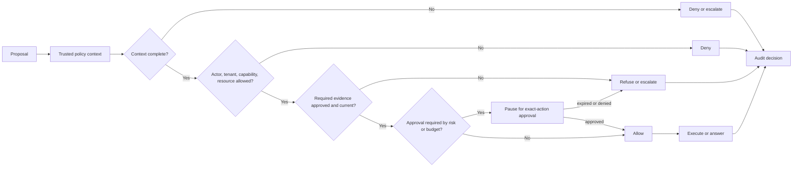

# Policy Enforcement

La enforcement de policy limita lo que el agent puede decir o hacer mediante permisos, reglas de acceso a datos, reglas de negocio, reglas de seguridad y escalamiento.

> Fuente y descargas
>
> - [Repository source](https://github.com/GTuritto/Agentic-Systems-Patterns/tree/main/compliance-policy-enforcer-agent)
> - [Download code bundle](/downloads/policy-enforcement.zip)

## Intent

La enforcement de policy es el límite controlado por software que decide si una respuesta propuesta por el model, una llamada a tool, un acceso a datos, una escritura en memory o un efecto secundario está permitido. El model puede proponer una acción. El runtime decide si la permite, la niega, requiere aprobación, la escala o la audita.

La policy no debe vivir solo en el texto del prompt. Los prompts pueden explicar la policy al model, pero la enforcement pertenece al código, workflow, manifiestos de tools, sistemas de control de acceso y registros de decisiones auditables.

Los agents orientados al conocimiento usan la misma idea para las respuestas: el model solo debe responder desde fuentes aprobadas, citar la evidencia y rechazar o escalar cuando la fuente requerida falta, está desactualizada, prohibida o en conflicto.

La regla práctica es: la policy se ejecuta antes de la autoridad. Antes de la recuperación, antes de las escrituras en memory, antes de la ejecución de tools, antes de la comunicación externa y antes de las respuestas finales en dominios regulados o basados en evidencia, el runtime debe saber si la acción está permitida.

## Usar cuando

- Las acciones deben ser verificadas antes de ejecutarse.
- El agent maneja datos privados, regulados, sensibles a la seguridad o críticos para el negocio.
- El sistema necesita fuentes aprobadas, citas o restricciones de cumplimiento.
- Las decisiones de policy deben ser auditables y reproducibles.
- El runtime puede identificar actor, recurso, acción, capability, riesgo y context.
- Las llamadas a tools, escrituras en memory, recuperación, respuestas finales o transiciones de workflow requieren reglas diferentes según la clase de task.
- Existe una ruta de aprobación humana para acciones válidas pero demasiado riesgosas para ejecutarse de forma autónoma.

## Evitar cuando

- La policy solo está escrita como guía en el prompt sin verificación en runtime.
- El sistema no puede identificar el actor, recurso, acción y context.
- Las verificaciones de policy ocurren después de acciones irreversibles.
- Las excepciones son silenciosas, no revisadas o faltan en los traces.
- Las fuentes de conocimiento aprobadas no pueden ser identificadas, actualizadas o citadas.
- El runtime no puede detener, pausar o cambiar la ejecución después de una decisión de policy.

## Arquitectura

Usa este diagrama para leer Policy Enforcement como un límite de sistema, no solo como una forma de código. La pregunta clave de propiedad es: el runtime es dueño del state durable, reintentos, traces, triggers, configuración de despliegue y controles operativos.


## Forma del sistema

- **Límite del pattern:** el límite de policy evalúa acciones propuestas, acceso a datos, respuestas y escrituras en memory antes de que tengan efecto.
- **Propietario del state:** el runtime es dueño del policy context, registros de decisión, versión de policy, trace ID y resultado de enforcement.
- **Rol del model:** el model propone una acción o respuesta y puede explicar el riesgo, pero no se otorga permiso a sí mismo.
- **Límite de conocimiento:** fuentes aprobadas, vigencia, citas y reglas de rechazo definen lo que el agent puede afirmar.
- **Límite de presupuesto:** la policy puede requerir aprobación, degradar capability o detenerse cuando una ejecución ha excedido el gasto o autonomía permitidos para su clase de riesgo.
- **Promesa operativa:** las decisiones de policy ocurren antes de la ejecución y son visibles después de la ejecución.

## Protocolo central

1. Recibir una acción propuesta, respuesta, llamada a tool, resultado de recuperación o escritura en memory.
2. Construir el policy context: actor, caller, tenant, recurso, capability, riesgo, evidencia y trace ID.
3. Evaluar la policy antes de que la acción se ejecute o la respuesta se devuelva.
4. Retornar una decisión: permitir, negar, requerir aprobación, escalar o solo auditar.
5. Si se requiere aprobación, pausar en la puerta de aprobación.
6. Ejecutar solo las decisiones permitidas o aprobadas.
7. Registrar decisión, motivo, versión de policy, actor, recurso, acción y trace ID.
8. Alimentar negaciones graves, omisiones y sobrescrituras en los regression evals.

## Notas de implementación

Usa este flujo de decisión al revisar dónde se ejecuta la policy. Cada rama debe producir un evento de trace con la versión de policy, motivo, actor, recurso, capability y efecto de ejecución.



Una decisión de policy debe ser un objeto tipado en runtime.

```ts
type PolicyOutcome = 'allow' | 'deny' | 'require_approval' | 'escalate' | 'audit';

type PolicyDecision = {
  actionId: string;
  actor: {
    id: string;
    role: string;
    tenantId?: string;
  };
  resource: {
    type: 'customer_record' | 'refund' | 'email' | 'memory' | 'document';
    id: string;
    tenantId?: string;
  };
  capability: 'read' | 'write' | 'send' | 'refund' | 'remember' | 'answer';
  riskLevel: 'low' | 'medium' | 'high' | 'critical';
  decision: PolicyOutcome;
  reason: string;
  requiredApproval?: {
    approverRole: string;
    approvalPolicy: string;
  };
  policyVersion: string;
  traceId: string;
};
```

El policy context debe provenir de state confiable en runtime, no solo del texto del model:

```ts
type PolicyContext = {
  actionId: string;
  traceId: string;
  actorRole: string;
  actorTenant?: string;
  resourceTenant?: string;
  capability: PolicyDecision['capability'];
  riskLevel: PolicyDecision['riskLevel'];
  toolName?: string;
  evidenceStatus?: 'present' | 'missing' | 'stale' | 'forbidden';
  budgetState: 'within_budget' | 'approval_threshold' | 'exhausted';
  hasHumanApproval: boolean;
  policyVersion: string;
};
```

La función de enforcement debe ejecutarse antes de la recuperación, escritura en memory, llamada a tool, efecto secundario o respuesta final:

```ts
function enforcePolicy(input: PolicyContext): Pick<PolicyDecision, 'decision' | 'reason'> {
  if (input.actorTenant && input.resourceTenant && input.actorTenant !== input.resourceTenant) {
    return { decision: 'deny', reason: 'tenant_boundary' };
  }

  if (input.budgetState === 'exhausted') {
    return { decision: 'escalate', reason: 'budget_exhausted' };
  }

  if (input.budgetState === 'approval_threshold' && !input.hasHumanApproval) {
    return { decision: 'require_approval', reason: 'budget_approval_required' };
  }

  if (input.capability === 'refund' && input.riskLevel === 'high') {
    return { decision: 'require_approval', reason: 'high_risk_refund' };
  }

  if (input.capability === 'send' && input.actorRole !== 'support_agent') {
    return { decision: 'deny', reason: 'role_not_allowed' };
  }

  if (input.capability === 'answer' && input.evidenceStatus !== 'present') {
    return { decision: 'escalate', reason: 'required_evidence_not_available' };
  }

  if (input.capability === 'remember' && input.riskLevel !== 'low') {
    return { decision: 'require_approval', reason: 'memory_write_requires_review' };
  }

  return { decision: 'allow', reason: 'policy_passed' };
}
```

Para respuestas orientadas al conocimiento, la policy también decide si la evidencia está permitida:

```ts
type SourcePolicy = {
  sourceId: string;
  approved: boolean;
  freshness: 'current' | 'stale' | 'unknown';
  citationRequired: boolean;
  allowedTenant?: string;
};
```

El model puede explicar por qué una acción parece segura. El runtime aún toma la decisión.

### Dónde se ejecuta la policy

| Boundary | Policy Question |
| --- | --- |
| Retrieval | ¿Este actor tiene permitido leer estas fuentes para este task? |
| Tool call | ¿Este tool está permitido para el actor, tenant, recurso, riesgo y presupuesto? |
| Memory write | ¿Esta memory es segura, acotada, útil y permitida para persistir? |
| Human approval | ¿Esta acción solo está permitida después de revisión, y quién puede aprobarla? |
| Final answer | ¿La respuesta está respaldada por evidencia aprobada y es segura para devolver? |
| Workflow transition | ¿El siguiente paso es válido después del current state y la decisión de policy? |

Trata cada decisión de policy como un evento en runtime. Debe tener un trace ID, versión de policy, resumen de entrada, decisión, motivo y efecto de ejecución.

## Failure Modes

- La policy existe solo en el system prompt.
- La policy se ejecuta después de que un tool ya fue ejecutado.
- La decisión carece de actor, resource, tenant o capability context.
- Un retry omite la policy porque el primer intento ya fue verificado.
- Las versiones de la policy cambian pero los traces no registran qué versión se aplicó.
- Los denials no se registran, por lo que los operadores no pueden ver acciones inseguras intentadas.
- Las acciones que requieren aprobación se tratan como permitidas.
- Las respuestas de knowledge citan fuentes no aprobadas, obsoletas o inaccesibles.
- Las exceptions se convierten en huecos permanentes y no documentados en la policy.
- Las verificaciones de policy ignoran el budget state, por lo que un agent puede seguir gastando cuando ya debería requerirse aprobación.
- Las escrituras en memory omiten la policy porque se tratan como gestión inofensiva de context.
- Las respuestas finales omiten la policy incluso cuando el dominio requiere evidencia aprobada.

## Evaluation Strategy

Las policy evals deben probar caminos permitidos, denegados, que requieren aprobación y de escalamiento.

- Prueba acciones permitidas de bajo riesgo.
- Prueba acciones denegadas a través de límites de role, tenant, resource y capability.
- Prueba acciones que requieren aprobación antes de efectos secundarios.
- Prueba fuentes obsoletas o no aprobadas en respuestas ligadas a knowledge.
- Prueba retries y workflows reanudados para asegurar que la policy se aplique cada vez.
- Prueba ausencia de actor, resource o tenant context.
- Prueba cambios de versión de policy y la completitud de auditoría.
- Prueba incidentes de producción como policy fixtures reproducibles.
- Prueba casos de threshold de budget que requieren aprobación antes de continuar.
- Prueba denegaciones, aprobaciones y alcance de tenant en escrituras de memory.
- Prueba rechazo o escalamiento de respuesta final cuando falta evidencia requerida.

Un policy eval compacto puede verse así:

```json
{
  "case_id": "cross_tenant_customer_record_read",
  "proposed_action": {
    "actor_tenant": "tenant_a",
    "resource_tenant": "tenant_b",
    "capability": "read",
    "resource_type": "customer_record",
    "budget_state": "within_budget",
    "evidence_status": "present"
  },
  "expected": {
    "decision": "deny",
    "reason": "tenant_boundary",
    "must_not_execute": true,
    "required_trace_fields": ["actor", "resource", "policy_version", "trace_id"]
  }
}
```

Mide la precisión de decisiones de policy, tasa de false allow, tasa de false denial, precisión en el enrutamiento de aprobación, violaciones de tenant-boundary, uso de stale-policy, completitud de denial logging y recurrencia de fallas conocidas de policy.

Para sistemas en producción, el false allow suele ser la métrica más peligrosa. Un false denial puede frustrar a un usuario. Un false allow puede filtrar datos, mover dinero, enviar el mensaje incorrecto o crear un incidente.

## Production Checklist

- Aplica la policy antes de la ejecución, retorno de respuesta, escritura en memory o comunicación externa.
- Construye el policy context a partir de datos confiables del runtime, no solo texto del model.
- Devuelve decisiones explícitas de allow, deny, require-approval, escalate o audit.
- Registra actor, resource, capability, reason, policy version y trace ID.
- Aplica la policy en retries y workflows reanudados.
- Mantén versionadas las policy versions, tool manifests, source rules y approval rules.
- Trata la ausencia de policy context como deny o escalate.
- Aplica la policy a escrituras en memory y respuestas finales, no solo a tools.
- Conecta las decisiones de policy al budget state del runtime.
- Agrega dashboards para denials, approvals, overrides y false allows.
- Convierte policy misses en regression evals.
- Revisa las exceptions y expíralas intencionalmente.

## Code Walkthrough

Lee el extracto como la expresión ejecutable más pequeña del pattern. El capítulo que lo rodea explica las restricciones de diseño; el código muestra dónde esas restricciones se convierten en interfaces concretas, state, validación o control de flujo.

## Source Code

Estos extractos muestran la forma de la implementación. El código completo está disponible en el bundle de descarga y en el source del repositorio.

### `compliance-policy-enforcer-agent/policy_contract.ts`

[Open full source](https://github.com/GTuritto/Agentic-Systems-Patterns/blob/main/compliance-policy-enforcer-agent/policy_contract.ts)

```ts
export type PolicyOutcome = 'allow' | 'deny' | 'require_approval' | 'escalate';

export type PolicyContext = {
  traceId: string;
  actor: {
    id: string;
    role: 'support_agent' | 'finance_reviewer' | 'viewer';
    tenantId: string;
  };
  resource: {
    type: 'customer_record' | 'refund' | 'email' | 'memory' | 'document';
    id: string;
    tenantId: string;
  };
  capability: 'read' | 'write' | 'send' | 'refund' | 'remember' | 'answer';
  riskLevel: 'low' | 'medium' | 'high' | 'critical';
  evidenceStatus: 'present' | 'missing' | 'stale' | 'forbidden';
  budgetState: 'within_budget' | 'approval_threshold' | 'exhausted';
  hasHumanApproval: boolean;
  policyVersion: string;
};

export type PolicyDecision = {
  traceId: string;
  policyVersion: string;
  decision: PolicyOutcome;
  reason: string;
  executionAllowed: boolean;
  requiredApprovalRole?: 'finance_reviewer' | 'security_reviewer' | 'manager';
};

export function enforcePolicy(context: PolicyContext): PolicyDecision {
  const base = {
    traceId: context.traceId,
    policyVersion: context.policyVersion
  };

  if (context.actor.tenantId !== context.resource.tenantId) {
    return {
      ...base,
      decision: 'deny',
      reason: 'tenant_boundary',
      executionAllowed: false
    };
  }

  if (context.evidenceStatus === 'forbidden') {
    return {
      ...base,
      decision: 'deny',
      reason: 'evidence_forbidden',
      executionAllowed: false
    };
  }

  if (context.evidenceStatus === 'missing' || context.evidenceStatus === 'stale') {
    return {
      ...base,
      decision: 'escalate',
      reason: 'required_evidence_not_current',
      executionAllowed: false
    };
  }

  if (context.budgetState === 'exhausted') {
    return {
      ...base,
      decision: 'escalate',
      reason: 'budget_exhausted',
      executionAllowed: false
    };
  }

  if (context.capability === 'refund' && context.riskLevel !== 'low' && !context.hasHumanApproval) {
    return {
      ...base,
      decision: 'require_approval',
      reason: 'refund_requires_review',
      executionAllowed: false,
      requiredApprovalRole: 'finance_reviewer'
    };
  }

  if (context.capability === 'send' && context.actor.role !== 'support_agent') {
    return {
      ...base,
      decision: 'deny',
      reason: 'role_cannot_send',
      executionAllowed: false
    };
```

_Extracto truncado para mayor legibilidad. Descarga el bundle o abre el archivo fuente para la implementación completa._

## Download

- [Download source bundle](/downloads/policy-enforcement.zip)
- [Open source folder](https://github.com/GTuritto/Agentic-Systems-Patterns/tree/main/compliance-policy-enforcer-agent)

El bundle de descarga contiene la carpeta `compliance-policy-enforcer-agent/` actual de este repositorio.

## Related Patterns

- [Human Approval Gates](/tools-skills-protocols/human-approval-gates)
- [Tool Capability Design](/tools-skills-protocols/tool-capability-design)
- [Agent Threat Model](/agent-engineering-practice/agent-threat-model)
- [Semantic Recall and RAG](/memory-knowledge/semantic-recall-rag)
- [Production Runtime Overview](/production-runtime/overview)
- [Cost Controls and Runtime Budgets](/production-runtime/cost-controls-runtime-budgets)
- [Production Evaluation Feedback Loops](/production-runtime/production-evaluation-feedback-loops)
- [Pattern Evaluation Checklist](/pattern-selection/pattern-evaluation-checklist)
