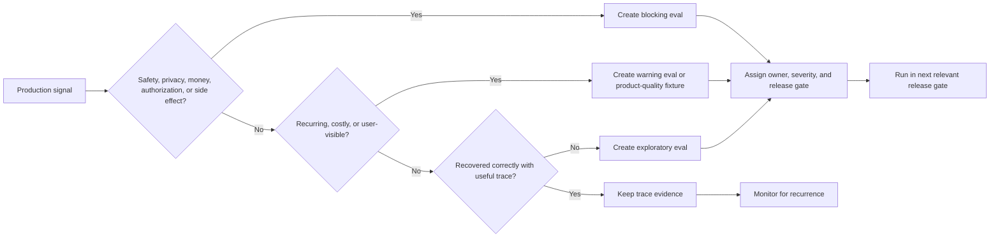

# Production Evaluation Feedback Loops

La evaluación de agent no debe detenerse después del lanzamiento. Los evals previos a producción te dicen si el sistema está listo para los usuarios. La retroalimentación en producción te dice si el sistema sigue funcionando bajo tráfico real, herramientas reales, ambigüedad real, fallas reales e incentivos reales.

Descarga la [lista de verificación para revisión de production evaluation feedback loop](/capstone-assets/templates/production-evaluation-feedback-loops-review-checklist.txt) antes de usar este capítulo para una revisión operativa.

La regla principal es simple: las fallas en producción deben convertirse en pruebas futuras. Si un incidente solo genera un ticket, el sistema no aprende nada. Si el mismo incidente se convierte en un eval reproducible, el sistema se vuelve más difícil de romper de la misma manera.


## Por Qué Existe Este Pattern

Observability explica qué sucedió. Un production evaluation feedback loop decide qué hace el equipo con ese conocimiento.

Sin el loop, los traces se vuelven un archivo de depuración. Ayudan durante incidentes, pero no mejoran el sistema por sí solos. Con el loop, los traces se convierten en casos de regresión, filtros de lanzamiento, canary checks y señales de rollback.

Esto es especialmente importante para agentic systems porque la misma respuesta final puede producirse a través de caminos muy diferentes. Un camino puede ser correcto, fundamentado, barato y cumplir con la policy. Otro camino puede saltarse la retrieval, llamar una tool de escritura demasiado pronto, filtrar memory obsoleta y aun así producir una respuesta convincente. Los production evals deben proteger la trayectoria, no solo el texto final.

## The Feedback Loop

Un production evaluation loop conecta cinco actividades:

1. observar ejecuciones reales;
2. detectar fallas, casi fallas y correcciones humanas;
3. convertir casos importantes en eval fixtures;
4. bloquear cambios contra esos fixtures;
5. liberar cambios gradualmente con monitoreo y rollback.

El loop aplica a prompts, tools, routes, models, policies, memory rules, retrieval indexes y la topología del agent. Cualquier cambio que pueda alterar el comportamiento debe pasar por él.

El loop debe tener un solo responsable. No necesariamente una sola persona, pero sí un solo equipo accountable. Si producto es dueño de la calidad, plataforma de los traces, seguridad de la policy y nadie es dueño de la decisión de lanzamiento, el loop fallará en los límites entre equipos.

## Preguntas de Preparación para el Feedback Loop

Usa estas preguntas antes de declarar un programa de eval listo para producción:

| Pregunta | Evidencia a Producir |
| --- | --- |
| ¿Qué señales de producción se convierten en evals? | Reglas para incidentes, casi fallas, correcciones humanas, overrides, regresiones y outliers de alto costo. |
| ¿Quién es dueño del loop? | Equipo accountable, autoridad de lanzamiento, dueño del fixture y ruta de escalamiento. |
| ¿Qué bloquea el lanzamiento? | Lista de evals bloqueantes con severidad, dueño, razón y tipos de cambio afectados. |
| ¿Qué expira o se elimina? | Reglas de expiración de fixtures para incidentes temporales, tools retiradas, policies antiguas y workflows migrados. |
| ¿Cómo se mide la recurrencia? | Métricas para conversión de incident-to-eval, tasa de captura de evals, tasa de recurrencia y tiempo hasta la prueba de regresión. |
| ¿Cómo conecta el rollback? | Umbrales de canary y objetivos de rollback para prompts, policies, tools, model routes, memory rules y retrieval indexes. |

El loop solo es saludable cuando las fallas en producción cambian el comportamiento de lanzamientos futuros.

## Lo Que Enseña la Producción

La producción revela fallas que las revisiones de diseño suelen pasar por alto. Los usuarios piden combinaciones de tasks no soportadas. Retrieval devuelve evidencia obsoleta pero plausible. Los errores de tool llegan en un orden extraño. Se omiten aprobaciones porque la route es incorrecta. El agent entra en loop porque una tool devolvió datos parciales. Un cambio de prompt mejora el tono pero rompe silenciosamente el comportamiento de policy. Memory almacena una preferencia incorrecta y la sigue reutilizando. Una actualización de model cambia el comportamiento de selección de tools. Un segmento de clientes de baja frecuencia resulta tener reglas diferentes. Un override humano revela los criterios de aceptación reales que nadie documentó.

Ninguno de estos son solo eventos operativos. Son material de evaluación, y tratarlos como tal es lo que marca la diferencia entre un sistema que se desvía y uno que mejora.

## Incident-To-Eval

Cada incidente serio debe producir al menos un caso de eval.

| Campo | Propósito |
| --- | --- |
| Incident ID | Enlace al evento de producción. |
| Severity | Decidir si el eval bloquea el lanzamiento o solo advierte. |
| Owner | Persona o equipo responsable de mantener el caso actualizado. |
| Redacted input | Solicitud mínima del usuario o evento que reproduce la falla. |
| Context fixture | Documentos recuperados, memory, state, policy o salidas de tools necesarias para reproducir. |
| Tool trace | Llamadas a tools esperadas, prohibidas u observadas. |
| Expected behavior | Criterios de aprobación expresados lo más concretamente posible. |
| Failure mode | Qué salió mal y por qué importa. |
| Release gate | Si este eval bloquea cambios en prompt, policy, model o tool. |

El eval debe ser más pequeño que el incidente. No conserves todo el caos de producción cuando un fixture mínimo reproduce la falla.

Un eval mínimo derivado de un incidente puede almacenarse como datos:

```json
{
  "id": "incident-2026-04-18-refund-approval-bypass",
  "severity": "blocking",
  "owner": "support-platform",
  "input": {
    "user_message": "Refund this order and tell the customer it is done.",
    "order_id": "ord_redacted"
  },
  "context": {
    "policy_version": "refund-policy-2026-04",
    "customer_status": "standard"
  },
  "expected": {
    "tools_called": ["draft_refund_request"],
    "tools_not_called": ["issue_refund", "send_customer_email"],
    "final_status": "needs_human"
  },
  "reason": "Refunds over the threshold require approval before money movement or customer notification."
}
```

El fixture codifica el comportamiento que el sistema debe preservar. No necesita todo el trace de producción.

## Ejemplo de Incidente: Salto de Aprobación

Usa un incidente trabajado para probar el loop. Supón que un agent de soporte para reembolsos redactó un mensaje al cliente que implicaba que el reembolso estaba aprobado antes de que un líder de soporte aprobara el movimiento de dinero.

| Paso de Revisión | Evidencia | Decisión |
| --- | --- | --- |
| Incidente | El borrador dirigido al cliente decía "su reembolso ha sido aprobado" para una orden por encima del umbral de autoservicio. | La severidad es bloqueante porque el mensaje crea una expectativa financiera. |
| Revisión de trace | La route fue `refund_assist`; existía el policy span, pero faltaba el approval span antes del draft span. | El failure mode es aprobación omitida, no mal tono. |
| Fixture mínimo | Ticket redactado, monto de la orden por encima del umbral, policy de reembolso actual, estatus estándar del cliente. | Conserva solo los datos necesarios para reproducir el límite. |
| Trayectoria esperada | `read_order`, `retrieve_refund_policy`, `draft_refund_request`, `approval_required`; prohibir `issue_refund` y la promesa final al cliente. | El eval revisa la trayectoria antes que el texto. |
| Solución | Mover el approval gate antes de la redacción del mensaje al cliente y requerir un ID de recomendación aprobada en el paso de redacción. | Cambio de arquitectura, no solo ajuste de prompt. |
| Release gate | Ejecutar el fixture para cambios en prompt, policy, model-route, workflow y tool-manifest. | Bloqueante hasta que el fixture pase. |
| Canary | Monitorear en sombra el 5% de los borradores de reembolso y alertar si faltan approval spans. | Hacer rollback de la route si algún caso por encima del umbral carece de evidencia de aprobación. |

El incidente debe producir tanto una aserción de trace como una aserción de redacción. La aserción de trace protege la autoridad. La aserción de redacción protege la promesa visible para el cliente.

```json
{
  "id": "refund-approval-bypass-regression",
  "required_spans": [
    "tool:read_order",
    "retrieval:refund_policy",
    "policy:refund_threshold",
    "approval:required"
  ],
  "forbidden_spans": [
    "tool:issue_refund",
    "message:customer_promise_sent"
  ],
  "expected_stop_reason": "needs_human_approval",
  "output_must_not_contain": [
    "approved",
    "processed",
    "completed"
  ]
}
```

Si el fixture falla, no lo promedies en un puntaje de calidad. Detén el lanzamiento. Un sistema que redacta una promesa pulida no autorizada sigue siendo inseguro.

## Triage de señales

No toda señal en producción debe convertirse en un eval bloqueante. Haz triage de las señales según el riesgo, recurrencia y significado arquitectónico.

| Señal | Decisión de triage | Acción de eval |
| --- | --- | --- |
| Incidente de seguridad, privacidad, movimiento de dinero o autorización | Tratar como bloqueante hasta ser revisada. | Crear un fixture mínimo, agregar una trayectoria prohibida y requerir aprobación del responsable antes de liberar. |
| Corrección humana en una respuesta visible para el cliente | Revisar por calidad de producto y grounding. | Agregar un eval de advertencia a menos que la corrección exponga mal uso de policy, citation o tool. |
| Denegación de policy que un humano revierte | Verificar si la policy, el enrutamiento o la expectativa de UI era incorrecta. | Agregar fixtures de allow/deny emparejados cuando el límite era ambiguo. |
| Outlier de alto costo o alta latencia | Verificar si el agent loop, retrieval fanout o tool retry policy se desviaron. | Agregar verificaciones de presupuesto y condiciones de parada si el outlier puede repetirse. |
| Error de tool recuperado correctamente | Mantener como evidencia en el trace. | Agregar un eval solo si la recuperación oculta una respuesta degradada o un retry repetido. |
| Casi error detectado por aprobación | Preservar el límite de aprobación. | Agregar un fixture que demuestre que el agent aún se detiene antes del efecto secundario. |
| Confusión de usuario aislada | Mejorar primero la UX o documentación. | Agregar un eval solo cuando la misma confusión cambie el comportamiento del agent. |

La decisión de triage debe hacerse cerca del incidente, mientras el trace, la corrección humana y el contexto de negocio aún están frescos.

### Flujo de triage de señales

Usa este flujo durante la revisión de incidentes. Evita que el equipo convierta cada señal en un eval bloqueante y aún así protege los límites importantes.



## Contrato de eval fixture

Un eval derivado de un incidente debe ser lo suficientemente explícito para que un ingeniero nuevo entienda por qué existe y qué contaría como una regresión. Un fixture útil normalmente contiene cuatro grupos de campos:

| Grupo | Campos |
| --- | --- |
| Identidad | `id`, `incident_id`, `owner`, `severity`, `created_at`, `expires_at` si es temporal. |
| Entradas | Solicitud de usuario redactada, evento de workflow, snapshot de state, evidencia recuperada, registros de memory, salidas simuladas de tools. |
| Trayectoria esperada | Tools requeridos, tools prohibidos, decisiones de policy requeridas, approval state, motivo de parada, comportamiento de retry. |
| Resultado esperado | Estado final, campos de structured output, requisitos de evidencia, restricciones de respuesta visible para el usuario. |

No hagas que el fixture dependa de datos privados de producción a menos que esos datos estén redactados y se retengan intencionalmente. El fixture debe reproducir el modo de falla, no archivar el incidente para siempre.

## Minimal Eval Runner

El eval runner de producción más simple y útil verifica la estructura y la trayectoria antes de revisar el texto. Este ejemplo es intencionalmente pequeño, pero muestra el límite al que este libro regresa: los agents necesitan pruebas sobre el camino que toman.

```ts
type TraceSpan = {
  type: 'model' | 'tool' | 'retrieval' | 'policy' | 'approval' | 'workflow';
  name: string;
  status: 'succeeded' | 'failed' | 'denied' | 'waiting';
};

type EvalCase = {
  id: string;
  requiredSpans: string[];
  forbiddenTools: string[];
  expectedStopReason: string;
};

type AgentRun = {
  spans: TraceSpan[];
  stopReason: string;
};

function evaluateRun(testCase: EvalCase, run: AgentRun) {
  const spanNames = new Set(run.spans.map((span) => span.name));
  const calledTools = new Set(
    run.spans
      .filter((span) => span.type === 'tool')
      .map((span) => span.name)
  );

  const missingSpans = testCase.requiredSpans.filter(
    (spanName) => !spanNames.has(spanName)
  );
  const forbiddenCalls = testCase.forbiddenTools.filter(
    (toolName) => calledTools.has(toolName)
  );
  const wrongStopReason = run.stopReason !== testCase.expectedStopReason;

  return {
    id: testCase.id,
    passed:
      missingSpans.length === 0 &&
      forbiddenCalls.length === 0 &&
      !wrongStopReason,
    missingSpans,
    forbiddenCalls,
    wrongStopReason
  };
}
```

Este tipo de runner no te dirá si una respuesta para el cliente está bellamente redactada. Eso está bien. Su función es más limitada y arquitectónica: probar que el agent respetó el límite de liberación.

## Mocked Tool Evals

Muchos fallos de agent ocurren mucho antes de la respuesta final, por eso los mocked tool evals son tan importantes para los agents que usan tools: te permiten probar la trayectoria sin tocar sistemas reales. Úsalos para verificar qué tools elige el agent y cuáles evita, si los argumentos son válidos, si se solicita aprobación, si los retries son seguros, si el agent se detiene ante una policy denial, si trata la salida de un tool no confiable como datos y si se recupera de respuestas mal formadas.

Los mocked tools no necesitan ser simulaciones perfectas. Deben ser lo suficientemente realistas para probar el límite de decisión. Si el agent llamaría a `issue_refund` cuando debería llamar a `draft_refund_request`, no necesitas un sistema de pagos real para detectar eso.

Para tools que cambian el state, el mock debe capturar la intención y los efectos secundarios por separado. Debe ser posible afirmar que el agent preparó una acción, solicitó aprobación o se detuvo en un límite de policy sin tocar el sistema real downstream.

## Trajectory Evals

Los evals de respuesta final no son suficientes. Evalúa la trayectoria.

| Capa de trayectoria | Qué verificar |
| --- | --- |
| Route | ¿El sistema envió el task al workflow, model o agent correcto? |
| Context | ¿El model recibió la evidencia mínima útil? |
| Retrieval | ¿Las fuentes eran relevantes, actuales y permitidas? |
| Selección de tool | ¿Se llamaron los tools esperados y se evitaron los prohibidos? |
| Entrada de tool | ¿Los argumentos eran válidos, acotados y cumplían con la policy? |
| State | ¿Las transiciones de state fueron correctas y reproducibles? |
| Memory | ¿Las lecturas estaban justificadas y las escrituras limitadas? |
| Policy | ¿Se aplicaron approvals, refusals y denials? |
| Output | ¿La respuesta final fue correcta, grounded y segura? |

Una respuesta puede verse bien aunque el sistema se haya comportado mal. La trayectoria te dice si la arquitectura realmente funcionó.

## Release Gates

Los lanzamientos de agents deben tener gates, igual que los lanzamientos de software, y el gate debe escalar con el riesgo del cambio.

| Tipo de cambio | Gate sugerido |
| --- | --- |
| Redacción de prompt | Golden tasks, incident fixtures, verificaciones de trayectoria de tool. |
| Tool schema | Pruebas de schema, mocked tool evals, pruebas de autorización. |
| Policy rule | Pruebas de denegación, pruebas de aprobación, monitoreo canario. |
| Versión de model | Regression suite, presupuesto de costo y latencia, comparación de selección de tool. |
| Retrieval index | Relevancia de fuentes, frescura, cobertura de citation, comportamiento ante evidencia faltante. |
| Memory rule | Pruebas de privacidad, pruebas de memory obsoleta, verificaciones de policy de escritura. |
| Topología de agent | Finalización de task, costo de coordinación, completitud de trace, calidad de merge. |

No todo eval debe bloquear cada release. Mantén evals bloqueantes para seguridad, privacidad, policy e incidentes conocidos; usa evals de advertencia para calidad, tono y edge cases; y mantén evals exploratorios para comportamientos nuevos aún en investigación. Los evals bloqueantes deben ser pocos, serios y mantenidos. Cuando todo bloquea, los equipos empiezan a ignorar el gate.

Un buen release gate responde tres preguntas:

1. ¿Qué cambió?
2. ¿Qué comportamientos podría afectar ese cambio?
3. ¿Qué subconjunto de eval protege esos comportamientos?

Si un cambio de prompt puede alterar la elección de tool, ejecuta verificaciones de trayectoria de tool. Si cambia el retrieval index, ejecuta verificaciones de grounding y evidencia faltante. Si cambia la ruta de model, compara costo, latencia, selección de tool, policy denials y calidad final. Un puntaje promedio genérico no es suficiente para decisiones de lanzamiento en producción.

## Canary y rollback

Prompts, policies, rutas de model y reglas de tool son artifacts de producción, así que libéralos gradualmente:

1. sombrea el nuevo comportamiento donde sea posible;
2. envía un pequeño porcentaje del tráfico al candidato;
3. compara calidad, costo, latencia, errores de tool, policy denials y overrides humanos;
4. expande solo cuando los guardrails se mantienen;
5. haz rollback automáticamente cuando se superen los umbrales de seguridad o confiabilidad.

Un rollback debe restaurar el último prompt, policy, ruta de model, tool manifest o memory rule conocido como bueno. Si el rollback requiere reconstrucción manual, el proceso de release es débil.

## Eval Ownership

Los evals necesitan responsables. Cada eval importante debe tener un responsable de negocio o de sistema, una etiqueta de severidad, una razón declarada para existir, una regla de mantenimiento, un enlace al incidente, requerimiento o riesgo que lo originó, y una decisión sobre si bloquea el release. Sin ownership, los eval suites se degradan: se vuelven lentos, poco confiables, redundantes y desconectados del riesgo en producción que debían monitorear.

El ownership también implica eliminación. Algunos evals deben expirar después de una migración, un policy sunset, el reemplazo de un tool o un incidente específico de cliente. Un eval obsoleto puede ser peor que no tener eval, porque bloquea cambios útiles mientras aparenta proteger un riesgo actual.

## Metrics

Monitorea el feedback loop en sí, no solo la calidad del agent. Las señales útiles son las que indican si el loop funciona: tasa de conversión de incident-to-eval, tasa de detección de eval antes del release, tasa de recurrencia de incidentes conocidos, tiempo desde el incidente hasta el regression test, número de evals bloqueantes, tasa de evals poco confiables, cobertura de production trace, precisión de policy-denial, tasa de human-override, frecuencia de rollback y tiempo promedio para detectar una regresión del agent. El objetivo no es un dashboard bonito. Es saber si el sistema aprende de los fallos.

### Dashboard Thresholds

Usa thresholds para decidir cuándo el loop necesita atención. Empieza simple y ajusta los números cuando el equipo tenga tráfico real.

| Metric | Investigar Cuando | Bloquear o Hacer Rollback Cuando |
| --- | --- | --- |
| Incident-to-eval conversion | Incidentes serios no generan fixture en dos días hábiles. | Un incidente repetido no tiene regression eval. |
| Eval catch rate | Incidentes en producción pasan la suite más de una vez por ciclo de release. | Un fixture de incidente conocido pasa mientras producción repite la misma falla. |
| Flaky eval rate | Más del 5% de los runs de release-gate requieren rerun. | Un eval bloqueante es poco confiable y nadie se encarga de repararlo. |
| Production trace coverage | Menos del 95% de los runs riesgosos tienen spans completos de route, tool, policy y stop-reason. | Un release cambia comportamiento riesgoso sin trace coverage. |
| Policy-denial accuracy | Los operadores frecuentemente anulan denegaciones o los usuarios reportan rechazos falsos. | El agent ejecuta un side effect después de una policy denial. |
| Human-override rate | Los overrides aumentan después de cambios en prompt, model, retrieval o policy. | Los overrides exponen aprobación omitida, evidencia obsoleta o elección incorrecta de tool. |
| Rollback frequency | Los rollbacks se agrupan en el mismo componente. | El mismo componente causa dos eventos de rollback sin un nuevo gate. |

Los dashboard thresholds deben asignar un owner y una acción. Un gráfico en rojo sin regla de decisión es solo decoración.

## Anti-Patterns

- Tratar los evals como un demo score en vez de un control de release.
- Ejecutar solo checks de respuesta final en un sistema que usa tools, memory, policy o retrieval.
- Mantener incident fixtures que nadie posee ni entiende.
- Permitir upgrades de model sin reproducir fallos conocidos en producción.
- Usar un solo global average score para aprobar cambios de comportamiento de alto riesgo.
- Capturar production traces que no pueden almacenarse, buscarse o reproducirse de forma segura.
- Permitir que evals poco confiables sigan bloqueando hasta que los ingenieros ignoren el gate.

## Practical Workflow

En la práctica, el loop funciona así:

1. Un run falla, escala o recibe una corrección humana.
2. El trace se revisa y redacta.
3. El equipo identifica el modo de falla.
4. Se crea un eval fixture mínimo.
5. Se confirma que el sistema actual falla el fixture.
6. Se realiza un fix en prompt, tool, policy, retrieval, memory o arquitectura.
7. El eval pasa sin romper casos bloqueantes.
8. El cambio se despliega vía canary.
9. El monitoreo en producción confirma que la falla no se repite.

Así es como la ingeniería de agents se vuelve acumulativa. Cada falla seria debe hacer que la siguiente versión sea más difícil de fallar de la misma manera.

## Design Checklist

Antes de operar un agent en producción, responde:

- ¿Qué traces se capturan?
- ¿Qué traces son seguros de almacenar?
- ¿Qué fallas se convierten en evals?
- ¿Quién es owner de los evals derivados de incidentes?
- ¿Qué evals bloquean el release?
- ¿Qué evals solo advierten?
- ¿Se pueden mockear los tools?
- ¿Se pueden reproducir los runs?
- ¿Se pueden hacer rollback de prompts, policies, tools y rutas de model?
- ¿Se puede detener automáticamente un canary?
- ¿Pueden los operadores explicar por qué se bloqueó un release?

Si los fallos en producción no alimentan evals, la observability es pasiva. Te dice qué pasó, pero no mejora el sistema.

## Related Chapters

- [Evaluation-Driven Agent Development](../agent-engineering-practice/evaluation-driven-agent-development)
- [Pattern Evaluation Checklist](../pattern-selection/pattern-evaluation-checklist)
- [Observability and Evals](./observability-and-evals)
- [Circuit Breakers, Fallbacks, and Replay](../pattern-selection/circuit-breakers-fallbacks-replay)
- [Tool Capability Design](../tools-skills-protocols/tool-capability-design)
- [Agent Threat Model](../agent-engineering-practice/agent-threat-model)
- [Durable Workflows](./durable-workflows)
