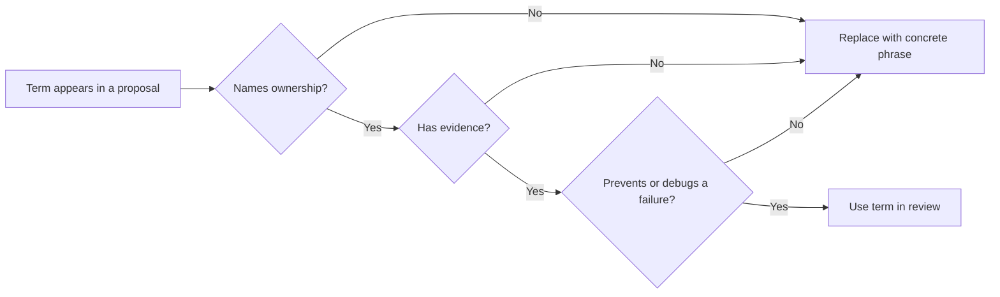

# Glosario y Acrónimos

Usa este capítulo cuando un término bloquee el avance. Las definiciones son breves a propósito. Cada término explica qué significa la palabra en este libro y por qué importa al diseñar, probar u operar un agentic system.

Lee el glosario como un vocabulario de control. En este libro, los términos solo son útiles cuando ayudan al equipo a decidir sobre ownership, riesgo, evidencia o preparación para release.

## Cómo Usar Este Glosario

Usa un término en una revisión de diseño solo si el equipo puede responder tres preguntas:

1. ¿Qué posee este término?
2. ¿Qué evidencia prueba que funciona?
3. ¿Qué falla nos ayuda a prevenir o depurar?

Si un término no responde esas preguntas, reemplázalo por una frase más concreta. Por ejemplo, "agentic workflow" es demasiado amplio a menos que puedas nombrar el goal, state, límite de tool, puerta de policy y condición de stop.

Usa este flujo cuando un término suene útil pero vago. Conserva el término solo cuando clarifique ownership, evidencia y análisis de fallas.

## Mapa de Revisión de Términos

Usa este mapa durante revisiones de diseño. Cuando un término aparezca en una propuesta, haz la pregunta de revisión antes de aceptarlo.

| Cuando alguien dice... | Pregunta... | Ir a |
| --- | --- | --- |
| Agent | ¿Qué decisión en runtime toma el model que el código no puede tomar con suficiente seguridad? | [¿Qué es un Agent?](/foundations/what-is-an-agent) |
| Autonomous | ¿Qué decisiones, tools, presupuestos y condiciones de stop se delegan? | [Arquitectura antes de Autonomía](/pattern-selection/architecture-before-autonomy) |
| Memory | ¿Es context local de task, memory durable de usuario, historial episódico o knowledge recuperado? | [Context Engineering](/foundations/context-engineering) |
| Tool | ¿Qué autoridad otorga y qué revisiones de policy se ejecutan antes de efectos secundarios? | [Tool Capability Design](/tools-skills-protocols/tool-capability-design) |
| Eval | ¿Qué comportamiento, trayectoria, decisión de policy o modo de falla detecta? | [Evaluation-Driven Agent Development](/agent-engineering-practice/evaluation-driven-agent-development) |
| Human-in-the-loop | ¿La persona aprueba una acción exacta, revisa un resultado o solo recibe una notificación? | [Human Approval Gates](/tools-skills-protocols/human-approval-gates) |
| Multi-agent | ¿Qué context, permiso, skill, latencia o necesidad de revisión justifica otro agent? | [Choosing Multi-Agent Topology](/multi-agent-systems/choosing-multi-agent-topology) |
| Production-ready | ¿Dónde está la evidencia de traces, puertas de eval, rollback, ownership y respuesta a incidentes? | [10/10 Production Gate](/publishing/ten-out-of-ten-production-gate) |

## Términos Clave

| Término | Significado | Por qué importa |
| --- | --- | --- |
| Agent | Un sistema que persigue un goal mediante un loop, usa tools o context, rastrea state y se detiene por regla. | Separa la arquitectura real de agent de una simple llamada a un model. |
| Agent loop | El ciclo de observar, decidir, actuar, evaluar y detenerse alrededor de un agent. | Aquí deben vivir los presupuestos, policy, state y manejo de fallas. |
| Autonomy | La cantidad de autoridad de decisión delegada al sistema. | Más autonomy requiere límites, pruebas, aprobaciones y rollback más fuertes. |
| Boundary | La línea entre la elección del model y el control determinista del sistema. | Límites débiles convierten la incertidumbre del model en riesgo para el sistema. |
| Capability | Algo que el sistema puede hacer, usualmente mediante un tool, skill, workflow o servicio. | Las capabilities necesitan ownership, autorización, auditoría y pruebas. |
| Context | La información pasada a un model o paso de agent. | El context controla lo que el model puede usar, confundir, filtrar o ignorar. |
| Goal | El resultado explícito que el sistema intenta alcanzar. | Goals ambiguos producen comportamientos ambiguos y evals débiles. |
| Policy | Una regla que restringe lo que el agent puede hacer. | La policy debe aplicarse fuera del prompt cuando las acciones implican riesgo. |
| State | Datos que registran la ejecución actual, memory, progreso, decisiones o efectos externos. | State oculto dificulta el replay, la depuración y las revisiones de seguridad. |
| Stop condition | Una regla que termina un loop o transfiere el control a un humano/sistema. | Sin stop conditions, los agents desperdician presupuesto o repiten acciones inseguras. |
| Tool | Una capability invocable expuesta a un agent. | El diseño de tools es un plano de control, no solo un wrapper de API. |

## Confusiones Comunes

Estos pares causan muchos diseños débiles. Usa el término más preciso en las revisiones.

| Términos confundidos | Distinción |
| --- | --- |
| Model call vs agent | Un model call retorna una respuesta. Un agent loop puede decidir qué hacer después. |
| Workflow vs agent | Un workflow sigue un camino definido por código. Un agent elige al menos algunos pasos a partir de observaciones. |
| Memory vs context | Context es lo que el model ve ahora. Memory es state almacenado con reglas de retención, corrección y eliminación. |
| Tool vs skill | Un tool ejecuta una capability. Un skill empaqueta procedimientos, referencias, scripts, plantillas y ejemplos. |
| Policy vs prompt instruction | La policy la aplica el software o un límite de autoridad. Una prompt instruction es una guía para el model. |
| Eval vs test | Los tests suelen revisar comportamiento determinista. Los evals revisan outputs, trayectorias o juicios influenciados por el model. |
| Trace vs log | Los logs registran eventos. Los traces conectan la ejecución: goal, context, decisiones, tools, outputs, costos y razón de stop. |
| Approval vs notification | Approval bloquea una acción exacta hasta ser aceptada. Notification solo informa lo que ocurrió. |

En caso de duda, elige el término que haga más visible el ownership y la evidencia.

## Términos de Arquitectura

| Término | Significado | Por qué importa |
| --- | --- | --- |
| Architecture decision record (ADR) | Un registro breve de una decisión de arquitectura, context, alternativas y consecuencias. | Los ADRs hacen que el diseño de agent sea revisable después de la fase de demo. |
| Circuit breaker | Un control que detiene o degrada la ejecución cuando las fallas superan un umbral. | Previene que fallas repetidas de model/tool se conviertan en daños visibles para el usuario. |
| Deterministic boundary | Código, schema, policy o lógica de workflow que no depende del juicio del model. | Mantiene las decisiones de alto riesgo fuera de la generación probabilística de texto. |
| Durable workflow | Un workflow que puede persistir, reanudarse, reintentarse y recuperarse tras una interrupción. | Los agents en producción necesitan continuidad ante caídas, colas y timeouts. |
| Fallback | Un camino alterno más seguro usado cuando el camino preferido falla o se vuelve muy riesgoso. | Los fallbacks preservan la calidad del servicio sin fingir que la autonomy siempre funciona. |
| Handoff | Una transferencia tipada de trabajo entre componentes, agents, tools o humanos. | Los handoffs necesitan context, state, ownership y criterios de aceptación. |
| Idempotency | La propiedad de que repetir una acción produce el mismo efecto deseado. | Los reintentos y replay son inseguros sin acciones externas idempotentes. |
| Replay | Volver a ejecutar un trace, paso de workflow o camino de decisión para depuración o evaluación. | El replay convierte incidentes en pruebas reproducibles. |
| Routing | Elegir qué camino, tool, model, workflow o agent debe manejar una task. | Un mal routing agrega costo, latencia y modos de falla. |
| Service boundary | El contrato alrededor de un componente desplegable del sistema. | Los agents se vuelven operables cuando se tratan como servicios con APIs y SLOs. |

## Términos de Evaluación

| Término | Significado | Por qué importa |
| --- | --- | --- |
| Eval case | Un input concreto, comportamiento esperado y regla de puntuación. | Convierte una afirmación de calidad vaga en una revisión repetible. |
| Eval gate | Un umbral de evaluación requerido antes de release o despliegue. | Previene que cambios en prompt o policy se publiquen solo por confianza. |
| Fixture | Un input de prueba controlado, conjunto de documentos, respuesta de tool o trace. | Los fixtures hacen reproducible el comportamiento de un agent. |
| Grader | Código, rúbrica o model que puntúa un output o trayectoria. | Los graders deben probarse, o se vuelven otro agent poco confiable. |
| Regression | Un comportamiento previamente correcto que falla tras un cambio. | Los agent systems necesitan suites de regression porque pequeños cambios en el prompt pueden alterar el comportamiento. |
| Trace | Un registro estructurado de prompts, llamadas a tools, decisiones, observaciones, costos y resultados. | Los traces explican lo que ocurrió cuando los outputs no son suficientes. |
| Trajectory | El camino completo que un agent sigue a través de pasos, tools, state y decisiones. | Algunas fallas solo aparecen a lo largo del camino, no en la respuesta final. |

## Términos de Memory y Knowledge

| Término | Significado | Por qué importa |
| --- | --- | --- |
| Context budget | El límite de tokens, latencia, costo y atención para el context. | Más context no siempre es mejor; puede distraer o filtrar información. |
| Context packet | Un paquete ensamblado deliberadamente de instrucciones, hechos, state, tools y evidencia. | Permite que la selección de context sea inspeccionable. |
| Episodic memory | Registros almacenados de eventos, interacciones o ejecuciones. | Ayuda a la personalización y continuidad, pero requiere reglas de retención y corrección. |
| Knowledge boundary | Las fuentes confiables que un agent puede usar para afirmaciones. | Reduce la alucinación y permite rechazar cuando falta evidencia. |
| Retrieval-augmented generation (RAG) | Un diseño donde la evidencia recuperada se agrega al context del model. | RAG solo ayuda cuando la calidad de retrieval, las citas y la frescura se prueban. |
| Semantic recall | Recuperación basada en significado en vez de coincidencia exacta de palabras clave. | Puede encontrar evidencia útil, pero también puede recuperar material erróneo pero plausible. |
| Working memory | State local de la task usado durante una ejecución o sesión. | Mantiene el trabajo de varios pasos coherente sin convertir cada hecho en memory durable. |

## Términos de Seguridad y Confianza

| Término | Significado | Por qué importa |
| --- | --- | --- |
| Approval gate | Un punto donde un humano o un servicio de policy debe aprobar una acción exacta. | Los gates reducen el riesgo para dinero, credenciales, datos de usuario y cambios irreversibles. |
| Audit log | Un registro de decisiones, aprobaciones, llamadas a tools y efectos externos. | Los audit logs apoyan la revisión de incidentes y la rendición de cuentas. |
| Credential boundary | La regla sobre qué identidad o secreto puede usar una llamada a tool. | Los agents no deben heredar credenciales amplias por defecto. |
| Least privilege | Dar al sistema solo el acceso necesario para la task. | Un acceso amplio convierte errores del model en incidentes de seguridad. |
| Sandbox | Un entorno restringido para acciones de código, navegador, archivos o red. | Los sandboxes limitan el daño cuando las acciones generadas fallan o son atacadas. |
| Threat model | Un análisis estructurado de lo que puede salir mal, quién puede causarlo y cómo reducir el riesgo. | Los threat models de agents deben incluir tools, memory, prompts, usuarios y datos externos. |
| Trust contract | Las promesas que el producto hace sobre lo que el agent puede hacer, mostrar, cambiar o decidir. | Los usuarios necesitan control claro cuando los agents actúan en su nombre. |

## Términos de Protocolos y Frameworks

| Término | Significado | Por qué importa |
| --- | --- | --- |
| A2A | Comunicación agent-to-agent mediante mensajes tipados, identidad y autorización. | A2A necesita contratos; el chat libre entre agents es difícil de asegurar o depurar. |
| MCP | Model Context Protocol, un protocolo para exponer tools y recursos a clientes de model. | MCP puede estandarizar el acceso a tools, pero los servidores aún requieren auth, policy y control de ciclo de vida. |
| Skill | Una capability procedimental empaquetada con instrucciones, archivos, scripts o ejemplos. | Las skills preservan el know-how probado y reducen el exceso de prompts repetidos. |
| Supervisor | Un componente o agent que asigna, revisa o coordina agents trabajadores. | Los supervisors necesitan autoridad, reglas de detención y manejo de fallos. |
| Worker | Un agent o componente acotado responsable de una subtask. | Los workers deben tener entradas, salidas, tools y criterios de éxito limitados. |

## Acrónimos

| Acrónimo | Expansión | Nota |
| --- | --- | --- |
| ADR | Architecture Decision Record | Usar para decisiones de diseño y consecuencias. |
| A2A | Agent-to-Agent | Usar para comunicación tipada entre agents. |
| API | Application Programming Interface | Tratar agent tools como APIs con policy. |
| CI | Continuous Integration | Usar CI para eval gates y revisiones de regresión. |
| KPI | Key Performance Indicator | Usar con cuidado; los KPIs de agents requieren métricas de calidad y riesgo. |
| MCP | Model Context Protocol | Usar para interoperabilidad de tools/recursos. |
| PII | Personally Identifiable Information | Requiere minimización, enmascaramiento, retención y reglas de acceso. |
| RAG | Retrieval-Augmented Generation | Requiere evals de retrieval y controles de fuente. |
| SLA | Service Level Agreement | Compromiso externo sobre el comportamiento del servicio. |
| SLO | Service Level Objective | Objetivo interno para confiabilidad, latencia o calidad. |
| UX | User Experience | Incluye confianza, visibilidad, corrección y control. |

## Regla de Revisión

Cuando un capítulo, ADR o nota de lanzamiento use un acrónimo, defínelo en su primer uso a menos que la sección circundante ya lo haga. Esto importa para un libro en línea porque los lectores a menudo llegan a una sola página desde una búsqueda en vez de leer los capítulos en orden.

## Capítulos Relacionados

- [What Is An Agent?](/foundations/what-is-an-agent)
- [Choosing the Right Pattern](/pattern-selection/choosing-the-right-pattern)
- [Context Engineering](/foundations/context-engineering)
- [Evaluation-Driven Agent Development](/agent-engineering-practice/evaluation-driven-agent-development)
- [Agent Threat Model](/agent-engineering-practice/agent-threat-model)
