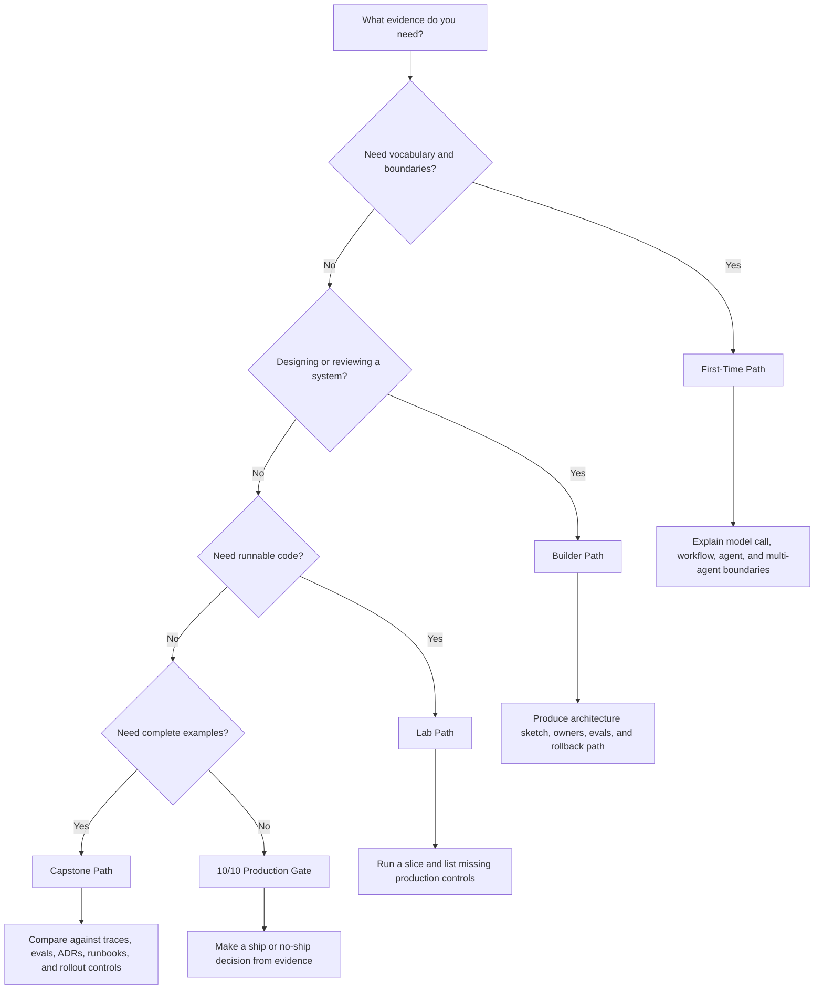

# Cómo leer este libro

Este libro tiene dos objetivos.

Primero, plantea un argumento: los agentic systems necesitan arquitectura antes que autonomía. Segundo, te ofrece una referencia de patterns que puedes usar durante el trabajo de diseño.

No necesitas leer todos los capítulos en orden. Pero sí debes leer los capítulos de selección antes de agregar loops, tools, memory o múltiples agents a un sistema.

## Elige tu ruta

Usa la ruta que coincida con la decisión que tienes enfrente.

| Si eres... | Comienza con | Objetivo |
| --- | --- | --- |
| Nuevo en agentic systems | [First-Time Path](#ruta-para-primeros-lectores) | Aprende el vocabulario central y los límites. |
| Diseñando o revisando un sistema | [Builder Path](#ruta-para-builders) | Elige patterns, controles y responsabilidades de producción. |
| Ejecutando código | [Lab Path](#ruta-de-labs) | Construye pequeños ejemplos y conéctalos con la arquitectura. |
| Buscando ejemplos tipo producto | [Capstone Path](#capstone-path) | Ve patterns combinados en sistemas completos. |
| Aprendiendo visualmente o integrando un equipo | [Visual Architecture Route](/publishing/logical-groups#ruta-de-arquitectura-visual) | Usa diagramas para entender límites, propiedad y controles de producción. |
| Consultando un pattern durante el trabajo | [Reference Path](#reference-path) | Revisa casos de uso, modos de falla, evals y listas de verificación de producción. |
| Eligiendo una sección para leer | [Logical Groups](/publishing/logical-groups) | Entiende por qué el libro está agrupado así y dónde cada grupo aporta valor. |
| Atorado con la terminología | [Glossary and Acronyms](/publishing/glossary) | Descifra agent, eval, protocol, security y términos de producción. |
| Preparando un release | [10/10 Production Gate](/publishing/ten-out-of-ten-production-gate) | Verifica si el sistema es revisable, testeable, observable y reversible. |

La ruta más útil no es la lista más corta de páginas. Es la que te lleva a una decisión de diseño con suficiente context para evitar una mala abstracción.

## Flujo de decisión de ruta de lectura

La ruta termina solo cuando produce la evidencia de la derecha.

## Guía de tiempo y dificultad

Consulta esta tabla antes de elegir una ruta. Las estimaciones asumen un ingeniero de software que puede hojear material familiar y detenerse en patterns, código o controles de producción desconocidos.

| Ruta | Mejor para | Dificultad | Tiempo | Evidencia que debes producir |
| --- | --- | --- | ---: | --- |
| First-Time Path | Aprender el vocabulario y los límites. | Principiante a intermedio | 2-4 horas | Una breve explicación de agent, workflow, tool, state, memory, eval y condición de stop. |
| Builder Path | Diseñar o revisar un sistema real. | Intermedio a avanzado | 1-2 días | Boceto de arquitectura, pattern seleccionado, alternativas rechazadas, owners, evals y ruta de rollback. |
| Lab Path | Ejecutar ejemplos y ver límites de implementación. | Intermedio | 1-3 días | Pruebas aprobadas, salida de trace, lista de controles faltantes y una tarea de hardening por lab. |
| Capstone Path | Comparar sistemas completos tipo producto. | Avanzado | 4-8 horas | Análisis de brechas contra traces, evals, ADRs, runbooks y controles de release. |
| Reference Path | Consultar un pattern durante el diseño. | Intermedio | 10-30 minutos por capítulo | Decisión de fit/avoid, modo de falla, caso de eval y checklist de producción. |
| Release Path | Decidir si un sistema puede lanzarse. | Avanzado | 2-6 horas | Scorecard completado, registro de evidencia de release, límites conocidos y decisión de ship/no-ship. |

No optimices por velocidad. Optimiza por evidencia. Una lectura rápida que no cambia el diseño no es útil.

## Criterios de salida de ruta

Usa estos chequeos para decidir si una ruta ya te sirvió. Si no puedes responder la pregunta de salida, continúa con la ruta enlazada antes de elegir un pattern o lanzar un sistema.

| Ruta | Terminas cuando puedes... | Si no, continúa con... |
| --- | --- | --- |
| First-Time Path | Explicar la diferencia entre una llamada a model, prompt chain, workflow, single agent y multi-agent system. | [Pattern Selection and Composition](/pattern-selection/architecture-before-autonomy) |
| Builder Path | Dibujar el límite del sistema, nombrar el owner de state, tools, memory, policy, evals y rollback, y defender por qué cada pattern pertenece. | [Reference Architecture](/systems-architecture/reference-architecture) |
| Lab Path | Ejecutar una pequeña implementación, identificar los controles de producción faltantes y nombrar el siguiente paso de hardening. | [Lab Production Readiness Checklist](/hands-on-labs/production-readiness-checklist) |
| Capstone Path | Comparar un ejemplo completo con tu propio sistema y listar las brechas en traces, evals, ADRs, runbooks y controles de rollout. | [Capstone Projects](/capstone-projects/) |
| Reference Path | Decidir si el pattern encaja, su costo, cómo falla y qué eval prueba que funciona. | [Choosing the Right Pattern](/pattern-selection/choosing-the-right-pattern) |
| Release Path | Mostrar evidencia de que el sistema es revisable, testeable, observable, reversible y tiene owner. | [10/10 Production Gate](/publishing/ten-out-of-ten-production-gate) |

No consideres una ruta como completa solo porque leíste las páginas. Considérala completa cuando cambia la decisión de diseño que tienes enfrente.

## Grupos lógicos

La barra lateral está organizada como una ruta de diseño, no como un catálogo plano.

| Grupo | Propósito | Lee cuando |
| --- | --- | --- |
| [Start Here](/intro) | Oriéntate, elige una ruta de lectura y define qué cuenta como agent. | Eres nuevo en el libro o necesitas la entrada más corta. |
| [Pattern Selection and Composition](/pattern-selection/architecture-before-autonomy) | Decide si usar un prompt, chain, router, loop, multi-agent system o reliability pattern. | Estás eligiendo o revisando una arquitectura. |
| [Agent Runtime Foundations](/foundations/what-is-an-agent) | Aprende los primitivos centrales de runtime: single agent, loop, state, tools y structured output. | Necesitas el vocabulario y los límites de control. |
| [Engineering Practice and Frameworks](/agent-engineering-practice/agent-development-lifecycle) | Pasa de demo a sistema diseñado con lifecycle, harnesses, elecciones de framework y hojas de trabajo. | Estás planeando la implementación. |
| [Evaluation, Security, and Trust](/agent-engineering-practice/evaluation-driven-agent-development) | Agrega eval gates, threat modeling, sandboxing y controles de confianza humana. | El sistema afecta usuarios, datos o acciones externas. |
| [Control Loops](/control-loops/planning-and-execution) | Agrega planning, reflection, evaluator-optimizer, self-improvement y patterns de self-healing. | El agent necesita control iterativo. |
| [Context, Memory, and Knowledge](/foundations/context-budgets-and-working-sets) | Diseña working sets, context packets, memory, semantic recall, RAG y límites de knowledge. | El sistema depende de evidencia o state recordado. |
| [Tools, Skills, and Protocols](/tools-skills-protocols/skills) | Diseña tool capabilities, skills, MCP, A2A, aprobaciones y comunicación segura. | El agent necesita capacidades externas. |
| [Multi-Agent Systems](/multi-agent-systems/choosing-multi-agent-topology) | Elige y opera topologías para delegación, supervisión, debate y trabajo en paralelo. | Un agent ya no es suficiente. |
| [Systems Architecture](/systems-architecture/agentic-system-architecture) | Compón sistemas completos: servicios, sistemas RAG, coding agents, computer-use agents, dominios, ADRs y referencias. | Estás diseñando todo el límite del sistema. |
| [Production Runtime](/production-runtime/overview) | Ejecuta agents con durabilidad, observability, feedback loops, policy, budgets, eventos y controles de rollout. | Estás preparando para producción. |
| [Hands-On Labs](/hands-on-labs/) | Construye los patterns en ejercicios pequeños y tracks de framework. | Quieres práctica de implementación. |
| [Capstone Projects](/capstone-projects/) | Estudia ejemplos completos tipo producto con traces, evals, ADRs, runbooks y rollback. | Quieres ver patterns combinados. |

## Recomendación para la Primera Lectura

Empieza aquí si quieres que el libro se lea como un libro, no como un catálogo:

- Lector: ingeniero o líder técnico que busca el argumento completo.
- Resultado: comprender la postura de arquitectura-primero del libro antes de usar el catálogo.
- Profundidad aproximada: media-larga; lo ideal es leerlo en varias sesiones.

1. [Introduction](/intro)
2. [Logical Groups](/publishing/logical-groups)
3. [What Is An Agent?](/foundations/what-is-an-agent)
4. [Architecture Before Autonomy](/pattern-selection/architecture-before-autonomy)
5. [Choosing the Right Pattern](/pattern-selection/choosing-the-right-pattern)
6. [From Patterns To Systems](/pattern-selection/from-patterns-to-systems)
7. [Agent Development Lifecycle](/agent-engineering-practice/agent-development-lifecycle)
8. [Agent Harnesses](/agent-engineering-practice/agent-harnesses)
9. [Building a Minimal Agent Runtime](/agent-engineering-practice/building-a-minimal-agent-runtime)
10. [Cross-Framework Decision Matrix](/agent-engineering-practice/cross-framework-decision-matrix)
11. [Real Framework Setup Notes](/agent-engineering-practice/real-framework-setup-notes)
12. [Templates and Worksheets](/agent-engineering-practice/templates-and-worksheets)
13. [Evaluation-Driven Agent Development](/agent-engineering-practice/evaluation-driven-agent-development)
14. [Agent Threat Model](/agent-engineering-practice/agent-threat-model)
15. [Tool Capability Design](/tools-skills-protocols/tool-capability-design)
16. [Agentic System Architecture](/systems-architecture/agentic-system-architecture)
17. [Agents As Services](/systems-architecture/agents-as-services)
18. [Choosing Multi-Agent Topology](/multi-agent-systems/choosing-multi-agent-topology)
19. [Coding Agents](/systems-architecture/coding-agents)
20. [Production Runtime Overview](/production-runtime/overview)
21. [Deployment Walkthrough](/production-runtime/deployment-walkthrough)
22. [Capstone Projects](/capstone-projects/)
23. [Support Refund Agent Capstone](/capstone-projects/support-refund-agent)
24. [Research RAG Agent Capstone](/capstone-projects/research-rag-agent)
25. [Multi-Agent Delivery Workflow Capstone](/capstone-projects/multi-agent-delivery-workflow)
26. [Production Evaluation Feedback Loops](/production-runtime/production-evaluation-feedback-loops)
27. [Cost Controls and Runtime Budgets](/production-runtime/cost-controls-runtime-budgets)
28. [Reference Architecture](/systems-architecture/reference-architecture)
29. [10/10 Production Gate](/publishing/ten-out-of-ten-production-gate)

Esta ruta te da la tesis antes de los detalles del catálogo.

## Ruta para Primeros Lectores

Empieza aquí si eres nuevo en agentic systems:

- Lector: ingeniero de software aprendiendo el vocabulario.
- Resultado: saber qué hace diferente a un agent de una llamada a un model, chain o workflow.
- Profundidad aproximada: corta-media; léelo antes de los labs.

1. [Introduction](/intro)
2. [Logical Groups](/publishing/logical-groups)
3. [What Is An Agent?](/foundations/what-is-an-agent)
4. [Glossary and Acronyms](/publishing/glossary)
5. [Single Agent](/foundations/single-agent)
6. [Agent Loop](/foundations/agent-loop)
7. [Goals and State](/foundations/goals-and-state)
8. [Tool Use](/foundations/tool-use)
9. [Tool Capability Design](/tools-skills-protocols/tool-capability-design)
10. [Context Budgets and Working Sets](/foundations/context-budgets-and-working-sets)
11. [Context Engineering](/foundations/context-engineering)
12. [Choosing the Right Pattern](/pattern-selection/choosing-the-right-pattern)
13. [Hands-On Labs](/hands-on-labs/)

Esta ruta te da el vocabulario central antes de los capítulos de production runtime.

## Ruta para Builders

Usa esta ruta cuando estés diseñando o revisando un sistema:

- Lector: builder, staff engineer, arquitecto, revisor o líder técnico.
- Resultado: producir un diseño defendible con state, tools, memory, policy, evals y límites de runtime explícitos.
- Profundidad aproximada: media-larga; úsala junto con un diseño real.

1. [Choosing the Right Pattern](/pattern-selection/choosing-the-right-pattern)
2. [Resource-Aware Agent Design](/pattern-selection/resource-aware-agent-design)
3. [Agent Development Lifecycle](/agent-engineering-practice/agent-development-lifecycle)
4. [Agent Harnesses](/agent-engineering-practice/agent-harnesses)
5. [Building a Minimal Agent Runtime](/agent-engineering-practice/building-a-minimal-agent-runtime)
6. [Cross-Framework Decision Matrix](/agent-engineering-practice/cross-framework-decision-matrix)
7. [Real Framework Setup Notes](/agent-engineering-practice/real-framework-setup-notes)
8. [Templates and Worksheets](/agent-engineering-practice/templates-and-worksheets)
9. [Evaluation-Driven Agent Development](/agent-engineering-practice/evaluation-driven-agent-development)
10. [Agent Threat Model](/agent-engineering-practice/agent-threat-model)
11. [Tool Capability Design](/tools-skills-protocols/tool-capability-design)
12. [Agent Security and Sandboxing](/agent-engineering-practice/agent-security-and-sandboxing)
13. [Agents As Services](/systems-architecture/agents-as-services)
14. [Choosing Multi-Agent Topology](/multi-agent-systems/choosing-multi-agent-topology)
15. [Reference Architecture](/systems-architecture/reference-architecture)
16. [Production Runtime Overview](/production-runtime/overview)
17. [Deployment Walkthrough](/production-runtime/deployment-walkthrough)
18. [Capstone Projects](/capstone-projects/)
19. [Support Refund Agent Capstone](/capstone-projects/support-refund-agent)
20. [Research RAG Agent Capstone](/capstone-projects/research-rag-agent)
21. [Multi-Agent Delivery Workflow Capstone](/capstone-projects/multi-agent-delivery-workflow)
22. [Observability and Evals](/production-runtime/observability-and-evals)
23. [Production Evaluation Feedback Loops](/production-runtime/production-evaluation-feedback-loops)
24. [Cost Controls and Runtime Budgets](/production-runtime/cost-controls-runtime-budgets)
25. [10/10 Production Gate](/publishing/ten-out-of-ten-production-gate)

Esta ruta es ideal para trabajo de arquitectura, revisiones de diseño y verificaciones de preparación para producción.

## Ruta de Labs

Usa esta ruta cuando quieras ejecutar código:

- Lector: ingeniero enfocado en la implementación.
- Resultado: ejecutar ejemplos pequeños, inspeccionar límites y entender qué debe cambiar antes de producción.
- Profundidad aproximada: práctica; espera tiempo de configuración y depuración.

1. [Lab Framework and Language Matrix](/hands-on-labs/framework-language-matrix)
2. [Real Framework Setup Notes](/agent-engineering-practice/real-framework-setup-notes)
3. [Lab Production Readiness Checklist](/hands-on-labs/production-readiness-checklist)
4. [Deployment Walkthrough](/production-runtime/deployment-walkthrough)
5. [Lab 01 - Tool-Using Agent](/hands-on-labs/lab-01-tool-using-agent)
6. [Lab 02 - Agent Loop and Planning](/hands-on-labs/lab-02-agent-loop-and-planning)
7. [Lab 03 - Agentic RAG](/hands-on-labs/lab-03-agentic-rag)
8. [Lab 04 - A2A Communication](/hands-on-labs/lab-04-a2a-communication)
9. [Lab 05 - Multi-Agent Supervisor](/hands-on-labs/lab-05-multi-agent-supervisor)
10. [Lab 06 - Observability and Evals](/hands-on-labs/lab-06-observability-and-evals)
11. [Lab 07 - Mastra Runtime Packaging](/hands-on-labs/lab-07-mastra-runtime-packaging)
12. [Lab 08 - CrewAI Flows and Crews](/hands-on-labs/lab-08-crewai-flows-and-crews)
13. [From-Scratch Mini-Framework Track](/hands-on-labs/from-scratch-mini-framework)
14. [Lab 09 - Minimal Agent Loop](/hands-on-labs/lab-09-minimal-agent-loop)
15. [Lab 10 - Tool Registry and Policy Gate](/hands-on-labs/lab-10-tool-registry-and-policy-gate)
16. [Lab 11 - Context, Memory, Trace, and Evals](/hands-on-labs/lab-11-context-memory-trace-evals)
17. [Lab 12 - LangGraph State Graph](/hands-on-labs/lab-12-langgraph-state-graph)
18. [Lab 13 - AutoGen Transcript Evals](/hands-on-labs/lab-13-autogen-transcript-evals)
19. [Capstone Projects](/capstone-projects/)
20. [Support Refund Agent Capstone](/capstone-projects/support-refund-agent)
21. [Research RAG Agent Capstone](/capstone-projects/research-rag-agent)
22. [Multi-Agent Delivery Workflow Capstone](/capstone-projects/multi-agent-delivery-workflow)
23. [10/10 Production Gate](/publishing/ten-out-of-ten-production-gate)

Cada lab enlaza de regreso a los capítulos de patterns y a los paquetes de código fuente descargables. Los labs se mueven intencionalmente entre Python, TypeScript, código neutral a frameworks, recuperación estilo LangChain/LangGraph, state graphs estilo LangGraph, supervisión y transcript evals estilo AutoGen, runtime packaging estilo Mastra, orquestación de flows estilo CrewAI, código A2A orientado a protocolos y evals basados en pruebas para que puedas ver la arquitectura debajo de la API.

## Capstone Path

Usa esta ruta cuando quieras ejemplos completos con forma de producto:

- Lector: ingeniero que ha terminado los capítulos principales o los labs.
- Resultado: conectar patterns, traces, evals, ADRs, runbooks y rollout controls en sistemas completos.
- Profundidad aproximada: media; se recomienda como material para revisión de diseño.

1. [Capstone Projects](/capstone-projects/)
2. [Support Refund Agent Capstone](/capstone-projects/support-refund-agent)
3. [Research RAG Agent Capstone](/capstone-projects/research-rag-agent)
4. [Multi-Agent Delivery Workflow Capstone](/capstone-projects/multi-agent-delivery-workflow)
5. [Deployment Walkthrough](/production-runtime/deployment-walkthrough)
6. [Templates and Worksheets](/agent-engineering-practice/templates-and-worksheets)

Esta ruta es ideal después de los labs. Muestra cómo los patterns, frameworks, evals, traces, ADRs y runbooks encajan entre sí.

## Reference Path

Usa la barra lateral o la búsqueda cuando necesites un pattern específico. Cada capítulo generado de pattern sigue la misma estructura:

- Lector: ingeniero que toma una decisión local sobre un pattern.
- Resultado: decidir si un pattern es adecuado, cuál es su costo y cómo probarlo.
- Profundidad aproximada: consulta rápida; salta entre capítulos relacionados.

Las páginas de patterns incluyen:

- cuándo usarlo
- cuándo evitarlo
- arquitectura
- system shape
- core protocol
- notas de implementación
- modos de falla
- estrategia de evaluación
- checklist de producción
- código fuente y descargas

La estructura repetida facilita escanear los capítulos durante el trabajo de diseño. No leas esas páginas como una novela. Usa los capítulos redactados para el argumento y las páginas de patterns para tomar decisiones.
