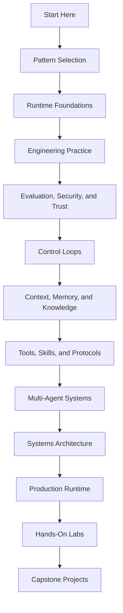

# Logical Groups

Este libro está organizado según el orden en que normalmente aparecen las decisiones de ingeniería. Comienza con el problema y la elección del pattern, luego agrega los elementos primitivos del runtime, prácticas de ingeniería, controles de riesgo, arquitectura, operaciones en producción, laboratorios y ejemplos completos.

Usa esta página cuando la barra lateral parezca extensa. Cada grupo responde a una pregunta diferente y le da al lector un punto claro de partida.

## Mapa de Grupos

| Grupo | Pregunta Principal | Beneficio para el Lector |
| --- | --- | --- |
| [Start Here](/intro) | ¿Qué es este libro y qué cuenta como un agent? | Obtienes el vocabulario, rutas para el lector, glosario y barra de producción. |
| [Pattern Selection and Composition](/pattern-selection/architecture-before-autonomy) | ¿Qué pattern debe usar este sistema? | Evitas agregar autonomía donde un prompt, chain, router o workflow es suficiente. |
| [Agent Runtime Foundations](/foundations/what-is-an-agent) | ¿Qué elementos primitivos hacen funcionar un agent? | Comprendes loops, state, tools, structured output, context y límites de control. |
| [Engineering Practice and Frameworks](/agent-engineering-practice/agent-development-lifecycle) | ¿Cómo construimos esto como software y no solo como un demo? | Obtienes orientación sobre lifecycle, harness, framework, setup y worksheet. |
| [Evaluation, Security, and Trust](/agent-engineering-practice/evaluation-driven-agent-development) | ¿Cómo sabemos que esto es seguro y útil? | Conectas evals, threat models, sandboxing y user trust con decisiones de lanzamiento. |
| [Control Loops](/control-loops/planning-and-execution) | ¿Cuándo debe el sistema planear, reflexionar, optimizar o recuperarse? | Eliges control iterativo sin ocultar fallas o costos. |
| [Context, Memory, and Knowledge](/foundations/context-budgets-and-working-sets) | ¿Qué debe saber, recordar o recuperar el agent? | Diseñas context packets, memory, RAG y límites de knowledge de manera deliberada. |
| [Tools, Skills, and Protocols](/tools-skills-protocols/skills) | ¿Qué puede hacer el agent fuera del model? | Defines tool contracts, skills, approvals, MCP, A2A y seguridad en la comunicación. |
| [Multi-Agent Systems](/multi-agent-systems/choosing-multi-agent-topology) | ¿Cuándo un solo agent ya no es suficiente? | Comparas delegación, supervisión, debate, paralelismo y workflows tipo crew. |
| [Systems Architecture](/systems-architecture/agentic-system-architecture) | ¿Cómo se convierten estos patterns en un sistema completo? | Ves servicios, sistemas RAG, coding agents, personal agents, arquitecturas de dominio, ADRs y referencias. |
| [Production Runtime](/production-runtime/overview) | ¿Cómo sobrevive el sistema en operación real? | Agregas durabilidad, observability, feedback loops, budgets, policy, eventos, rollout y rollback. |
| [Hands-On Labs](/hands-on-labs/) | ¿Cómo se ven estas ideas en código? | Construyes pequeños vertical slices en Python, TypeScript, runtimes personalizados y frameworks comunes de agent. |
| [Capstone Projects](/capstone-projects/) | ¿Cómo se ve un agentic system completo? | Estudias sistemas con forma de producto con traces, evals, ADRs, runbooks y planes de rollback. |
| [Historical Patterns](/deprecated/historical-patterns) | ¿Qué términos antiguos siguen siendo relevantes? | Puedes comparar el lenguaje de arquitectura actual con nombres de patterns antiguos. |
| [Publishing Appendix](/publishing/publishing-and-releases) | ¿Cómo se mantiene y publica el libro? | Obtienes notas de lanzamiento, checklist y publicación para el libro en línea. |

## Design Pipeline

Lee de izquierda a derecha cuando quieras que el libro construya un solo argumento de diseño. Salta al grupo con la evidencia faltante cuando estés revisando un sistema real.

## Mapa de Problemas

Usa este mapa cuando conoces el problema pero no el grupo correcto. Comienza con la sección indicada y luego sigue sus capítulos relacionados.

| Si tu problema es... | Comienza con | Terminas con |
| --- | --- | --- |
| El equipo quiere agregar un agent pero no ha justificado la autonomía. | [Pattern Selection and Composition](/pattern-selection/architecture-before-autonomy) | Un diseño más pequeño o una razón clara para el comportamiento agentic. |
| La implementación oculta el state en prompts o historial de chat. | [Agent Runtime Foundations](/foundations/what-is-an-agent) | Goals explícitos, state, tools, structured output y condiciones de parada. |
| Un demo funciona, pero nadie sabe cómo probarlo u operarlo. | [Engineering Practice and Frameworks](/agent-engineering-practice/agent-development-lifecycle) | Un lifecycle, harness, límite de framework y rastro de worksheet. |
| El sistema puede afectar usuarios, datos, dinero o sistemas externos. | [Evaluation, Security, and Trust](/agent-engineering-practice/evaluation-driven-agent-development) | Evals, threat model, sandbox, approval y controles de trust. |
| El agent sigue en loop, reintentando o autocorrigiéndose sin evidencia clara. | [Control Loops](/control-loops/planning-and-execution) | Un diseño de loop con condiciones de parada, budgets y estados de falla revisables. |
| Las respuestas dependen de documentos, memory o ensamblaje de context. | [Context, Memory, and Knowledge](/foundations/context-budgets-and-working-sets) | Policy de origen, context packet, retrieval, memory y reglas de frescura. |
| El agent necesita tools, approvals, MCP, A2A o mensajes seguros. | [Tools, Skills, and Protocols](/tools-skills-protocols/skills) | Tool contracts restringidos, sobres de protocolo, permisos y registros de auditoría. |
| Un agent está sobrecargado o necesita colaboradores especialistas. | [Multi-Agent Systems](/multi-agent-systems/choosing-multi-agent-topology) | Una topología, límite de roles, transcript, merge policy y regla de parada. |
| Varios patterns deben convertirse en un solo producto desplegable. | [Systems Architecture](/systems-architecture/agentic-system-architecture) | Un límite de sistema, ADRs, forma de servicio y arquitectura de referencia. |
| El diseño está cerca de producción. | [Production Runtime](/production-runtime/overview) | Durabilidad, observability, policy, budgets, rollout y evidencia de rollback. |
| Quieres prueba en código antes de comprometerte con un diseño. | [Hands-On Labs](/hands-on-labs/) | Un pequeño vertical slice ejecutable y una lista de controles de producción faltantes. |
| Quieres comparar con ejemplos completos. | [Capstone Projects](/capstone-projects/) | Una lista de brechas para traces, evals, ADRs, runbooks y controles de lanzamiento. |

## Orden Recomendado

Lee estos grupos en orden cuando quieras que el libro construya un solo argumento:

1. Start Here
2. Pattern Selection and Composition
3. Agent Runtime Foundations
4. Engineering Practice and Frameworks
5. Evaluation, Security, and Trust
6. Control Loops
7. Context, Memory, and Knowledge
8. Tools, Skills, and Protocols
9. Multi-Agent Systems
10. Systems Architecture
11. Production Runtime
12. Hands-On Labs
13. Capstone Projects

Este orden mantiene al lector dentro de un solo argumento de diseño: elige el pattern, define el runtime, agrega control de loop solo donde sea necesario, da al agent evidencia y capabilities, decide si un agent es suficiente y luego convierte el diseño en un sistema operado.

## Ruta de Arquitectura Visual

Usa esta ruta cuando quieras que los diagramas lleven la primera pasada. Es útil para revisiones de diseño, onboarding de equipos y lectura en PDF.

| Paso | Capítulo | Qué debe aclarar el diagrama |
| --- | --- | --- |
| 1 | [Agent Loop](/foundations/agent-loop) | Cómo el state, las acciones, las observaciones y las condiciones de detención forman una run. |
| 2 | [Planning and Execution](/control-loops/planning-and-execution) | Quién es responsable del plan, la validación, la ejecución y el progreso. |
| 3 | [Memory-Augmented Agent](/memory-knowledge/memory-augmented-agent) | Cómo se gobiernan la recuperación, inyección de context, almacenamiento y corrección. |
| 4 | [Tool Capability Design](/tools-skills-protocols/tool-capability-design) | Dónde se ubican los permisos, policy, llamadas a tools y registros de auditoría. |
| 5 | [Secure Agent Communication](/tools-skills-protocols/secure-agent-communication) | Qué puertas de autoridad protegen el intercambio agent-to-agent o con herramientas remotas. |
| 6 | [Choosing Multi-Agent Topology](/multi-agent-systems/choosing-multi-agent-topology) | Cuándo delegar, supervisar, debatir, paralelizar o permanecer como single-agent. |
| 7 | [Agentic System Architecture](/systems-architecture/agentic-system-architecture) | Cómo los patterns se componen en servicios, state, policy, evals y operaciones. |
| 8 | [Production Runtime Overview](/production-runtime/overview) | Qué debe existir alrededor del agent antes de su uso en producción. |
| 9 | [Event-Triggered Agents](/production-runtime/event-triggered-agents) | Cómo los triggers desatendidos se mantienen idempotentes, observables, reproducibles y seguros. |

Después de esta ruta, usa los capítulos de patterns como referencia. Cada diagrama debe responder una pregunta concreta de ownership, no solo decorar la página.

## Contratos de Grupo

Cada grupo debe entregar al lector un artifact o decisión durable. Usa esta tabla para saber cuándo continuar, pausar o saltar.

| Grupo | Entra cuando | Sale con |
| --- | --- | --- |
| Start Here | Necesitas orientación, vocabulario o el estándar de producción. | Una ruta de lectura y una definición compartida de agentic system. |
| Pattern Selection and Composition | Estás decidiendo si la autonomía pertenece al diseño. | Un pattern seleccionado, alternativas rechazadas y criterios de aceptación. |
| Agent Runtime Foundations | Necesitas hacer explícita la run. | Goal, state, tool, output, context y contratos de condiciones de detención. |
| Engineering Practice and Frameworks | Estás convirtiendo un diseño en software. | Harness, elección de framework, worksheet y registro de revisión. |
| Evaluation, Security, and Trust | El sistema afecta usuarios reales, datos, dinero o decisiones. | Eval set, threat model, sandbox boundary y controles de confianza. |
| Control Loops | El sistema debe planear, revisar, evaluar o recuperarse. | Loop policy, presupuesto, evaluator, estados de falla y reglas de detención. |
| Context, Memory, and Knowledge | La respuesta depende de evidencia, historial o recuperación. | Context packet, source policy, regla de memory y límite de frescura. |
| Tools, Skills, and Protocols | El agent necesita capacidades externas o intercambio agent-to-agent. | Contratos de tool, sobre de permisos, puerta de aprobación y registro de auditoría. |
| Multi-Agent Systems | Un agent está sobrecargado o múltiples roles mejoran el trabajo. | Topología, contratos de rol, merge policy, transcript y ruta de escalamiento. |
| Systems Architecture | Los patterns deben convertirse en un producto desplegable. | Límite de servicio, ADRs, flujo de datos/control y arquitectura de referencia. |
| Production Runtime | El sistema está cerca de su lanzamiento o ya está operando. | Durabilidad, traces, feedback de eval, presupuestos, rollout y plan de rollback. |
| Hands-On Labs | Necesitas prueba en código. | Slice ejecutable, evidencia de pruebas y lista de controles de producción faltantes. |
| Capstone Projects | Quieres un punto de comparación end-to-end. | Análisis de brechas contra un sistema con forma de producto. |

## Reglas de Handoff

Avanza solo cuando el grupo actual haya producido evidencia. Una elección de pattern sin criterios de aceptación no está lista para implementación. Un diseño de runtime sin state y condiciones de detención no está listo para tools. Una superficie de tool sin límites de aprobación y auditoría no está lista para producción. Un laboratorio sin lista de controles faltantes no es prueba de preparación.

Retrocede cuando falte evidencia:

| Evidencia faltante | Regresa a |
| --- | --- |
| El equipo no puede explicar por qué el sistema necesita autonomía. | Pattern Selection and Composition |
| State, tools, memory o policy viven solo dentro de prompts. | Agent Runtime Foundations |
| No hay eval set o threat model. | Evaluation, Security, and Trust |
| El sistema no tiene trace, replay, presupuesto o ruta de rollback. | Production Runtime |
| La arquitectura no tiene registro escrito de decisiones. | Systems Architecture |

Estos handoffs evitan que el libro se convierta en un recorrido de conceptos. Cada sección debe producir una decisión, exponer una brecha o enviar al lector a la sección que puede cerrarla.

## Prueba de Valor

Cada grupo debe ayudar al lector a tomar una mejor decisión de ingeniería:

- elegir un diseño más pequeño cuando la autonomía no es necesaria
- hacer visible el state, tools, memory y context
- agregar evals antes de confiar en el comportamiento
- separar el juicio del model del control determinista
- hacer que el riesgo sea revisable por otro ingeniero
- conectar ejemplos con responsabilidades de producción

Si un grupo no ayuda con uno de esos resultados, debe ser revisado, fusionado o eliminado.

## Conclusión

El libro no está organizado por nombres de tendencias. Está organizado por decisiones: elegir el pattern, definir el runtime, controlar el riesgo, componer el sistema, operarlo y probarlo con ejemplos.
