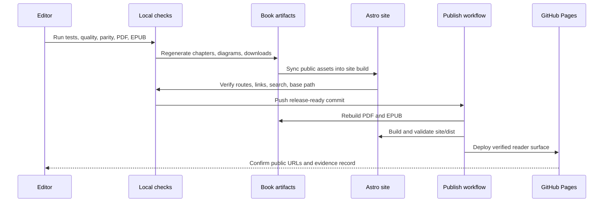

# Publicación y Lanzamientos

El libro se publica para lectura en el sitio de Astro GitHub Pages. Los archivos PDF y EPUB son formatos de cortesía para lectura offline; el lector en línea es el producto principal.

## URLs Públicas

- Sitio del libro: <https://gturitto.github.io/Agentic-Systems-Patterns/>
- PDF de cortesía: <https://gturitto.github.io/Agentic-Systems-Patterns/releases/Agentic-Systems-Patterns.pdf>
- EPUB de cortesía: <https://gturitto.github.io/Agentic-Systems-Patterns/releases/Agentic-Systems-Patterns.epub>
- Repositorio: <https://github.com/GTuritto/Agentic-Systems-Patterns>
- Discussions: <https://github.com/GTuritto/Agentic-Systems-Patterns/discussions>

## Artifacts de Lanzamiento

Los formatos de cortesía registrados se encuentran en:

```text
book/releases/Agentic-Systems-Patterns.pdf
book/releases/Agentic-Systems-Patterns.epub
```

El despliegue de GitHub Pages publica los mismos archivos en:

```text
/releases/Agentic-Systems-Patterns.pdf
/releases/Agentic-Systems-Patterns.epub
```

Cada ejecución del workflow `Publish Book` también sube los formatos de cortesía como un workflow artifact. Usa ese artifact cuando necesites inspeccionar el PDF o EPUB exacto producido por una ejecución específica de CI.

Antes de etiquetar o anunciar un lanzamiento, usa la [Release Readiness Checklist](./release-readiness-checklist.md). Usa las [Release Notes](./release-notes.md) como el resumen para lectores de lo que cambió y qué evidencia respalda el lanzamiento. Usa [GitHub Discussions](https://github.com/GTuritto/Agentic-Systems-Patterns/discussions) como el canal público canónico para preguntas de lectores, feedback de capítulos y seguimiento del release.

Descarga el artifact reutilizable de publicación: [release evidence record](/capstone-assets/templates/release-evidence-record.txt).

## Comandos Locales de Publicación

Desde la raíz del repositorio:

```sh
npm test
npm run release:commands
npm run typecheck
npm run capstones:evidence
npm run native-examples:validate
npm run native-examples:smoke:langgraph
npm run book:manifest:test
npm run book:visuals:verify
npm run book:quality
npm run book:build
npm run site:build
npm run site:parity
npm run book:pdf
npm run book:epub
```

Estos comandos cubren ejemplos ejecutables, paridad de comandos de lanzamiento, contratos TypeScript, alineación de evidencia capstone, slices nativos de framework, capítulos generados, consistencia editorial, cobertura visual, assets de diagramas, rutas del sitio, enlaces internos y las descargas de PDF/EPUB de cortesía.

Usa `npm run site:dev` para la vista previa principal del lector local.

Usa `npm run book:start` solo para la vista previa de autoría en VitePress.

Las salidas principales son:

```text
site/dist
book/releases/Agentic-Systems-Patterns.pdf
book/releases/Agentic-Systems-Patterns.epub
```

`site/dist` se despliega en GitHub Pages. La build de Astro usa la ruta base `/Agentic-Systems-Patterns/`.

Los comandos de pipeline de libro de nivel inferior son:

```sh
npm run book:content
npm run book:content:verify
npm run book:diagrams
npm run book:diagrams:verify
```

Ejecuta comandos de nivel inferior solo cuando edites capítulos generados, bundles de fuente, metadatos editoriales o exportaciones de diagramas directamente. Un lanzamiento aún debe pasar el conjunto completo de comandos anterior.

Usa este flujo como el modelo de publicación. El libro en línea es la superficie de lanzamiento; PDF y EPUB son acompañantes generados que deben coincidir con el mismo contenido verificado.



## GitHub Pages Release Gate

Usa este gate antes de anunciar el libro en línea:

| Check | Evidence |
| --- | --- |
| La ruta base del sitio es correcta | Los enlaces construidos resuelven bajo `/Agentic-Systems-Patterns/`. |
| Existen rutas de lector | `site:parity` reporta todos los capítulos del manifest y páginas de sección. |
| Existen assets de descarga | PDF de cortesía, EPUB de cortesía, source bundles, ejemplos de trace, reportes de eval y hojas de trabajo están presentes bajo `site/dist`. |
| Los quality gates del libro pasan | `book:quality` verifica cobertura del manifest, contenido generado, consistencia editorial, assets de diagramas y cobertura de Mermaid SVG. |
| La evidencia capstone concuerda | `capstones:evidence` verifica capítulos capstone, salida de runtime, assets de trace, reportes de eval y enlaces de scorecard. |
| La búsqueda está generada | Pagefind indexa el sitio construido sin errores de build. |
| Los formatos de cortesía coinciden con el sitio | `book:pdf` y `book:epub` se ejecutan después de cambios de contenido y las copias de deploy se actualizan. |
| Las release notes están al día | Fecha de revisión, alcance, límites conocidos y evidencia de verificación coinciden con el lanzamiento. |

No trates GitHub Pages como un simple volcado de archivos estáticos. Trátalo como la superficie del producto: rutas, descargas, búsqueda, PDF, navegación y release notes deben coincidir.

## Checklist de Superficie para el Lector

Antes de compartir la URL pública, inspecciona el sitio como lo haría un lector:

| Surface | What To Check | Why It Matters |
| --- | --- | --- |
| Homepage | La acción principal abre el libro y las acciones secundarias resuelven. | Los nuevos lectores necesitan un inicio claro. |
| Sidebar | Las secciones coinciden con los grupos lógicos y el manifest actual. | Los lectores necesitan orientación entre 100+ capítulos. |
| Search | Una consulta como `approval`, `RAG` o `eval` retorna páginas útiles. | Los lectores de GitHub Pages usan el libro como referencia. |
| Courtesy formats | El PDF y EPUB se descargan y reflejan el contenido actual del sitio. | Los lectores offline no deben recibir guías desactualizadas. |
| Templates | Las hojas de trabajo y checklists se descargan desde rutas públicas. | El valor del libro depende de artifacts reutilizables. |
| Source bundles | Las descargas de pattern y lab resuelven. | Los ingenieros necesitan código funcional junto al texto. |
| Release notes | Versión actual, alcance, evidencia y límites son explícitos. | Las afirmaciones públicas necesitan prueba y límites. |

Si alguna superficie falla, corrige el sitio o documenta la limitación antes de anunciar el lanzamiento.

## Despliegue

El despliegue es manejado por:

```text
.github/workflows/publish-book.yml
```

El workflow se ejecuta en cada push a `main` y también puede ser activado manualmente con `workflow_dispatch`. Verifica paridad de comandos de lanzamiento, evidencia capstone, el manifest del libro, contenido editorial, cobertura visual, assets de diagramas y cobertura de Mermaid SVG, construye el PDF y EPUB de cortesía, valida la build de autoría en VitePress, construye el sitio Astro, ejecuta verificaciones de paridad/enlaces de Astro y despliega `site/dist`.

## Release Evidence Record

Para cada lanzamiento público, conserva un breve registro de evidencia:

```text
version:
date:
commit:
site url:
pdf url:
epub url:
commands passed:
visual pages checked:
known limitations:
rollback action:
```

Este registro es útil cuando un lector reporta una página rota, PDF desactualizado, descarga faltante o discrepancia entre el sitio y el repositorio.

Usa el [release evidence record](/capstone-assets/templates/release-evidence-record.txt) descargable cuando el lanzamiento cambie contenido, assets, rutas, generación de formatos de cortesía, búsqueda o el comportamiento del workflow de publicación. Para el lanzamiento actual, comienza desde el [pre-launch release evidence for 2026-06-21](/capstone-assets/templates/prelaunch-release-evidence-2026-06-21.txt) completado y agrega los checks de URL pública después del despliegue.

## Licencia

El código fuente y los ejemplos ejecutables están licenciados bajo la Licencia MIT. El contenido del libro/referencia, diagramas, hojas de trabajo y artifacts de publicación generados están licenciados bajo [Creative Commons Attribution-NonCommercial-ShareAlike 4.0 International](https://creativecommons.org/licenses/by-nc-sa/4.0/) (`CC-BY-NC-SA-4.0`).

Al reutilizar o adaptar el contenido, preserva la atribución, úsalo solo para fines no comerciales a menos que se otorgue permiso por separado y distribuye las adaptaciones bajo la misma licencia.
