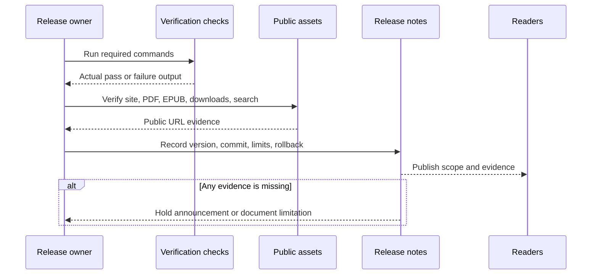

# Notas de la versión

Estas notas resumen el estado actual de la versión de *Agentic Systems Patterns*. Úsalas junto con la [Release Readiness Checklist](./release-readiness-checklist.md) antes de publicar.

Utiliza el [release evidence record](/capstone-assets/templates/release-evidence-record.txt) para capturar la salida real de comandos, verificaciones de URLs públicas, revisión de assets, límites conocidos y acción de rollback para una versión. El registro local actual completado es el [pre-launch release evidence for 2026-06-21](/capstone-assets/templates/prelaunch-release-evidence-2026-06-21.txt).

## Versión actual

Versión: `1.0.0`

Fecha de revisión: 2026-06-21

Tema de la versión: transformar el repositorio de un catálogo de patterns a una guía completa para diseñar, implementar, evaluar y operar agentic systems en diferentes frameworks.

## Valor agregado para el lector

- Rutas claras para lectores primerizos, constructores, usuarios de labs, usuarios de capstone y usuarios de referencia.
- Capítulos de patterns con intención consistente, guía de uso/evitación, arquitectura, forma del sistema, protocolo, modos de falla, estrategia de eval, checklist de producción, enlaces a fuentes y descargas.
- Labs agnósticos de framework en Python y TypeScript.
- Cobertura de retrieval estilo LangChain/LangGraph, state graphs estilo LangGraph, runtime packaging estilo Mastra, transcript evaluation estilo AutoGen, flows estilo CrewAI, A2A, MCP y runtimes personalizados deterministas.
- Un track de mini-framework desde cero que explica qué empaquetan los agent frameworks internamente.
- Capstones orientados a producto para soporte de reembolsos, research RAG y workflows de entrega multi-agent.
- Un caso de estudio de soporte de reembolso que inicia en la Introducción y capítulos de fundamentos, y regresa en labs y capstones.
- Ejemplos más concretos de enseñanza de patterns para drafting de single-agent, refund gates con prompt chaining y scoring de evaluator-optimizer.
- Presupuestos de tiempo opcionales por ejercicio en Labs 01-13 para que los lectores puedan dividir el trabajo en bloques más cortos y revisables.
- Ejemplos avanzados más profundos para fallas en la configuración de frameworks, conversión de incidentes de aprobación de reembolso a eval, y límites de autoridad específicos de dominio.
- Ejemplos completos de preparación para producción para soporte de reembolso, research RAG y workflows de entrega multi-agent.
- Slices nativos de framework para ejemplos seleccionados de LangGraph, Mastra, CrewAI y AutoGen.
- Flujo de publicación listo para producción para el lector de GitHub Pages, PDF/EPUB de cortesía, bundles de fuentes generados, diagramas, metadatos y filtros de búsqueda Pagefind, verificaciones de paridad y validación de ejemplos nativos.

## Evidencia de verificación

Antes de publicar, la versión debe pasar:

```sh
npm test
npm run release:commands
npm run typecheck
npm run capstones:evidence
npm run native-examples:validate
npm run native-examples:smoke:langgraph
npm run book:manifest:test
npm run book:visuals:verify
npm run book:build
npm run site:build
npm run site:parity
npm run book:pdf
npm run book:epub
```

La versión no está lista si algún comando falla, si la cobertura visual retrocede, si la evidencia de capstone difiere de la salida del runtime, o si el PDF y EPUB de cortesía generados no se actualizan después de cambios en el contenido.

Registra los resultados reales de los comandos con la versión. La evidencia esperada no es suficiente para una etiqueta pública o anuncio.

Utiliza este flujo al convertir estas notas en una versión pública. Una nota de versión es válida solo cuando apunta a evidencia actual, assets públicos y una acción de rollback.



## Plantilla de registro de evidencia

Para cada versión pública, registra:

| Campo | Valor |
| --- | --- |
| Versión | |
| Fecha | |
| Commit | |
| Responsable de la versión | |
| Comandos aprobados | |
| URLs públicas verificadas | |
| Discussions verificadas | |
| Assets de descarga verificados | |
| Evidencia de capstone verificada | |
| Búsqueda verificada | |
| Filtros de búsqueda verificados | |
| PDF de cortesía verificado | |
| EPUB de cortesía verificado | |
| Limitaciones conocidas | |
| Acción de rollback | |

Mantén este registro en el PR de la versión, el release de GitHub o en las notas de la versión anexadas. No reemplaces la evidencia real con una checklist planeada.

## Verificación de assets para el lector

Antes de publicar, verifica estas rutas del sitio generado:

| Asset | Ruta |
| --- | --- |
| Libro en línea | `/Agentic-Systems-Patterns/` |
| Discussions | `https://github.com/GTuritto/Agentic-Systems-Patterns/discussions` |
| PDF de cortesía | `/Agentic-Systems-Patterns/releases/Agentic-Systems-Patterns.pdf` |
| EPUB de cortesía | `/Agentic-Systems-Patterns/releases/Agentic-Systems-Patterns.epub` |
| Plantillas | `/Agentic-Systems-Patterns/capstone-assets/templates/` |
| Ejemplos de salida capturada | [lab-and-capstone-command-output.txt](/capstone-assets/output-examples/lab-and-capstone-command-output.txt) |
| Ejemplos de preparación para producción completados | [completed-production-readiness-examples.txt](/capstone-assets/templates/completed-production-readiness-examples.txt) |
| Descargas | `/Agentic-Systems-Patterns/downloads/` |
| Índice y filtros de búsqueda | `/Agentic-Systems-Patterns/pagefind/` con metadatos de sección, tipo, nivel y ruta del lector. |

La versión no debe anunciarse hasta que el sitio de GitHub Pages, el canal de feedback en GitHub Discussions, el PDF de cortesía, el EPUB de cortesía, las descargas, las plantillas, los ejemplos de salida capturada y el índice de búsqueda de Pagefind estén todos generados desde el mismo contenido o verificados contra el mismo release.

## Límites conocidos del alcance

- Los ejemplos son educativos y deterministas por defecto; las integraciones en vivo con proveedores de model requieren configuración local.
- Los slices nativos de framework son puntos de comparación para límites importantes, no tutoriales exhaustivos de cada feature del framework.
- El libro prioriza arquitectura, evidencia de producción y disciplina de revisión de diseño sobre la cobertura API por API de los frameworks.
- Los nombres históricos de patterns permanecen en la sección deprecada para que la terminología antigua pueda mapearse a la taxonomía actual.

## Artifacts de publicación

- Salida del sitio: `site/dist`
- Artifact fuente PDF: `book/releases/Agentic-Systems-Patterns.pdf`
- Copia de despliegue PDF: `book/docs/public/releases/Agentic-Systems-Patterns.pdf`
- Artifact fuente EPUB: `book/releases/Agentic-Systems-Patterns.epub`
- Copia de despliegue EPUB: `book/docs/public/releases/Agentic-Systems-Patterns.epub`
- Descargas generadas: `book/docs/public/downloads/`

## Resumen de la versión

Esta versión está lista cuando el lector puede responder cinco preguntas después de terminar la guía:

1. ¿Qué agentic pattern debo usar y por qué?
2. ¿Qué controla state, policy, tools, memory, approvals, traces y evals?
3. ¿Cómo ejecuto un ejemplo pequeño e identifico qué falta para producción?
4. ¿Cómo se mapea la misma arquitectura entre frameworks y lenguajes?
5. ¿Qué evidencia prueba que el sistema es lo suficientemente seguro para liberar?

## Verificaciones posteriores a la publicación

Después del despliegue, abre la URL pública de GitHub Pages y verifica:

- que la página principal cargue;
- que la navegación por capítulos funcione;
- que la búsqueda abra, devuelva resultados ricos en metadatos y los filtros de nivel/tipo funcionen;
- que el PDF de cortesía se descargue;
- que el EPUB de cortesía se descargue;
- que al menos una worksheet, trace, eval report, ejemplo de salida capturada y bundle de fuentes se descarguen.

Si algún asset público falla, actualiza las notas de la versión con la limitación o revierte el anuncio.
