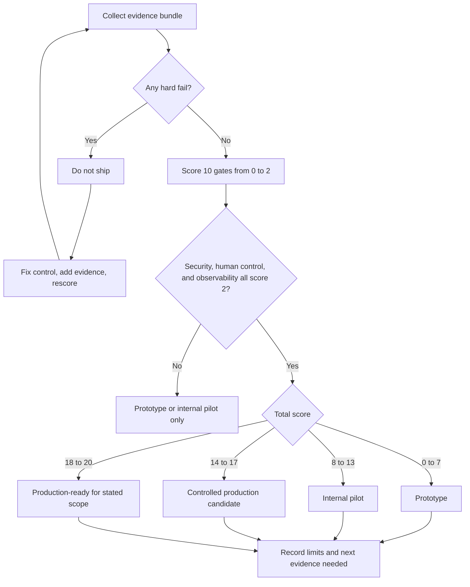

# 10/10 Production Gate

Este libro no está terminado cuando puedes describir agent patterns. Está terminado cuando puedes diseñar un sistema que un equipo pueda revisar, probar, lanzar, observar y hacer rollback.

Usa este gate antes de declarar un agentic system listo para producción. Un puntaje menor a 8 significa que el diseño sigue siendo un demo o prototipo. Un puntaje de 10 significa que el equipo tiene evidencia, no solo confianza.

Descarga la hoja de trabajo reutilizable: [10/10 production gate scorecard](/capstone-assets/templates/ten-out-of-ten-production-gate-scorecard.txt).

## Cuándo Usar Este Gate

Usa este gate en tres momentos:

| Momento | Propósito | Resultado Esperado |
| --- | --- | --- |
| Antes de la implementación | Encontrar falta de ownership antes de que el código haga costoso cambiar el diseño. | Cambios de arquitectura, no aprobación de lanzamiento. |
| Antes del piloto | Decidir si usuarios limitados, datos o efectos secundarios son aceptables. | Piloto interno, piloto controlado o bloqueado. |
| Antes de producción | Verificar evidencia para cada camino de alto riesgo. | Lanzar, lanzar con límites documentados o no lanzar. |

No esperes hasta la semana de lanzamiento. El gate es más útil cuando cambia el diseño temprano.

## Qué Prueba Un Sistema 10/10

| Área | Un Sistema 10/10 Demuestra | Evidencia |
| --- | --- | --- |
| Goal | El sistema tiene un goal estrecho, non-goals explícitos y criterios de éxito claros. | Problem statement, user story, acceptance tests. |
| Boundary | El diseño separa el juicio del model del control determinista. | Architecture diagram, service contracts, policy boundary. |
| State | El sistema nombra quién es dueño del run state, durable memory, user data y external effects. | State schema, retention rules, replay plan. |
| Tools | Cada tool tiene un contrato tipado, regla de autorización, timeout y registro de auditoría. | Tool manifest, test fixtures, audit log example. |
| Context | El context se arma deliberadamente y lleva información de origen, confianza, frescura y presupuesto. | Context packet example, retrieval trace, context budget. |
| Evaluation | El equipo puede correr evals para happy paths, edge cases, regresiones y fallas conocidas. | Eval dataset, grader rubric, CI gate output. |
| Security | El threat model cubre tools, memory, prompts, retrieved content, credentials y users. | Threat model, mitigations, sandbox tests. |
| Human control | Los usuarios pueden inspeccionar, aprobar, corregir, detener o escalar comportamientos riesgosos. | Approval UI, correction flow, audit trail. |
| Runtime | El sistema maneja retries, timeouts, idempotency, degradación y rollback. | Runbook, retry policy, rollback plan. |
| Observability | Los operadores pueden inspeccionar traces, costos, latencia, llamadas a tools, eval drift e incidentes. | Dashboard, trace sample, alert thresholds. |

## Scorecard

Califica cada fila del 0 al 2.

| Puntaje | Significado |
| ---: | --- |
| 0 | Falta o solo descrito en prosa. |
| 1 | Parcialmente implementado pero no probado o no revisable. |
| 2 | Implementado, probado, documentado y asignado a un owner. |

| Gate | Puntaje |
| --- | ---: |
| Goal y non-goals son explícitos. | 0-2 |
| Architecture boundary es revisable. | 0-2 |
| State ownership está documentado. | 0-2 |
| Tool contracts y permisos están probados. | 0-2 |
| Context packet es inspeccionable. | 0-2 |
| Eval gate bloquea lanzamientos inseguros. | 0-2 |
| Threat model tiene mitigaciones. | 0-2 |
| Human control existe para acciones riesgosas. | 0-2 |
| Runtime puede reintentar, reanudar, degradar y hacer rollback. | 0-2 |
| Observability explica incidentes. | 0-2 |

Puntaje total:

- 0-7: prototipo
- 8-13: piloto interno
- 14-17: candidato a producción controlada
- 18-20: listo para producción

No promedies la ausencia de un control de seguridad. Un sistema que toca dinero, credenciales, datos privados, infraestructura o acciones visibles para el cliente debe tener 2 en security, human control y observability.

## Release Decision Flow

Usa este flujo después de calificar. Evita que fallas críticas se oculten con un puntaje total alto.

## Reglas de Calificación

Califica la evidencia, no la intención:

| Afirmación | Puntaje 0 | Puntaje 1 | Puntaje 2 |
| --- | --- | --- | --- |
| "Tenemos evals." | No existen eval fixtures. | Existen evals pero no bloquean el lanzamiento ni cubren fallas. | Evals cubren caminos esperados e inseguros, corren en CI y bloquean el lanzamiento. |
| "Tenemos observability." | Existen logs pero no pueden reconstruir una ejecución. | Existen traces solo para caminos exitosos. | Los operadores pueden inspeccionar ejecuciones exitosas, fallidas, rechazadas, escaladas y con timeout. |
| "Tenemos approval." | Los humanos son notificados después de la acción. | Approval existe pero autoriza comportamientos vagos. | Approval vincula una acción exacta, versión de policy, expiración, approver y trace ID. |
| "Podemos hacer rollback." | Rollback significa volver a desplegar o borrar la función. | Existe un camino de rollback pero no está probado. | Model, prompt, policy, tool, workflow o agent behavior pueden deshabilitarse de forma independiente. |

Si la evidencia no es inspeccionable por otro ingeniero, no la califiques como 2.

## Release Modes

Usa el puntaje para elegir un modo de lanzamiento:

| Modo | Alcance Permitido | Evidencia Requerida |
| --- | --- | --- |
| Prototipo | Demos locales, datos falsos, sin efectos secundarios reales. | Etiqueta clara de que no es producción. |
| Piloto interno | Usuarios internos, datos limitados, acciones solo de lectura o muy acotadas. | Owner, logs, evals básicos, rollback y límites conocidos. |
| Candidato a producción controlada | Usuarios o datos reales con despliegue limitado y monitoreo activo. | Scorecard completa, approval para acciones riesgosas, traces, eval gate, runbook. |
| Listo para producción | Operación normal para el alcance previsto. | Puntaje 18-20, sin fallas críticas, rollback probado, incident-to-eval loop. |

El modo de lanzamiento debe aparecer en el ADR, release notes o launch plan. Un sistema puede estar listo para producción para una tarea específica y seguir siendo prototipo para tareas adyacentes.

## Hard Fails

Cualquier hard fail bloquea producción, sin importar el puntaje total.

| Hard Fail | Por Qué Bloquea |
| --- | --- |
| El agent puede llamar tools de alto riesgo sin policy o approval. | El model puede convertir ambigüedad en acción irreversible. |
| Las credenciales se heredan ampliamente del proceso host. | Un bug en prompt o tool puede convertirse en escalamiento de privilegios. |
| El equipo no puede hacer replay de una ejecución fallida. | Los incidentes no pueden convertirse en pruebas de regresión. |
| Evals solo miden la calidad de la respuesta final. | El mal uso de tools, state oculto y trayectorias inseguras permanecen invisibles. |
| Las fuentes de context no tienen procedencia ni regla de frescura. | El sistema puede actuar con confianza sobre información obsoleta o no confiable. |
| No hay plan de rollback para cambios en prompt, policy, model o tool. | Un lanzamiento seguro requiere reversión segura. |

## Evidence Bundle

Una revisión de diseño seria debe adjuntar estos artifacts:

1. Architecture diagram con model, tools, state, policy, memory y user boundary.
2. ADR explicando el pattern elegido y alternativas rechazadas.
3. Tool manifest con permisos, clase de riesgo, timeouts y campos de auditoría.
4. Context packet example para una task real.
5. Trace de una ejecución exitosa y una fallida.
6. Eval dataset con al menos happy path, edge case, adversarial y regression cases.
7. Threat model con mitigaciones y evidencia de pruebas.
8. Approval o escalation flow para acciones riesgosas.
9. Runbook con alertas, triage de incidentes, rollback y owner.
10. Umbrales de costo, latencia y presupuesto.

## Preguntas Mínimas Para Revisión de Producción

Haz estas preguntas antes del lanzamiento:

1. ¿Qué acción exacta puede tomar el sistema sin intervención humana?
2. ¿Qué state cambia si el model se equivoca?
3. ¿Qué llamada a tool sería la más costosa, riesgosa o irreversible?
4. ¿Qué evidencia probaría que la respuesta o acción está fundamentada?
5. ¿Qué pasa si retrieval devuelve contenido obsoleto u hostil?
6. ¿Qué pasa si un tool hace timeout después de que el efecto externo tuvo éxito?
7. ¿Qué eval fallaría si el sistema retrocede mañana?
8. ¿Quién recibe la alerta y qué puede hacer rollback?
9. ¿Qué ve el usuario cuando el agent está inseguro?
10. ¿Qué haría que el equipo apague el agent?

## Dónde aprender sobre cada gate

| Área de Gate | Leer |
| --- | --- |
| Elección de pattern | [Choosing the Right Pattern](/pattern-selection/choosing-the-right-pattern) |
| Límite de arquitectura | [Architecture Before Autonomy](/pattern-selection/architecture-before-autonomy), [Agentic System Architecture](/systems-architecture/agentic-system-architecture) |
| Control de state y loop | [Agent Loop](/foundations/agent-loop), [Goals and State](/foundations/goals-and-state) |
| Contratos de tool | [Tool Use](/foundations/tool-use), [Tool Capability Design](/tools-skills-protocols/tool-capability-design) |
| Context y memory | [Context Engineering](/foundations/context-engineering), [Context Budgets and Working Sets](/foundations/context-budgets-and-working-sets) |
| Evals | [Evaluation-Driven Agent Development](/agent-engineering-practice/evaluation-driven-agent-development), [Observability and Evals](/production-runtime/observability-and-evals) |
| Seguridad | [Agent Threat Model](/agent-engineering-practice/agent-threat-model), [Agent Security and Sandboxing](/agent-engineering-practice/agent-security-and-sandboxing) |
| Control humano | [Human Approval Gates](/tools-skills-protocols/human-approval-gates), [Agent UX and Human Trust](/agent-engineering-practice/agent-ux-and-human-trust) |
| Runtime | [Production Runtime Overview](/production-runtime/overview), [Deployment Walkthrough](/production-runtime/deployment-walkthrough) |
| Ejemplos completos | [Capstone Projects](/capstone-projects/) |

## Conclusión

Un agentic system 10/10 no es el sistema más autónomo. Es el sistema cuya autonomía es limitada, probada, observable, reversible y que justifica el costo operativo.
