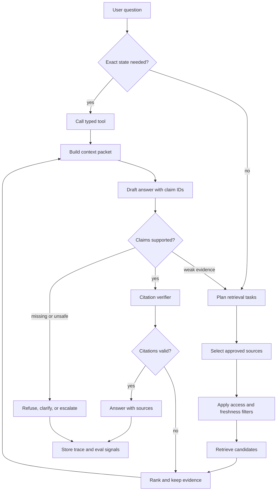

# Agentic RAG Systems

Agentic RAG utiliza el comportamiento de agent alrededor de la recuperación. En lugar de una sola llamada retrieve-then-generate, el sistema puede planear consultas, elegir fuentes, invocar retrieval tools, inspeccionar evidencia, refinar búsquedas, verificar citas y decidir si responder, pedir aclaración o escalar.

Este capítulo es arquitectónico. El capítulo existente de [Semantic Recall and RAG](../memory-knowledge/semantic-recall-rag) explica el retrieval pattern. Este capítulo explica cómo construir un sistema completo alrededor de ese patrón.

La distinción importante es que Agentic RAG no es solo un prompt más inteligente sobre una vector database. Es un sistema de producción para trabajo fundamentado en evidencia. Ese sistema tiene ownership de fuentes, ingestion, indexing, retrieval, context assembly, generation, verification, evaluation, observability y refresh.

Usa la [Agentic RAG query trace worksheet](/capstone-assets/templates/agentic-rag-query-trace-worksheet.txt) durante revisiones de arquitectura. Obliga al equipo a registrar la pregunta, fuentes, filtros, evidencia omitida, verificación de citas y la decisión final en runtime.

## Basic RAG vs Agentic RAG

Basic RAG es un pipeline:

```text
query -> retrieve -> inject context -> generate answer
```

Agentic RAG es un control loop:

```text
goal -> plan retrieval -> search -> inspect evidence -> refine or verify -> answer or refuse
```

Este cambio importa porque muchas preguntas reales no se resuelven con una sola búsqueda. Requieren descomposición, selección de fuentes, permisos, verificación de frescura y verificación de respuestas.

## Cuando RAG No Es Suficiente

No uses semantic retrieval como sustituto de exact state.

Si la pregunta solicita el saldo actual de la cuenta, el estado de una orden, feature flag, conteo de inventario, entitlement, payment state, permiso de acceso o el estado de un incidente en vivo, el sistema debe llamar un typed tool o un servicio respaldado por base de datos. RAG puede explicar policy, contexto histórico o documentación, pero el exact transactional state debe estar detrás de un contrato.

Usa RAG para evidencia y explicación. Usa tools para la verdad operativa actual. Muchos sistemas útiles combinan ambos:

1. recuperar policy y procedimiento;
2. llamar un typed tool para el current state;
3. armar un context packet con ambos;
4. responder con citas y referencias a resultados de tools;
5. rechazar o escalar cuando la evidencia y el state no coinciden.

## Reference Flow

Usa este diagrama para verificar si el sistema puede retroceder cuando la evidencia es débil. El camino importante no es solo de consulta a respuesta; es el loop de retrieval a verification, refinement, refusal o escalation.


## Query Trace Flow

Este flujo es el mapa de depuración para el lector. Cada flecha debe producir trace evidence que un revisor pueda inspeccionar después de una respuesta incorrecta, rechazo o escalamiento.



## System Components

- **Source registry:** Lista fuentes aprobadas, propietarios, sensibilidad, frescura, alcance de tenant y reglas de eliminación.
- **Ingestion pipeline:** Importa material fuente, detecta cambios, fragmenta contenido, redacta donde sea necesario y registra versiones.
- **Index builder:** Crea indexes vectoriales, por palabra clave, graph o híbridos a partir de los fragments aprobados.
- **Query planner:** Descompone solicitudes complejas en retrieval tasks.
- **Retrieval router:** Elige indexes, bases de datos, APIs, memories o fuentes web.
- **Access filter:** Aplica permisos de usuario y policy a nivel de fuente antes de la recuperación.
- **Retriever:** Ejecuta búsquedas vectoriales, por palabra clave, graph, SQL, API o híbridas.
- **Ranker:** Elimina duplicados, fragments obsoletos, evidencia de baja relevancia y contenido no elegible por policy.
- **Context builder:** Arma un context packet rastreable con instrucciones, state, evidencia, resultados de tools, memory, exclusiones y presupuesto.
- **Verifier:** Verifica si la evidencia realmente respalda la respuesta.
- **Synthesizer:** Produce la respuesta final con citas e incertidumbre.
- **Citation verifier:** Verifica que las citas respalden las afirmaciones específicas a las que están asociadas.
- **Telemetry:** Registra consulta, fuentes, rankings, context packet, citas, costos y resultados del verifier.
- **Evaluation loop:** Reproduce traces, mide la calidad de retrieval y respuesta, y convierte incidentes en casos de regresión.

## Usar Cuando

- La respuesta debe estar fundamentada en fuentes cambiantes o privadas.
- La pregunta puede requerir múltiples búsquedas o tipos de fuentes.
- Los usuarios necesitan citas, procedencia y frescura.
- Las fallas de retrieval deben llevar a aclaración, rechazo o escalamiento en vez de alucinaciones.

## Evitar Cuando

- Una consulta determinista a base de datos respondería la pregunta directamente.
- El sistema no puede hacer cumplir permisos de fuente.
- El corpus es demasiado ruidoso para soportar grounding confiable.
- La calidad de las citas no se evalúa.

## Architecture Decisions

Define estas decisiones explícitamente:

- Source inventory: qué fuentes existen y quién las posee.
- Freshness policy: cuán obsoleta puede estar cada fuente.
- Chunking policy: cómo se dividen y actualizan los documentos.
- Metadata policy: tenant, usuario, proyecto, fecha, sensibilidad y tipo de fuente.
- Retrieval strategy: vector, keyword, graph, SQL, API o híbrida.
- Citation policy: qué cuenta como una cita válida.
- Refusal policy: qué sucede cuando la evidencia es débil.
- Evaluation policy: qué dataset prueba la calidad de retrieval.

## Source Lifecycle

La mayoría de las fallas de RAG comienzan antes del retrieval. El ciclo de vida de la fuente es parte de la arquitectura.

| Stage | Design Question | Failure If Ignored |
| --- | --- | --- |
| Source registration | ¿Quién posee esta fuente y quién puede consultarla? | documentos huérfanos, permisos poco claros. |
| Ingestion | ¿Cómo se detectan actualizaciones, eliminaciones y redacciones? | fragments obsoletos o prohibidos siguen siendo recuperables. |
| Chunking | ¿Qué unidad puede respaldar una cita? | las citas apuntan a documentos amplios o pierden contexto. |
| Indexing | ¿Qué versiones de index existen y qué model las construyó? | las regresiones no pueden rastrearse ni revertirse. |
| Access filtering | ¿Se aplican permisos antes de retrieval y ranking? | fragments no autorizados entran en los conjuntos candidatos. |
| Refresh | ¿Qué tan rápido deben aparecer o desaparecer los cambios? | la policy antigua prevalece porque es más fácil de recuperar. |
| Deletion | ¿La eliminación por usuario, tenant o legal puede quitar contenido indexado? | los datos eliminados persisten en vectores o cachés. |

No trates el vector index como fuente de la verdad. Es un artifact derivado. El source registry y la ingestion pipeline deben poder explicar qué fuente original produjo cada fragmento, cuándo fue indexado y si sigue siendo válido.

## Corrective RAG Loop

Corrective RAG agrega un verifier antes de la síntesis final. Si la evidencia es débil, el sistema cambia la consulta o la fuente en lugar de forzar una respuesta.

El diagrama anterior muestra este loop: evidencia débil regresa a planificación, evidencia respaldada pasa a síntesis y evidencia insegura o ausente se convierte en rechazo, aclaración o escalamiento.

El verifier debe revisar más que la fluidez de la respuesta. Debe preguntar si cada afirmación importante tiene evidencia de respaldo, si la fuente citada está actualizada, si el solicitante puede verla, si otra fuente entra en conflicto, si la respuesta usó exact state de un tool cuando era necesario y si la respuesta final debería ser un rechazo o escalamiento.

## Multi-Agent RAG

Un sistema multi-agent RAG separa roles:

- Researcher: descompone la necesidad de información.
- Retriever: busca en fuentes específicas.
- Verifier: verifica la evidencia frente a las afirmaciones.
- Synthesizer: redacta la respuesta.
- Policy agent: verifica elegibilidad de fuentes y límites de datos sensibles.

Usa agents separados solo cuando los roles aportan valor independiente. Si todos los roles leen la misma evidencia y repiten el mismo prompt, usa un solo agent con pasos estructurados.

## Trace Model

Agentic RAG necesita traces que permitan revisar el comportamiento de retrieval. Una respuesta final con citas no es suficiente. Necesitas saber cómo llegó el sistema a ese resultado.

```ts
type RagTrace = {
  runId: string;
  actorId: string;
  tenantId: string;
  question: string;
  queryPlan: Array<{
    queryId: string;
    purpose: string;
    sourceTypes: string[];
  }>;
  retrievals: Array<{
    queryId: string;
    indexName: string;
    indexVersion: string;
    filters: Record<string, unknown>;
    returnedSourceIds: string[];
    selectedSourceIds: string[];
    omittedSourceIds: string[];
  }>;
  contextPacketId: string;
  citations: Array<{
    claimId: string;
    sourceId: string;
    chunkId: string;
    verifierStatus: "supported" | "weak" | "contradicted" | "not_checked";
  }>;
  outcome: "answered" | "refused" | "clarification_needed" | "escalated";
  policyVersion: string;
};
```

Este trace permite al equipo depurar la falla real: mala planeación, fuente incorrecta, filtro ausente, índice desactualizado, mal rerank, ensamblaje de context débil, desajuste de cita o error del verifier.

## End-To-End Query Trace

Usa un trace concreto en revisiones de diseño. Un trace debe mostrar el camino desde la pregunta del usuario hasta la respuesta final, no solo las citas finales.

| Paso | Evidencia en el Trace | Falla que Expone |
| --- | --- | --- |
| Usuario pregunta | actor, tenant, question, task type, risk class | tenant incorrecto, task no soportado o pregunta de exact-state enviada a RAG |
| Planner descompone | subqueries, source types, required freshness, tool needs | clase de fuente ausente o query demasiado amplia |
| Access filter ejecuta | allowed sources, denied sources, policy version | fuente no autorizada entrando al retrieval |
| Retriever busca | query text, filters, index version, scores, source IDs | índice desactualizado, metadata incorrecta, low recall |
| Ranker recorta | selected chunks, omitted chunks, reason for omission | mejor evidencia descartada por el context budget |
| Context builder ensambla | instructions, evidence, tool results, memory, exclusions | policy o requerimiento de cita ausente en el context |
| Synthesizer redacta | claim IDs, answer sections, cited chunks | claim no soportado o citation laundering |
| Verifier revisa | support status por claim, conflicts, missing evidence | evidencia débil aceptada como grounded |
| Runtime decide | answered, refused, clarification, or escalation | respuesta forzada cuando la evidencia era insuficiente |

El trace debe hacer visibles las omisiones. Un revisor debe ver no solo lo que el sistema usó, sino también lo que rechazó, por qué se rechazó y si el rechazo fue seguro.

## Retrieval Failure Playbook

La mayoría de los incidentes RAG no son fallas del model. Son fallas de fuente, filtro, ranking, context o verificación. Haz el triage por separado.

| Síntoma | Causa Probable | Primer Arreglo |
| --- | --- | --- |
| La fuente correcta nunca aparece. | Fuente ausente, ingesta desactualizada, índice incorrecto o access filter demasiado estricto. | Revisa el source registry, ingestion log, versión del índice y filtros. |
| La fuente correcta aparece pero no se selecciona. | Reranker, dedupe o recorte por budget la eliminó. | Inspecciona los chunks seleccionados y omitidos con puntajes y razones. |
| La respuesta cita un claim cercano pero incorrecto. | Chunk demasiado amplio, citation verifier muy débil o síntesis se excede. | Agrega chequeos de cita a nivel de claim y unidades de cita más pequeñas. |
| La respuesta usa una policy antigua. | Metadata de freshness ausente o SLA de refresh violado. | Agrega fechas efectivas, rechazo de fuentes desactualizadas y alertas al source owner. |
| La respuesta filtra contenido no autorizado. | Access filter aplicado después del retrieval o metadata ausente. | Aplica permisos antes del retrieval y prueba intentos de cruce de tenant. |
| La respuesta rechaza demasiado seguido. | Umbral de evidencia muy alto o query planner demasiado limitado. | Agrega ruta de clarificación y búsquedas fallback específicas por fuente. |
| El agent sigue buscando temas adyacentes. | Planner sin condiciones de parada o verifier da feedback vago. | Agrega máximo de rondas, propósito del query y razón de falla del verifier. |
| Prompt injection cambia el estilo de respuesta o la policy. | El contenido recuperado se trató como instrucción en vez de evidencia. | Etiqueta el texto fuente como evidencia no confiable y agrega fixtures de injection. |
| Fuentes en conflicto se colapsan en una sola respuesta. | Ranker o synthesizer ocultó el desacuerdo. | Conserva fechas de fuente y exige divulgación de conflicto o escalamiento. |
| La respuesta depende de una fuente omitida. | Context budget eliminó evidencia decisiva sin señal de revisión. | Registra los chunks omitidos con razones y prueba casos bajo presión de budget. |

El playbook evita que los equipos ajusten prompts cuando el defecto real está en la plomería de retrieval.

## Evaluation Guidance

Evalúa el pipeline por capas.

| Capa | Qué Probar |
| --- | --- |
| Ingesta | integridad de fuentes, eliminación, redacción, versionado de chunks. |
| Retrieval | recall, precisión, freshness, aislamiento de tenant, diversidad de fuentes. |
| Reranking | si la mejor evidencia sobrevive al recorte y presión de budget. |
| Ensamblaje de context | si policy, goal, evidence y citas están incluidos y etiquetados. |
| Generación | groundedness, comportamiento de rechazo, incertidumbre y uso de citas. |
| Verificación | falso soporte, contradicción omitida, cita alucinada, rechazo de fuente desactualizada. |
| Operaciones | replay, integridad de trace, rollback, refresh de fuente, reproducción de incidentes. |

Casos útiles de eval incluyen preguntas de respuesta conocida, preguntas con evidencia faltante, fuentes en conflicto, policy desactualizada, intentos de cruce de tenant, prompt injection en documentos recuperados, preguntas de exact-state que deberían invocar tools y trampas de cita donde la fuente correcta se recupera pero no respalda el claim específico.

Mide recall de retrieval, precisión de retrieval, freshness de fuente, precisión de permisos de fuente, integridad del context packet, fidelidad de citas, tasa de claims no soportados, tasa de rechazo por evidencia faltante, rechazo de fuente desactualizada, violaciones de tenant-boundary, costo, latencia y éxito de replay.

## Failure Modes

- Citaciones alucinadas: la respuesta cita una fuente que no respalda el claim.
- Retrieval drift: el loop sigue buscando temas adyacentes en vez de la pregunta del usuario.
- Over-fetching: demasiado context desplaza la evidencia importante.
- Permission leaks: retrieval devuelve documentos que el usuario no debería ver.
- Stale grounding: documentación antigua predomina porque es más fácil de recuperar.
- Memory contamination: preferencias del usuario se tratan como material fuente factual.
- Index drift: la fuente cambió pero el índice no.
- Delete failure: contenido eliminado o revocado sigue siendo recuperable.
- Exact-state confusion: semantic search responde una pregunta que requería una llamada a tool en vivo.
- Citation laundering: existe una cita, pero respalda un claim cercano en vez del claim real.
- Verifier theater: el verifier aprueba prosa plausible sin revisar el soporte de fuente.
- Trace gaps: el equipo no puede reconstruir qué chunks se recuperaron, omitieron o usaron.

## Production Controls

- Indexes con control de acceso.
- Filtros de metadata antes del retrieval.
- Source registry con owners, sensibilidad, freshness y reglas de eliminación.
- Versionado de chunks e índices.
- Workflows de reindexado y eliminación.
- Umbrales de cantidad de evidencia y freshness.
- Traces de context packet.
- Validación de citas.
- Datasets de eval para retrieval y citas.
- Telemetría a nivel de fuente.
- Escalamiento humano para evidencia en conflicto.
- Fallback de tool tipado para estado transaccional exacto.
- Pruebas red-team para prompt injection en documentos recuperados.
- Replay de incidentes desde traces almacenados.

## Production Checklist

- ¿Cada chunk indexado puede rastrearse a una fuente original, owner, versión y regla de permisos?
- ¿Se aplican access filters antes del retrieval, no solo después del ranking?
- ¿Fuentes desactualizadas, eliminadas o revocadas se eliminan de todos los índices y cachés?
- ¿El estado operacional exacto se obtiene mediante tools tipados y no por semantic search?
- ¿El context packet muestra fuentes incluidas y omitidas?
- ¿Las citas se verifican contra los claims específicos que respaldan?
- ¿El sistema puede rechazar o pedir clarificación cuando falta evidencia?
- ¿Los operadores pueden reproducir una respuesta fallida desde su retrieval trace?
- ¿Retrieval, reranking, ensamblaje de context, generación y verificación se evalúan por separado?
- ¿El refresh de fuentes y rollback de índices están documentados operacionalmente?

## Related Chapters

- [Semantic Recall and RAG](../memory-knowledge/semantic-recall-rag)
- [Context Engineering](../foundations/context-engineering)
- [Knowledge-Bound Agents](../memory-knowledge/knowledge-bound-agents)
- [Tool Capability Design](../tools-skills-protocols/tool-capability-design)
- [Goals and State](../foundations/goals-and-state)
- [Evaluator-Optimizer](../control-loops/evaluator-optimizer)
- [Observability and Evals](../production-runtime/observability-and-evals)
