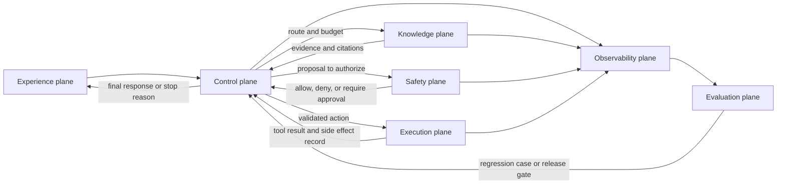

# Agentic System Architecture

Un agentic system es más que una llamada a un model envuelta en un loop. Es un conjunto de control planes, execution planes, data planes y safety planes que permiten que el software use el juicio del model sin perder el control de ingeniería.

Usa este capítulo cuando un solo pattern no es suficiente y necesitas combinar agents, tools, memory, policies, workflows, evals y observability en un solo sistema coherente.

Este capítulo define la composición y los límites de responsabilidad. No prescribe un framework específico ni reimplementa cada plane. Los capítulos especializados cubren el control del loop, tools, memory, workflows, seguridad, evaluación y operación en runtime.

Cuando los agents cruzan límites de proceso, equipo, runtime o propiedad, trátalos como servicios con contratos explícitos. Consulta [Agents As Services](./agents-as-services) para esa arquitectura.

Descarga la [agentic system architecture review checklist](/capstone-assets/templates/agentic-system-architecture-review-checklist.txt) cuando conviertas este capítulo en un ADR, design review o capstone review.

## Core Idea

Separa el sistema en planes:

- **Experience plane:** chat, IDE, API, webhook, ticket, móvil o punto de entrada programado.
- **Control plane:** routing, planificación, permisos, presupuestos, aprobaciones, task state y condiciones de parada.
- **Execution plane:** tools, ejecución de código, acciones en navegador, llamadas a API, workflows y efectos secundarios externos.
- **Knowledge plane:** retrieval, memory, índices, metadatos, frescura de la fuente y citas.
- **Evaluation plane:** evals offline, verificaciones en runtime, verificadores, pruebas red-team y datasets de regresión.
- **Observability plane:** traces, costos, latencia, llamadas a tools, entradas al model, decisiones y revisión de operadores.


Los planes deben tener owners definidos. Si el mismo prompt es dueño de la planificación, policy, escrituras en memory, autoridad sobre tools, comportamiento de reintentos y mensajes al usuario, el sistema no tiene una arquitectura real. Solo tiene un model con autoridad amplia.

## Plane Ownership Matrix

Usa esta tabla durante la revisión de diseño.

| Plane | Primary Owner | What It Must Decide | Evidence |
| --- | --- | --- | --- |
| Experience | product surface o API gateway | quién inicia la ejecución, qué ve el usuario, qué requiere confirmación | flujo de UI, contrato de API, texto de aprobación |
| Control | runtime, workflow engine o application service | goal state, routing, presupuestos, condiciones de parada, reintentos, escalamiento | state machine, workflow graph, timeout policy |
| Execution | tool gateway, service adapters, sandbox | qué acciones pueden ejecutarse y con qué autoridad | tool manifest, permission map, idempotency keys |
| Knowledge | retrieval service, memory service, data platform | qué evidencia puede entrar al context y qué puede persistir | index policy, memory policy, citation records |
| Evaluation | test harness y release gate | qué nivel de calidad bloquea el release | eval fixtures, thresholds, CI output |
| Observability | platform y operations team | cómo se reconstruye una ejecución fallida | trace schema, dashboards, redaction proof |
| Safety | policy service y ruta de aprobación humana | qué acciones se niegan, permiten o escalan | policy rules, approval records, audit logs |

Esta matriz previene la propiedad vaga. Un capítulo, framework o equipo puede ser dueño de un plane, pero el sistema en producción debe nombrar al owner.

## Runtime Plane Flow

Los planes interactúan en cada ejecución seria. El experience plane inicia el trabajo, el control plane decide la ruta, el safety plane otorga o niega autoridad, y los execution y knowledge planes devuelven evidencia. Evaluation y observability envuelven todo el recorrido.



Usa el flujo para encontrar contratos faltantes. Si una ejecución puede pasar de control a execution sin safety, el sistema tiene autoridad oculta. Si execution devuelve un efecto secundario sin observability, la revisión de incidentes será especulación. Si evaluation nunca recibe traces, los fallos en producción no se convertirán en gates de release.

## Architecture Questions

- ¿Quién es dueño del goal?
- ¿Quién es dueño del state?
- ¿Quién puede invocar tools?
- ¿Qué requiere aprobación?
- ¿Qué pasa cuando falta evidencia?
- ¿Qué pasa cuando el model se equivoca?
- ¿Qué se puede replay después de una falla?
- ¿Qué es determinista y qué está mediado por el model?

El sistema debe tener respuestas directas a esas preguntas antes de manejar datos privados, movimiento de dinero, infraestructura de producción o comunicación con clientes.

Agrega estas preguntas para la revisión de producción:

- ¿Qué componente puede detener una ejecución?
- ¿Qué componente puede reanudar una ejecución?
- ¿Qué componente puede escribir en memory?
- ¿Qué componente puede modificar registros visibles para el usuario?
- ¿Qué componente puede gastar dinero, enviar mensajes, desplegar código o cambiar permisos?
- ¿Qué componente prueba que se realizó un policy check antes de usar autoridad?
- ¿Qué componente convierte incidentes en casos de eval?

Si la respuesta es "el model decide", limita el rol del model. Permite que proponga. Deja que el software valide, autorice, ejecute y registre.

## Boundary Design

La decisión arquitectónica más importante es el límite entre el juicio del model y el software determinista. Mantén las salidas del model como propuestas hasta que el software las valide.

Límites fuertes se ven como tool schemas tipados, policy checks antes de efectos secundarios, transiciones de state explícitas, aprobación humana para operaciones de alto riesgo, filtros de retrieval y citas, límites de presupuesto y tiempo, y audit logs que conectan el prompt, la decisión, la entrada al tool y el resultado. Límites débiles se ven como acceso amplio a shell o navegador sin aprobación, enforcement de policy solo en el prompt, escrituras en memory no estructuradas, reintentos ocultos, resultados de tools que no pueden ser trazados y agents que pueden reescribir sus propias reglas operativas sin revisión.

## Composition Contract

Todo agentic system serio necesita un composition contract escrito. Puede vivir en un ADR, service contract o runtime config, pero debe responder las mismas preguntas.

```ts
type AgenticSystemContract = {
  systemId: string;
  owner: string;
  userEntrypoints: string[];
  supportedGoals: string[];
  stateOwner: "application" | "workflow-engine" | "agent-runtime" | "external-service";
  toolAuthority: Array<{
    toolName: string;
    capability: "read" | "draft" | "write" | "execute";
    approval: "none" | "human" | "policy" | "human-and-policy";
    idempotencyRequired: boolean;
  }>;
  knowledgeSources: Array<{
    source: string;
    freshnessRule: string;
    accessRule: string;
    citationRequired: boolean;
  }>;
  memoryPolicy: {
    canWrite: boolean;
    writeOwner: string;
    retention: string;
    deletionPath: string;
  };
  evalGate: {
    dataset: string;
    blockingThresholds: string[];
    requiredBeforeRelease: boolean;
  };
  observability: {
    traceId: string;
    redactionPolicy: string;
    replaySupported: boolean;
  };
  rollback: {
    disableModel: string;
    disableTool: string;
    disableWorkflow: string;
  };
};
```

El tipo exacto importa menos que la disciplina. Un revisor debe poder leer el contrato y saber qué puede hacer el sistema, quién es dueño de cada límite y cómo el equipo prueba que funcionó.

## Build Sequence

Construye el sistema en cortes verticales delgados.

1. Comienza con el workflow visible para el usuario y define el goal más pequeño y valioso.
2. Agrega state determinista antes de agregar memory o comportamiento multi-agent.
3. Agrega un tool de solo lectura y traza cada llamada.
4. Agrega retrieval solo después de que las reglas de acceso y los requisitos de cita estén claros.
5. Agrega un tool con capacidad de escritura detrás de policy, aprobación e idempotencia.
6. Agrega eval fixtures para ejecuciones exitosas, casos de rechazo, evidencia faltante, policy denial, fallas de tools y rollback.
7. Agrega reintentos y recuperación solo después de que el trace pueda explicar la primera falla.
8. Agrega topología multi-agent solo cuando un solo agent genere propiedad poco clara o baja calidad.

Este orden mantiene el sistema inspeccionable. También le da al equipo un producto funcional antes de que la arquitectura crezca.

## Ejemplo: Support Refund Agent

Un support refund agent puede parecer simple: leer un ticket, inspeccionar órdenes, decidir si se permite un reembolso y redactar una respuesta. En producción, ese workflow cruza varios planos.

| Paso | Plano | Propietario | Control |
| --- | --- | --- | --- |
| El cliente solicita un reembolso | experience | soporte UI | usuario autenticado y ticket context |
| Runtime crea goal | control | workflow service | run ID, tenant ID, timeout, stop condition |
| Agent lee policy | knowledge | retrieval service | policy index por tenant con citas |
| Agent lee orden | execution | order API adapter | tool de solo lectura con trace record |
| Agent propone reembolso | control | application service | objeto de decisión estructurado |
| Policy revisa propuesta | safety | policy service | monto, motivo, región, estado del cliente |
| Humano aprueba caso especial | safety | support supervisor | registro de aprobación con expiración |
| Se ejecuta el reembolso | execution | payment adapter | idempotency key y nota de rollback |
| Se cierra la ejecución | observability | plataforma | trace, costo, tool calls, policy result |
| Caso fallido entra a evals | evaluation | equipo de ingeniería | regression fixture y release gate |

Esta arquitectura no confía al model el movimiento de dinero. El model lee evidencia y propone una acción. El software revisa la propuesta, registra la decisión y controla el efecto secundario.

## Antes y Después de la Revisión de Arquitectura

Un diseño débil suele sonar conciso:

```text
Give the agent the customer ticket, policy docs, order API, refund API, and email tool.
Ask it to solve the case end to end.
```

Ese esquema esconde la arquitectura dentro del prompt. Los revisores no pueden ver quién controla el tenant scope, la frescura de la fuente, la autoridad para reembolsos, la aprobación, la seguridad de reintentos, la memory o el incident replay.

Usa esta tabla de revisión para convertir el esquema en un sistema.

| Decisión de Diseño Débil | Riesgo Oculto | Reescritura para Producción |
| --- | --- | --- |
| Un agent recibe todas las tools. | La autoridad de lectura y escritura se fusionan en un solo rol. | Separa tools de lectura, tools de borrador y tools de efecto secundario bajo permisos distintos. |
| Policy docs son solo prompt context. | Una policy obsoleta o incorrecta puede causar acciones que afectan al cliente. | Recupera policy desde una fuente controlada por acceso con versión, propietario y cita. |
| El model decide si se permite el reembolso. | La autoridad de negocio queda en texto generado. | El model propone una recomendación; policy service valida umbral, región, estado y reglas de excepción. |
| El llamado al reembolso ocurre dentro del loop. | Un reintento o falla puede duplicar el movimiento de dinero. | Payment adapter requiere registro de aprobación, idempotency key y trace de efecto secundario. |
| El email se envía después de la respuesta final. | El cliente ve lenguaje no soportado o no aprobado. | El model redacta el email; runtime revisa evidencia, tono, policy y estado de aprobación antes de enviar. |
| Memory almacena el resultado automáticamente. | Memory incorrecta o sensible puede persistir entre sesiones. | La escritura en memory es clasificada, revisada por policy y ligada a reglas de retención y eliminación. |
| Logs son texto plano. | Los operadores no pueden reconstruir por qué ocurrió la acción. | Trace enlaza goal, evidencia, propuesta del model, decisión de policy, aprobación, tool call y motivo de detención. |

El diseño más seguro sigue siendo agentic. El model maneja ambigüedad, síntesis y recomendaciones. La arquitectura controla autoridad, evidencia, state y recuperación.

## Evidencia para Lanzamiento

Para una revisión de arquitectura, exige artifacts en lugar de garantías.

| Artifact | Contenido Mínimo | Pregunta del Revisor |
| --- | --- | --- |
| Mapa de propiedad de planos | propietarios para experience, control, execution, knowledge, evaluation, observability y safety | ¿A quién se contacta cuando falla este límite? |
| Contrato de composición | goals soportados, propietario de state, autoridad de tool, fuentes de knowledge, memory policy, eval gate, rollback | ¿Puede el model hacer algo fuera de este contrato? |
| Trace de camino exitoso | una ejecución exitosa desde el entrypoint hasta el estado final | ¿Podemos probar que el camino esperado funciona? |
| Trace de acción denegada | un intento bloqueado de tool, retrieval, memory o aprobación | ¿Podemos probar que la autoridad se aplica antes de la acción? |
| Trace de evidencia faltante | una ejecución que rechaza, pregunta o escala | ¿Podemos probar que el sistema no inventa soporte? |
| Simulación de rollback | feature flag, switch de desactivación o fallback de enrutamiento | ¿Pueden los operadores detener el comportamiento riesgoso rápidamente? |
| Regression gate | eval cases ligados a riesgos conocidos | ¿La próxima versión detectará la misma falla? |

Si un equipo no puede adjuntar estos artifacts, el diseño no está listo para uso en producción general. Puede seguir siendo un prototipo o piloto interno, pero su etiqueta de lanzamiento debe indicarlo.

## Mapeo de Frameworks

Los frameworks pueden ayudar, pero no eliminan la necesidad de límites claros.

| Necesidad de Arquitectura | Soporte Común de Framework | Lo que la Aplicación Sigue Controlando |
| --- | --- | --- |
| state graph | LangGraph, workflow engines, durable runtimes | state schema de dominio y reglas de migración |
| agent collaboration | AutoGen, CrewAI, topología de servicios personalizada | límites de roles y autoridad de decisión final |
| tool discovery | MCP, tool registries, framework tool APIs | permisos, secretos, policy e idempotency |
| retrieval | vector stores, RAG frameworks, search APIs | acceso a fuentes, frescura, citas, eliminación |
| memory | framework memory stores o almacenes personalizados | política de escritura, corrección, retención, control de usuario |
| evals | test harnesses, judges, CI scripts | datasets, umbrales, reglas de lanzamiento |
| observability | tracing SDKs y logs de plataforma | redacción, reconstrucción de ejecución, incident workflow |

Usa las funciones del framework donde refuercen el límite. No dejes que la conveniencia del framework oculte policy, propiedad o state.

## Patrones de Composición

Los sistemas de producción comunes combinan varios capítulos de este libro:

- **Agent Loop** para ciclos acotados de observar-decid-actuar.
- **Goals and State** para reanudabilidad y auditoría.
- **MCP-first Tool Use** para tools descubribles.
- **Agentic RAG Systems** para respuestas fundamentadas en evidencia.
- **Production Runtime Overview** para el control plane alrededor de state, policy, presupuestos, traces, evals y decisiones de detención.
- **Durable Workflows** para state de larga duración, reintentos y aprobaciones.
- **Observability and Evals** para filtros de calidad y control de regresiones.
- **Policy Enforcement** para revisiones de permisos y cumplimiento.
- **Agents As Services** para límites de servicio, contratos, protocolos, reintentos y correlación de trace entre agents.

## Lista de Verificación para Revisión de Arquitectura

Un diseño está listo para construir cuando los revisores pueden responder sí a estos puntos:

- El sistema tiene un propietario nombrado y un responsable de incidentes.
- Cada plano tiene un propietario nombrado y un artifact de evidencia.
- El model propone acciones mediante structured outputs.
- Código determinista valida los structured outputs antes de efectos secundarios.
- Tools de lectura, escritura y ejecución tienen permisos separados.
- Acciones de alto riesgo requieren policy, aprobación o ambos.
- Las fuentes de retrieval tienen reglas de acceso, frescura y citas.
- Las escrituras en memory tienen policy, periodo de retención y ruta de eliminación.
- El state puede inspeccionarse después de una falla.
- Una ejecución puede correlacionarse entre prompts, tool calls, policy checks, aprobaciones y efectos secundarios.
- Evals cubren éxito, rechazo, evidencia faltante, denegación de policy, falla de tool, replay y rollback.
- Rollback puede deshabilitar el model, una tool, un workflow o un agent sin reimplementar todo el sistema.

## Modos de Falla

Las fallas recurrentes son fáciles de nombrar. El model se convierte en el control plane y ningún componente determinista controla state o permisos. Todos los patterns se agregan a la vez, produciendo un sistema poderoso pero imposible de depurar. Retrieval, memory y tool output se mezclan en un solo context no confiable. El sistema no tiene ruta de replay después de una mala acción. Los evals aparecen solo después de la primera falla en producción, en vez de antes del lanzamiento.

Otras fallas aparecen después. Un equipo deja que memory se convierta en una base de datos oculta sin ruta de corrección. Los tool adapters aceptan instrucciones amplias en lenguaje natural en vez de entradas tipadas. La lógica de reintentos repite efectos secundarios sin idempotency keys. Un framework controla el state de una manera que la aplicación no puede inspeccionar. Una demo exitosa se convierte en un lanzamiento de producción sin threat modeling, redacción o rollback.

## Preguntas para la Revisión de Diseño

Haz estas preguntas antes de la implementación:

- ¿Qué decisión de negocio toma o respalda este sistema?
- ¿Cuál es el nivel de autonomía útil más estrecho?
- ¿Qué evidencia debe estar presente antes de que el model pueda responder?
- ¿Qué acción es demasiado riesgosa para ejecución autónoma?
- ¿Qué resultado de tool puede contaminar el razonamiento posterior si se acepta sin revisión?
- ¿Qué transición de state nunca debe depender solo de texto generado?
- ¿Qué trace necesitaría un operador durante un incidente en producción?
- ¿Qué eval habría detectado la falla más probable y vergonzosa?
- ¿Qué feature flag desactiva primero la parte riesgosa?
- ¿Qué capítulo futuro o ADR debe controlar la próxima expansión?

## Regla de diseño

La arquitectura debe hacer visible el fallo. Si una ejecución falla, un operador debe poder responder: qué goal estaba activo, qué evidencia se usó, qué tool calls se ejecutaron, qué policy checks pasaron, qué cambió y por qué el sistema se detuvo.

Usa [Reference Architecture](./reference-architecture) para convertir estos planos en una forma concreta de despliegue. Luego usa [Production Runtime Overview](../production-runtime/overview) para definir los controles que ejecutan y operan cada ejecución.

## Capítulos relacionados

- [Agent Loop](../foundations/agent-loop)
- [Goals and State](../foundations/goals-and-state)
- [MCP-first Tool Use](../tools-skills-protocols/mcp-first-tool-use)
- [Agents As Services](./agents-as-services)
- [Agentic RAG Systems](./agentic-rag-systems)
- [Reference Architecture](./reference-architecture)
- [Production Runtime Overview](../production-runtime/overview)
- [Durable Workflows](../production-runtime/durable-workflows)
- [Observability and Evals](../production-runtime/observability-and-evals)
