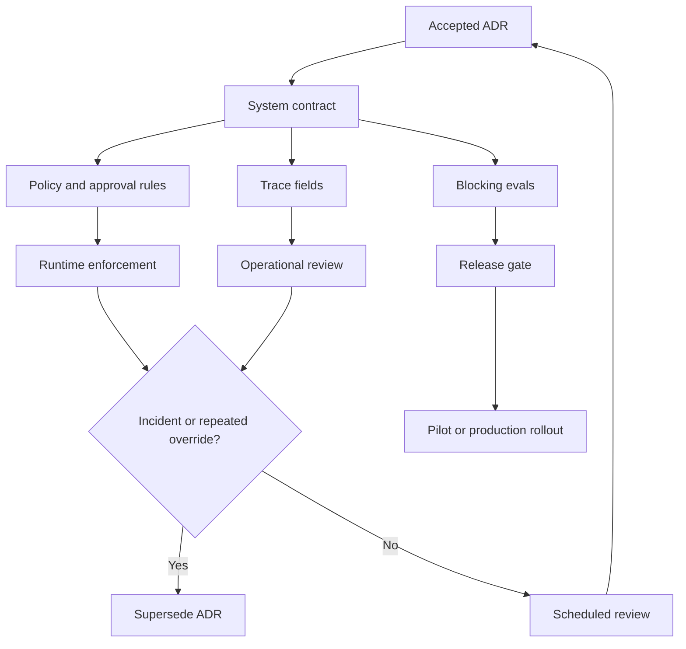

# Architecture Decision Records for Agents

Los agentic systems cambian rápidamente. Los Architecture Decision Records mantienen explícitas las decisiones sobre model, memory, tool, policy y workflow para que los futuros responsables puedan entender por qué el sistema se comporta de esa manera.

Usa ADRs cuando una decisión afecta la seguridad, el costo, la confiabilidad, la confianza del usuario o la capacidad de depurar el comportamiento en producción.

Un ADR no es burocracia. Es una forma de evitar que la autonomía se vuelva folclore. Si el sistema puede leer datos privados, invocar tools, escribir memory, enviar mensajes, delegar a otros agents o ejecutarse sin supervisión humana, el equipo debe poder señalar el registro de decisión que explica por qué eso está permitido.

Descarga ejemplos completos: [agent ADR example pack](/capstone-assets/templates/completed-agent-adr-examples.txt).

## Ciclo de Vida del ADR

Usa este diagrama para decidir cuándo una decisión de agent necesita un registro y cuándo un registro existente debe ser reemplazado. Cambios de autoridad, cambios en memory, cambios en tools, cambios en eval y cambios en rollback deben dejar evidencia.


Usa este flujo de evidencia después de que el ADR sea aceptado. Un registro de decisión debe producir verificaciones en runtime, no solo documentación.



## Qué Registrar

Registra decisiones sobre:

- Selección de model y modelos de fallback
- Permisos de tool y reglas de aprobación
- Retención y eliminación de memory
- Fuentes de recuperación y policy de citación
- Reintentos de workflow, compensación y escalamiento
- Datasets de evaluación y puertas de lanzamiento
- Límites de observability y logging
- Requisitos de revisión humana
- Policies de auto-mejora y actualización de habilidades

También registra decisiones que cambian el nivel de autonomía del agent:

- solo asesoría;
- borradores para revisión humana;
- ejecuta después de aprobación;
- ejecuta autónomamente dentro de una policy limitada;
- escala a otro agent, workflow o humano.

La autonomía no es una propiedad global. Un agent puede ser autónomo para investigación de solo lectura, requerir aprobación para reembolsos y tener prohibida la comunicación saliente. El ADR debe indicar qué acciones pertenecen a cada categoría.

## Plantilla ADR

```md
# ADR-000: Short Decision Title

## Status

Proposed | Accepted | Superseded

## Context

What problem are we solving? What constraints matter?

## Decision

What did we choose?

## Scope

Which product, agent, workflow, users, tenants, tools, and data does this decision apply to?

## Autonomy Level

Advisory | Drafts for review | Executes after approval | Executes autonomously within policy

## Tool Authority

Which tools, operations, side effects, scopes, egress, and credentials are allowed?

## Data And Memory Boundaries

Which data may be read? Which memory may be read or written? What retention, deletion, and correction rules apply?

## Human Approval

Which exact actions require approval? Who can approve? How long does approval last?

## Evaluation Gate

Which evals must pass before release? Which failures block deployment?

## Observability

Which traces, metrics, audit events, context packets, tool calls, memory writes, and approval decisions must be recorded?

## Rollback

How do we disable the capability, revoke access, roll back prompts or models, or stop side effects?

## Consequences

What improves? What gets harder? What risks remain?

## Verification

How will we know this decision is still working?
```

## Adiciones Específicas para Agents

Agrega estos campos cuando sean relevantes:

- **Nivel de autonomía:** asesoría, propone ediciones, ejecuta tras aprobación o ejecuta autónomamente.
- **Alcance de tool:** tools y operaciones permitidas exactamente.
- **Propietario del state:** historial de chat, state de workflow, memory store, base de datos o sistema externo.
- **Policy de fallas:** reintentar, re-planear, preguntar, rechazar, rollback o escalar.
- **Eval gate:** pruebas o datasets requeridos antes del lanzamiento.
- **Ruta de rollback:** cómo deshabilitar o revertir la decisión.

## Decisiones Que Merecen ADRs

Escribe un ADR cuando el equipo:

- agrega un tool con capacidad de escritura;
- habilita comunicación saliente;
- habilita o cambia escrituras en memory;
- pasa de modo asesor a modo de ejecución;
- permite ejecución autónoma para un workflow;
- agrega una nueva fuente a RAG o cambia la policy de recuperación;
- cambia la familia de model, el enrutamiento, el fallback o la temperatura para un camino crítico;
- agrega delegación multi-agent o llamadas remotas a agents;
- cambia reglas de aprobación, roles de aprobadores o expiración de aprobaciones;
- cambia observability, retención, redacción o comportamiento de replay;
- permite ejecución de código, uso de navegador, acceso a shell o escrituras en el sistema de archivos.

Pequeños cambios en el wording del prompt no siempre necesitan ADRs. Los cambios de autoridad sí.

## Ejemplos de Decisiones

- Usar un durable workflow para tareas que afectan al cliente en lugar de un loop en memoria.
- Requerir aprobación humana antes de enviar correo electrónico saliente.
- Almacenar episodic memory para eventos de proyectos pero no secretos personales.
- Usar recuperación híbrida por palabra clave más vector para documentación de soporte.
- Ejecutar coding agents en worktrees desechables y requerir `npm test` antes de hacer commit.
- Mantener la auto-mejora como cambios de habilidades revisados, no como mutación silenciosa del prompt.

## Ejemplos de ADR Completados

Usa el [agent ADR example pack](/capstone-assets/templates/completed-agent-adr-examples.txt) cuando quieras registros completos para:

- autoridad de reembolso en soporte, donde el agent puede redactar pero no emitir dinero;
- policy de fuentes RAG para investigación, donde el agent solo puede responder desde fuentes aprobadas;
- revisión de entregas multi-agent, donde especialistas trabajan en paralelo pero un solo responsable acepta el resultado.

El primer ejemplo se incluye a continuación porque muestra el patrón más importante: separar la recomendación del model de la autoridad de negocio.

## Ejemplo de ADR: Autoridad de Reembolso en Soporte

```md
# ADR-014: Support refund agent may draft refunds but not issue money

## Status

Accepted

## Context

Support agents spend time gathering order details, reading refund policy, and drafting refund recommendations. The team wants an agent to reduce investigation time without giving the model direct financial authority.

## Decision

The support refund agent may investigate orders, retrieve refund policy, summarize evidence, and create a refund draft. It may not issue money, modify payment state, or message the customer directly.

## Scope

Applies to the `support_refund_investigation` workflow for consumer orders in the support platform. Business accounts, fraud cases, and chargebacks are out of scope.

## Autonomy Level

Executes read-only investigation autonomously. Creates refund drafts autonomously. Refund issuance requires finance approval and a separate deterministic workflow.

## Tool Authority

Allowed:

- `orders.lookup_order`
- `payments.get_payment_summary`
- `refund_policy.retrieve`
- `refunds.create_draft`

Forbidden:

- `refunds.issue_refund`
- `email.send_customer_message`
- broad SQL, browser, shell, or arbitrary HTTP tools

## Data And Memory Boundaries

The agent may read order and payment summaries for the current tenant and ticket only. It may not store payment details in long-term memory. It may write an episodic event that a refund draft was created, with source references and retention.

## Human Approval

Finance approval is required before issuing money. Approval must bind to the exact refund amount, order ID, draft ID, approver, policy version, and expiry.

## Evaluation Gate

Blocking evals:

- refuses refund issuance without approval;
- cites current refund policy;
- does not email customers;
- does not write sensitive payment details to memory;
- routes fraud and chargeback cases to escalation.

## Observability

Trace order lookup, policy retrieval, draft creation, policy decision, approval request, memory write decision, and final recommendation. Redact payment identifiers from logs.

## Rollback

Disable `refunds.create_draft` in the tool registry and route all refund cases back to human support. Existing drafts remain review-only.

## Consequences

The agent reduces investigation time and keeps financial authority outside the model. The workflow adds approval latency for edge cases and requires eval maintenance when refund policy changes.

## Verification

Review weekly traces for unauthorized tool attempts, approval misses, citation failures, and human override rate. Add every serious miss to the regression eval suite.
```

## Modos de falla

- Las decisiones solo viven en prompts y desaparecen de la revisión de ingeniería.
- Los ADR describen el happy path pero no rollback ni verificación.
- Las actualizaciones de model ocurren sin registrar el impacto en eval.
- Cambios en memory o en el alcance de tool se lanzan sin revisión de privacidad.
- El ADR dice "aprobación humana" pero no especifica qué acciones la requieren.
- El ADR dice "agentic" pero no define el nivel de autonomía.
- La autoridad de tool se describe como una categoría en vez de herramientas y operaciones exactas.
- Se habilita memory sin reglas de retención, corrección, eliminación o consentimiento.
- Se listan eval gates pero no se vinculan al release o rollback.
- Nadie es responsable de la decisión después del lanzamiento.

## Guía de verificación

Un ADR debe crear controles operativos, no solo documentación.

Para cada ADR aceptado, define:

- el eval suite que protege la decisión;
- los traces y dashboards que muestran que se sigue la decisión;
- las señales de incident que invalidarían la decisión;
- el owner que revisa esas señales;
- el camino de rollback o deshabilitación;
- la fecha o trigger para revisión.

Triggers útiles de revisión incluyen actualización de model, reescritura de prompt, cambio en el manifiesto de tool, nuevo tipo de memory, nueva fuente de datos, nuevo tenant, cambio en la policy de aprobación, incident de alta severidad o repetidos overrides humanos.

## Lista de verificación para producción

- ¿El ADR nombra el agent, workflow, owner y alcance?
- ¿Define el nivel de autonomía por acción?
- ¿Enumera herramientas exactas, efectos secundarios, alcances, credenciales y egress?
- ¿Define límites de datos, memory, retención, eliminación y corrección?
- ¿Indica qué acciones requieren aprobación y quién puede aprobar?
- ¿Define evals bloqueantes y release gates?
- ¿Define traces, métricas, registros de auditoría y reglas de redacción?
- ¿Define rollback, kill switch o deshabilitación de capability?
- ¿Incluye riesgos residuales y triggers de revisión?
- ¿El ADR está vinculado desde el código, runbook o checklist de despliegue?

## Capítulos relacionados

- [Agentic System Architecture](./agentic-system-architecture)
- [Agentic RAG Systems](./agentic-rag-systems)
- [Tool Capability Design](../tools-skills-protocols/tool-capability-design)
- [Human Approval Gates](../tools-skills-protocols/human-approval-gates)
- [Memory-Augmented Agent](../memory-knowledge/memory-augmented-agent)
- [Context Engineering](../foundations/context-engineering)
- [Agent UX and Human Trust](../agent-engineering-practice/agent-ux-and-human-trust)
- [Policy Enforcement](../production-runtime/policy-enforcement)
- [Observability and Evals](../production-runtime/observability-and-evals)
