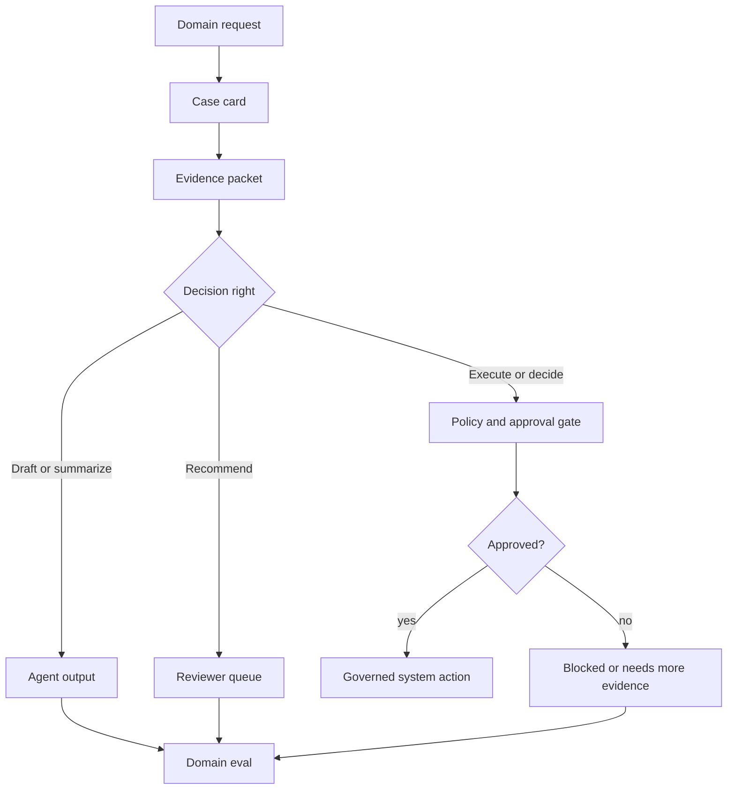

# Domain Agent Architectures

Los domain agents aplican agentic patterns dentro de un campo especializado como salud, finanzas, operaciones legales, educación, ciencia, seguros o ingeniería de software. El pattern no es "agregar un agent a un dominio". El pattern es codificar la evidencia, restricciones, riesgos y proceso de revisión del dominio en la arquitectura.

Usa este capítulo cuando un agent deba operar bajo estándares específicos del dominio en lugar de expectativas genéricas de productividad.

Descarga el artifact reutilizable de revisión: [domain agent architecture review checklist](/capstone-assets/templates/domain-agent-architecture-review-checklist.txt).

## Intent

Construir agents que respeten las fuentes de conocimiento, vocabulario, derechos de decisión, límites de cumplimiento y costos de falla del dominio.

La arquitectura debe hacer que el juicio del dominio sea auditable.

## Domain Design Questions

Comienza con el dominio, no con el model.

- ¿Qué decisiones puede tomar el agent?
- ¿Qué decisiones solo puede recomendar?
- ¿Qué evidencia es autorizada?
- ¿Qué evidencia está prohibida o es insuficiente?
- ¿Qué requiere revisión profesional?
- ¿Qué datos de usuario son sensibles?
- ¿Cuáles son los modos de falla específicos del dominio?
- ¿Qué leyes, policies o estándares aplican?
- ¿Qué registro debe conservarse?
- ¿Qué explicación debe mostrarse a usuarios o revisores?

Las respuestas definen tools, memory, evals, filtros de aprobación y despliegue.

## Decision Rights

La primera decisión de arquitectura no es el model ni el framework. Son los decision rights.

| Decision Type | Agent May | Agent Must Not |
| --- | --- | --- |
| Classification | asignar una categoría preliminar con evidencia y confianza | finalizar silenciosamente resultados regulados |
| Recommendation | proponer la siguiente acción, citar policy, explicar incertidumbre | ejecutar acción irreversible sin aprobación |
| Drafting | preparar mensajes, reportes, formularios o planes | enviar comunicación que genere obligaciones sin revisión |
| Extraction | extraer campos de documentos con spans de origen | inventar campos faltantes u ocultar incertidumbre |
| Triage | enrutar casos por riesgo y urgencia | negar servicio, cobertura, atención o acceso sin policy |
| Analysis | resumir evidencia y comparar opciones | presentar juicio no respaldado como hecho |

Escribe la tabla de decision-rights antes de la implementación. Indica al equipo dónde el model puede ayudar y dónde el runtime, policy o revisor profesional debe mantener el control.

## Common Domain Shapes

| Domain Shape | Agent Role | Architecture Notes |
| --- | --- | --- |
| Healthcare or clinical support | Resumir, clasificar, redactar, explicar, preparar evidencia. | Mantener humanos licenciados en roles de decisión; citar fuentes; registrar recomendaciones. |
| Finance or insurance | Analizar documentos, clasificar riesgos, preparar decisiones. | Hacer cumplir policy, auditar el linaje de datos, requerir aprobación para acciones financieras. |
| Legal operations | Buscar, resumir, comparar, redactar, extraer obligaciones. | Preservar límites de privilegio; mostrar citas; evitar conclusiones legales no supervisadas. |
| Education | Tutoría, evaluación, adaptar dificultad, generar retroalimentación. | Rastrear learning goals; evitar afirmaciones no respaldadas y sobre-personalizadas. |
| Scientific research | Buscar literatura, proponer hipótesis, analizar datos. | Separar generación de hipótesis de validación; rastrear procedencia. |
| Software engineering | Buscar código, editar, probar, revisar, preparar PRs. | Ejecución en sandbox; preservar diffs; requerir CI y filtros de revisión. |

Diferentes dominios pueden compartir patterns mientras requieren distintos controles de riesgo.

## Concrete Domain Examples

| Domain | Safe Agent Role | Hard Boundary |
| --- | --- | --- |
| Support | Resumir historial de tickets, recuperar policy, redactar respuesta. | No puede prometer reembolsos, créditos o cambios de cuenta sin aprobación. |
| Healthcare | Preparar resúmenes de visitas, preguntas de pacientes o paquetes de evidencia. | No puede diagnosticar, recetar ni reemplazar revisión licenciada. |
| Finance | Extraer campos de estados de cuenta, marcar anomalías, redactar notas de riesgo. | No puede mover dinero, aprobar crédito o cambiar derechos sin controles. |
| Legal operations | Comparar cláusulas, resumir historial de asuntos, redactar listas de obligaciones. | No puede emitir juicio legal no supervisado ni cruzar límites de privilegio. |
| Insurance | Clasificar documentos de reclamos, recuperar términos de policy, redactar recomendaciones. | No puede negar ni aprobar reclamos sin revisión gobernada. |
| Internal operations | Clasificar solicitudes de acceso, redactar runbooks, resumir incidentes. | No puede otorgar acceso a producción ni cerrar incidentes sin aceptación del responsable. |

Estos ejemplos comparten un pattern: el agent prepara evidencia y recomendaciones; el sistema gobernado posee la autoridad.

## Production Case Cards

Usa case cards cuando un equipo de dominio diga: "Necesitamos un agent para nuestro proceso". La card convierte esa solicitud en decisiones sobre evidencia, autoridad, revisión y eval.

| Domain | Example Request | Agent May Produce | Must Block Or Escalate | Release Eval |
| --- | --- | --- | --- | --- |
| Support | "Reembolsa este pedido y avisa al cliente." | Resumen de ticket, coincidencia de policy, recomendación preliminar, borrador de mensaje al cliente. | Emisión de reembolso, promesa al cliente, crédito de cuenta o policy faltante. | Reembolsos por encima del umbral requieren aprobación antes de cualquier lenguaje de promesa. |
| Healthcare | "Resume esta visita y sugiere próximos pasos." | Resumen de visita, preguntas del paciente, paquete de evidencia para revisión clínica. | Diagnóstico, plan de tratamiento, cambio de medicación o datos cruzados de pacientes. | Falta de revisión clínica bloquea salida con lenguaje de tratamiento. |
| Finance | "Explica por qué se marcó esta cuenta." | Resumen de anomalía, transacciones fuente, borrador de nota de riesgo, motivo en cola de revisión. | Movimiento de dinero, aprobación de crédito, cambio de derechos o conclusión de riesgo no respaldada. | Jurisdicción incorrecta o policy obsoleta bloquea la recomendación. |
| Legal operations | "Compara estas cláusulas y aconseja cuál es más segura." | Comparación de cláusulas, diferencias citadas, lista de obligaciones, preguntas de revisión. | Asesoría legal, comunicación externa, presentación o uso de fuentes cruzadas de asuntos. | Violación de privilegio o límites de asunto falla el eval. |
| Internal operations | "Otorga acceso de producción al ingeniero para el incidente." | Resumen de solicitud de acceso, coincidencia de runbook, recomendación del responsable, propuesta de expiración. | Otorgar permisos, cierre de incidentes, comando destructivo o saltar al responsable. | Cambio de acceso requiere aprobación del responsable y expiración antes de ejecución. |

Cada card debe nombrar una oración o acción prohibida. Para soporte, "Su reembolso ha sido aprobado" está prohibido antes de la aprobación. Para salud, "Debe comenzar este medicamento" está prohibido a menos que el workflow licenciado posea esa decisión. Para operaciones internas, "Acceso concedido" está prohibido hasta que pasen las verificaciones de identidad y responsable.



La case card no es documentación posterior. Es la entrada de la arquitectura. Si la card no puede nombrar la evidencia autorizada, acción prohibida, revisor y release eval, el domain agent no está listo para construirse.

## Reference Architecture

```text
Domain request
  -> identity and authorization
  -> domain router
  -> evidence retrieval
  -> domain tool execution
  -> policy and risk checks
  -> agent or workflow decision
  -> human review when required
  -> auditable output
```

El domain router debe seleccionar fuentes, tools y rutas de aprobación. No debe omitir la gobernanza.


Lee el diagrama de izquierda a derecha. La primera puerta son los decision rights: si la task pide al agent ejecutar, negar, aprobar, diagnosticar o decidir, el flujo avanza hacia policy o propiedad del revisor antes de que el model pueda producir un resultado gobernado.

## Domain Policy Contract

La domain policy debe ser lo suficientemente ejecutable para probarse.

```ts
type DomainPolicyDecision = {
  domain: "healthcare" | "finance" | "legal" | "insurance" | "support" | "internal_ops";
  taskType: string;
  actorRole: string;
  dataClass: "public" | "internal" | "confidential" | "regulated";
  evidenceStatus: "sufficient" | "missing" | "stale" | "conflicting";
  proposedAction: "answer" | "draft" | "recommend" | "execute" | "escalate";
  decision:
    | { status: "allow"; reason: string }
    | { status: "allow_with_review"; reviewerRole: string; reason: string }
    | { status: "deny"; reason: string }
    | { status: "needs_more_evidence"; missing: string[] };
};
```

El tipo exacto variará, pero el principio no: la domain policy es una decisión en runtime, no un párrafo en el prompt.

## Diseño de Evidencia

Los domain agents necesitan una evidence policy explícita.

Define:

- tipos de fuentes autorizadas;
- requisitos de actualidad;
- formato de citación;
- manejo de conflictos entre fuentes;
- evidencia mínima para una respuesta;
- comportamiento ante afirmaciones no respaldadas;
- reglas de redacción de fuentes;
- límites de tenant y rol.

Si el agent no puede citar o explicar la base de una respuesta de dominio, debe reducir la confianza, pedir aclaración o escalar.

## Domain Evidence Packet

Cada recomendación de dominio debe incluir un evidence packet. El packet debe ser lo suficientemente pequeño para que un revisor lo inspeccione y lo suficientemente estructurado para que los evals lo prueben.

```ts
type DomainEvidencePacket = {
  domain: "support" | "healthcare" | "finance" | "legal" | "insurance" | "internal_ops";
  caseId: string;
  actorRole: string;
  taskType: string;
  decisionRight: "classify" | "draft" | "recommend" | "execute" | "escalate";
  sources: Array<{
    sourceId: string;
    sourceType: "policy" | "record" | "contract" | "clinical_note" | "ticket" | "runbook" | "database_result";
    version: string;
    effectiveDate?: string;
    jurisdiction?: string;
    tenantId?: string;
    freshness: "current" | "stale" | "unknown";
    citedSpan?: string;
  }>;
  uncertainty: Array<{
    issue: string;
    impact: "low" | "medium" | "high";
    requiredReviewer?: string;
  }>;
  forbiddenActions: string[];
  finalStatus: "draft" | "recommendation" | "needs_more_evidence" | "needs_review" | "blocked";
};
```

El packet debe hacer evidente cualquier evidencia insegura. Una jurisdicción faltante, una policy version desactualizada, una fuente cross-tenant o una afirmación no respaldada deben cambiar el estado final antes de que el usuario vea una respuesta confiada.

## Domain Playbooks

Usa domain playbooks para evitar tratar cada campo especializado como la misma arquitectura con diferente vocabulario.

| Domain | Minimum Evidence | Default Agent Output | Mandatory Review Trigger |
| --- | --- | --- | --- |
| Support | ticket, account scope, current policy, prior actions | draft response o recommendation | refund, credit, account change o missing policy |
| Healthcare | patient-scoped record, approved reference, date, reviewer role | summary, question list o evidence packet | diagnosis, treatment, medication o conflicting clinical facts |
| Finance | transaction record, policy, jurisdiction, risk class | anomaly note, extracted fields o draft analysis | money movement, credit decision, entitlement change o high-risk flag |
| Legal operations | matter scope, source document, privilege boundary, clause span | clause summary, obligation list o draft comparison | legal conclusion, privilege risk, filing o external communication |
| Insurance | claim record, policy version, effective date, required documents | claim summary o draft recommendation | approval, denial, exception, missing document o conflicting evidence |
| Internal operations | request, owner, runbook, access policy, incident state | triage, draft runbook step o owner recommendation | production access, incident closure, permission grant o destructive action |

El playbook debe ser local al dominio y propiedad del equipo responsable del resultado. No permitas que un agent prompt genérico decida cuánta evidencia es suficiente.

## Worked Slice: Insurance Claim Triage

Un insurance claim triage agent puede ayudar a un revisor a avanzar más rápido sin darle autoridad sobre el claim.

| Step | Runtime Owner | Agent Role | Required Evidence | Stop Condition |
| --- | --- | --- | --- | --- |
| intake | workflow service | none | claim ID, policy ID, claimant, submitted documents | invalid o cross-tenant claim |
| document extraction | extraction tool and verifier | extract fields with source spans | invoice, incident date, policy number, requested amount | missing required field |
| policy retrieval | retrieval service | none | policy version, effective date, coverage terms | stale o mismatched policy |
| triage | domain agent | draft coverage questions and risk notes | extracted fields and policy spans | conflicting evidence o exception |
| recommendation | domain agent | recommend next reviewer action | evidence packet and uncertainty list | approval, denial o exception requested |
| review | licensed or authorized reviewer | none | recommendation, source spans, policy checks | reviewer accepts, edits, rejects o escalates |
| audit | workflow service | none | final decision, reviewer ID, reason, trace | retained case record |

El agent puede decir: "Este claim parece necesitar más evidencia porque la fecha del incidente está fuera del periodo de policy visible." No debe decir: "Claim denied." La arquitectura mantiene el lenguaje de triage separado del lenguaje de decisión regulada.

## Domain Release Gate

Antes de que un domain agent llegue a usuarios o revisores reales, requiere evidencia de que el límite de dominio funciona.

| Gate | Passing Evidence |
| --- | --- |
| decision rights | tests prueban que el agent redacta, recomienda o escala en vez de tomar decisiones prohibidas |
| source authority | evals fallan cuando la respuesta usa evidencia no aprobada, desactualizada, cross-tenant o de versión incorrecta |
| reviewer workflow | el revisor puede ver source spans, policy checks, incertidumbre y acción propuesta |
| privacy and retention | traces, prompts, memory y outputs redactan u omiten datos regulados según la policy |
| negative cases | el sistema escala evidencia faltante, evidencia conflictiva y policy exceptions |
| override learning | las ediciones y rechazos del revisor se convierten en regression cases etiquetados |
| communication safety | los borradores evitan lenguaje de decisión final, diagnóstico, promesa, obligación o aprobación |

No consideres un puntaje alto en calidad de respuesta genérica como un domain release. El release gate debe probar que el sistema respeta el modelo de autoridad del dominio.

## Jurisdicción, Tenant y Límites de Versión

Las respuestas de dominio suelen depender de dónde, cuándo y para quién se hace la pregunta.

Rastrea:

- límite de tenant o cliente;
- jurisdicción o región;
- policy version;
- document version;
- effective date;
- reviewer role;
- data retention class;
- source freshness.

Una finance policy de la jurisdicción incorrecta, una clinical note del paciente equivocado, un documento legal del matter incorrecto o una insurance policy de la effective date equivocada no es evidencia débil. Es evidencia insegura.

## Revisión y Aprobación

Los domain agents suelen producir recomendaciones en lugar de decisiones finales.

Usa revisión humana para:

- decisiones clínicas, legales, financieras o de cumplimiento;
- clasificaciones de baja confianza;
- evidencia conflictiva;
- excepciones a la policy;
- acciones irreversibles;
- comunicaciones que generen obligación o responsabilidad.

La interfaz de revisión debe mostrar evidencia, policy checks, campos extraídos, incertidumbre y la acción propuesta.

Las decisiones del revisor deben convertirse en datos. Captura si el revisor aceptó, editó, rechazó o escaló la recomendación y por qué. Esos registros pueden actualizar evals, policy examples, prompts y material de entrenamiento.

## Domain Evals

Los evals genéricos no son suficientes.

Agrega evals para:

- terminología de dominio;
- extracción de documentos;
- precisión de citación;
- evidencia faltante;
- policy exceptions;
- umbrales de escalamiento;
- restricciones de privacidad;
- entradas adversariales o ambiguas;
- casos de override del revisor.

Usa expertos en el tema para etiquetar donde el juicio sea importante.

## Domain Eval Matrix

| Eval Type | Example |
| --- | --- |
| Evidence grounding | la respuesta debe citar la policy actual o el source span |
| Extraction accuracy | los campos requeridos coinciden con los document fixtures etiquetados |
| Missing evidence | el sistema pide más evidencia o escala |
| Policy exception | la recomendación sigue el workflow de excepción |
| Privacy boundary | el agent rechaza datos cross-tenant o no autorizados |
| Jurisdiction/version | la respuesta usa la región y policy date correctas |
| Reviewer override | las recomendaciones sobreescritas se convierten en regression cases |
| Communication risk | los borradores evitan lenguaje de obligación, diagnóstico, promesa o decisión final |

Los domain evals deben incluir casos negativos. El sistema debe probar que sabe cuándo no debe responder.

## Failure Modes

- El agent suena autoritativo cuando la evidencia es débil.
- La domain-specific policy vive solo en prompts.
- El agent trata recomendaciones como decisiones.
- La retrieval mezcla tenants, jurisdicciones o policy versions.
- Los evals miden la calidad del lenguaje pero no la corrección de dominio.
- La revisión humana no tiene suficiente evidencia para decidir.
- El sistema usa una fuente web general donde solo se permiten fuentes de dominio aprobadas.
- Los reviewer overrides no se capturan, por lo que el mismo error se repite.
- Un mensaje borrador crea obligación legal, financiera, clínica o contractual.
- La memory almacena hechos regulados o sensibles sin reglas de retención y eliminación.

## Preguntas de revisión

Antes de poner en marcha un agent de dominio, pregunta:

1. ¿Qué decisiones tiene prohibido tomar el agent?
2. ¿Qué fuentes de evidencia son autorizadas, obsoletas, prohibidas o insuficientes?
3. ¿Qué rol humano es responsable de la revisión final?
4. ¿Qué tenant, jurisdicción, policy o versión de documento aplica?
5. ¿Qué debe conservarse para auditoría?
6. ¿Qué debe redactarse de los prompts, traces, memory y output final?
7. ¿Qué eval falla el release si el agent suena confiado pero carece de evidencia?
8. ¿Cómo se convierten las correcciones del revisor en pruebas de regresión?

## Capítulos relacionados

- [Agentic RAG Systems](./agentic-rag-systems)
- [Policy Enforcement](../production-runtime/policy-enforcement)
- [Human Approval Gates](../tools-skills-protocols/human-approval-gates)
- [Evaluation-Driven Agent Development](../agent-engineering-practice/evaluation-driven-agent-development)
- [Knowledge-Bound Agents](../memory-knowledge/knowledge-bound-agents)
