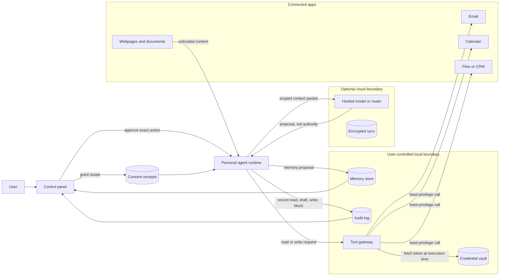

# Open Personal Agent Architectures

Los open personal agents son asistentes autohospedados o controlados por el usuario que se conectan a aplicaciones de chat, calendarios, bandejas de entrada, navegadores, archivos, memory y automatizaciones. OpenClaw y Hermes Agent son ejemplos útiles porque enfatizan diferentes aspectos de la arquitectura: acción personal amplia versus aprendizaje a largo plazo.

Este capítulo no es un ranking de productos. Utiliza estos proyectos para explicar la arquitectura de los personal agents persistentes.

Descarga el artifact reutilizable de revisión: [personal agent architecture review checklist](/capstone-assets/templates/personal-agent-architecture-review-checklist.txt).

## Ejemplos

- [OpenClaw](https://openclaw.ai/) y su [repositorio en GitHub](https://github.com/openclaw/openclaw): un asistente personal que se ejecuta en infraestructura controlada por el usuario y actúa a través de canales como apps de chat, superficies de dispositivos y tools conectados.
- [Hermes Agent](https://hermes-agent.nousresearch.com/docs/) y su [repositorio en GitHub](https://github.com/nousresearch/hermes-agent): un agent persistente enfocado en memory, creación de skills y aprendizaje por uso repetido.
- [AutoGPT](https://github.com/significant-gravitas/autogpt): una plataforma para crear y ejecutar agents continuos.
- [OpenHands](https://github.com/OpenHands/openhands): una plataforma open-source para agents de desarrollo de software.

## Core Architecture


## Trust Boundary Flow

Lee la arquitectura como un conjunto de límites, no como un solo asistente con muchos plugins. El consentimiento otorga el alcance. El runtime prepara el context. El tool gateway ejecuta con credenciales que nunca entran al context visible para el model. El audit log envía evidencia de regreso al usuario.



El diagrama da la regla de revisión para el resto del capítulo: cada flecha necesita una razón, un alcance, una regla de retención y un control visible para el usuario. Si un producto no puede explicar una flecha, el agent no debe recibir esa autoridad.

## Qué Los Hace Diferentes

Un asistente normal responde en la sesión actual. Un personal agent mantiene el context y puede actuar a lo largo del tiempo. Eso crea valor y riesgo.

Capacidades útiles:

- Preferencias de usuario persistentes
- Memory de proyectos y relaciones
- Trabajo programado
- Integraciones con apps
- Skills reutilizables
- Acceso multicanal
- Tasks de larga duración

Nuevos riesgos:

- OAuth scopes demasiado amplios
- Identidad equivocada en email o chat
- Memory almacenando datos privados o incorrectos
- Automatización sin suficiente revisión
- Prompt injection a través de bandejas de entrada, calendarios, páginas y documentos
- Carga operativa al autohospedar

## Privacy Model

Los personal agents necesitan un privacy model antes de requerir más tools. El sistema debe clasificar los datos según su origen, quién puede verlos, cuánto tiempo duran y si pueden salir del entorno del usuario.

| Data Class | Ejemplos | Regla por Defecto |
| --- | --- | --- |
| Session context | chat actual, archivos del task actual, salida temporal de tool | expira a menos que el usuario lo guarde |
| User preference | estilo de escritura, horario laboral, tools preferidas | almacenar con inspección y eliminación por el usuario |
| Sensitive personal data | inbox, calendario, contactos, documentos, registros de salud o financieros | minimizar, redactar y evitar memory durable por defecto |
| Credentials and tokens | OAuth tokens, API keys, sesiones de navegador | nunca colocar en context visible para el model |
| External content | cuerpo de email, página web, documento compartido, mensaje de chat | tratar como datos no confiables, no como instrucciones |
| Action history | mensajes enviados, edición de archivos, automatizaciones, aprobaciones | retener como audit log con reglas de redacción |

La regla clave de diseño es la separación. Un dato útil para el task actual no debe convertirse automáticamente en memory durable del usuario. Una credencial de conector nunca debe convertirse en context. Una página web no debe poder reescribir la policy permanente del usuario.

## Local And Cloud Split

Los open personal agents suelen mezclar ejecución local, models hospedados, conectores en la nube e infraestructura controlada por el usuario. Haz explícita la división.

| Responsabilidad | Preferir Local Cuando | Preferir Cloud Cuando |
| --- | --- | --- |
| Inspección de archivos | los archivos son privados, grandes o sensibles | el usuario elige explícitamente procesamiento en la nube |
| Memory store | el usuario quiere propiedad, exportación o eliminación | la sincronización entre dispositivos importa y la policy es clara |
| Tool execution | los tools acceden a apps locales, state del navegador o secretos | el API del conector es hospedado y con alcance definido |
| Model calls | el contenido es altamente sensible o importa el uso offline | importan la calidad, latencia o models especializados |
| Audit logs | el usuario quiere historial privado local | el equipo o servicio gestionado necesita operaciones centrales |

No ocultes la división detrás de configuraciones vagas. El usuario debe poder ver qué datos permanecen locales, cuáles se envían a un proveedor de model, qué conectores pueden leer o escribir datos y qué automatizaciones pueden ejecutarse sin aprobación.

## Connector Risk

Los conectores son el poder y el riesgo de los personal agents. Email, calendario, chat, navegador, archivos y conectores de automatización crean un problema de confused-deputy: contenido hostil puede pedirle a un agent confiable que use credenciales confiables.

Trata cada conector como una superficie de tool:

- OAuth scopes restringidos;
- permisos específicos por task;
- separación de lectura y escritura;
- verificación de remitente o actor;
- límite de tenant o cuenta;
- eventos de auditoría para cada acción externa;
- aprobación para mensajes salientes, compras, eliminaciones, cambios de permisos y actualizaciones de cuenta.

El agent no debe recibir un permiso global de "asistente personal". Debe recibir el acceso mínimo de conector para la ruta actual.

## Escenario: Meeting Follow-Up Agent

Un usuario pide: "Después de cada llamada de ventas, redacta un email de seguimiento, crea notas en el CRM y recuérdame mañana si no he respondido." Esto parece simple, pero cruza email, calendario, CRM, memory y automatización.

| Paso | El Agent Quiere Hacer | Límite Requerido |
| --- | --- | --- |
| leer evento de calendario | inspeccionar título de la reunión, asistentes y notas | calendar scope de solo lectura y verificación de asistentes |
| inspeccionar transcripción | extraer decisiones, tasks y nombres de clientes | fuente de transcripción marcada como no confiable a menos que el usuario la haya importado |
| redactar email | preparar mensaje para destinatario externo | solo modo borrador; no enviar sin aprobación exacta |
| crear nota en CRM | escribir resumen en el registro del cliente | coincidencia de cuenta, permiso de escritura en CRM y registro de auditoría |
| guardar preferencia | recordar el tono de seguimiento preferido del usuario | propuesta de memory visible para el usuario con opción de eliminar |
| programar recordatorio | crear recordatorio para mañana | automatización reversible con horario visible |

El diseño más seguro no pide a un solo agent que "gestione el seguimiento". Enruta cada acción a través de un límite específico del conector. El usuario aprueba el email externo y la escritura en CRM por separado porque tienen destinatarios, alcances de datos y rutas de rollback diferentes.

## Arquitectura del Panel de Control

El panel de control es parte de la arquitectura, no una configuración secundaria. Es la consola de runtime del usuario para un agent persistente.

| Panel | Muestra | El usuario puede |
| --- | --- | --- |
| Connections | cuentas conectadas, alcances, último acceso, permisos de escritura | desconectar, reducir alcance, pausar escrituras |
| Automations | horarios, disparadores, próxima ejecución, último resultado | pausar, editar, ejecutar una vez, eliminar |
| Approvals | acciones exactas pendientes, datos usados, vencimiento | aprobar, denegar, editar borrador, requerir aprobación futura |
| Memory | preferencias guardadas, hechos inferidos, fuente, sensibilidad | editar, eliminar, exportar, marcar como incorrecto |
| Activity | lecturas recientes, borradores, escrituras, intentos bloqueados | deshacer, reportar problema, abrir trace |
| Safety | instrucciones sospechosas, bloqueos de conectores, parada de emergencia | pausar todo, pausar conector, restaurar modo anterior |

Cada fila debe enlazar a un registro de auditoría. Un usuario debe poder responder rápidamente tres preguntas: ¿a qué puede acceder el agent?, ¿qué puede hacer sin preguntar?, y ¿qué ha hecho ya?

## Patrón Estilo OpenClaw

Los sistemas estilo OpenClaw optimizan el alcance: un asistente conectado a muchos canales y tools.

Énfasis arquitectónico:

- Diseño gateway-first
- Interacción chat-native
- Conectores de tools y apps
- Despliegue propiedad del usuario
- Automatización de tasks amplia

Usa este estilo cuando el principal problema es darle a un usuario un solo asistente en sus aplicaciones diarias.

## Patrón Estilo Hermes

Los sistemas estilo Hermes optimizan el aprendizaje a lo largo del tiempo.

Énfasis arquitectónico:

- Memory persistente
- Extracción de skills de workflows repetidos
- Loops de auto-mejora
- Presencia de agent de larga duración
- User model que se profundiza con las sesiones

Usa este estilo cuando el principal problema es hacer que el asistente mejore en los workflows recurrentes de un usuario.

## Arquitectura de Seguridad

Los personal agents necesitan límites de seguridad más fuertes que los asistentes solo de chat porque pueden acceder a sistemas privados.

Controles mínimos:

- Verificación de identidad para solicitudes desde email, chat y canales compartidos
- Alcances de tools restringidos por tipo de task
- Aprobación humana antes de enviar mensajes, gastar dinero, cambiar accesos o eliminar datos
- Tipos de memory separados para preferencias, hechos, credenciales y state de tasks
- Logs de auditoría para cada acción externa
- Filtros de prompt-injection para documentos, emails y páginas web recuperadas
- Secrets almacenados fuera del context visible para el model

## Superficie de Control del Usuario

Un personal agent debe exponer su plano de control al usuario. Como mínimo, el usuario debe poder inspeccionar y cambiar:

- cuentas conectadas y alcances;
- automations y horarios activos;
- approvals pendientes;
- memories durables;
- acciones recientes;
- ejecuciones fallidas;
- instrucciones bloqueadas o sospechosas;
- estado de parada de emergencia.

La superficie de control del usuario no es un lujo. Es la forma en que una persona supervisa un agent que trabaja a través del tiempo y aplicaciones. Si el usuario no puede ver lo que el agent recuerda, a qué puede acceder y qué ha hecho, el sistema está pidiendo confianza sin dar control.

## Modos de Permiso

Los personal agents necesitan modos de permiso que coincidan con la confianza del usuario, el riesgo del task y la autoridad del conector. Evita una sola configuración global de automatización.

| Modo | El agent puede | El agent no debe |
| --- | --- | --- |
| Observe | leer context limitado y resumirlo | escribir, enviar, eliminar, programar, comprar o cambiar accesos |
| Draft | preparar mensajes, archivos, cambios de calendario o acciones de tools | ejecutar el borrador sin aprobación |
| Ask-each-time | solicitar aprobación para una acción exacta | reutilizar la aprobación para una acción, destinatario, monto o cuenta diferente |
| Auto-low-risk | ejecutar acciones limitadas, reversibles y de bajo impacto | tocar datos sensibles, mensajes externos, dinero, credenciales o permisos |
| Paused | retener configuración e historial de auditoría | ejecutar trabajos programados, consultar conectores o invocar tools |

El modo debe ser visible en cada vista de conector, automation y memory. Un usuario no debe tener que deducir si el agent puede actuar.

## Transiciones de Permiso

La mayoría de los incidentes con personal agents ocurren cuando un sistema pasa silenciosamente de leer, a redactar, a actuar. Trata cada transición como un límite de producto y seguridad.

| Transición | Señal de usuario requerida | Evidencia de runtime requerida |
| --- | --- | --- |
| disconnected a observe | el usuario conecta una cuenta o carpeta | conector, alcance, cuenta, timestamp y clases de datos visibles en Connections |
| observe a draft | el usuario habilita el modo draft para un task o conector | ruta, tipos de borrador permitidos, datos fuente y garantía de no envío |
| draft a ask-each-time | el usuario permite prompts de aprobación de acción exacta | plantilla de aprobación, vencimiento, destinatario u objetivo y ruta de edición |
| ask-each-time a auto-low-risk | el usuario opta por una acción limitada y reversible | allowlist de acciones, clase de riesgo, ruta de deshacer, límite de tasa y registro de auditoría |
| auto-low-risk a paused | el usuario pausa, el detector de riesgos se activa o la policy bloquea | motivo de pausa, conectores afectados, trabajos pendientes y regla de reanudación |

Nunca combines estas transiciones en un solo permiso amplio. "Permitir que el asistente ayude con el email" no es un permiso seguro. "Redactar respuestas de estas etiquetas, nunca enviar sin aprobación" es un permiso revisable.

## Recibos de Consentimiento

Cuando un personal agent obtiene acceso, almacena memory o inicia una automation, el usuario debe recibir un recibo que pueda inspeccionar después.

```ts
type PersonalAgentConsentReceipt = {
  receiptId: string;
  userId: string;
  grantedAt: string;
  scope: "connector" | "memory" | "automation" | "approval_policy";
  resource: string;
  mode: "observe" | "draft" | "ask_each_time" | "auto_low_risk";
  dataClasses: string[];
  allowedActions: string[];
  forbiddenActions: string[];
  expiresAt?: string;
  revokePath: string;
  auditViewPath: string;
};
```

El consentimiento no es una casilla oculta en el onboarding. Es un registro operativo. El producto debe usarlo al decidir qué puede leer, recordar, automatizar o solicitar aprobar el agent.

## Registro de Auditoría del Personal Agent

Cada acción externa debe dejar un registro que el usuario pueda entender sin leer traces o logs.

```ts
type PersonalAgentAuditRecord = {
  actionId: string;
  timestamp: string;
  mode: "observe" | "draft" | "ask_each_time" | "auto_low_risk" | "paused";
  connector: "email" | "calendar" | "chat" | "browser" | "files" | "automation" | "memory";
  action: string;
  actor: "user" | "agent" | "schedule" | "external_event";
  dataUsed: string[];
  approvalId?: string;
  result: "drafted" | "executed" | "blocked" | "failed" | "reverted";
  userControls: Array<"approve" | "deny" | "undo" | "delete_memory" | "pause_connector" | "report_problem">;
};
```

El registro de auditoría debe responder: qué pasó, por qué pasó, qué datos se usaron, qué aprobación lo permitió y qué puede hacer ahora el usuario. Si una acción no puede explicarse de esta manera, no debe ejecutarse de forma autónoma.

## Policy de Escritura de Memory

Los personal agents persistentes necesitan una puerta de escritura de memory:

```ts
type PersonalMemoryWrite = {
  proposedMemory: string;
  source: "user_statement" | "observed_behavior" | "tool_result" | "imported_data";
  sensitivity: "low" | "medium" | "high";
  retention: "session" | "until_changed" | "expires" | "do_not_store";
  userVisible: boolean;
  correctionPath: string;
};
```

El valor predeterminado debe ser conservador. Almacena preferencias explícitas del usuario más fácilmente que hechos inferidos. No almacenes hechos sensibles a menos que el usuario pueda inspeccionarlos, corregirlos y eliminarlos.

## Modos de Falla

- El agent confía en un remitente falsificado y actúa sobre datos privados.
- Una instrucción de chat anula la policy establecida por el usuario.
- El agent almacena un hecho temporal como memory durable.
- Un conector expone más datos de los necesarios para el task.
- El usuario no puede inspeccionar por qué ocurrió una acción.
- El sistema no tiene modo de parada de emergencia ni de aprobación.
- Una página web, email o documento compartido inyecta instrucciones que cruzan a otro conector.
- El procesamiento en la nube recibe datos que el usuario esperaba que permanecieran locales.
- Una migración de memory conserva hechos obsoletos o incorrectos.
- Un token de conector amplio convierte un bug de prompt-injection en acceso a toda la cuenta.

## Preguntas de Revisión

Antes de probar un personal agent, pregunta:

1. ¿Qué puede hacer el agent mientras el usuario está ausente?
2. ¿Qué datos permanecen locales y cuáles pueden salir del entorno del usuario?
3. ¿Qué conectores pueden leer datos y cuáles pueden escribir datos?
4. ¿Qué acción requiere aprobación cada vez?
5. ¿Cómo puede el usuario inspeccionar, editar, exportar o eliminar memory?
6. ¿Cómo trata el agent los emails, páginas web, documentos y mensajes de chat como contenido no confiable?
7. ¿Qué muestra el log de auditoría después de una acción?
8. ¿Cómo puede el usuario detener toda la automatización de inmediato?

## Regla de Diseño

Trata al personal agent como a un empleado con llaves. Necesita identidad, permisos, entrenamiento, supervisión, logs y una forma de revocar el acceso.

## Capítulos relacionados

- [Skills](../tools-skills-protocols/skills)
- [Memory-Augmented Agent](../memory-knowledge/memory-augmented-agent)
- [Human Approval Gates](../tools-skills-protocols/human-approval-gates)
- [Policy Enforcement](../production-runtime/policy-enforcement)
- [Agentic System Architecture](./agentic-system-architecture)
