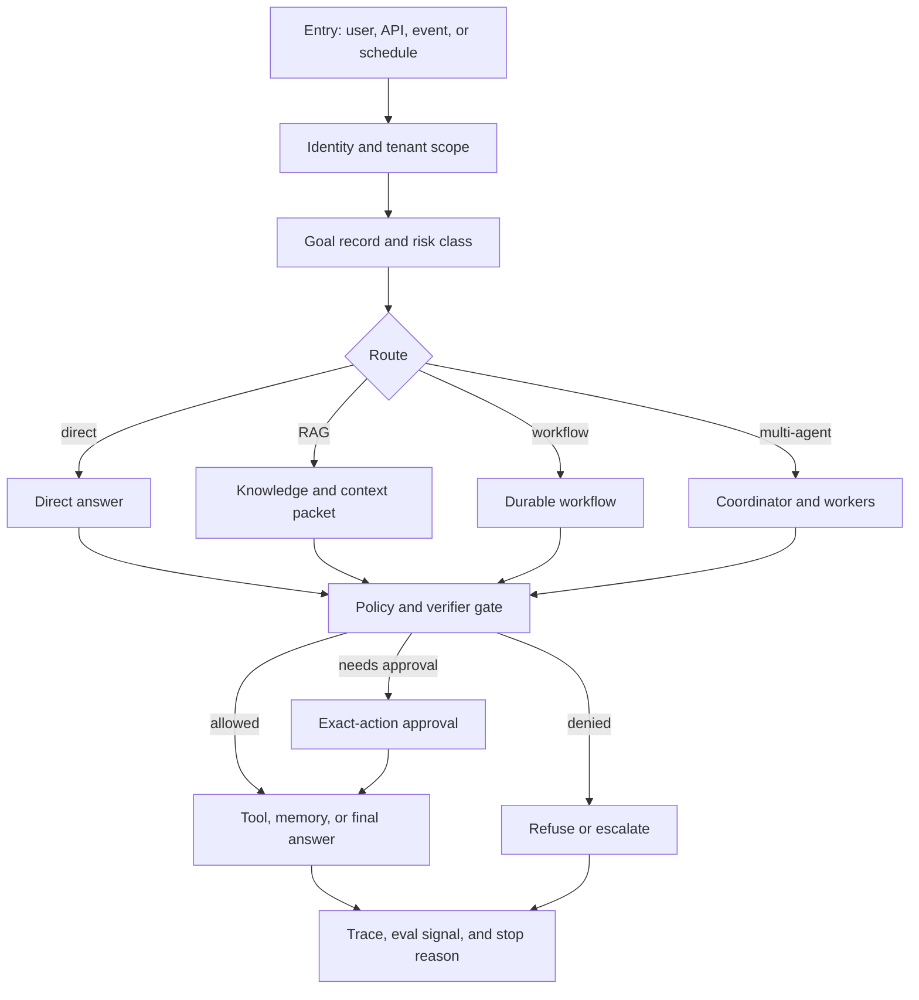

# Reference Architecture

Esta arquitectura de referencia combina los patrones principales del libro en un agentic system listo para producción. Es intencionalmente conservadora: el software determinista es dueño del state, la policy y los side effects; las llamadas al model proponen decisiones dentro de loops acotados.

Usa este capítulo como puente entre la selección de patterns y el diseño del sistema. El diagrama no es una prescripción de framework; muestra los límites de propiedad que un sistema en producción necesita antes de que los agents manejen datos privados, acciones externas o trabajo de larga duración.

## Architecture

Lee este diagrama como un mapa de propiedad para sistemas en producción: los servicios deterministas son dueños de la identidad, el state, la policy, la retrieval, las aprobaciones y los traces alrededor de llamadas acotadas al model.


Descarga el artifact reutilizable de revisión: [reference architecture review checklist](/capstone-assets/templates/reference-architecture-review-checklist.txt).

## Boundary Flow

Usa este flujo para revisar una solicitud desde la entrada hasta el estado final. Separa el control plane que decide qué está permitido del execution plane que recupera evidencia, invoca tools y escribe el state.



El flujo debe fallar cerrado. Una propuesta del model solo puede avanzar después de que los checks de state, policy, schema, evidencia, aprobación o verificador la acepten.

## What This Architecture Is For

Usa esta estructura cuando el agent pueda tocar datos privados, invocar tools, esperar aprobación, ejecutarse por más de una solicitud o afectar clientes, dinero, infraestructura, cumplimiento o operaciones internas. Es más pesada que un prompt chain, pero la estructura adicional permite revisiones.

No comiences aquí para un prototipo de solo lectura, un resumidor de una sola vez o un workflow cuyos pasos sean totalmente deterministas. Para esos sistemas, usa el pattern más pequeño que resuelva el task y mantén los controles de producción proporcionales al riesgo.

## Readiness Questions

Usa estas preguntas antes de una revisión de diseño:

1. ¿Qué puede hacer el sistema que una respuesta normal de chat no puede?
2. ¿Qué acción crea el mayor riesgo, costo o impacto al usuario?
3. ¿Qué servicio es dueño del state que sobrevive reintentos, caídas y esperas de aprobación?
4. ¿Qué policy check se ejecuta antes de la retrieval, antes del uso de tools, antes de escribir en memory y antes de la respuesta final?
5. ¿Qué evidencia debe ver el model y cuál debe permanecer fuera del context del model?
6. ¿Qué evento exacto mueve una ejecución de borrador a acción aprobada?
7. ¿Qué trace prueba que el sistema siguió el camino previsto?
8. ¿Qué switch desactiva el comportamiento riesgoso sin deshabilitar todo el producto?

Si un equipo responde esto solo con texto de prompt, el diseño sigue siendo un prototipo.

## Layered View

| Layer | Owns | Must Not Delegate To The Model |
| --- | --- | --- |
| Entry layer | Usuario, tenant, fuente de eventos, validación de solicitudes, límites de tasa. | Autenticación, alcance de tenant, confianza en entrada sin procesar. |
| Routing layer | Respuesta directa, workflow, loop, RAG o ruta multi-agent. | Si una ruta de alto riesgo está permitida. |
| Goal and state layer | Registro de goal, run state, checkpoints, motivo de detención, datos de replay. | Reglas de mutación de state durable. |
| Context and knowledge layer | Retrieval, memory, frescura, citas, policy de fuente. | Elegibilidad de fuente o control de acceso. |
| Tool and execution layer | Schemas de tools, timeouts, idempotencia, registros de side-effect. | Permiso para llamar sistemas externos. |
| Policy and approval layer | Autorización, clase de riesgo, aprobación exacta de acción, escalamiento. | Autoridad final para acciones riesgosas. |
| Evaluation layer | Evals offline, runtime verifiers, release gates, datos de regresión. | Juicio de calidad o seguridad sin umbrales. |
| Observability layer | Traces, audit logs, costos, latencia, llamadas a tools, incidentes. | Razonamiento oculto como única explicación. |

Las capas no requieren servicios separados. Un sistema pequeño puede implementar varias capas en una sola base de código. Lo importante es la propiedad: otro ingeniero debe poder encontrar dónde se toma, prueba, registra y revierte cada decisión.

## Control Plane vs Execution Plane

Mantén las decisiones de control fuera del texto libre del model. El model puede proponer, resumir, clasificar o redactar. Los servicios controlados por el runtime deciden si la propuesta puede afectar el state, tools, memory, aprobaciones o usuarios.

| Plane | Owns | Examples | Release Evidence |
| --- | --- | --- | --- |
| Control plane | authorization, routing, policy, budgets, approval, release gates | route policy, risk class, policy decision, eval threshold, kill switch | policy logs, eval report, approval trace, rollback drill |
| Execution plane | retrieval, tool calls, workflows, memory writes, model calls | vector search, order lookup, draft refund, workflow resume, memory write | tool manifest, source metadata, idempotency record, workflow trace |
| Evidence plane | provenance, citations, state snapshots, audit trail | context packet, citation map, state version, run transcript | successful trace, failed trace, redaction proof |

Esta separación previene una falla común: que un model proponga una acción y la autorice implícitamente. La arquitectura de producción debe hacer visible y comprobable el camino de autorización.

## Maturity Ladder

Adopta la arquitectura por etapas. No construyas todos los componentes de plataforma antes de que el sistema demuestre valor.

| Level | System Shape | Required Controls | Promotion Test |
| --- | --- | --- | --- |
| 0 - Prototype | Demo local o interna de solo lectura. | Etiqueta clara de no producción, trace básico, sin datos privados ni side effects. | El equipo puede explicar qué fallaría antes de usar datos reales. |
| 1 - Scoped Assistant | Un task acotado con retrieval o tools de solo lectura. | Identidad, alcance de tenant, policy de fuente, verificación de citas, motivo de detención. | Evidencia no autorizada o faltante produce denegación, rechazo o escalamiento. |
| 2 - Tool-Assisted Workflow | El sistema redacta o prepara acciones mediante tools tipados. | Tool manifest, validación de schema, idempotencia para borradores, correlación de traces. | Tools con capacidad de escritura no autorizada no pueden ser llamados solo desde texto del model. |
| 3 - Approved Action | El sistema puede activar efectos visibles para clientes, financieros, operativos o durables tras aprobación. | Aprobación exacta de acción, registro de decisión de policy, audit record, ruta de rollback o desactivación. | Una acción riesgosa no puede ejecutarse sin evidencia de policy y aprobación. |
| 4 - Production Runtime | El sistema corre continuamente con eval gates y respuesta a incidentes. | State durable, replay, dashboards, alertas, release gates, runbook, rollback drill. | Los operadores pueden reconstruir y desactivar una ruta fallida sin reimplementar todo. |
| 5 - Platform Capability | Múltiples productos o equipos reutilizan el runtime, tools, policies o evals. | Contratos versionados, pruebas de compatibilidad, matriz de propiedad, aislamiento de tenant, observabilidad compartida. | Un cambio de contrato no puede romper silenciosamente el comportamiento downstream de un agent. |

La escalera no es una insignia de estatus. Es un control de alcance. Un sistema nivel 1 puede ser excelente para un task de solo lectura. Un sistema nivel 3 que no puede probar la aprobación vinculante no está listo para producción.

## Primer Camino de Implementación

Comienza con un solo workflow de usuario y un solo límite de riesgo. Una primera implementación útil debe ser lo suficientemente pequeña como para revisarse en una sola reunión de diseño.

| Paso | Construir Primero | Posponer Hasta Que Sea Necesario |
| --- | --- | --- |
| Goal | Una task con criterios explícitos de éxito y rechazo. | Alcance amplio de assistant o enrutamiento multi-dominio. |
| State | Run ID, actor, tenant, route, stop reason y trace link. | Long-term memory, personalización entre sesiones o auto-mejora del agent. |
| Knowledge | Una fuente aprobada con reglas de vigencia y citación. | Múltiples índices, ingestión automática o recuperación abierta en la web. |
| Tools | Un tool de solo lectura o un tool solo para borradores. | Write tools, control de navegador, acceso a shell o acciones de pago. |
| Policy | Denegar rutas inseguras, fuentes no autorizadas y evidencia faltante. | Plataforma de policy completa con reglas dinámicas. |
| Evaluation | Cinco casos: éxito, evidencia faltante, fuente no autorizada, falla de tool y rechazo. | Suites de eval basadas en judge y generación de datos sintéticos. |
| Operations | Muestra de trace, owner, límites conocidos y switch de desactivación. | Suite completa de dashboards y rotación multi-equipo de on-call. |

Este camino mantiene la arquitectura ligada a la evidencia. Cada capa agregada debe cerrar un riesgo nombrado, no solo satisfacer un diagrama.

## Flujo de Solicitud

1. Autentica al usuario o fuente del evento.
2. Crea un registro de goal con restricciones, alcance de usuario y resultado solicitado.
3. Enruta la task a una respuesta directa, Agentic RAG, durable workflow o proceso multi-agent.
4. Ejecuta verificaciones de policy antes de la recuperación, uso de tools o efectos secundarios.
5. Persiste observaciones, decisiones, llamadas a tools y outputs.
6. Verifica evidencia, calidad del output y cumplimiento de policy.
7. Devuelve una respuesta, solicita aprobación, rechaza o escala.
8. Almacena traces para depuración y mejora del dataset de eval.

## Ejemplo: Solicitud de Reembolso en Soporte

Un cliente solicita un reembolso. La arquitectura debe mantener tres decisiones separadas.

| Decisión | Owner | Ejemplo de Resultado |
| --- | --- | --- |
| ¿Puede el sistema inspeccionar esta orden? | Capas de entrada, identidad y policy. | Permitir lectura dentro del mismo tenant o denegar acceso cruzado entre tenants. |
| ¿Se cumple la refund policy? | Capas de retrieval, policy y eval. | Borrador de recomendación con cita de policy o escalar por evidencia faltante. |
| ¿Puede moverse el dinero? | Capas de aprobación y ejecución. | Requiere aprobación de finanzas; el model no puede emitir el reembolso. |

El model puede redactar una recomendación. No autentica al usuario, no elige sus propios tools, no decide la autoridad de pago, no escribe memory sin policy, ni marca el workflow como completo sin un stop reason. Esa separación es el objetivo de la reference architecture.

## Mapeo de Puntos de Control

Convierte la arquitectura en tickets de implementación asignando cada transición riesgosa a un punto de control concreto.

| Transición | Control Requerido | Evidencia a Almacenar | Prueba de Liberación |
| --- | --- | --- | --- |
| request entra al sistema | identidad, alcance de tenant, rate limit | actor ID, tenant ID, source, request ID | request entre tenants denegada antes de retrieval |
| route seleccionada | route policy y risk class | route, risk class, motivo de enrutamiento | route de alto riesgo no puede seleccionarse solo por texto de prompt |
| context ensamblado | elegibilidad de fuente, vigencia, presupuesto | context refs, owner de fuente, vigencia, token count | fuente obsoleta o no autorizada excluida |
| model propone acción | validación de schema y policy | propuesta, resultado de schema, resultado de policy | propuesta mal formada rechazada |
| llamada a tool solicitada | tool manifest, permiso, idempotency | nombre del tool, autoridad, argumentos, idempotency key | escritura no autorizada denegada |
| aprobación necesaria | exact-action binding | approver, acción, monto o destino, expiración, trace ID | aprobación amplia rechazada |
| resultado emitido | verificador final y stop reason | respuesta, citas, estado final, stop reason | evidencia faltante no puede producir estado completado |
| memory escrita | memory class y regla de retención | tipo de memory, owner, retención, ruta de eliminación | memory sensible denegada o redactada |

Si una fila no tiene owner, prueba o evidencia almacenada, la arquitectura sigue siendo solo un dibujo. La implementación está lista solo cuando cada transición puede fallar de forma cerrada.

## Puntos de Control

- **Antes de retrieval:** aplica control de acceso y elegibilidad de fuente.
- **Antes de usar tools:** valida schema, permisos, presupuesto y necesidades de aprobación.
- **Antes de la respuesta final:** verifica afirmaciones, citas y policy.
- **Antes de escribir memory:** clasifica qué tipo de memory se almacena.
- **Antes de liberar:** ejecuta evals y revisiones de regresión.

## Slices de Implementación de Referencia

Construye la arquitectura en slices. Cada slice debe producir una prueba desplegable, no solo una promesa en un diagrama.

| Slice | Construir | Debe Probar |
| --- | --- | --- |
| Respuesta solo lectura | validación de entrada, enrutamiento, context packet, trace | El sistema puede responder con evidencia delimitada y un trace reproducible. |
| Respuesta asistida por tool | gateway de tools, schemas, timeouts, idempotency | Las llamadas a tools están autorizadas, tipadas, registradas y son reversibles cuando sea posible. |
| Approval workflow | solicitud de aprobación, exact action binding, expiración, audit log | Un humano aprueba una acción concreta, no un comportamiento futuro amplio. |
| Durable workflow | state store, checkpoints, reintentos, stop reasons | La ejecución sobrevive a fallas sin duplicar efectos secundarios. |
| Production release | suite de eval, runbook, rollback switch, dashboards | Los operadores pueden detectar, detener, depurar y mejorar el sistema. |

Esta secuencia evita que los equipos construyan orquestación antes de poder probar límites de state, policy y evidencia.

## Formas de Despliegue

La reference architecture no requiere una plataforma grande desde el primer día. Usa la forma de despliegue más pequeña que preserve los puntos de control para el riesgo que estás asumiendo.

| Forma | Usar Cuando | Compresión Aceptable | No Comprimir |
| --- | --- | --- | --- |
| Prototipo | El sistema es solo lectura, interno y desechable. | Un solo servicio de aplicación puede manejar routing, state, retrieval y traces. | Autenticación, alcance de tenant, elegibilidad de fuente y stop reason. |
| Piloto | Un grupo pequeño usa el sistema en trabajo real con autoridad limitada. | Las verificaciones de policy y registros de aprobación pueden vivir en la base de datos de la aplicación. | Permiso de tool, correlación de trace, puertas de eval y rollback switch. |
| Producción | El sistema afecta usuarios, registros, dinero, infraestructura u operaciones. | Varias capas pueden compartir repositorio o runtime. | Durable state, idempotency, audit logs, ownership de incidentes y evidencia de liberación. |
| Regulado o alto riesgo | El sistema toca compliance, datos sensibles, pagos, seguridad, salud, decisiones legales o laborales. | Las llamadas al model pueden quedarse detrás de un solo runtime gateway. | Policy enforcement independiente, auditoría de aprobación, redacción, retención y revisión de evidencia. |

La compresión es segura solo cuando la propiedad se mantiene explícita. Un prototipo puede compartir rutas de código. No puede compartir la pregunta de quién es owner de state, policy, autoridad de tool, evidencia y rollback.

## Guía de Ubicación de Límites

Usa esta guía para decidir si un componente pertenece dentro del agent runtime, el servicio de aplicación o un servicio de plataforma separado.

| Límite | Mantener Dentro de la App Cuando | Separar en un Servicio Cuando |
| --- | --- | --- |
| Policy | Las reglas son pocas, específicas del producto y revisadas con la feature. | Varios productos, tenants, risk classes o owners de compliance usan las mismas reglas. |
| Tools | Los tools son acotados, de bajo riesgo y propiedad de un solo equipo. | Los tools son compartidos, con capacidad de escritura, costosos, con credenciales o auditados. |
| Retrieval | Las fuentes son pequeñas, locales y de baja sensibilidad. | Las fuentes requieren control de acceso, policy de vigencia, citas, eliminación o revisión de owner. |
| Memory | La memory es local a la task o de corta duración. | La memory cruza sesiones, usuarios, tenants, clases de privacidad o reglas de retención. |
| Workflow | Las ejecuciones terminan en una sola request y no tienen efectos secundarios. | Las ejecuciones esperan aprobación, reintentos, reanudan, programan trabajo o llaman tools irreversibles. |
| Evaluation | La feature tiene un set de eval pequeño y fijo. | Los evals bloquean releases, comparan versiones, alimentan revisión de incidentes o sirven a varios equipos. |
| Observability | Los logs son suficientes para depurar una ejecución de prueba. | Los operadores necesitan traces, redacción, costo, latencia, tool, policy y registros de aprobación. |

La separación debe seguir la propiedad y el riesgo, no la moda. Un servicio separado sin un owner más fuerte es solo código más distribuido.

## Evidence Bundle

Un diseño que afirma seguir esta arquitectura debe adjuntar estos artifacts:

| Artifact | Demuestra |
| --- | --- |
| Architecture diagram | Propiedad de state, tools, policy, memory, evals, approvals y traces. |
| State schema | Qué persiste, qué se puede reproducir y por qué se detuvo el run. |
| Tool manifest | Qué capabilities existen, quién puede llamarlas y qué efectos secundarios crean. |
| Context packet example | Qué fuentes llegaron al model, con confianza, frescura y presupuesto. |
| Policy decision log | Por qué se permitió o denegó una tool, retrieval source, memory write o approval path. |
| Trace sample | Qué ocurrió en un run exitoso y en un run fallido. |
| Eval report | Qué comportamientos bloquean el release. |
| Runbook | Quién es responsable de incidentes y cómo funciona el rollback. |

## Run Trace Contract

Una reference architecture solo es real si un run puede demostrar que los límites funcionaron. Captura el run como trace data estructurado, no como logs dispersos.

```ts
type ReferenceRunTrace = {
  runId: string;
  tenantId: string;
  userOrEvent: string;
  goal: string;
  route: "direct_answer" | "rag" | "agent_loop" | "durable_workflow" | "multi_agent";
  stateVersion: string;
  context: Array<{
    source: string;
    accessDecision: "allow" | "deny";
    freshness: "current" | "stale" | "unknown";
    citationRequired: boolean;
  }>;
  modelDecisions: Array<{
    step: string;
    proposal: string;
    acceptedBy: "schema" | "policy" | "human" | "runtime";
  }>;
  policyChecks: Array<{
    boundary: "retrieval" | "tool" | "memory" | "approval" | "final_answer";
    decision: "allow" | "deny" | "escalate";
    policyVersion: string;
  }>;
  toolCalls: Array<{
    name: string;
    authority: "read" | "draft" | "write" | "execute";
    idempotencyKey?: string;
    result: "success" | "failed" | "denied";
  }>;
  finalStatus: "completed" | "refused" | "needs_approval" | "policy_blocked" | "evidence_missing" | "failed";
  stopReason: string;
  rollbackPath?: string;
};
```

Los nombres exactos de los campos pueden cambiar. Lo que no debe cambiar es el invariante: un revisor debe poder reconstruir quién preguntó, qué evidencia entró al context, qué propuso el model, qué policies se ejecutaron, qué tools se usaron, por qué se detuvo el run y cómo revertir o deshabilitar el camino riesgoso.

## Architecture Acceptance Tests

Antes de un piloto, ejecuta al menos estas verificaciones de aceptación contra el trace contract.

| Test | Evidencia de aprobación |
| --- | --- |
| Tenant isolation | Una solicitud cross-tenant registra una denegación antes de retrieval o uso de tool. |
| Missing evidence | El run se detiene con `evidence_missing` o `needs_approval`; no inventa soporte. |
| Policy denial | Una acción bloqueada registra la versión de policy, boundary, motivo de denegación y sin efecto secundario. |
| Approval binding | Una acción de alto riesgo espera aprobación vinculada a la acción exacta, actor, expiración y trace ID. |
| Retry safety | Un write reintentado usa la misma idempotency key o se detiene antes de efectos secundarios duplicados. |
| Memory control | Un memory write registra clasificación, propietario, retención y ruta de eliminación. |
| Rollback proof | Los operadores pueden deshabilitar la ruta del model, tool, workflow, policy o agent sin eliminar todo el producto. |

Si estas pruebas son difíciles de escribir, probablemente la arquitectura aún está oculta en framework glue, prompts o procesos informales.

## Runtime Components

- Identity and tenant boundary
- Goal and state store
- Prompt and instruction registry
- Tool gateway
- Retrieval router
- Memory service
- Policy engine
- Approval service
- Workflow engine
- Evals service
- Trace and audit store

## Ownership Matrix

Asigna responsables antes de producción. La falta de ownership es un defecto de arquitectura.

| Component | Engineering Owner | Operational Owner | Release Artifact |
| --- | --- | --- | --- |
| Identity and tenant boundary | plataforma o backend de producto | seguridad o plataforma on-call | access-control tests |
| Goal and state store | equipo de workflow/runtime | runtime on-call | state schema y replay fixture |
| Retrieval router | equipo de search o knowledge | propietario de contenido/datos | source policy y freshness report |
| Tool gateway | equipo de integración | propietario de servicio para cada tool | tool manifest y audit sample |
| Policy engine | seguridad, compliance o product policy | policy owner | policy decision log |
| Approval service | equipo de workflow de producto | propietario de aprobación de negocio | approval trace sample |
| Evals service | equipo de AI platform o calidad | release owner | blocking eval report |
| Trace and audit store | equipo de observability | incident commander | successful y failed run traces |

Una persona puede ser responsable de varias celdas en un equipo pequeño. La tabla sigue siendo importante porque cada falla en producción preguntará quién era responsable del boundary.

## Design Review Questions

Haz estas preguntas antes de un piloto en producción:

1. ¿Qué decisión toma el model y qué decisión toma el software después de eso?
2. ¿Qué cambios de state sobreviven a un crash, retry o espera de approval?
3. ¿Qué llamada de tool tiene el mayor costo, riesgo o irreversibilidad?
4. ¿Qué evidencia se requiere antes de que el sistema responda o actúe?
5. ¿Qué sucede cuando la evidencia falta, está desactualizada, es conflictiva o no está autorizada?
6. ¿Qué se escribe en memory y quién puede corregirlo o eliminarlo?
7. ¿Qué eval bloquea el release si el sistema falla mañana?
8. ¿Puede un operador reconstruir el run fallido sin adivinar?
9. ¿Qué se puede deshabilitar sin volver a desplegar todo el sistema?
10. ¿Qué haría que el equipo apague el agent?

## Minimum Production Checklist

- Responsable explícito para goal y state
- Tool schemas y validación
- Aprobación humana para acciones de alto riesgo
- Retrieval con control de acceso
- Validación de citas para respuestas fundamentadas
- Evals para core tasks
- Traces para cada run
- Controles de presupuesto, timeout y cancelación
- Ruta de revisión de incidentes
- Switch de rollback o deshabilitar

## Reference Architecture Review Gate

Usa la [reference architecture review checklist](/capstone-assets/templates/reference-architecture-review-checklist.txt) antes de un piloto o release de producción. Bloquea el release cuando:

- el model es responsable de autenticación, autorización, policy o permiso de efectos secundarios;
- el durable state no tiene schema, replay path o motivo de detención;
- las retrieval sources carecen de control de acceso, confianza, frescura o validación de citas;
- las approvals autorizan comportamientos futuros vagos;
- los evals solo inspeccionan el texto final e ignoran tools, policy, evidence y transiciones de state;
- los operadores no pueden reconstruir un run exitoso y uno fallido a partir de traces.

## Scaling Path

Comienza pequeño:

1. Single agent con validación de tool.
2. Agrega goals y state.
3. Agrega retrieval y validación de citas.
4. Agrega durable workflow para tasks de larga duración.
5. Agrega gates de aprobación humana.
6. Agrega datasets de eval y observability.
7. Agrega multi-agent decomposition solo cuando un agent se convierte en un cuello de botella.

## Anti-Patterns

Evita estos diseños:

- El model elige de una lista amplia de tools sin permiso a nivel de ruta.
- El texto del prompt es el único boundary de policy.
- Retrieval, memory y resultados de tool se mezclan en el context sin procedencia.
- El sistema puede actuar pero no puede reproducir por qué actuó.
- Las approvals autorizan comportamientos futuros vagos en lugar de una acción exacta.
- Los evals solo revisan la calidad de la respuesta final e ignoran el uso de tools, policy, evidence y motivo de detención.
- El rollback requiere eliminar todo el deployment porque prompts, tools y policies no pueden deshabilitarse de forma independiente.

## Related Chapters

- [Agentic System Architecture](./agentic-system-architecture)
- [Agentic RAG Systems](./agentic-rag-systems)
- [MCP-first Tool Use](../tools-skills-protocols/mcp-first-tool-use)
- [Production Runtime Overview](../production-runtime/overview)
- [Durable Workflows](../production-runtime/durable-workflows)
- [Policy Enforcement](../production-runtime/policy-enforcement)
- [Observability and Evals](../production-runtime/observability-and-evals)
