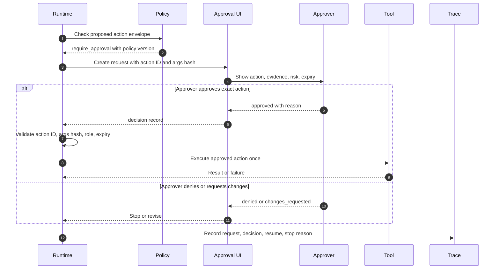
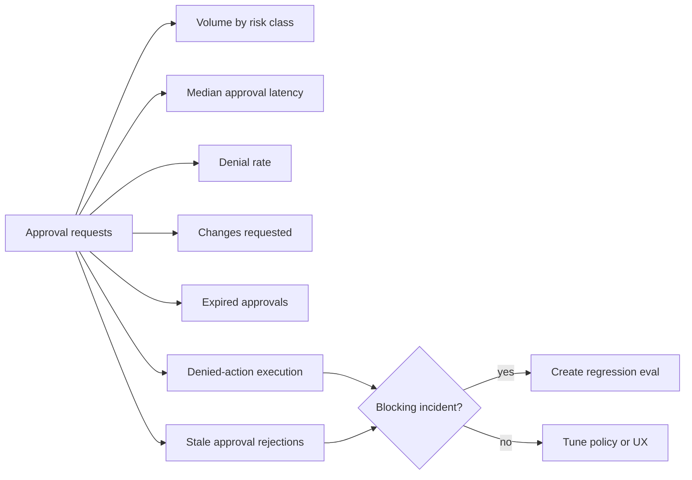

# Human Approval Gates

Los human approval gates pausan la ejecución antes de acciones sensibles, costosas, destructivas o visibles externamente.

> Fuente y descargas
>
> - [Repository source](https://github.com/GTuritto/Agentic-Systems-Patterns/tree/main/human-in-the-loop-approval-agent)
> - [Download code bundle](/downloads/human-approval-gates.zip)

## Intento

Los human approval gates pausan un agentic workflow antes de ejecutar una acción sensible, costosa, destructiva o visible externamente. El gate no es "preguntar a un humano en el chat". Es una pausa controlada del workflow con la acción propuesta, riesgo, evidencia, policy, identidad del aprobador, tiempo de espera, decisión y registro de auditoría.

La aprobación es un límite de arquitectura. El model puede proponer una acción. El software decide si esa acción necesita aprobación, empaqueta la solicitud de aprobación, espera de forma durable, registra la decisión y reanuda o detiene el workflow.

El detalle importante es que la aprobación por sí sola no hace seguro a un agent. Un paso de aprobación vago puede convertirse en teatro. Un approval gate útil vincula una decisión humana a una acción exacta, bajo una versión específica de la policy, con suficiente evidencia para que el humano tome una decisión real.

## Usar cuando

- El agent puede desencadenar efectos secundarios financieros, legales, de seguridad, de acceso a datos o visibles para el cliente.
- Un humano debe revisar la evidencia antes de que el workflow continúe.
- El workflow puede pausar, persistir el state y reanudar de forma segura.
- Las decisiones de aprobación necesitan una auditoría.
- La policy puede definir qué acciones requieren aprobación y cuáles pueden proceder automáticamente.

## Evitar cuando

- Cada paso requiere aprobación y el agent ya no reduce trabajo.
- El aprobador no puede ver suficiente evidencia para tomar una decisión.
- La aprobación ocurre en un mensaje de chat no rastreado o canal alterno.
- El workflow no puede reanudarse de forma segura después de esperar.
- El sistema no puede evitar que los reintentos reutilicen aprobaciones obsoletas.

## Arquitectura

Usa este diagrama para leer Human Approval Gates como un límite de sistema, no solo una forma de código. La pregunta clave de propiedad es: el protocolo o capability boundary posee schemas, permisos, registros de invocación y validación de respuestas.


## Forma del sistema

- **Pattern boundary:** el approval gate es dueño de la pausa, solicitud, decisión, tiempo de espera, resume token y registro de auditoría.
- **State owner:** el workflow engine o runtime es dueño del state durable mientras espera la aprobación.
- **Model role:** el model explica la acción propuesta y la evidencia de soporte, pero no aprueba su propia acción.
- **Policy boundary:** el software decide si se requiere aprobación antes de ejecutar la acción.
- **Promesa operativa:** las acciones de alto riesgo no se ejecutan solo porque el model las solicitó.

## Core Protocol

1. Recibe una acción propuesta por el model con caller, trace ID, riesgo, evidencia y efectos secundarios.
2. Ejecuta la policy para decidir si la acción está permitida, denegada o requiere aprobación.
3. Si se requiere aprobación, crea una solicitud de aprobación durable.
4. Presenta al aprobador la acción propuesta, evidencia, razón de la policy, riesgo y consecuencias.
5. Espera por aprobar, denegar, solicitar cambios, escalación, tiempo de espera o cancelación.
6. Registra quién decidió, cuándo, por qué y bajo qué versión de la policy.
7. Reanuda solo la acción exacta aprobada, o detiene/revisa si se deniega.
8. Almacena la decisión junto con el trace y el registro de auditoría de la acción.

La decisión de policy debe ocurrir antes del efecto secundario. Si el tool ya envió el correo, emitió el reembolso, cambió el permiso o escribió en la memory durable, el approval gate es solo una nota de incidente.

## Notas de implementación

Las solicitudes de aprobación deben estar tipadas. El aprobador no debe inferir el efecto secundario a partir de un texto vago.

### La aprobación no es una sola cosa

Diferentes riesgos necesitan diferentes formas de aprobación. Tratar cada human checkpoint como el mismo botón crea fricción en flujos de bajo riesgo y control débil en flujos de alto riesgo.

| Approval Type | Purpose | Example |
| --- | --- | --- |
| Confirmation | El usuario confirma la intención antes de una acción visible. | "Enviar este correo redactado a estos destinatarios." |
| Review | Una persona calificada revisa la evidencia y la justificación. | El líder de soporte revisa una recomendación de reembolso. |
| Authorization | Un rol con autoridad explícita permite una acción. | Finanzas aprueba un reembolso por encima de un umbral. |
| Escalation | El workflow no puede decidir al nivel actual. | Seguridad revisa una solicitud de acceso sospechosa. |
| Break-glass | Una anulación de emergencia poco común con auditoría reforzada. | Restaurar acceso durante una caída. |
| Batch approval | Una decisión cubre un conjunto limitado de acciones similares. | Aprobar 25 respuestas de tickets de bajo riesgo generadas por la misma policy. |

Batch approval es la que requiere más cuidado. Debe definir la membresía del lote, el conteo máximo, el tipo de acción permitida, la clase de riesgo, expiración y reglas de muestreo o revisión. No debe convertirse en "aprobar lo que sea que el agent haga después".

### Approval Envelope

Una solicitud de aprobación debe contener el action envelope, no solo un mensaje legible por humanos. La parte legible puede explicar la decisión. La parte legible por máquina es la que previene el approval laundering.

| Field | Why It Matters |
| --- | --- |
| Approval ID | Identificador estable para la pausa y decisión. |
| Action ID | La acción exacta que se aprueba. |
| Tool name and version | Previene que la aprobación se desplace entre cambios de tool. |
| Arguments hash | Detecta cambios ocultos después de la aprobación. |
| Resource IDs | Muestra qué cliente, cuenta, archivo, ticket, pago o permiso se ve afectado. |
| Risk class | Conecta la aprobación con la policy y el enrutamiento. |
| Evidence references | Permite al aprobador inspeccionar el material fuente. |
| Policy version | Explica por qué se requirió la aprobación. |
| Approver role | Previene que la persona equivocada apruebe. |
| Expiration | Previene que se reutilicen aprobaciones antiguas. |
| Idempotency key | Previene ejecuciones duplicadas tras un reintento. |
| Trace ID | Conecta la aprobación con la ejecución y la auditoría. |

El action ID debe derivarse de campos estables: tool, versión, argumentos, recurso, tenant, actor, policy version e idempotency key. Si alguno de estos cambia, la aprobación ya no debe coincidir.

```ts
type ApprovalRequest = {
  approvalId: string;
  actionId: string;
  traceId: string;
  requestedBy: 'agent' | 'workflow' | 'operator';
  tenantId: string;
  actorId: string;
  proposedAction: {
    tool: string;
    toolVersion: string;
    args: Record<string, unknown>;
    argsHash: string;
    resourceIds: string[];
    sideEffects: string[];
  };
  riskLevel: 'low' | 'medium' | 'high' | 'critical';
  evidenceRefs: string[];
  policyRefs: string[];
  policyVersion: string;
  approverRole: 'support_lead' | 'security_reviewer' | 'finance_approver';
  expiresAt: string;
  idempotencyKey: string;
};
```

El registro de decisión es tan importante como la solicitud:

```ts
type ApprovalDecision = {
  approvalId: string;
  decision: 'approved' | 'denied' | 'changes_requested' | 'expired';
  decidedBy: string;
  decidedByRole: string;
  decidedAt: string;
  reason: string;
  approvedActionId?: string;
  approvedArgsHash?: string;
  policyVersion: string;
  traceId: string;
};
```

Nunca trates la aprobación como un permiso general. Vincúlala a la acción exacta:

```ts
type ActionToExecute = {
  actionId: string;
  tool: string;
  toolVersion: string;
  argsHash: string;
  idempotencyKey: string;
};

function canResumeWithApproval(
  request: ApprovalRequest,
  decision: ApprovalDecision,
  action: ActionToExecute,
) {
  if (decision.decision !== 'approved') return false;
  if (decision.approvalId !== request.approvalId) return false;
  if (decision.approvedActionId !== action.actionId) return false;
  if (decision.approvedArgsHash !== action.argsHash) return false;
  if (request.proposedAction.tool !== action.tool) return false;
  if (request.proposedAction.toolVersion !== action.toolVersion) return false;
  if (request.idempotencyKey !== action.idempotencyKey) return false;
  if (decision.policyVersion !== request.policyVersion) return false;
  if (new Date(request.expiresAt).getTime() < Date.now()) return false;
  return true;
}
```

La aprobación autoriza una acción, bajo una versión de policy, con un trace. Si el agent cambia la acción, el workflow necesita una nueva aprobación.

### Qué debe ver el aprobador

Una buena interfaz de aprobación no es una transcripción de chat con un botón de aprobar. Debe mostrar la acción exacta, el recurso que se va a cambiar, la clase de riesgo, la razón de la policy, la evidencia, el diff o payload, el blast radius, la expiración y las decisiones disponibles.

Para un reembolso a un cliente, el aprobador debe ver la orden, el pago, el mensaje del cliente, la refund policy, el monto, la razón y si el agent está redactando, enviando para aprobación o emitiendo el dinero. Para un correo saliente, el aprobador debe ver los destinatarios, asunto, cuerpo, adjuntos, evidencia fuente y cualquier dato privado incluido. Para una escritura en memory, el aprobador debe ver la memory propuesta, fuente, tenant, clase de retención y ruta de eliminación.

La persona debe poder aprobar, denegar, solicitar cambios, escalar o cancelar. Los comentarios libres son útiles, pero la decisión en sí debe estar estructurada.

### Flujo de revisión de aprobación

Usa este flujo para probar si la UI, el policy engine y el runtime están de acuerdo sobre la misma acción. El aprobador nunca debe aprobar un resumen que el runtime luego traduzca en un payload diferente.



La UI puede ser simple, pero debe preservar el contrato de máquina. La acción visible, la razón de la policy, el hash de argumentos, los IDs de recursos, la expiración y la decisión deben coincidir con los registros usados por `canResumeWithApproval`.

### Panel de métricas de aprobación

Los approval gates necesitan señales operativas, no solo una pantalla de solicitud. Un pequeño dashboard debe separar problemas de conveniencia de problemas de seguridad.



Trata la ejecución de acciones denegadas, la reutilización de aprobaciones obsoletas y la ausencia de spans de aprobación como señales que bloquean el release. Una alta latencia de aprobación puede ser un problema del workflow. Una alta tasa de denegación puede indicar que el agent está solicitando acciones fuera de su autoridad. Una alta tasa de rubber-stamp puede indicar que la UI está pidiendo demasiadas decisiones de bajo valor.

### Protección contra aprobación obsoleta y replay

Los approval gates fallan cuando una decisión puede ser reproducida fuera de su context original. El runtime debe rechazar una aprobación cuando la acción cambió, la versión de la policy cambió, la aprobación expiró, el rol del aprobador ya no coincide, el tenant cambió, el recurso cambió o la idempotency key ya fue consumida.

Esto es importante para los reintentos. Los durable workflows deben reanudar desde la espera de aprobación, no reconstruir una acción similar desde una nueva salida del model y asumir que la aprobación anterior aún aplica. Si el model vuelve a planear después de la aprobación, el nuevo plan debe pasar la policy nuevamente.

### Seguimiento de denegaciones

Las denegaciones repetidas son señal, no ruido. Haz seguimiento de las solicitudes de tool denegadas por tool, alcance y razón. Después de un pequeño umbral, el agent debe dejar de reintentar y elegir uno de tres caminos:

1. pedir una aprobación más amplia con una razón clara;
2. cambiar a un fallback de menor riesgo;
3. detenerse y reportar el requerimiento bloqueado.

Esto previene loops de aprobación donde el agent gasta su presupuesto pidiendo la misma acción bloqueada en formas ligeramente diferentes.

### Observabilidad

Las aprobaciones deben aparecer como spans de primer nivel en los traces, no como notas adjuntas a una respuesta final. Un trace debe mostrar la decisión de policy que requirió aprobación, la solicitud de aprobación, la duración de la espera, el aprobador, la decisión, el resume token y el efecto final o la razón de detención.

Métricas útiles en producción incluyen volumen de aprobaciones por clase de riesgo, latencia de aprobación, tasa de denegación, tasa de cambios solicitados, tasa de aprobaciones expiradas, tasa de rechazo por aprobación obsoleta, tasa de rubber-stamp, tasa de override e incidentes de aprobación perdida. Estas métricas no son solo operativas. Son retroalimentación sobre si el nivel de autonomía está correctamente configurado.

## Modos de falla

- La solicitud de aprobación carece de evidencia, por lo que la persona aprueba sin revisar o adivina.
- El texto de aprobación oculta el efecto secundario real.
- El sistema solicita aprobación después de que el tool ya se ejecutó.
- Un reintento reutiliza la aprobación para una acción diferente.
- La aprobación expira pero el workflow continúa de todos modos.
- No se registra la identidad del aprobador ni la razón.
- La fatiga de aprobación hace que las personas aprueben todo.
- Las aprobaciones denegadas se convierten en prompts más suaves y se reintentan hasta que pasan.
- El audit trail registra la respuesta final pero no la acción propuesta ni la decisión.
- La aprobación se adjunta a una conversación, no a una llamada exacta de tool.
- Una aprobación por lote cubre acciones que no eran visibles cuando se aprobó el lote.
- El model vuelve a planear después de la aprobación y ejecuta un payload diferente.
- El aprobador ve una justificación pulida pero no la evidencia fuente.

## Estrategia de evaluación

Los approval evals deben demostrar que las acciones riesgosas se pausan y que las acciones seguras no generan fricción innecesaria.

- Prueba acciones de alto riesgo que deben requerir aprobación.
- Prueba acciones de solo lectura de bajo riesgo que no deberían requerir aprobación.
- Prueba una aprobación denegada y verifica que el efecto secundario no se ejecute.
- Prueba una aprobación expirada y verifica que el workflow no se reanude.
- Prueba una acción cambiada después de la aprobación y requiere una nueva aprobación.
- Prueba falta de evidencia y requiere `changes_requested` o escalamiento.
- Prueba el comportamiento de reintento con idempotency keys.
- Prueba cambios de policy-version entre la solicitud y la reanudación.
- Prueba aprobaciones por lote con un ítem fuera de policy.
- Prueba prompt injection en la evidencia que pide al aprobador ignorar la policy.
- Prueba la completitud del audit: solicitud, decisión, aprobador, policy version y trace ID.

Un fixture de eval compacto puede hacer explícito el límite de aprobación:

```json
{
  "case_id": "refund_requires_finance_approval",
  "proposed_action": {
    "tool": "refunds.issue_refund",
    "tool_version": "2026-06-17",
    "amount_cents": 12500,
    "args_hash": "sha256:7c4b..."
  },
  "expected": {
    "requires_approval": true,
    "approver_role": "finance_approver",
    "must_include_evidence": ["order", "payment", "refund_policy"],
    "must_not_execute_before_approval": true,
    "must_reject_if_args_hash_changes": true,
    "required_audit_fields": ["approval_id", "decided_by", "policy_version", "trace_id"]
  }
}
```

Mide la precisión del enrutamiento de aprobaciones, tasa de aprobaciones innecesarias, tasa de ejecución de acciones denegadas, reutilización de aprobaciones obsoletas, latencia de aprobación, completitud de audit, tasa de rubber-stamp y tasa de override humana.

Trata la ejecución de acciones denegadas y la reutilización de aprobaciones obsoletas como fallas bloqueantes, no como métricas de calidad promedio. Segmenta la latencia de aprobación y la tasa de override por clase de riesgo, tipo de acción, policy version y rol del aprobador para que un flujo saludable de bajo riesgo no oculte un control débil en alto riesgo.

Para el contrato de caso de eval compartido y el método de release-gate, consulta [Evaluation-Driven Agent Development](/agent-engineering-practice/evaluation-driven-agent-development).

## Lista de verificación para producción

- Define qué acciones requieren aprobación por policy, no por redacción del prompt.
- Incluye acción propuesta, efectos secundarios, evidencia, razón de policy y riesgo en cada solicitud.
- Mantén el action envelope legible por máquina.
- Persiste el workflow state mientras esperas.
- Vincula la aprobación a un action ID exacto y a una idempotency key.
- Vincula la aprobación a la versión del tool, hash de argumentos, tenant, recurso y policy version.
- Configura expiración, timeout, cancelación y comportamiento de escalamiento.
- Registra identidad del aprobador, decisión, razón, policy version y trace ID.
- Evita que aprobaciones denegadas o expiradas se reintenten silenciosamente.
- Rechaza aprobaciones cuando la acción cambia después de la revisión.
- Trata las aprobaciones como spans de trace y registros de audit.
- Haz seguimiento del volumen de aprobaciones y la fatiga de aprobación.
- Mantén versionadas las approval policies, request schemas y decision records.
- Convierte errores graves de aprobación en regression evals.

## Ejecuta el ejemplo

```sh
npm run approval-gate
npm run approval-gate:test
```

## Recorrido por el Código

Lee el extracto como la expresión ejecutable más pequeña del pattern. El capítulo explica las restricciones de diseño; el código muestra dónde esas restricciones se convierten en interfaces concretas, state, validación o control de flujo.

## Código Fuente

Estos extractos muestran la forma de la implementación. El código completo está disponible en el paquete de descarga y en el repositorio fuente.

### `human-in-the-loop-approval-agent/typescript/src/approval_gate.ts`

[Abrir fuente completa](https://github.com/GTuritto/Agentic-Systems-Patterns/blob/main/human-in-the-loop-approval-agent/typescript/src/approval_gate.ts)

```ts
import {
  actionId,
  stableHash,
  type ApprovalDecision,
  type ApprovalRequest,
  type ApprovalResult,
  type ProposedAction,
} from "./approval_contract.ts";

export * from "./approval_contract.ts";

export class ApprovalGate {
  private readonly consumedKeys = new Set<string>();

  async resume(
    request: ApprovalRequest,
    decision: ApprovalDecision,
    action: ProposedAction,
    now: Date,
    execute: (action: ProposedAction) => Promise<void>,
  ): Promise<ApprovalResult> {
    const audit = [
      `approval:${request.approvalId}:decision:${decision.decision}`,
    ];

    if (decision.decision !== "approved") {
      return { status: "rejected", reason: "not_approved", audit };
    }

    if (
      decision.approvalId !== request.approvalId ||
      decision.traceId !== request.traceId ||
      decision.decidedByRole !== request.approverRole
    ) {
      return { status: "rejected", reason: "approval_mismatch", audit };
    }

    const currentActionId = actionId(action, request.policyVersion);
    const currentArgsHash = stableHash(action.args);
    if (
      currentActionId !== request.actionId ||
      currentActionId !== decision.approvedActionId ||
      currentArgsHash !== request.argsHash ||
      currentArgsHash !== decision.approvedArgsHash
    ) {
      return { status: "rejected", reason: "action_changed", audit };
    }

    if (decision.policyVersion !== request.policyVersion) {
      return { status: "rejected", reason: "policy_changed", audit };
    }

    if (now.getTime() >= new Date(request.expiresAt).getTime()) {
      return { status: "rejected", reason: "approval_expired", audit };
    }

    if (this.consumedKeys.has(action.idempotencyKey)) {
      return {
        status: "rejected",
        reason: "idempotency_key_consumed",
        audit,
      };
    }

    this.consumedKeys.add(action.idempotencyKey);
    try {
      await execute(action);
    } catch (error) {
      this.consumedKeys.delete(action.idempotencyKey);
      throw error;
    }
    audit.push(`approval:${request.approvalId}:executed:${request.actionId}`);
    return { status: "executed", audit };
  }
}
```

### `human-in-the-loop-approval-agent/typescript/src/approval_contract.ts`

[Abrir fuente completa](https://github.com/GTuritto/Agentic-Systems-Patterns/blob/main/human-in-the-loop-approval-agent/typescript/src/approval_contract.ts)

```ts
import { createHash } from "node:crypto";

export type ProposedAction = {
  tool: "refunds.issue_refund";
  toolVersion: string;
  args: {
    orderId: string;
    amountCents: number;
  };
  tenantId: string;
  actorId: string;
  resourceIds: string[];
  idempotencyKey: string;
};

export type ApprovalRequest = {
  approvalId: string;
  actionId: string;
  traceId: string;
  proposedAction: ProposedAction;
  argsHash: string;
  evidenceRefs: string[];
  policyVersion: string;
  approverRole: "finance_approver";
  expiresAt: string;
};

export type ApprovalDecision = {
  approvalId: string;
  decision: "approved" | "denied";
  decidedBy: string;
  decidedByRole: "finance_approver";
  decidedAt: string;
  reason: string;
  approvedActionId?: string;
  approvedArgsHash?: string;
  policyVersion: string;
  traceId: string;
};

export type ApprovalResult =
  | { status: "executed"; audit: string[] }
  | {
      status: "rejected";
      reason:
        | "not_approved"
        | "approval_mismatch"
        | "action_changed"
        | "policy_changed"
        | "approval_expired"
        | "idempotency_key_consumed";
      audit: string[];
    };

function canonicalJson(value: unknown): string {
  if (Array.isArray(value)) {
    return `[${value.map(canonicalJson).join(",")}]`;
  }
  if (value && typeof value === "object") {
    const entries = Object.entries(value as Record<string, unknown>)
      .sort(([left], [right]) => left.localeCompare(right))
      .map(([key, item]) => `${JSON.stringify(key)}:${canonicalJson(item)}`);
    return `{${entries.join(",")}}`;
  }
  return JSON.stringify(value);
}

export function stableHash(value: unknown): string {
  return createHash("sha256").update(canonicalJson(value)).digest("hex");
}

export function actionId(
  action: ProposedAction,
  policyVersion: string,
): string {
  return stableHash({ ...action, policyVersion });
}

export function createApprovalRequest(input: {
  approvalId: string;
  traceId: string;
  action: ProposedAction;
  evidenceRefs: string[];
  policyVersion: string;
  expiresAt: string;
}): ApprovalRequest {
  return {
    approvalId: input.approvalId,
    actionId: actionId(input.action, input.policyVersion),
    traceId: input.traceId,
```

_Extracto truncado para mayor legibilidad. Descarga el paquete o abre el archivo fuente para ver la implementación completa._

### `human-in-the-loop-approval-agent/typescript/test/approval_gate.spec.ts`

[Abrir fuente completa](https://github.com/GTuritto/Agentic-Systems-Patterns/blob/main/human-in-the-loop-approval-agent/typescript/test/approval_gate.spec.ts)

```ts
import {
  actionId,
  ApprovalGate,
  createApprovalRequest,
  stableHash,
  type ApprovalDecision,
  type ProposedAction,
} from "../src/approval_gate.ts";

function assert(condition: unknown, message: string): asserts condition {
  if (!condition) throw new Error(message);
}

const action: ProposedAction = {
  tool: "refunds.issue_refund",
  toolVersion: "2026-06-18",
  args: { orderId: "ORD-104", amountCents: 12500 },
  tenantId: "tenant-a",
  actorId: "support-agent",
  resourceIds: ["ORD-104"],
  idempotencyKey: "refund:ORD-104:12500",
};

const request = createApprovalRequest({
  approvalId: "APR-104",
  traceId: "trace-104",
  action,
  evidenceRefs: ["order:ORD-104", "policy:refunds-2026"],
  policyVersion: "refund-policy-v3",
  expiresAt: "2026-06-18T12:30:00.000Z",
});

function decision(
  value: "approved" | "denied" = "approved",
): ApprovalDecision {
  return {
    approvalId: request.approvalId,
    decision: value,
    decidedBy: "finance-user-7",
    decidedByRole: "finance_approver",
    decidedAt: "2026-06-18T12:05:00.000Z",
    reason: value === "approved" ? "Evidence supports refund." : "Insufficient evidence.",
    approvedActionId:
      value === "approved"
        ? actionId(action, request.policyVersion)
        : undefined,
    approvedArgsHash:
      value === "approved" ? stableHash(action.args) : undefined,
    policyVersion: request.policyVersion,
    traceId: request.traceId,
  };
}

async function attempt(
  gate: ApprovalGate,
  approval: ApprovalDecision,
  proposedAction: ProposedAction,
  now = new Date("2026-06-18T12:10:00.000Z"),
) {
  let executions = 0;
  const result = await gate.resume(
    request,
    approval,
    proposedAction,
    now,
    async () => {
      executions += 1;
    },
  );
  return { result, executions };
}

const approved = await attempt(new ApprovalGate(), decision(), action);
assert(approved.result.status === "executed", "Approved action must execute");
assert(approved.executions === 1, "Approved action must execute once");

const denied = await attempt(new ApprovalGate(), decision("denied"), action);
assert(denied.result.status === "rejected", "Denied action must be rejected");
assert(denied.executions === 0, "Denied action must not execute");

const expired = await attempt(
  new ApprovalGate(),
  decision(),
  action,
  new Date("2026-06-18T12:30:00.000Z"),
);
assert(
  expired.result.status === "rejected" &&
    expired.result.reason === "approval_expired",
  "Expired approval must be rejected",
```

_Extracto truncado para mayor legibilidad. Descarga el paquete o abre el archivo fuente para ver la implementación completa._

## Descarga

- [Descargar paquete fuente](/downloads/human-approval-gates.zip)
- [Abrir carpeta fuente](https://github.com/GTuritto/Agentic-Systems-Patterns/tree/main/human-in-the-loop-approval-agent)

El paquete de descarga contiene la carpeta `human-in-the-loop-approval-agent/` actual de este repositorio.

## Patrones Relacionados

- [Tool Capability Design](/tools-skills-protocols/tool-capability-design)
- [MCP-first Tool Use](/tools-skills-protocols/mcp-first-tool-use)
- [Policy Enforcement](/production-runtime/policy-enforcement)
- [Durable Workflows](/production-runtime/durable-workflows)
- [Observability and Evals](/production-runtime/observability-and-evals)
- [Cost Controls and Runtime Budgets](/production-runtime/cost-controls-runtime-budgets)
- [Agent Threat Model](/agent-engineering-practice/agent-threat-model)
- [Agent UX and Human Trust](/agent-engineering-practice/agent-ux-and-human-trust)
- [Evaluation-Driven Agent Development](/agent-engineering-practice/evaluation-driven-agent-development)
- [Pattern Evaluation Checklist](/pattern-selection/pattern-evaluation-checklist)
