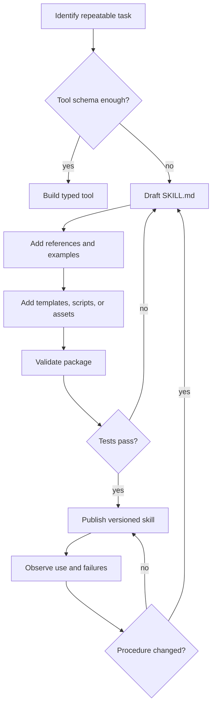

# Skills

Skills empaquetan conocimiento procedimental como carpetas descubribles y versionadas de instrucciones, referencias, scripts, plantillas, recursos y pruebas.

> Fuente y descargas
>
> - [Repository source](https://github.com/GTuritto/Agentic-Systems-Patterns/tree/main/skills-pattern)
> - [Download code bundle](/downloads/skills.zip)

## Intento

El Skills Pattern empaqueta conocimiento procedimental como carpetas descubribles: instrucciones concisas, referencias, scripts, plantillas y pruebas que un agent carga solo cuando son relevantes.

Esta carpeta incluye un pequeño paquete de skill para release-notes. Muestra la estructura que debe tener un skill de producción: `SKILL.md` para activación y procedimiento, referencias para policy, plantillas para salida estable, fixtures para ejemplos repetibles y un runner/test en TypeScript que un humano o agent puede ejecutar.

## Escenario

Un equipo de plataforma quiere que coding agents preparen release notes, actualicen un changelog y recolecten evidencia de verificación. Un tool schema puede describir "write release notes", pero no puede contener la release rubric del equipo, ejemplos, comandos requeridos, policy de source-link y checklist final.

Un skill es el mejor límite. `SKILL.md` da la regla de activación y el procedimiento corto. Los archivos de referencia contienen la release policy y ejemplos. Los scripts recolectan versión, diff y evidencia de pruebas. Las plantillas mantienen estable la forma de la salida. El agent carga archivos más profundos solo cuando aparece el release task, así que el trabajo de codificación normal no paga el costo de context.

La pregunta importante es si la carpeta contiene un procedimiento repetible que otro ingeniero pueda revisar, ejecutar, versionar y probar.

## Usar cuando

- Una capability requiere un procedimiento de dominio repetible y no solo una tool API.
- Quieres know-how reutilizable entre agents, equipos o proyectos.
- El agent se beneficia de disclosure progresivo: instrucciones cortas primero, referencias más profundas solo cuando se necesitan.

## Evitar cuando

- Un simple tool schema describe completamente la capability.
- El skill incluiría secretos, credenciales o scripts inseguros.
- Las instrucciones son demasiado vagas para probarse con tareas reales.

## Arquitectura

Usa este diagrama para leer Skills como un límite de sistema, no solo una forma de código. La pregunta clave de ownership es: el protocolo o el límite de capability posee schemas, permisos, registros de invocación y validación de respuestas.


## Reglas de decisión

Usa un skill cuando el model necesita juicio procedimental alrededor de una capability. Usa un tool cuando el model solo necesita llamar una operación tipada.

| Necesidad | Preferir | Razón |
| --- | --- | --- |
| Llamar una API estable con entrada y salida tipada. | Tool | El schema y la regla de autorización contienen todo el contrato. |
| Seguir un procedimiento de equipo de varios pasos. | Skill | El agent necesita instrucciones, ejemplos, plantillas y verificaciones. |
| Producir un artifact repetido como una PR note, ADR, reporte o release packet. | Skill | Las plantillas y ejemplos reducen el drift. |
| Ejecutar una acción peligrosa. | Tool detrás de policy, no solo skill. | Skills pueden explicar el procedimiento, pero los permisos deben estar fuera del texto. |
| Compartir capability entre agents o equipos. | Skill más scripts probados. | Humanos y agents necesitan el mismo contrato ejecutable. |



## Forma del sistema

- **Límite del pattern:** el agent descubre o selecciona una capability, envía una solicitud tipada y recibe un resultado tipado a través de un policy boundary.
- **Propietario del state:** el protocolo o el límite de capability posee schemas, permisos, registros de invocación y validación de respuestas.
- **Artifact principal:** `skills-pattern/` contiene un paquete de skill para release-notes revisable con instrucciones de activación, referencia de policy, plantilla, fixture, runner en TypeScript y pruebas.
- **Promesa operativa:** Skills empaquetan conocimiento procedimental como carpetas descubribles y versionadas de instrucciones, referencias, scripts, plantillas, recursos y pruebas.
- **Ruta ejecutable:** comienza con `npm run skills:demo` antes de adaptar el pattern a un sistema más grande.

## Contrato

Un skill de producción debe tener una anatomía pequeña y revisable.

| Parte | Propietario | Prueba A++ |
| --- | --- | --- |
| `SKILL.md` | Regla de activación, procedimiento corto y enrutamiento a material más profundo. | Un nuevo agent puede decidir cuándo usar el skill sin cargar todas las referencias. |
| `references/` | Policy de dominio, ejemplos, rúbricas y edge cases. | Las referencias están acotadas, actualizadas y citadas por el skill. |
| `scripts/` | Recolección, validación, generación o formateo repetible. | Un humano puede ejecutar los scripts fuera del agent loop. |
| `templates/` | Forma de salida estable para artifacts comunes. | Las salidas se mantienen consistentes entre ejecuciones y agents. |
| `tests/` o fixtures | Casos positivos y negativos. | Activación incorrecta, entradas faltantes, salidas inseguras y artifacts malformados fallan. |
| Manifest o metadata | Versión, propietario, dependencias, permisos y entorno. | Los revisores pueden auditar riesgos de supply-chain y permisos. |

### Bad Skill vs Production Skill

| Weak Skill | Production Skill |
| --- | --- |
| "Use this for writing." | "Use this for release notes from verified engineering evidence." |
| Un solo archivo largo de instrucciones. | `SKILL.md` corto más referencias enrutadas. |
| Consejos vagos y ejemplos copiados en el context. | Plantillas, fixtures y scripts con salida determinista. |
| Suposiciones de shell ocultas. | Comandos explícitos, dependencias, entradas, salidas y modos de fallo. |
| Sin casos negativos. | Pruebas de activación incorrecta, evidencia faltante, solicitud insegura y salida malformada. |
| El texto del skill implica permiso. | Policy y autoridad de ejecución viven fuera del texto. |

## Core Protocol

1. Descubre la capability, schema, permisos y restricciones operativas.
2. Prepara una solicitud tipada a partir del goal y state actuales.
3. Autoriza la solicitud antes de la invocación.
4. Invoca el tool, skill o remote agent y valida el resultado.
5. Devuelve structured output, rechazo, progreso o error sin perder correlation IDs.

## Notas de implementación

- Mantén `SKILL.md` corto y enruta a archivos más profundos solo cuando sea necesario.
- Incluye scripts y plantillas en vez de pedirle al model que recree artifacts frágiles.
- Trata los skills como insumos de supply-chain: revisa, versiona, prueba y restringe la ejecución.
- Incluye ejemplos de uso exitoso y fallido.
- Registra propietario, versión, dependencias y ruta de rollback antes de distribuir un skill.
- Prefiere scripts ejecutables para formateo frágil, recolección de evidencia o validación.
- Mantén credenciales en almacenes de plataforma o variables de entorno, nunca dentro de archivos de skill.

### Skills CLI-First

Un skill útil debe poder ser invocado tanto por un humano como por un agent. Una interfaz de línea de comandos suele ser el contrato compartido más simple:

- un comando por capability;
- subcomandos predecibles como `list`, `get`, `create` y `run`;
- salida estructurada para agents y salida legible para humanos;
- valores predeterminados no interactivos con flags explícitos como `--yes` o `--force`;
- credenciales desde el entorno o almacenes de plataforma, no prompts ocultos dentro del comando.

Esto mantiene el skill comprobable fuera del agent loop. Si un humano no puede ejecutar el skill directamente e inspeccionar la salida, será más difícil depurar el agent cuando el skill falle.

## Modos de fallo

- Descripciones de skill demasiado amplias, causando activación irrelevante.
- Archivos largos de instrucciones que consumen context antes de entender la tarea.
- Dependencias ocultas que solo funcionan en una máquina.
- Scripts maliciosos o desactualizados incluidos.
- Texto de prompt que amplía silenciosamente la autoridad de tool o filesystem.
- Referencias que entran en conflicto con `SKILL.md` o entre sí.
- Plantillas que divergen porque ningún fixture prueba el artifact final.
- Falta de ruta de rollback después de que se publica una mala versión de skill.

## Lista de revisión

Antes de agregar un skill a un entorno de agent, verifica:

- La descripción es lo suficientemente específica para que el skill se active solo para las tareas correctas.
- La primera pantalla de instrucciones le dice al agent qué hacer, qué no hacer y qué archivos cargar después.
- Cualquier script es determinista, no interactivo por defecto y seguro para ejecutarse con el menor privilegio.
- Los secretos provienen de almacenes de plataforma o variables de entorno, nunca de texto copiado.
- El skill tiene al menos un ejemplo de éxito y uno de rechazo o mal uso.
- El skill registra suficiente evidencia para que un revisor pueda reproducir el resultado.
- El skill puede deshabilitarse, versionarse o revertirse de forma independiente al prompt del agent.

## Estrategia de evaluación

- Prueba el uso en el happy-path, activación de tareas incorrectas, entradas faltantes, artifacts mal formados, solicitudes inseguras y dependencias ausentes.
- Verifica que la skill cargue solo las referencias necesarias para el task.
- Valida los artifacts generados contra plantillas en lugar de solo revisar la calidad del texto.
- Ejecuta scripts fuera del agent loop para que los humanos puedan reproducir fallos.
- Rastrea la precisión de activación, la completitud de la evidencia, la tasa de fallos de scripts, la validez de artifacts y el éxito del rollback.

## Lista de verificación para producción

- Nombra el owner, versión, conjunto de dependencias y runtime soportado.
- Mantén `SKILL.md` lo suficientemente corto para el uso en la primera carga.
- Protege scripts peligrosos detrás de una policy externa y aprobación.
- Valida entradas, salidas, placeholders de plantillas y evidencia requerida.
- Registra el nombre de la skill, versión, referencias cargadas, scripts ejecutados, artifacts escritos y estado final.
- Fija o revierte la skill de forma independiente al agent prompt.

Usa la lista de verificación descargable del libro en línea al revisar un paquete de skill para producción.

## Ejecuta el ejemplo

```sh
npm run skills:demo
npm run skills:test
```

## Recorrido por el código

Lee el extracto como la expresión ejecutable más pequeña del pattern. El capítulo circundante explica las restricciones de diseño; el código muestra dónde esas restricciones se convierten en interfaces concretas, state, validación o flujo de control.

## Código fuente

Estos extractos muestran la forma de la implementación. El código completo está disponible en el bundle de descarga y en el repositorio fuente.

### `skills-pattern/release-notes-skill/SKILL.md`

[Open full source](https://github.com/GTuritto/Agentic-Systems-Patterns/blob/main/skills-pattern/release-notes-skill/SKILL.md)

```md
# Release Notes Skill

Use this skill when the task is to prepare release notes from verified engineering evidence.

## Activation

Use this skill for release notes, changelog entries, launch summaries, or publish-ready update notes. Do not use it for product marketing copy, speculative roadmap notes, or incident reports.

## Procedure

1. Read `references/release-policy.md` before drafting.
2. Load the evidence record from the caller or from `fixtures/release-evidence.json` for the demo.
3. Render the notes with `templates/release-notes.md`.
4. Include only shipped changes, verification evidence, known limits, and artifact links.
5. Refuse or return `needs_evidence` when verification, owner, version, or artifact data is missing.

## Do Not

- Invent test results, artifact links, owners, dates, or version numbers.
- Convert unresolved risks into shipped features.
- Use promotional language.
- Hide failed or skipped verification.

## Expected Output

Return concise release notes with these sections: summary, shipped changes, verification, artifacts, known limits, and owner.
```

### `skills-pattern/typescript/src/skill_package.ts`

[Open full source](https://github.com/GTuritto/Agentic-Systems-Patterns/blob/main/skills-pattern/typescript/src/skill_package.ts)

```ts
import fs from "node:fs/promises";
import path from "node:path";
import { fileURLToPath } from "node:url";

export type ReleaseEvidence = {
  version?: string;
  owner?: string;
  summary?: string;
  changes?: string[];
  verification?: string[];
  artifacts?: string[];
  knownLimits?: string[];
};

export type SkillPackage = {
  root: string;
  skillMarkdown: string;
  policyMarkdown: string;
  templateMarkdown: string;
};

export type SkillValidation = {
  status: "pass" | "fail";
  reasons: string[];
};

export type SkillRunResult = {
  status: "rendered" | "needs_evidence" | "blocked";
  validation: SkillValidation;
  output: string;
};

const requiredTemplateFields = [
  "version",
  "owner",
  "summary",
  "changes",
  "verification",
  "artifacts",
  "knownLimits",
];

const requiredEvidenceFields: Array<keyof ReleaseEvidence> = [
  "version",
  "owner",
  "summary",
  "changes",
  "verification",
  "artifacts",
];

export function defaultSkillRoot() {
  const current = path.dirname(fileURLToPath(import.meta.url));
  return path.resolve(current, "..", "..", "release-notes-skill");
}

export async function readSkillPackage(root = defaultSkillRoot()): Promise<SkillPackage> {
  const [skillMarkdown, policyMarkdown, templateMarkdown] = await Promise.all([
    fs.readFile(path.join(root, "SKILL.md"), "utf8"),
    fs.readFile(path.join(root, "references", "release-policy.md"), "utf8"),
    fs.readFile(path.join(root, "templates", "release-notes.md"), "utf8"),
  ]);

  return {
    root,
    skillMarkdown,
    policyMarkdown,
    templateMarkdown,
  };
}

export async function readEvidence(evidencePath: string): Promise<ReleaseEvidence> {
  return JSON.parse(await fs.readFile(evidencePath, "utf8")) as ReleaseEvidence;
}

export function validateSkillPackage(skillPackage: SkillPackage): SkillValidation {
  const reasons: string[] = [];
  const skillWordCount = skillPackage.skillMarkdown.split(/\s+/).filter(Boolean).length;

  if (!/^# Release Notes Skill/m.test(skillPackage.skillMarkdown)) reasons.push("missing skill title");
  if (!/## Activation/.test(skillPackage.skillMarkdown)) reasons.push("missing activation section");
  if (!/## Procedure/.test(skillPackage.skillMarkdown)) reasons.push("missing procedure section");
  if (!/## Do Not/.test(skillPackage.skillMarkdown)) reasons.push("missing negative constraints");
  if (skillWordCount > 260) reasons.push("SKILL.md is too long for first-load instructions");
  if (!/Required Evidence/.test(skillPackage.policyMarkdown)) reasons.push("policy missing required evidence");

  for (const field of requiredTemplateFields) {
    if (!skillPackage.templateMarkdown.includes(`{{${field}}}`)) {
      reasons.push(`template missing placeholder: ${field}`);
    }
```

_Extracto truncado para mayor legibilidad. Descarga el bundle o abre el archivo fuente para la implementación completa._

### `skills-pattern/typescript/test/skill_package.spec.ts`

[Open full source](https://github.com/GTuritto/Agentic-Systems-Patterns/blob/main/skills-pattern/typescript/test/skill_package.spec.ts)

```ts
import path from "node:path";
import {
  defaultSkillRoot,
  readSkillPackage,
  renderReleaseNotes,
  runReleaseNotesSkill,
  validateEvidence,
  validateSkillPackage,
  type ReleaseEvidence,
} from "../src/skill_package.ts";

function assert(condition: unknown, message: string): asserts condition {
  if (!condition) throw new Error(message);
}

const skillRoot = defaultSkillRoot();
const skillPackage = await readSkillPackage(skillRoot);
const validation = validateSkillPackage(skillPackage);

assert(validation.status === "pass", `Expected valid skill package: ${validation.reasons.join(", ")}`);
assert(skillPackage.skillMarkdown.includes("## Activation"), "Expected activation section");
assert(skillPackage.policyMarkdown.includes("Required Evidence"), "Expected policy required evidence");

const evidencePath = path.join(skillRoot, "fixtures", "release-evidence.json");
const result = await runReleaseNotesSkill({ skillRoot, evidencePath });
assert(result.status === "rendered", "Expected rendered release notes");
assert(result.output.includes("# Release Notes: 2026-06-21-skills-reference"), "Expected release title");
assert(result.output.includes("npm run skills:test"), "Expected verification evidence");
assert(!result.output.includes("{{"), "Expected all placeholders replaced");

const missingEvidence: ReleaseEvidence = {
  version: "missing-fields",
  changes: [],
};
const evidenceIssues = validateEvidence(missingEvidence);
assert(evidenceIssues.includes("missing evidence: owner"), "Expected owner evidence issue");
assert(evidenceIssues.includes("missing evidence: verification"), "Expected verification evidence issue");

const unsafeTemplate = "# Release Notes: {{version}}\n\n{{summary}}";
const rendered = renderReleaseNotes(unsafeTemplate, {
  version: "v1",
  owner: "maintainer",
  summary: "Shipped source-backed skill package.",
  changes: ["Added skill package."],
  verification: ["npm run skills:test"],
  artifacts: ["skills-pattern/release-notes-skill/SKILL.md"],
});
assert(rendered.includes("v1"), "Expected template replacement");
assert(!rendered.includes("{{summary}}"), "Expected summary replacement");

console.log("Skills package tests OK");
```

## Descarga

- [Download source bundle](/downloads/skills.zip)
- [Open source folder](https://github.com/GTuritto/Agentic-Systems-Patterns/tree/main/skills-pattern)

El bundle de descarga contiene la carpeta `skills-pattern/` actual de este repositorio.

## Patrones relacionados

- [MCP-first Tool Use](https://github.com/GTuritto/Agentic-Systems-Patterns/blob/main/modern-tool-use-pattern/README.md)
- [Context Engineering](https://github.com/GTuritto/Agentic-Systems-Patterns/blob/main/context-engineering-pattern/README.md)
- [Human-in-the-Loop Approval](https://github.com/GTuritto/Agentic-Systems-Patterns/blob/main/human-in-the-loop-approval-agent/README.md)
