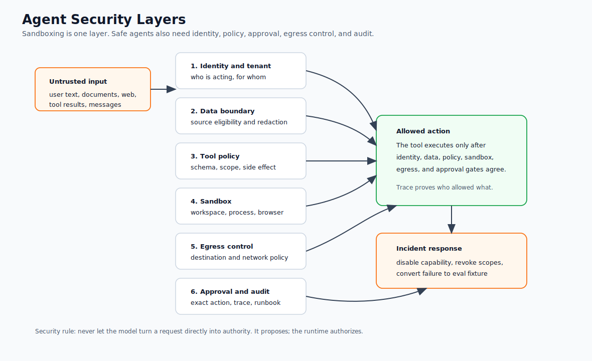

# Agent Security and Sandboxing

Agent security is different from chatbot safety because agents can act. They can read private data, call APIs, write files, run code, trigger workflows, and communicate with other systems.

Use this chapter when an agent has tools, memory, external data, or side effects.

Start with the [Agent Threat Model](./agent-threat-model) if you need to classify the system's risk. Use this chapter when you are ready to design the containment controls.

This chapter belongs after harnesses and production runtime because security is not a prompt feature. The same boundaries that make an agent operable also make it securable: identity, authorization, sandboxing, egress, approvals, traceability, and incident response.

## Security Model

Secure agents by separating four concerns: what the user asks for, what the model proposes, what policy allows, and what the tool actually executes. The model should not be the policy engine. It can classify intent or explain a decision, but deterministic software should enforce permissions.

In production there is a fifth concern: how the request crosses trust boundaries. If an agent calls another agent, a tool gateway, an MCP server, a browser worker, a workflow engine, or a data service, the system needs secure transport, caller identity, scoped authorization, and trace correlation. TLS, mTLS, OAuth or OIDC, policy enforcement, and observability are part of the same boundary.

The model can propose work. It should not mint credentials, choose its own scopes, decide that TLS is optional, approve its own network egress, or hide security events from traces.

## Security Layers

Use this diagram to see sandboxing as one layer in a larger security boundary. The model proposes work; identity, data access, tool policy, sandboxing, egress controls, approval, audit, and incident response decide what can actually happen.



## Threats To Design For

Agent security is easier to reason about when the threat is concrete. Start with these cases before adding more exotic ones.

| Threat | How it shows up | Control that should catch it |
| --- | --- | --- |
| Prompt injection | A document, email, page, or tool result tells the agent to ignore policy or leak data. | Source isolation, instruction hierarchy, retrieval guardrails, output checks. |
| Tool abuse | The model selects a legitimate tool for an unsafe purpose. | Tool policy, scopes, approvals, side-effect classification. |
| Secret leakage | A token, key, customer record, or internal note enters the prompt, memory, logs, or final answer. | Secret handles, redaction, data minimization, trace classification. |
| Data exfiltration | Private data leaves through browser, API, email, file write, or cross-agent message. | Egress policy, destination classification, approval gates, audit records. |
| Confused deputy | The agent uses a user's authority or a service token in a context where it should not. | Delegated scopes, audience checks, tenant checks, route-level permissions. |
| Unsafe delegation | One agent hands work to another agent with broader tools, unclear ownership, or weak identity. | A2A authorization, scoped task envelopes, trace-linked handoffs. |
| Replay or duplicate action | A message, tool call, or workflow step runs twice. | Idempotency keys, nonces, expiry, durable side-effect records. |
| Sandbox escape | Code, browser automation, or file handling reaches outside the intended workspace. | Filesystem isolation, network blocks, process limits, no ambient credentials. |

Do not treat these as abstract risks. Turn them into tests, traces, and operational runbooks.

## The High-Risk Combination

The most dangerous agent shape combines access to private or trusted data, exposure to untrusted content, and the ability to perform external actions. When those three meet, a malicious document, web page, email, or tool result can try to steer the agent into leaking data or taking an unsafe action.

Mitigate this with least privilege, content isolation, approval gates, egress controls, and explicit policy checks.

## Security Control Matrix

Use security controls by boundary, not as one generic "guardrail" layer.

| Boundary | Required Controls |
| --- | --- |
| Data access | Tenant checks, source eligibility, row or document permissions, data minimization, redaction. |
| Tool execution | Typed schemas, policy gate, scoped credentials, idempotency key, timeout, audit record. |
| Network egress | Allowlisted domains, blocked private networks, destination classification, TLS verification. |
| Cross-agent messages | TLS or mTLS, OAuth or OIDC claims, audience checks, scopes, replay protection, trace ID. |
| Browser or code execution | Container or VM isolation, restricted filesystem, no ambient credentials, CPU and wall-clock limits. |
| Memory writes | Source, privacy class, expiry, confidence, correction path, policy decision. |
| Human approval | Proposed action, evidence, policy result, approver identity, timestamp, final tool call. |
| Observability | Redacted traces, policy decisions, identity claims, tool calls, egress attempts, stop reasons. |

The matrix makes one thing visible: sandboxing is necessary, but it is not enough. A sandbox limits the blast radius of execution. It does not replace identity, authorization, policy, approval, egress control, or observability.

## Sandboxing

Sandbox any agent that can execute code, operate a browser, manipulate files, or call write APIs.

Sandbox controls:

- isolated process, container, VM, or browser profile;
- read-only filesystem by default;
- scoped workspace directory;
- no ambient credentials;
- explicit secret injection only for approved tools;
- outbound network restrictions;
- time and CPU limits;
- file size limits;
- audit logs for every side effect;
- cleanup after run completion.

Coding and computer-use agents need stronger sandboxes than read-only research agents.

### Sandbox Tiers

Not every agent needs the same sandbox. Match containment to the work.

| Tier | Use for | Minimum controls |
| --- | --- | --- |
| Read-only | Search, summarization, classification, retrieval over approved data. | No write tools, no secrets in context, traceable retrieval, output redaction. |
| Tool-limited | Business workflows with typed tools and bounded side effects. | Per-tool scopes, policy checks, idempotency keys, approvals for writes. |
| Workspace | Coding, document generation, data transformation, local file edits. | Scoped workspace, read-only source mounts where possible, diff review, cleanup. |
| Browser | Web navigation, form filling, UI automation. | Separate browser profile, blocked private networks, download controls, credential isolation. |
| Code execution | Shell, notebooks, package install, generated code, tests. | Container or VM boundary, CPU and time limits, network policy, no ambient secrets. |

The tier is a product decision. A support draft agent should not silently become a browser automation agent because a tool was convenient.

## Identity And Credentials

Agents should not run with ambient platform credentials. Every credential should be attached to a route, task, tool, user, tenant, and policy decision.

Use:

- short-lived tokens instead of long-lived secrets;
- OAuth or OIDC claims for user and service identity;
- audience checks so a token for one service cannot call another;
- scopes that match the delegated capability;
- mTLS for service-to-service identity where the platform supports it;
- per-tool credential injection after policy approval;
- credential revocation as part of incident response;
- redaction so credentials never enter prompts, memory, eval fixtures, or traces.

The runtime should be able to answer which identity called which tool with which scopes and which policy version allowed it. If it cannot, the credential model is not ready for production agents.

## Network And Egress

Network access is a tool, not a default right. A research agent that can browse the public web should not automatically be able to call internal APIs, metadata services, private networks, customer webhooks, or arbitrary domains.

Useful egress controls:

- allowlist domains by route and tool;
- block private IP ranges and cloud metadata endpoints;
- require TLS certificate validation for remote calls;
- separate browsing from authenticated business APIs;
- classify destinations as internal, partner, customer, public, or unknown;
- log denied egress attempts with trace IDs;
- require approval for new destinations or high-risk data export;
- fail closed when destination classification is missing.

Egress is where data leaks become real. Treat it as part of the policy boundary.

## Access Control

Grant access by role, task, and route. A support-answer agent can read public docs but cannot issue refunds. A billing workflow can read invoice state but needs approval to apply credit. A coding agent can edit files in a branch but cannot deploy to production. A research agent can browse the web but cannot touch customer data. Avoid global tool lists. Each route or agent should receive only the tools needed for the task.

Access control should check both the user and the agent route. A user may have permission to do something manually, but that does not mean every agent acting for that user should inherit the full permission set. Delegation should be narrower than the user's authority.

### Authorization Code Example

Keep authorization outside the prompt. The model can request a tool call, but the runtime decides whether that call can execute.

```ts
type ToolRequest = {
  actorId: string;
  tenantId: string;
  route: string;
  tool: string;
  sideEffect: "read" | "draft" | "write" | "external_send";
  destination?: string;
  idempotencyKey?: string;
};

type RuntimeClaims = {
  subject: string;
  tenantId: string;
  audience: string;
  scopes: string[];
  expiresAt: number;
};

type ToolPolicy = {
  requiredAudience: string;
  allowedTenants: string[];
  toolScopes: Record<string, string>;
  approvalRequiredFor: string[];
  allowedDestinations: string[];
};

type AuthorizationDecision =
  | { allowed: true; reason: "allowed" }
  | { allowed: false; reason: string };

function authorizeToolRequest(
  request: ToolRequest,
  claims: RuntimeClaims,
  policy: ToolPolicy,
  now = Date.now()
): AuthorizationDecision {
  if (claims.expiresAt <= now) {
    return { allowed: false, reason: "expired_token" };
  }

  if (claims.audience !== policy.requiredAudience) {
    return { allowed: false, reason: "wrong_audience" };
  }

  if (claims.tenantId !== request.tenantId || !policy.allowedTenants.includes(request.tenantId)) {
    return { allowed: false, reason: "tenant_boundary" };
  }

  const requiredScope = policy.toolScopes[request.tool];
  if (!requiredScope || !claims.scopes.includes(requiredScope)) {
    return { allowed: false, reason: "missing_scope" };
  }

  if (request.sideEffect !== "read" && !request.idempotencyKey) {
    return { allowed: false, reason: "missing_idempotency_key" };
  }

  if (request.destination && !policy.allowedDestinations.includes(request.destination)) {
    return { allowed: false, reason: "egress_denied" };
  }

  if (policy.approvalRequiredFor.includes(request.tool)) {
    return { allowed: false, reason: "approval_required" };
  }

  return { allowed: true, reason: "allowed" };
}
```

The real implementation should validate signed tokens and certificates with platform libraries. The architectural point is simpler: authorization happens before execution, from trusted runtime claims, not from model text.

## Guardrails

Guardrails should run before and after model calls and before tools.

| Guardrail Point | Checks |
| --- | --- |
| Input | prompt injection, sensitive data, unsupported request, user authorization. |
| Retrieval | untrusted source, stale source, tenant boundary, citation quality. |
| Tool intent | permission, side effect level, policy, approval requirement. |
| Tool input | schema, allowed fields, data minimization, idempotency key. |
| Output | data leakage, unsupported claims, unsafe instructions, missing caveats. |
| Memory write | privacy, source, expiry, correction path. |

No single guardrail is enough. Use layers.

## Secrets

Agents should not see raw secrets unless the tool contract requires them. Prefer server-side tool execution, scoped tokens, and short-lived credentials, with secret access granted per tool, no secrets in prompts or memory, and redacted traces. If a model can read a secret, assume it can accidentally expose it.

Do not pass secrets through natural-language context. Give the model a capability handle, not the secret itself. The tool gateway can resolve that handle after policy passes.

## Security Profile Example

A production agent should have an explicit security profile. The exact format can vary, but the runtime needs these decisions somewhere outside the prompt:

```json
{
  "route": "support_refund_assistant",
  "risk_class": "medium",
  "identity": {
    "allowed_issuers": ["https://identity.example.com"],
    "required_audience": "support-agent-runtime",
    "required_scopes": ["orders:read", "refunds:draft"]
  },
  "sandbox": {
    "filesystem": "read_only",
    "workspace": "/runs/${run_id}",
    "network": {
      "allowed_domains": ["api.example.com", "docs.example.com"],
      "block_private_networks": true,
      "require_tls": true
    },
    "limits": {
      "max_runtime_ms": 60000,
      "max_output_bytes": 200000
    }
  },
  "tools": {
    "allowed": ["orders.lookup", "refunds.draft_refund", "policies.current_refund_policy"],
    "approval_required": ["refunds.issue_refund", "email.send_customer"]
  },
  "observability": {
    "required_trace_fields": ["trace_id", "actor", "tool", "policy_decision", "stop_reason"],
    "redact": ["access_token", "refresh_token", "customer_email", "payment_token"]
  }
}
```

This profile is deliberately boring. That is the point. A boring profile can be reviewed, tested, diffed, rolled back, and attached to an incident.

## Approval Gates

For detailed approval design, use [Human Approval Gates](../tools-skills-protocols/human-approval-gates). In this chapter, approval is treated as a security control for high-risk authority.

Require approval for:

- money movement;
- account changes;
- customer communication at scale;
- production infrastructure changes;
- legal, medical, or compliance decisions;
- deletion or irreversible writes;
- broad data export;
- privilege escalation.

Approval records should include the proposed action, evidence, policy result, approver, timestamp, and final tool call.

## Security Observability

Security controls only help operators if they are visible. Record security events as first-class trace events:

- identity verification result;
- token issuer, audience, subject, tenant, and scopes after redaction;
- TLS or mTLS service identity for cross-service calls;
- policy decision, reason, and policy version;
- sandbox start, limits, denied filesystem access, and denied network egress;
- credential injection and credential refusal;
- approval request, approval decision, and approver identity;
- tool invocation, side-effect identifier, idempotency key, and stop reason;
- redaction action and trace retention class.

Do not turn observability into a data leak. Raw tokens, private keys, secrets, full customer records, and unnecessary payloads should not appear in traces. The goal is to explain authority and behavior, not to duplicate sensitive data.

## Security Evals

Test security controls before launch and after meaningful changes.

| Eval Case | Expected Behavior |
| --- | --- |
| Missing OAuth scope | Tool call is denied before execution and denial is traced. |
| Wrong token audience | Cross-agent request is rejected before payload processing. |
| Prompt injection in retrieved document | Agent treats content as data and does not change policy or destination. |
| Unapproved egress destination | Network call is blocked and recorded with trace ID. |
| Memory write contains private data | Write is denied, redacted, or routed for approval. |
| Tool requests broad credential | Runtime injects only scoped credential or denies the call. |
| Approval-required side effect | Workflow pauses before execution and records approval context. |
| Replay of old message | Idempotency or nonce check blocks duplicate action. |
| Browser tries private network | Request is denied before navigation or upload. |
| Code tries to read outside workspace | Filesystem access is denied and traced. |
| Subagent asks for broader tools | Delegation is refused or routed for approval. |
| Trace contains raw token | Redaction test fails and blocks release. |

Measure false allows, blocked unsafe tool calls, redaction failures, missing trace fields, unauthorized egress attempts, approval-routing accuracy, sandbox escape attempts, and time to investigate a security incident.

## Incident Response

Plan for agent incidents before launch. The team should already know how to disable a tool or a route, roll back a prompt or policy, revoke credentials, quarantine memory, inspect traces, notify affected users, and turn the incident into evals. If the response requires code archaeology in the middle of an incident, the system is not operationally ready.

Security incident response should include identity and credential actions: revoke tokens, rotate secrets, disable service accounts, invalidate message nonces, quarantine affected traces, and preserve enough audit evidence to explain the run.

## Related Chapters

- [Agent Threat Model](./agent-threat-model)
- [Production Runtime Overview](../production-runtime/overview)
- [Policy Enforcement](../production-runtime/policy-enforcement)
- [Observability and Evals](../production-runtime/observability-and-evals)
- [Human Approval Gates](../tools-skills-protocols/human-approval-gates)
- [Secure Agent Communication](../tools-skills-protocols/secure-agent-communication)
- [MCP-first Tool Use](../tools-skills-protocols/mcp-first-tool-use)
- [Circuit Breakers, Fallbacks, and Replay](../pattern-selection/circuit-breakers-fallbacks-replay)
- [Coding Agents](../systems-architecture/coding-agents)
