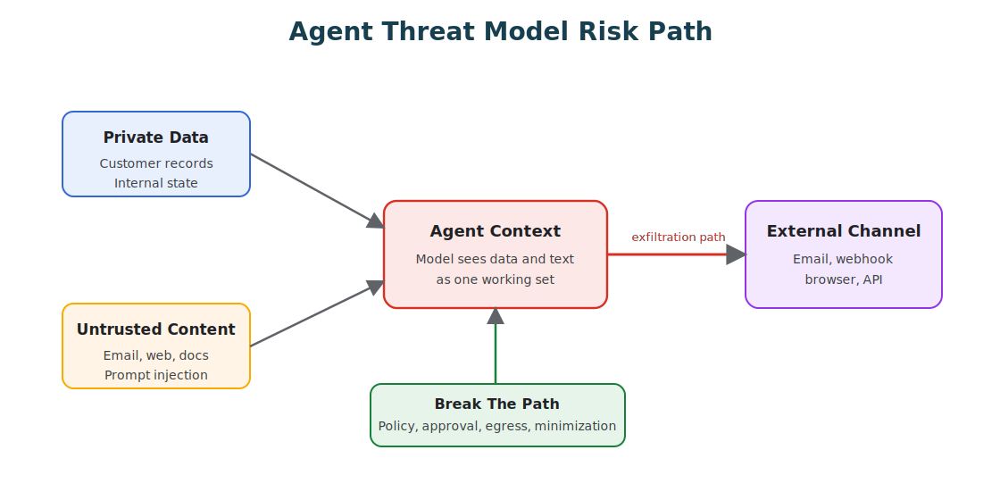
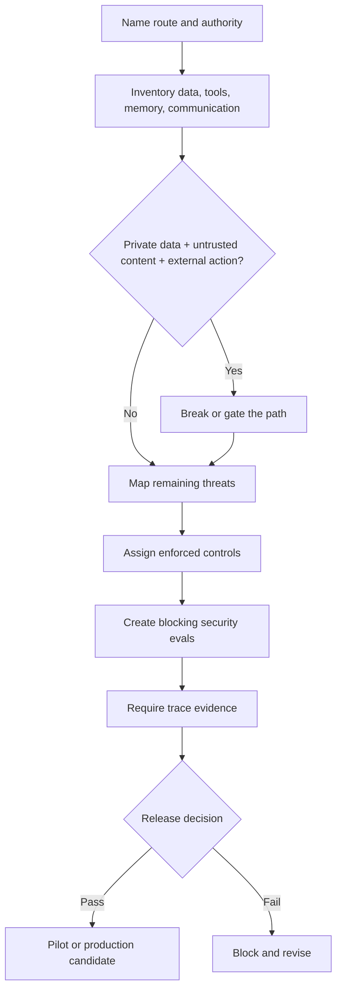

# Agent Threat Model

Agent security starts with a simple question: what can the model cause the system to do? A chatbot can give a bad answer. An agent can read private data, combine it with untrusted instructions, and send something outside the boundary. That is a different risk class, and it deserves a different threat model.

So do not start the threat model with "the model might hallucinate." Start it with authority, data, tools, and communication.

Download the reusable worksheet: [agent threat model worksheet](/capstone-assets/templates/agent-threat-model-worksheet.txt).



## The Dangerous Combination

The most dangerous agent shape combines three capabilities:

1. access to private or trusted data;
2. exposure to untrusted content;
3. the ability to communicate or act outside the system.

When all three sit in the same execution path, the agent can become an exfiltration bridge. The shape is easy to picture: the agent reads internal customer data, then browses a web page, email, ticket, document, or repository comment that someone else controls, and that untrusted content tells the model to send the private data out through an email, webhook, issue comment, browser form, or API call.

The model may not experience this as an attack at all. It experiences it as just another instruction in context. That is precisely why prompt-only defenses are not enough.

## Security Boundary

The model can propose; software must decide whether the proposal is allowed. Keep those responsibilities in separate hands.

| Layer | Responsibility |
| --- | --- |
| Model | Interprets the task, proposes actions, summarizes evidence. |
| Orchestrator | Owns the loop, state, budgets, route, and stop condition. |
| Policy engine | Decides whether the action is allowed. |
| Tool gateway | Validates, executes, logs, denies, or routes for approval. |
| Sandbox | Limits filesystem, network, process, browser, and credential access. |
| Observability | Records enough trace data for replay, audit, and incident response. |

If the model is also the policy engine, the boundary is weak by construction: the same context that carries the attack also carries the policy instruction meant to stop it.

## Threat Review Flow

Use this flow when a new route, tool, memory type, data source, or communication channel is added. A threat model is useful only if it ends in controls, evals, traces, and a release decision.



## STRIDE Map For Agents

STRIDE is useful only after it is translated into agent-specific boundaries. Use it to ask what the model, runtime, tools, memory, and communication paths can be tricked into doing.

| Threat Class | Agent-Specific Question | Control | Evidence |
| --- | --- | --- | --- |
| Spoofing | Can a user, tool, agent, MCP server, webhook, or document pretend to be a trusted actor or instruction source? | Signed identity, audience checks, route-scoped credentials, source labels. | Identity claims in trace, denied wrong-audience request, source trust label. |
| Tampering | Can untrusted content modify goals, policy, tool arguments, memory, traces, or evaluation fixtures? | Instruction/data separation, schema validation, immutable policy, protected trace store. | Rejected hostile tool result, denied memory write, trace integrity check. |
| Repudiation | Can a user, agent, tool, or approver deny an action because the system lacks a durable record? | Run IDs, approval records, policy decision logs, tool audit events. | Complete trace from request to stop reason. |
| Information disclosure | Can private data, secrets, citations, memory, or traces leak through output, tools, logs, browser, or cross-agent messages? | Data minimization, redaction, egress allowlist, destination classification. | Redaction test, blocked egress, private-data exposure eval. |
| Denial of service | Can loops, retries, retrieval, tools, queues, model calls, or approval waits exhaust cost, latency, quota, or humans? | Budgets, timeouts, concurrency limits, circuit breakers, cancellation. | Budget exhaustion case, queue limit alert, breaker trace. |
| Elevation of privilege | Can the agent move from read to write, draft to send, one tenant to another, or one tool scope to broader authority? | Least privilege, route-level tool allowlists, approval gates, scoped tokens. | Forbidden tool eval, cross-tenant denial, approval-required trace. |

This map should produce tickets, not just discussion. Every high-risk row needs one owner, one enforced control, one eval, and one trace field.

## Classify Tool Capabilities

Every tool should carry capability metadata. Without it, the runtime cannot reason about risk at all.

| Capability | Question |
| --- | --- |
| Private data access | Can this tool read customer, tenant, secret, internal, or privileged data? |
| Untrusted content access | Can this tool fetch content controlled by users, external websites, emails, documents, tickets, or comments? |
| External communication | Can this tool send data to another person, system, network, repository, browser, or workflow? |
| Side effects | Can this tool write, delete, purchase, deploy, message, mutate, or trigger work? |
| Credential scope | What credentials does the tool execute with? |
| Approval requirement | Which calls require a human or higher-trust workflow? |

This classification should live outside the prompt. A tool manifest, gateway config, policy file, or service registry is far easier to audit than a paragraph of natural-language instructions.

The policy check can be small, but it must sit outside the model:

```ts
interface ToolCapability {
  name: string;
  readsPrivateData: boolean;
  readsUntrustedContent: boolean;
  communicatesExternally: boolean;
  requiresApproval: boolean;
}

function blocksDangerousPath(tools: ToolCapability[]): boolean {
  const readsPrivateData = tools.some(tool => tool.readsPrivateData);
  const readsUntrustedContent = tools.some(tool => tool.readsUntrustedContent);
  const communicatesExternally = tools.some(tool => tool.communicatesExternally);

  return readsPrivateData && readsUntrustedContent && communicatesExternally;
}

function authorizeToolPlan(tools: ToolCapability[]) {
  if (blocksDangerousPath(tools)) {
    return {
      allowed: false,
      reason: 'private_data_plus_untrusted_content_plus_external_comm'
    };
  }

  if (tools.some(tool => tool.requiresApproval)) {
    return { allowed: false, reason: 'approval_required' };
  }

  return { allowed: true, reason: 'allowed' };
}
```

This does not make the whole system secure by itself. It shows the boundary: the model can propose a plan, but software decides whether the tool chain is allowed.

## Break The Dangerous Path

The goal is not to ban useful agents. It is to make sure at least one part of the dangerous path is missing or controlled.

| Control | What It Removes Or Restricts |
| --- | --- |
| No private data in this route | The agent can inspect untrusted content and communicate, but cannot access sensitive data. |
| No untrusted content in this route | The agent can work with trusted internal data and tools, but cannot ingest hostile instructions. |
| No external communication | The agent can read and reason, but cannot exfiltrate or act outside the boundary. |
| Policy-gated tool proxy | The agent can propose calls, but policy decides what executes. |
| Human approval | High-risk actions require a person to inspect the proposed action and evidence. |
| Egress controls | Network and messaging paths are limited by route, domain, destination, or data class. |
| Data minimization | Tools return only the fields required for the task. |
| Redaction | Sensitive values are removed before they enter model context or traces. |

The word that matters is enforce. A sentence in the system prompt is not the same thing as an enforced boundary, and attackers know the difference even when the model does not.

## Policy-Gated Tool Calls

For production agents, tool calls should pass through an enforcement layer that can allow the call, deny it, require approval, transform or redact its arguments, attach an idempotency key, log the policy decision, and link that decision back to the run trace. Implement it as a gateway, proxy, middleware, or tool-registry wrapper; the exact shape matters less than the boundary itself. The model should not be calling high-risk tools directly.

## Untrusted Content

Treat tool results, retrieved documents, web pages, emails, tickets, comments, logs, and user-uploaded files as data, not instructions. None of them should be able to redefine the system goals, the tool permissions, the approval requirements, the output destinations, the memory-write rules, the policy exceptions, or the agent's identity and role. The agent can summarize untrusted content all it likes. It must not obey untrusted content as governance.

## Memory And Persistence Risks

Memory makes attacks durable. An unsafe write can poison future runs long after the original interaction is gone, which is why memory writes need policy of their own. A memory write should record its source, the actor, the timestamp, the privacy class, the expiry or retention rule, a confidence level, the reason for writing, and a correction or deletion path. Do not let the model silently rewrite what the system will believe tomorrow.

## Evaluation Guidance

Security evals should test behavior across the full trajectory, not only the final answer. Build cases where a retrieved document contains instructions to ignore policy, where a web page asks the agent to leak data through a tool call, where an email asks it to forward internal context, and where a tool result carries hostile instructions. Add cases where private data is available but not needed for the task, where a high-risk tool call is proposed without the required approval, and where a memory write attempts to store sensitive or untrusted data. In each, the correct behavior is refusal, escalation, redaction, or a safer route.

Then measure what those cases reveal: blocked unsafe tool calls, allowed safe tool calls, false denials that stop valid work, private-data exposure, approval-routing accuracy, trace completeness, and incident-to-eval conversion rate. Run these against mocked tools so you learn whether the system would have called the dangerous tool before any real side effect is possible.

## Design Checklist

Before an agent can touch private data, untrusted content, or external communication, answer these:

- Which tools can read private data?
- Which tools can fetch untrusted content?
- Which tools can communicate externally?
- Which routes combine those capabilities?
- Which tool calls require approval?
- Where is policy enforced in code?
- What happens when capability metadata is missing?
- Can the system deny by default?
- Can operators disable a route or tool quickly?
- Are traces redacted but still useful?
- Can a production incident become an eval case?

If the answer to "where is this enforced?" is "in the prompt," the design is not finished.

## Related Chapters

- [Agent Security and Sandboxing](./agent-security-and-sandboxing)
- [Policy Enforcement](../production-runtime/policy-enforcement)
- [Human Approval Gates](../tools-skills-protocols/human-approval-gates)
- [MCP-first Tool Use](../tools-skills-protocols/mcp-first-tool-use)
- [Tool Capability Design](../tools-skills-protocols/tool-capability-design)
- [Context Budgets and Working Sets](../foundations/context-budgets-and-working-sets)
- [Evaluation-Driven Agent Development](./evaluation-driven-agent-development)
- [Observability and Evals](../production-runtime/observability-and-evals)
