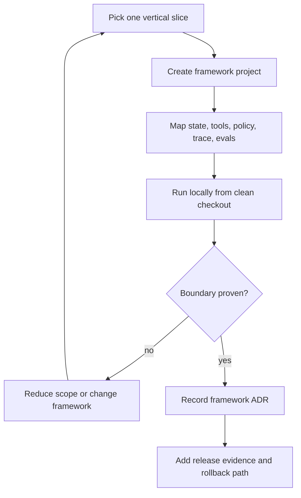

# Real Framework Setup Notes

The labs teach architecture through small local implementations. This chapter shows how to translate those patterns into real framework projects without making the book depend on one language or one vendor.

Use these notes after the framework-neutral labs. Keep the same architectural contracts: state schema, tool manifest, policy gate, trace schema, eval fixtures, and rollback plan. The framework should host those contracts, not replace them.

## How To Use This Chapter

Start with one vertical slice:

1. one user request;
2. one state object;
3. one read tool;
4. one side-effect tool behind policy or approval;
5. one trace;
6. one eval case;
7. one local run command;
8. one rollback or disable path.

Do not begin by porting every lab. Port the smallest behavior that proves the framework can own the responsibility you need it to own.



Use this flow before expanding the port. A framework is a candidate only after it proves the boundary that matters most: state, approval, tool authority, transcript ownership, workflow packaging, or eval integration.

## Shared Setup Rules

Every framework variant should define these files before the first demo:

| Artifact | Purpose |
| --- | --- |
| `.env.example` | Names required keys without storing secrets. |
| `state.schema.*` | Defines resumable state and migration fields. |
| `tools.*` | Declares tool names, inputs, outputs, side effects, and permissions. |
| `policy.*` | Enforces action rules before retrieval, memory writes, tool calls, or final answers. |
| `trace.*` | Emits run, model, tool, policy, approval, and evaluator events. |
| `evals/*` | Stores happy path, negative path, and trajectory checks. |
| `README.md` | Shows install, local run, test, eval, and cleanup commands. |

Keep secrets out of examples. Use `.env.example` for names and local environment variables for values.

## Setup Failure Playbook

Framework ports fail in repeatable ways. Treat setup failures as design evidence, not as local annoyance. A framework is not ready for the book's production path until a new engineer can reproduce install, run, test, eval, and cleanup from a clean checkout.

| Failure | Common Signal | What To Capture | Fix Or Decision |
| --- | --- | --- | --- |
| Wrong runtime version | Python, Node.js, or package manager rejects install. | Runtime version, lockfile version, install command, failing package. | Pin the runtime in docs and CI, or choose a framework slice with supported versions. |
| Hidden provider dependency | Demo imports a provider package that was not installed. | Missing module, provider package name, model route, `.env.example` field. | Make provider packages explicit and keep deterministic fallback tests. |
| Secret required for local test | Baseline test fails before architecture can be inspected. | Command, missing environment variable, whether deterministic fallback exists. | Split unit/eval tests from live-provider smoke tests. |
| Generated scaffold hides policy | Tool, approval, or memory rules live only inside example prompt text. | File path, hidden rule, missing policy module, failed boundary test. | Move policy into code and add a trajectory eval. |
| State cannot resume | Interrupt, retry, or local server restart loses run state. | Thread ID, checkpoint store, resume command, expected state diff. | Add persistent checkpointer or reject the framework for durable workflows. |
| Trace is final-answer only | Logs show output but not route, tool, policy, approval, or stop reason. | Trace fields present and missing, sample run ID, eval requirement. | Add instrumentation before expanding the port. |
| Upgrade breaks behavior | Package update changes routing, tool calls, memory, or termination. | Old/new versions, changed trace, failing fixture, rollback command. | Require regression evals before framework upgrades. |

Capture the failure in the framework ADR. The useful question is not "Can we install it?" The useful question is "Which production boundary did setup prove or fail to prove?"

Use this setup evidence record for each framework slice:

| Field | Example Value |
| --- | --- |
| Framework slice | `native-framework-examples/langgraph-refund/` |
| Runtime versions | `python --version`, `node --version`, or package manager version. |
| Install command | Exact command from clean checkout. |
| Baseline run command | Smallest command that proves the main boundary. |
| Eval command | Scoped command that proves failure behavior. |
| Required secrets | Names only; no values. |
| Deterministic fallback | Yes/no and command. |
| Known setup failure | One captured failure and fix. |
| Rollback or disable path | Command, feature flag, or route removal. |

## LangGraph Variant

Use LangGraph when the main risk is stateful control flow: branching, checkpoints, interrupts, replay, or human approval waits.

Repository native examples:

- `native-framework-examples/langgraph-refund/` for approval, interrupt, and resume behavior.
- `native-framework-examples/langgraph-research-rag/` for source filtering, citation faithfulness, and escalation behavior.

Official setup references:

- [LangGraph install](https://docs.langchain.com/oss/python/langgraph/install)
- [LangGraph graph API](https://docs.langchain.com/oss/python/langgraph/graph-api)
- [LangGraph local server](https://docs.langchain.com/oss/python/langgraph/local-server)
- [LangGraph persistence](https://docs.langchain.com/oss/python/langgraph/persistence)
- [LangGraph interrupts](https://docs.langchain.com/oss/python/langgraph/interrupts)

Typical local setup:

```sh
python3 -m venv .venv
source .venv/bin/activate
pip install -U langgraph
```

For a local LangGraph server, the official docs use the LangGraph CLI:

```sh
pip install -U "langgraph-cli[inmem]"
langgraph dev
```

Use the in-memory server only for local development. Production needs persistent storage for checkpoints and any long-term stores.

Porting path from the labs:

| Lab Asset | LangGraph Mapping |
| --- | --- |
| state object | `StateGraph` state schema |
| loop step | node function |
| route decision | conditional edge |
| approval wait | interrupt plus checkpoint |
| trace event | node, model, tool, policy, and interrupt spans |
| eval case | graph input, expected state diff, expected route, expected stop reason |

Production questions:

- Which checkpointer stores thread-scoped graph state?
- How are thread IDs assigned and protected from cross-tenant access?
- Which nodes can cause side effects?
- Are side-effect nodes idempotent under retry or resume?
- Which state fields need migrations?
- Which interrupts require human approval records?

Native example acceptance check: the example must prove the highest-risk boundary. For refund workflows, it must pause at an approval interrupt, resume by thread ID, preserve prior state, and pass evals without issuing money. For Research RAG, it must omit stale and forbidden sources before answer synthesis, cite only approved current evidence, and escalate when approved evidence is missing.

## AutoGen Variant

Use AutoGen when the main risk is collaborative behavior: role contracts, message history, team termination, and transcript review.

Repository native example: `native-framework-examples/autogen-delivery/`.

Official setup references:

- [AutoGen documentation](https://microsoft.github.io/autogen/stable//index.html)
- [AgentChat user guide](https://microsoft.github.io/autogen/stable//user-guide/agentchat-user-guide/index.html)
- [AgentChat installation](https://microsoft.github.io/autogen/stable//user-guide/agentchat-user-guide/installation.html)
- [AgentChat agents](https://microsoft.github.io/autogen/stable//user-guide/agentchat-user-guide/tutorial/agents.html)
- [AgentChat teams](https://microsoft.github.io/autogen/stable//user-guide/agentchat-user-guide/tutorial/teams.html)
- [AgentChat termination](https://microsoft.github.io/autogen/stable//user-guide/agentchat-user-guide/tutorial/termination.html)
- [AutoGen to Microsoft Agent Framework migration guide](https://learn.microsoft.com/en-us/agent-framework/migration-guide/from-autogen/)

Typical local setup:

```sh
python3 -m venv .venv
source .venv/bin/activate
pip install -U "autogen-agentchat" "autogen-ext[openai]"
```

AutoGen AgentChat currently requires Python 3.10 or later. AutoGen is community-maintained, so new long-lived Microsoft-stack projects should also evaluate Microsoft Agent Framework before standardizing on AutoGen. Keep provider packages explicit so model dependencies do not hide inside the framework.

Porting path from the labs:

| Lab Asset | AutoGen Mapping |
| --- | --- |
| supervisor | team manager or coordinator |
| worker contract | agent role, tools, and expected output |
| transcript | durable message record |
| termination rule | team stop condition |
| tool policy | execution wrapper outside the message text |
| eval case | transcript replay with role, tool, and termination assertions |

Production questions:

- Who owns the transcript as durable state?
- Which messages are persisted, redacted, and replayable?
- What stops the team?
- Which agent may call which tool?
- Can a retry duplicate a tool side effect?
- Which transcript failures become eval fixtures?

Native example acceptance check: the example must define role-specific AgentChat agents, a team termination rule, a normalized transcript export, and evals that fail on missing roles, invalid turn order, or missing final owner.

## Mastra Variant

Use Mastra when the main risk is packaging a TypeScript product runtime around agents, workflows, tools, memory, observability, and evals.

Repository native example: `native-framework-examples/mastra-refund/`.

Official setup references:

- [Mastra docs](https://mastra.ai/docs)
- [Mastra quickstart](https://mastra.ai/guides/getting-started/quickstart)
- [Mastra manual install](https://mastra.ai/docs/getting-started/manual-install)
- [Mastra agents](https://mastra.ai/docs/agents/overview)
- [Mastra tools](https://mastra.ai/docs/agents/using-tools)
- [Mastra workflows](https://mastra.ai/docs/workflows/overview)
- [Mastra evals](https://mastra.ai/docs/evals/overview)

Typical local setup starts from the framework CLI:

```sh
npm create mastra@latest
```

Use the scaffold to inspect project structure, then map the book's contracts into framework-owned modules. Do not leave product policy only inside generated example code.

Porting path from the labs:

| Lab Asset | Mastra Mapping |
| --- | --- |
| agent decision | Mastra agent |
| deterministic control flow | workflow |
| tool registry | typed tool declarations |
| memory contract | framework memory plus retention policy |
| trace schema | runtime observability export |
| eval case | framework eval plus repository fixture |

Production questions:

- Which parts are Mastra-owned and which remain application-owned?
- Where do tools declare side effects and permissions?
- How are workflows deployed, retried, and rolled back?
- How are traces and eval results exported to the team's operational system?
- Which framework upgrades require regression evals?

Native example acceptance check: the example must define a refund draft agent, typed policy and draft tools, a workflow that enforces policy-before-draft order, and an eval that fails on money movement or customer messaging.

## CrewAI Variant

Use CrewAI when the main risk is Python workflow automation with flow-owned state and bounded specialist crews.

Repository native example: `native-framework-examples/crewai-delivery/`.

Official setup references:

- [CrewAI docs](https://docs.crewai.com/)
- [CrewAI installation](https://docs.crewai.com/en/installation)
- [CrewAI quickstart](https://docs.crewai.com/en/quickstart)
- [CrewAI introduction](https://docs.crewai.com/en/introduction)

CrewAI's current docs emphasize Python 3.10 through 3.13, `uv`-based installation, and a quickstart that scaffolds a Flow plus an agent crew. Keep the generated flow small enough that state transitions remain visible.

Porting path from the labs:

| Lab Asset | CrewAI Mapping |
| --- | --- |
| flow state | CrewAI Flow state |
| task delegation | crew tasks |
| worker contract | agent role, goal, tools, and output shape |
| merge policy | flow acceptance step |
| trace event | flow, task, and crew output records |
| eval case | flow output plus role-output assertions |

Production questions:

- What does the Flow own that the Crew must not mutate implicitly?
- What does each role add that a deterministic function could not?
- How are crew outputs validated before the flow accepts them?
- What happens when one role fails or disagrees?
- Which flow checkpoints are needed before external side effects?

Native example acceptance check: the example must keep planner, reviewer, and tester outputs separate, then let the Flow decide final acceptance.

## Mini-Runtime Variant

Use the custom mini-runtime when the main risk is understanding and owning the architecture. It is not a framework replacement for every production need. It is a teaching and design tool.

Map the same contracts directly:

| Contract | Mini-Runtime Location |
| --- | --- |
| state | explicit application object or table |
| tools | registry with schemas and side-effect labels |
| policy | function called before authority |
| memory | context packet plus governed storage |
| trace | append-only event list |
| evals | deterministic tests over state, trace, and output |

The mini-runtime is valuable because it makes the hidden framework responsibilities visible. After building it, readers can judge whether LangGraph, AutoGen, Mastra, or CrewAI adds enough operational value to justify the abstraction.

## Framework-Agnostic Acceptance Checklist

Before calling a framework port complete, verify:

- install command is documented and reproducible;
- local run command works from a clean checkout;
- secrets live in environment variables, not source;
- state owner is named;
- tool side effects are declared;
- policy runs before authority;
- traces include model, tool, policy, and evaluator events;
- evals cover happy path, negative path, and trajectory;
- rollback or kill switch is documented;
- framework-specific code does not hide product contracts.

If the port passes only the happy path, it is still a demo.
