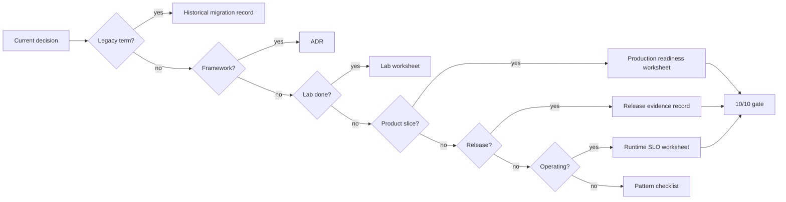
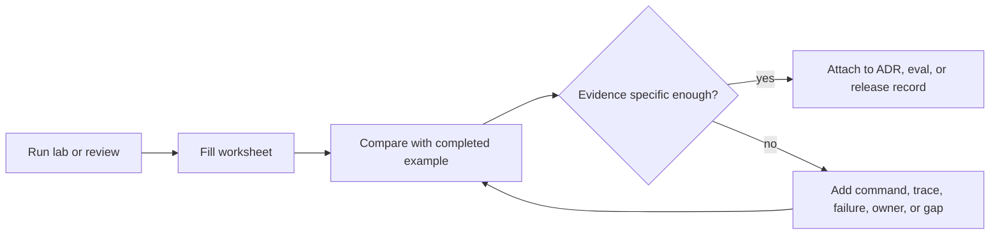

# Templates and Worksheets

These templates turn the book's guidance into reviewable engineering artifacts. Use them when a lab becomes a product slice, when a team chooses a framework, or when an agent gains more authority.

Copy only the sections that matter. A short, complete decision record beats a long template with empty answers.

For filled examples, compare these templates with the [Capstone Projects](../capstone-projects/).

## Choose The Right Artifact

Start with the artifact that matches the decision in front of you. Do not fill every template by default.

| Situation | Use This Artifact | Done When |
| --- | --- | --- |
| Choosing LangGraph, AutoGen, Mastra, CrewAI, or a custom runtime | [Framework selection ADR template](/capstone-assets/templates/framework-selection-adr-template.txt) | The team can name what the framework owns and what the application still owns. |
| Studying completed agent ADRs | [Completed agent ADR examples](/capstone-assets/templates/completed-agent-adr-examples.txt) | The team can compare its decision record with realistic authority, RAG, and multi-agent examples. |
| Studying completed lab evidence | [Completed lab evidence examples](/capstone-assets/templates/completed-lab-evidence-examples.txt) | The team can compare its worksheet with concrete commands, traces, failure paths, production gaps, and release decisions. |
| Studying production readiness evidence | [Completed production readiness examples](/capstone-assets/templates/completed-production-readiness-examples.txt) | The team can compare its production worksheet with concrete owners, gates, blockers, readiness ratings, and next actions. |
| Reviewing an Agentic RAG answer | [Agentic RAG query trace worksheet](/capstone-assets/templates/agentic-rag-query-trace-worksheet.txt) | The team can reconstruct source selection, omitted evidence, citation checks, and the final answer/refusal decision. |
| Reviewing a debate or consensus workflow | [Debate and consensus review checklist](/capstone-assets/templates/debate-consensus-review-checklist.txt) | Independence, merge policy, dissent handling, budget, baseline comparison, and judge errors are reviewed. |
| Threat-modeling an agent route | [Agent threat model worksheet](/capstone-assets/templates/agent-threat-model-worksheet.txt) | Private data, untrusted content, tool authority, STRIDE risks, evals, and trace evidence are reviewed together. |
| Reviewing agent UX and trust | [Agent UX review worksheet](/capstone-assets/templates/agent-ux-review-worksheet.txt) | Runtime states, visible evidence, user controls, approval UX, correction paths, and UX evals are explicit. |
| Finishing a lab | [Lab completion worksheet](/capstone-assets/templates/lab-completion-worksheet.txt) | The run command, test command, pattern boundary, and lesson are recorded. |
| Completing Lab 02 Agent Loop and Planning | [Lab 02 planning loop guided exercise worksheet](/capstone-assets/templates/lab-02-planning-loop-guided-exercise.txt) | Baseline plan trace, changed input, unsupported step, missing input, and stop-condition contract are captured. |
| Completing Lab 03 Agentic RAG | [Lab 03 Agentic RAG guided exercise worksheet](/capstone-assets/templates/lab-03-agentic-rag-guided-exercise.txt) | Baseline retrieval, grounding change, missing-evidence behavior, source contract, native graph comparison, and eval fixture are captured. |
| Completing Lab 06 Observability and Evals | [Lab 06 observability and evals guided exercise worksheet](/capstone-assets/templates/lab-06-observability-evals-guided-exercise.txt) | Trace contract, missing-policy failure, negative case, CI gate, and incident-to-eval note are captured. |
| Completing Lab 07 Runtime Packaging | [Lab 07 runtime packaging guided exercise worksheet](/capstone-assets/templates/lab-07-runtime-packaging-guided-exercise.txt) | Runtime boundaries, tool order, forbidden side effects, rollback, and native Mastra comparison are captured. |
| Completing Lab 12 State Graphs | [Lab 12 state graph guided exercise worksheet](/capstone-assets/templates/lab-12-state-graph-guided-exercise.txt) | Interrupt, checkpoint, resume, replay safety, native LangGraph comparison, and production follow-up are captured. |
| Turning a lab into a product slice | [Lab production readiness worksheet](/capstone-assets/templates/lab-production-readiness-worksheet.txt) | Missing state, policy, eval, trace, rollback, and ownership controls are explicit. |
| Reviewing a production candidate | [Production readiness worksheet](/capstone-assets/templates/production-readiness-worksheet.txt) | Every high-authority path has evidence or is scoped out of release. |
| Operating a production route | [Runtime SLO and incident review worksheet](/capstone-assets/templates/runtime-slo-and-incident-review-worksheet.txt) | SLOs, dashboard panels, incident triage, trace review, eval conversion, and rollback actions are explicit. |
| Preparing a release | [Release evidence record](/capstone-assets/templates/release-evidence-record.txt) | The release has eval output, known risk, approver, rollback owner, and rollback command. |
| Reviewing agentic system composition | [Agentic system architecture review checklist](/capstone-assets/templates/agentic-system-architecture-review-checklist.txt) | Experience, control, execution, knowledge, safety, observability, evaluation, contracts, and authority boundaries are explicit. |
| Reviewing a full system architecture | [Reference architecture review checklist](/capstone-assets/templates/reference-architecture-review-checklist.txt) | Entry, routing, state, knowledge, tools, memory, approval, evals, observability, and release ownership are reviewed together. |
| Reviewing unattended event-triggered work | [Event-triggered agent review checklist](/capstone-assets/templates/event-triggered-agent-review-checklist.txt) | Event contract, admission, dedupe, ordering, retries, dead letters, storms, traces, and evals are explicit. |
| Reviewing a self-healing workflow | [Self-healing workflow review checklist](/capstone-assets/templates/self-healing-workflow-review-checklist.txt) | Failure classes, recovery policy, idempotency, compensation, breakers, replay packets, and regression evals are explicit. |
| Reviewing a personal agent architecture | [Personal agent architecture review checklist](/capstone-assets/templates/personal-agent-architecture-review-checklist.txt) | Consent, local/cloud split, credentials, memory, user controls, connectors, and audit evidence are explicit. |
| Checking the final bar | [10/10 production gate scorecard](/capstone-assets/templates/ten-out-of-ten-production-gate-scorecard.txt) | The system is reviewable, testable, observable, reversible, and owned. |
| Comparing a capstone with your own system | [Capstone review scorecard](/capstone-assets/templates/capstone-review-scorecard.txt) | You have a concrete adaptation plan and a list of blocking gaps. |
| Scoring a pattern before adoption | [Pattern evaluation scorecard](/capstone-assets/templates/pattern-evaluation-scorecard.txt) | The pattern has evidence for goal, boundary, autonomy, tools, state, context, security, evals, observability, and operations. |
| Translating older agent terminology | [Historical pattern migration record](/capstone-assets/templates/historical-pattern-migration-record.txt) | A vague legacy label is mapped to a current architecture decision with evidence. |
| Reviewing a reusable skill package | [Skill review checklist](/capstone-assets/templates/skill-review-checklist.txt) | Activation, instruction shape, assets, security, versioning, tests, observability, and final decision are explicit. |
| Reviewing one pattern | The matching pattern review checklist below | Use cases, avoid cases, failure modes, evals, and production controls have evidence. |



Use the smallest artifact that proves the decision. Add the production gate only when the system is close enough to release that missing evidence should block progress.

## Completed Examples

Blank templates help only after the reader understands the evidence standard. Use completed examples to compare the density and specificity of your own artifact.



Use [Completed agent ADR examples](/capstone-assets/templates/completed-agent-adr-examples.txt) for architecture decisions. Use [Completed lab evidence examples](/capstone-assets/templates/completed-lab-evidence-examples.txt) for lab evidence packs and eval reviews. Use [Completed production readiness examples](/capstone-assets/templates/completed-production-readiness-examples.txt) when a team needs to calibrate owner, gate, blocker, rollback, and release-decision evidence.

Downloadable versions:

- [A2A agent interoperability review checklist](/capstone-assets/templates/a2a-agent-interoperability-review-checklist.txt)
- [Agentic RAG query trace worksheet](/capstone-assets/templates/agentic-rag-query-trace-worksheet.txt)
- [Agentic system architecture review checklist](/capstone-assets/templates/agentic-system-architecture-review-checklist.txt)
- [Agent threat model worksheet](/capstone-assets/templates/agent-threat-model-worksheet.txt)
- [Agent UX review worksheet](/capstone-assets/templates/agent-ux-review-worksheet.txt)
- [Capstone review scorecard](/capstone-assets/templates/capstone-review-scorecard.txt)
- [Completed agent ADR examples](/capstone-assets/templates/completed-agent-adr-examples.txt)
- [Completed lab evidence examples](/capstone-assets/templates/completed-lab-evidence-examples.txt)
- [Completed production readiness examples](/capstone-assets/templates/completed-production-readiness-examples.txt)
- [Computer-use agent review checklist](/capstone-assets/templates/computer-use-agent-review-checklist.txt)
- [CrewAI flows and crews review checklist](/capstone-assets/templates/crewai-flows-and-crews-review-checklist.txt)
- [Debate and consensus review checklist](/capstone-assets/templates/debate-consensus-review-checklist.txt)
- [Cost controls and runtime budgets review checklist](/capstone-assets/templates/cost-controls-runtime-budgets-review-checklist.txt)
- [Deployment walkthrough review checklist](/capstone-assets/templates/deployment-walkthrough-review-checklist.txt)
- [Domain agent architecture review checklist](/capstone-assets/templates/domain-agent-architecture-review-checklist.txt)
- [Durable workflows review checklist](/capstone-assets/templates/durable-workflows-review-checklist.txt)
- [Evaluator-optimizer review checklist](/capstone-assets/templates/evaluator-optimizer-review-checklist.txt)
- [Event-triggered agent review checklist](/capstone-assets/templates/event-triggered-agent-review-checklist.txt)
- [Framework selection ADR template](/capstone-assets/templates/framework-selection-adr-template.txt)
- [Historical pattern migration record](/capstone-assets/templates/historical-pattern-migration-record.txt)
- [Lab 02 planning loop guided exercise worksheet](/capstone-assets/templates/lab-02-planning-loop-guided-exercise.txt)
- [Lab 03 Agentic RAG guided exercise worksheet](/capstone-assets/templates/lab-03-agentic-rag-guided-exercise.txt)
- [Lab 06 observability and evals guided exercise worksheet](/capstone-assets/templates/lab-06-observability-evals-guided-exercise.txt)
- [Lab 07 runtime packaging guided exercise worksheet](/capstone-assets/templates/lab-07-runtime-packaging-guided-exercise.txt)
- [Lab 12 state graph guided exercise worksheet](/capstone-assets/templates/lab-12-state-graph-guided-exercise.txt)
- [Lab completion worksheet](/capstone-assets/templates/lab-completion-worksheet.txt)
- [Lab production readiness worksheet](/capstone-assets/templates/lab-production-readiness-worksheet.txt)
- [Knowledge-bound agents review checklist](/capstone-assets/templates/knowledge-bound-agents-review-checklist.txt)
- [Long-term episodic memory review checklist](/capstone-assets/templates/long-term-episodic-memory-review-checklist.txt)
- [Mastra runtime review checklist](/capstone-assets/templates/mastra-runtime-review-checklist.txt)
- [Memory-augmented agent review checklist](/capstone-assets/templates/memory-augmented-agent-review-checklist.txt)
- [MCP-first tool use review checklist](/capstone-assets/templates/mcp-first-tool-use-review-checklist.txt)
- [Observability and evals review checklist](/capstone-assets/templates/observability-and-evals-review-checklist.txt)
- [Personal agent architecture review checklist](/capstone-assets/templates/personal-agent-architecture-review-checklist.txt)
- [Parallel agents review checklist](/capstone-assets/templates/parallel-agents-review-checklist.txt)
- [Pattern evaluation scorecard](/capstone-assets/templates/pattern-evaluation-scorecard.txt)
- [Planning and execution review checklist](/capstone-assets/templates/planning-and-execution-review-checklist.txt)
- [Policy enforcement review checklist](/capstone-assets/templates/policy-enforcement-review-checklist.txt)
- [Production evaluation feedback loop review checklist](/capstone-assets/templates/production-evaluation-feedback-loops-review-checklist.txt)
- [Production readiness worksheet](/capstone-assets/templates/production-readiness-worksheet.txt)
- [Release evidence record](/capstone-assets/templates/release-evidence-record.txt)
- [Reference architecture review checklist](/capstone-assets/templates/reference-architecture-review-checklist.txt)
- [Reflection pattern review checklist](/capstone-assets/templates/reflection-pattern-review-checklist.txt)
- [ReAct review checklist](/capstone-assets/templates/react-review-checklist.txt)
- [Runtime SLO and incident review worksheet](/capstone-assets/templates/runtime-slo-and-incident-review-worksheet.txt)
- [Self-improvement review checklist](/capstone-assets/templates/self-improvement-review-checklist.txt)
- [Self-healing workflow review checklist](/capstone-assets/templates/self-healing-workflow-review-checklist.txt)
- [Secure agent communication review checklist](/capstone-assets/templates/secure-agent-communication-review-checklist.txt)
- [Semantic recall and RAG review checklist](/capstone-assets/templates/semantic-recall-rag-review-checklist.txt)
- [Skill review checklist](/capstone-assets/templates/skill-review-checklist.txt)
- [Task delegation review checklist](/capstone-assets/templates/task-delegation-review-checklist.txt)
- [Tool capability design review checklist](/capstone-assets/templates/tool-capability-design-review-checklist.txt)
- [Working memory review checklist](/capstone-assets/templates/working-memory-review-checklist.txt)
- [10/10 production gate scorecard](/capstone-assets/templates/ten-out-of-ten-production-gate-scorecard.txt)

## Framework Selection ADR

Use this ADR when adopting LangGraph, AutoGen, Mastra, CrewAI, a mini-runtime, or another framework.

```md
# ADR-000: Choose [Framework] for [Agent or Workflow]

## Status

Proposed | Accepted | Superseded

## Context

What product problem are we solving?
What user-visible workflow will this framework host?
What constraints matter: language, deployment, compliance, team skills, latency, cost, or existing infrastructure?

## Decision

We will use [framework] for [scope].
The framework will own [state/control flow/tools/memory/evals/observability/deployment].
The application will still own [policy/domain data/security/approval/rollback].

## Alternatives Considered

| Option | Why It Fit | Why We Did Not Choose It |
| --- | --- | --- |
| Direct code / mini-runtime | | |
| LangGraph | | |
| AutoGen | | |
| Mastra | | |
| CrewAI | | |

## Responsibility Boundary

| Responsibility | Owner | Evidence |
| --- | --- | --- |
| State | framework/application/platform | schema, checkpoint, migration plan |
| Control flow | framework/application/platform | graph, workflow, team, flow, loop |
| Tools | framework/application/platform | manifest, schema, permission model |
| Policy | framework/application/platform | enforcement point before authority |
| Memory | framework/application/platform | retention, deletion, correction rules |
| Observability | framework/application/platform | trace schema and dashboard |
| Evals | framework/application/platform | fixtures, thresholds, CI gate |
| Deployment | framework/application/platform | runbook, rollback, kill switch |

## Vertical Slice Proof

- user request:
- state object:
- read tool:
- side-effect tool:
- policy decision:
- trace:
- eval:
- rollback:

## Acceptance Criteria

- local install and run commands are documented;
- state can be inspected and replayed;
- policy runs before side effects;
- evals fail the build for critical regressions;
- traces explain one failed run;
- rollback can disable the risky capability;
- framework-specific code does not hide product policy.

## Consequences

What gets easier?
What gets harder?
What lock-in or migration risk remains?
Which production incident would make us revisit this decision?

## Review Trigger

Review this ADR after model upgrade, framework upgrade, new write-capable tool, new memory type, production incident, or repeated human override.
```

## Production Readiness Worksheet

Use this worksheet before exposing the system to real users, real data, or real side effects.

| Gate | Answer | Evidence |
| --- | --- | --- |
| Owner | Who owns the runtime and incidents? | team, on-call, runbook |
| Scope | Which users, tenants, tools, data, and workflows are in scope? | ADR, service config |
| State | What state exists and where is it persisted? | schema, checkpoint store |
| Idempotency | Which actions can be retried safely? | idempotency keys, side-effect records |
| Tools | Which tools can be called and with what authority? | tool manifest, permission map |
| Policy | Where does policy run before authority? | enforcement code, tests |
| Approval | Which actions require approval? | approval schema, UI/API, expiry |
| Memory | What can be read or written? | retention, deletion, correction rules |
| Observability | Can one failed run be reconstructed? | trace dashboard, redaction proof |
| Evals | What blocks release? | eval fixtures, thresholds, CI output |
| Security | How are secrets, egress, and sandboxing handled? | secret manager, network policy |
| Rollback | How do we disable model, prompt, tool, workflow, or agent? | runbook, feature flag |
| Incident Loop | How do incidents become evals? | post-incident process |

Readiness rating:

```text
green: every high-authority path has evidence
yellow: limited internal or read-only release only
red: demo only; no real users, data, or side effects
```

## Lab-To-Production Checklist

Use this checklist after completing any hands-on lab.

```text
lab:
target product slice:
framework/language:
owner:

Architecture
[ ] Pattern selected and linked
[ ] Framework decision recorded
[ ] State owner named
[ ] Tool boundary defined
[ ] Policy boundary defined
[ ] Human approval boundary defined when needed

Implementation
[ ] Install command documented
[ ] Local run command documented
[ ] Test command documented
[ ] Eval command documented
[ ] .env.example committed
[ ] Secrets excluded from source
[ ] Tool schemas validated
[ ] Side effects use idempotency keys
[ ] Errors have typed outcomes

Production
[ ] Checkpoint or explicit stateless decision recorded
[ ] Trace schema implemented
[ ] Trace redaction implemented
[ ] Eval threshold defined
[ ] CI gate configured
[ ] Rollback path documented
[ ] Kill switch tested
[ ] Runbook created

Evidence
[ ] Test output attached
[ ] Eval output attached
[ ] Example trace attached
[ ] ADR linked
[ ] Owner accepted residual risk
```

If a checked item has no evidence, leave it unchecked.

## Release Gate Checklist

Use this gate for each production release.

Download the [release evidence record](/capstone-assets/templates/release-evidence-record.txt) when preparing a public book release, GitHub Pages deployment, or release PR.

| Check | Required Before Release |
| --- | --- |
| Prompt/model changed | run task, refusal, policy, tool, and cost evals |
| Tool changed | run authorization, schema, idempotency, and error evals |
| Policy changed | run false-allow, false-deny, approval, and escalation evals |
| Memory changed | run read-scope, write-policy, deletion, and correction evals |
| Retrieval changed | run access, freshness, citation, and missing-evidence evals |
| Runtime changed | run retry, cancellation, checkpoint, and trace completeness evals |

Release decision:

```text
release version:
change type:
eval dataset version:
passing threshold:
actual result:
known failures:
approved by:
rollback owner:
rollback command:
```

## Incident-To-Eval Worksheet

Use this after production incidents, near misses, or serious human overrides.

```text
incident ID:
date:
service:
trace ID:
owner:

What happened?

Which boundary failed?
[ ] state
[ ] tool
[ ] policy
[ ] approval
[ ] memory
[ ] retrieval
[ ] model/prompt
[ ] workflow
[ ] observability
[ ] eval gate

What should have happened?

New eval case:
input:
expected trajectory:
expected tool behavior:
expected policy behavior:
expected output:
blocking threshold:

Release rule:
[ ] blocks future release
[ ] warning only
[ ] monitor only

Follow-up:
code change:
policy change:
runbook change:
ADR update:
owner:
due date:
```

An incident that does not produce an eval, a policy change, or a runbook update is likely to repeat.

## Related Chapters

- [Framework Selection](./framework-selection)
- [Real Framework Setup Notes](./real-framework-setup-notes)
- [Cross-Framework Decision Matrix](./cross-framework-decision-matrix)
- [Architecture Decision Records for Agents](../systems-architecture/architecture-decision-records)
- [Deployment Walkthrough](../production-runtime/deployment-walkthrough)
- [Lab Production Readiness Checklist](../hands-on-labs/production-readiness-checklist)
