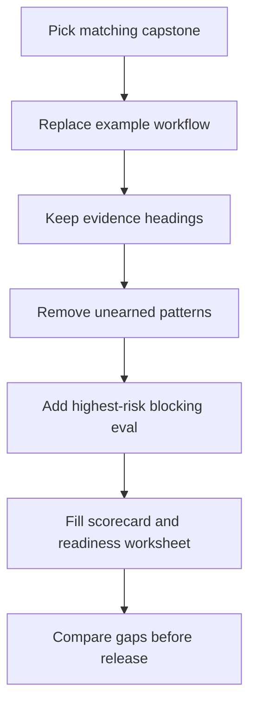

# Capstone Projects

The capstones show how the patterns combine into product-shaped systems. Each capstone starts from a concrete workflow, chooses the right agentic boundaries, maps the design across frameworks, and defines the production evidence required before release.

Use these chapters after the labs. The labs isolate one pattern at a time. The capstones combine patterns into systems with state, tools, policy, memory, observability, evals, deployment, rollback, ownership, and selected native framework slices.

Do not read the capstones as large tutorials. Read them as design review packets. Each one shows what evidence a team should gather before turning an agent pattern into product behavior.

## Capstone Set

| Capstone | Primary Goal | Main Patterns | Framework Lens |
| --- | --- | --- | --- |
| [Support Refund Agent](./support-refund-agent) | Draft policy-safe refund recommendations. | Tool use, policy enforcement, approval gates, observability, evals. | Mastra runtime, LangGraph workflow, mini-runtime, native Mastra and LangGraph slices. |
| [Research RAG Agent](./research-rag-agent) | Answer from approved sources with citations and memory rules. | Context engineering, semantic recall, knowledge-bound agents, memory, evals. | LangGraph graph, direct Python/TypeScript, Mastra runtime, native LangGraph slice. |
| [Multi-Agent Delivery Workflow](./multi-agent-delivery-workflow) | Coordinate specialist agents while preserving one accountable owner. | Supervisor/worker, CrewAI flows, AutoGen transcripts, durable workflows. | CrewAI, AutoGen, LangGraph, Mastra, native CrewAI and AutoGen slices. |

## Choose A Capstone

Use the capstone that matches your highest-risk boundary.

| If Your System Needs... | Start With | Main Risk To Inspect |
| --- | --- | --- |
| A model to draft an action involving money, policy, or customer data. | [Support Refund Agent](./support-refund-agent) | The model must never own final authority for the side effect. |
| Answers grounded in private or approved knowledge sources. | [Research RAG Agent](./research-rag-agent) | The system must refuse or escalate when evidence is missing, stale, or unauthorized. |
| Several specialist agents or roles contributing to one deliverable. | [Multi-Agent Delivery Workflow](./multi-agent-delivery-workflow) | Coordination must not erase blockers, minority concerns, failed tasks, or final ownership. |

If more than one applies, read the capstones in this order: side-effect authority, evidence grounding, then multi-agent coordination. Side effects and private data usually deserve review before topology choices.

## How To Reuse A Capstone

Turn a capstone into your own design review in five steps:

1. Replace the example workflow with your real workflow.
2. Keep the same evidence headings: state, tools, policy, memory, trace, eval, ADR, runbook, rollback.
3. Delete any pattern that does not earn its place in your workflow.
4. Add one blocking eval for the highest-risk failure.
5. Record gaps in the [capstone review scorecard](/capstone-assets/templates/capstone-review-scorecard.txt) and [production readiness worksheet](/capstone-assets/templates/production-readiness-worksheet.txt).

The reusable value is the review shape, not the domain. A refund system, research assistant, and delivery workflow all need the same proof: bounded authority, replayable state, traceable decisions, eval gates, and rollback.



Use this flow as the capstone reuse contract. The output is not a copied implementation; it is a reviewed system packet with gaps, evidence, and release blockers made explicit.

## Run The Capstones

The capstones include deterministic TypeScript assets so readers can inspect state, traces, evals, and rollback behavior without model provider keys.

```sh
npm run capstones:demo
npm run capstones:test
```

Expected demo output:

```text
support-refund-agent: pass
  stop: draft_ready
  trace events: 7
research-rag-agent: pass
  stop: answered_with_citation
  trace events: 6
multi-agent-delivery-workflow: pass
  stop: accepted_after_review
  trace events: 4
```

Source:

- `capstone-projects-runtime/typescript/src/capstones.ts`
- `capstone-projects-runtime/typescript/test/capstones.spec.ts`

After running the commands, compare the output with each capstone's trace and eval sections. The goal is to connect runtime behavior to the written design evidence.

## Runtime Evidence Map

Use this map to inspect the code path before reading the detailed capstone chapters.

| Capstone | Safe Stop | Release Evals | Rollback Path |
| --- | --- | --- | --- |
| Support Refund Agent | `draft_ready` | `draft_contains_policy_citation`, `no_money_movement`, `safe_stop_reason` | Disable `refunds.create_draft`; route the ticket to a human support queue. |
| Research RAG Agent | `answered_with_citation` | `current_source_used`, `stale_source_rejected`, `forbidden_source_omitted`, `citation_faithfulness` | Disable answer synthesis; return the ranked source list only. |
| Multi-Agent Delivery Workflow | `accepted_after_review` | `planner_present`, `risk_review_present`, `test_plan_present`, `turns_sequential`, `final_owner_accepts_last` | Disable delegation; route the request to a single-owner delivery checklist. |

These are not toy assertions. Each eval protects a production boundary:

- The refund capstone proves the agent can draft a recommendation while policy blocks money movement.
- The RAG capstone proves the context packet uses the current approved source and omits stale or forbidden sources.
- The delivery capstone proves specialist agents can contribute without removing final workflow ownership.

## What Each Capstone Proves

Each capstone includes:

- problem and non-goals;
- pattern composition;
- system architecture;
- data and state model;
- tool, policy, memory, and approval boundaries;
- native framework mapping;
- native framework example path where one exists;
- trace example;
- eval report example;
- ADR example;
- runbook example;
- release and rollback checklist.

The repeated structure matters. It gives readers a reusable design review shape: if a future project cannot fill these sections, it is not ready for production.

## Capstone Completion Standard

A capstone is complete only when it can answer these questions:

Download the reusable review artifact: [capstone review scorecard](/capstone-assets/templates/capstone-review-scorecard.txt).

Download the production follow-up worksheet: [production readiness worksheet](/capstone-assets/templates/production-readiness-worksheet.txt).

| Question | Required Evidence |
| --- | --- |
| What owns state? | State schema, checkpoint plan, migration note. |
| What owns authority? | Tool manifest, policy decision, approval rule. |
| What proves quality? | Eval cases, thresholds, failure examples. |
| What proves observability? | Trace event sequence and required fields. |
| What proves production readiness? | Deployment notes, runbook, rollback path. |
| What proves portability? | Framework mapping and assets kept outside framework-only code. |

Do not treat a capstone as a larger lab. Treat it as a small production design review.

## Capstone Review Gate

Use this gate before treating any capstone as A++ material:

| Check | Evidence |
| --- | --- |
| The workflow is concrete | One user-visible or operator-visible workflow starts the system. |
| The authority boundary is explicit | Tools, data, memory, approvals, and side effects have named owners. |
| The unsafe path is blocked | At least one blocking eval catches the highest-risk failure. |
| The run is replayable | State, trace, versions, and eval result can reconstruct success and failure. |
| The reader can reuse the shape | ADR, runbook, trace, eval, checklist, or rollback artifacts are provided. |

Record the score, blocking gaps, and next production artifact in the capstone review scorecard.

## A++ Capstone Rubric

Score each area from 0 to 2.

| Area | A++ Evidence |
| --- | --- |
| Problem and scope | Concrete workflow, explicit non-goals, clear authority level. |
| Pattern composition | Every loop, tool, memory, agent, and approval boundary has a reason to exist. |
| Architecture boundary | Model judgment is separated from deterministic control, policy, state, tools, and approval. |
| Tool and policy control | Tool contracts, permissions, timeouts, audit fields, and high-risk denial or approval paths are documented. |
| State, memory, and context | Run state, memory rules, context sources, trust, freshness, and budget are inspectable. |
| Evaluation evidence | Happy paths, edge cases, unsafe paths, and regressions have thresholds that can block release. |
| Observability and traceability | A successful run and failed run can be reconstructed from trace fields. |
| Production operation | Runbook, incident triggers, rollback, kill switch, and owners are named. |
| Framework portability | Framework-owned and application-owned responsibilities are clear. |
| Reader reuse | The chapter leaves the reader with reusable ADR, trace, eval, runbook, or checklist shapes. |

Interpret the score this way:

- 0-9: example sketch
- 10-14: useful design note
- 15-17: strong capstone
- 18-20: production-grade teaching example

A capstone cannot score A++ if a high-risk tool can run without policy or approval, if no replayable trace exists, if no blocking eval exists for unsafe behavior, if state or memory ownership is unclear, or if rollback is not documented.

## Recommended Reading Order

1. [Support Refund Agent](./support-refund-agent)
2. [Research RAG Agent](./research-rag-agent)
3. [Multi-Agent Delivery Workflow](./multi-agent-delivery-workflow)
4. [Deployment Walkthrough](../production-runtime/deployment-walkthrough)
5. [Templates and Worksheets](../agent-engineering-practice/templates-and-worksheets)

The first capstone is tool and policy heavy. The second is evidence and memory heavy. The third is coordination heavy.
