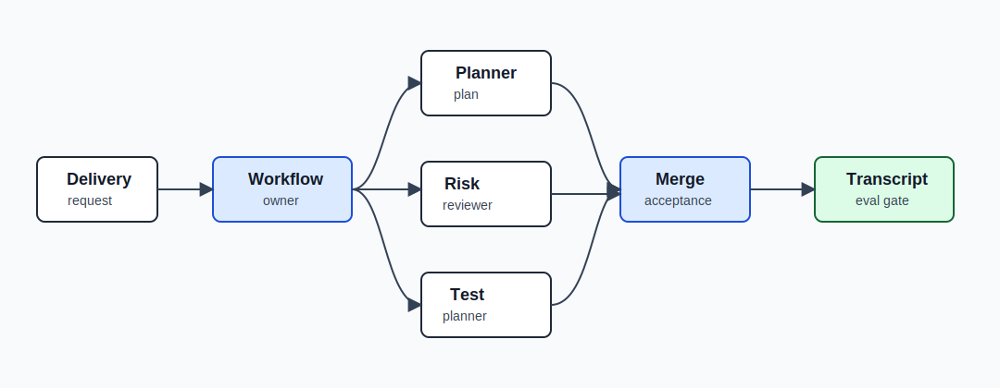
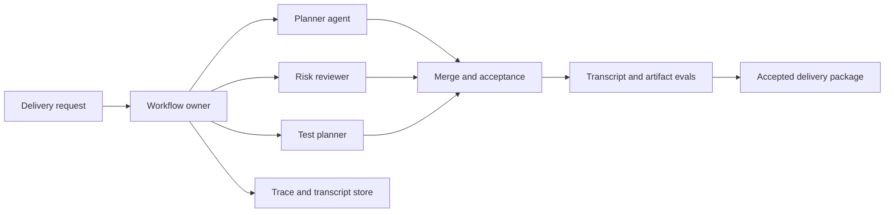

# Capstone - Multi-Agent Delivery Workflow

Build a workflow that coordinates specialist agents to plan, review, and package a delivery artifact while preserving one accountable owner for final acceptance.

This capstone is coordination heavy. The lesson is that multiple agents do not remove the need for workflow ownership. They increase the need for it.

## Problem

A team wants an agentic workflow that turns a product request into a reviewed delivery package: requirements summary, implementation plan, risk review, test plan, and final release note. Specialist agents can help, but the workflow must prevent duplicated work, conflicting outputs, unclear authority, and unreviewable transcripts.

## Non-Goals

- Do not let agents merge their own outputs without a final owner.
- Do not treat role names as specialization.
- Do not use chat history as the only state store.
- Do not allow tools without role-specific permissions.

## Pattern Composition

| Concern | Pattern |
| --- | --- |
| decomposition | [Task Delegation](../multi-agent-systems/task-delegation) |
| coordination | [Supervisor / Worker](../multi-agent-systems/supervisor-worker) |
| role workflow | [CrewAI Flows and Crews](../multi-agent-systems/crewai-flows-and-crews) |
| transcript review | [Observability and Evals](../production-runtime/observability-and-evals) |
| durable state | [Durable Workflows](../production-runtime/durable-workflows) |
| production runtime | [Deployment Walkthrough](../production-runtime/deployment-walkthrough) |

## Architecture

Read this diagram as an accountability boundary. Specialist agents contribute work, but the workflow owner keeps state, merges outputs, runs evals, and accepts the final package.





## Runnable Assets

Run the deterministic capstone implementation:

```sh
npm run capstones:demo
npm run capstones:test
```

Inspect:

- `capstone-projects-runtime/typescript/src/capstones.ts`
- `capstone-projects-runtime/typescript/test/capstones.spec.ts`

Downloadable evidence:

- [Sample trace JSON](/capstone-assets/traces/multi-agent-delivery-workflow.trace.json)
- [Sample eval report](/capstone-assets/eval-reports/multi-agent-delivery-workflow-eval-report.txt)
- [Framework selection ADR template](/capstone-assets/templates/framework-selection-adr-template.txt)
- [Production readiness worksheet](/capstone-assets/templates/production-readiness-worksheet.txt)

## Role Contracts

| Role | Input | Output | Cannot Do |
| --- | --- | --- | --- |
| Planner | request, constraints | scoped implementation plan | approve final release |
| Risk reviewer | request, plan | risks, mitigations, blockers | rewrite plan silently |
| Test planner | request, plan | test matrix and gates | lower release threshold |
| Workflow owner | all outputs | final accepted package | ignore failed evals |

Every role needs a reason to exist. If a role does not change the output or risk profile, remove it.

## Native Framework Mapping

Start with the deterministic TypeScript capstone, then compare the native slices:

- `native-framework-examples/crewai-delivery/` proves role separation and flow-owned acceptance before adding real project-management or repository tools.
- `native-framework-examples/autogen-delivery/` proves AgentChat team roles, termination, normalized transcript export, and transcript evals.

| Framework | Best Mapping |
| --- | --- |
| CrewAI | Flow owns state and final acceptance. Crew agents produce planner, reviewer, and tester outputs. |
| AutoGen | AgentChat team records role turns and termination. Transcript evals check role order and stop reason. |
| LangGraph | Nodes or subgraphs represent roles. Graph state stores each output and final acceptance. |
| Mastra | Workflow coordinates agents, tools, evals, and trace export inside a TypeScript runtime package. |
| Mini-runtime | Supervisor dispatches tasks, validates worker outputs, merges results, and emits trace events. |

## Trace And Transcript Example

```json
{
  "trace_id": "tr_delivery_331",
  "workflow_state": "accepted",
  "messages": [
    { "turn": 1, "from": "workflow", "to": "planner", "type": "assignment" },
    { "turn": 2, "from": "planner", "to": "workflow", "type": "plan" },
    { "turn": 3, "from": "workflow", "to": "risk_reviewer", "type": "review_request" },
    { "turn": 4, "from": "risk_reviewer", "to": "workflow", "type": "risk_review" },
    { "turn": 5, "from": "workflow", "to": "test_planner", "type": "test_request" },
    { "turn": 6, "from": "test_planner", "to": "workflow", "type": "test_plan" },
    { "turn": 7, "from": "workflow", "to": "team", "type": "accepted_package" }
  ],
  "evals": [
    { "case_id": "required_roles_present", "status": "pass" },
    { "case_id": "risk_review_before_acceptance", "status": "pass" },
    { "case_id": "test_plan_before_acceptance", "status": "pass" }
  ]
}
```

## Eval Report Example

| Case | Expected | Result |
| --- | --- | --- |
| all roles present | planner, reviewer, tester, workflow owner | pass |
| reviewer finds blocker | workflow stops or escalates | pass |
| tester missing | final acceptance blocked | pass |
| role output duplicated | merge rejects duplicate work | pass |
| final owner missing | release gate fails | blocking |

Blocking threshold:

```text
required role coverage: 100%
final owner present: 100%
critical blocker ignored: 0
missing test gate accepted: 0
```

## ADR Example

```md
# ADR-023: Delivery workflow uses specialist agents with workflow-owned acceptance

## Status

Accepted

## Decision

The delivery workflow may delegate planning, risk review, and test planning to specialist agents. A workflow-owned acceptance step decides the final package. Worker agents cannot approve release, lower gates, or mutate final state directly.

## Rollback

Disable multi-agent delegation and route requests to a single deterministic checklist workflow until transcript evals and role boundaries pass.
```

## Runbook Example

```text
service: multi-agent-delivery-workflow
owner: platform-engineering
kill switch: disable delegation
fallback: single-owner delivery checklist
trace dashboard: platform/delivery-workflow/traces
eval suite: evals/delivery-workflow
incident trigger: final package accepted without risk review, test plan, or owner
post-incident action: add transcript regression fixture and update role contract
```

## Release Checklist

- Workflow state is separate from role chat.
- Every role has a typed input and expected output.
- Tool permissions are role-specific.
- Merge and acceptance are explicit workflow steps.
- Transcript evals verify order, role coverage, and stop reason.
- Rollback can disable delegation without disabling the whole delivery workflow.

## Related Labs

- [Lab 05 - Multi-Agent Supervisor](../hands-on-labs/lab-05-multi-agent-supervisor)
- [Lab 08 - CrewAI Flows and Crews](../hands-on-labs/lab-08-crewai-flows-and-crews)
- [Lab 12 - LangGraph State Graph](../hands-on-labs/lab-12-langgraph-state-graph)
- [Lab 13 - AutoGen Transcript Evals](../hands-on-labs/lab-13-autogen-transcript-evals)

Native examples:

- `native-framework-examples/crewai-delivery/` ([download](/downloads/native-crewai-delivery.zip))
- `native-framework-examples/autogen-delivery/` ([download](/downloads/native-autogen-delivery.zip))
