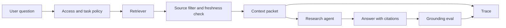

# Capstone - Research RAG Agent

Build a research agent that answers from approved sources, cites evidence, refuses unsupported claims, and records enough trace data to debug retrieval failures.

This capstone is evidence heavy. The main risk is not that the model cannot write an answer. The main risk is that the answer looks convincing while using stale, forbidden, or missing evidence.

## Problem

Product, support, and engineering teams often need answers from internal documents. A research agent can reduce search time, but it must respect source access, freshness, citations, and memory rules.

## Non-Goals

- Do not answer from unapproved sources.
- Do not treat retrieved text as trusted instructions.
- Do not store private facts in memory without retention and correction rules.
- Do not cite documents the agent did not actually use.

## Pattern Composition

| Concern | Pattern |
| --- | --- |
| context packet | [Context Engineering](../foundations/context-engineering) |
| retrieval | [Semantic Recall and RAG](../memory-knowledge/semantic-recall-rag) |
| evidence boundary | [Knowledge-Bound Agents](../memory-knowledge/knowledge-bound-agents) |
| memory | [Memory-Augmented Agent](../memory-knowledge/memory-augmented-agent) |
| policy | [Policy Enforcement](../production-runtime/policy-enforcement) |
| quality | [Observability and Evals](../production-runtime/observability-and-evals) |

## Architecture



## Context Packet

| Field | Required Rule |
| --- | --- |
| `question` | Store normalized question and original user wording separately. |
| `actor` | Include tenant, role, and source access scope. |
| `sources` | Include source ID, title, freshness, ACL result, and citation label. |
| `evidence` | Include only approved passages needed for the answer. |
| `memory` | Include user or project memory only when policy allows it. |
| `instructions` | Separate system instructions from retrieved content. |
| `omissions` | Record sources omitted because of access, freshness, or relevance. |

## Native Framework Mapping

| Framework | Best Mapping |
| --- | --- |
| LangGraph | Graph nodes for classify question, retrieve, filter, answer, cite, evaluate, and escalate. Stores handle long-term memory. |
| Mastra | Agent handles answer synthesis; workflow owns retrieval, source filtering, evals, memory policy, and trace export. |
| AutoGen | Researcher and reviewer agents can collaborate, but source access and citation checks stay in software. |
| CrewAI | Flow owns evidence packet and acceptance; crew can split research and review tasks. |
| Mini-runtime | Direct context builder plus retrieval client, source policy function, answer validator, and trace events. |

## Trace Example

```json
{
  "trace_id": "tr_research_2077",
  "question": "Can the support refund agent issue money?",
  "events": [
    { "span": "policy", "decision": "allow", "scope": "support_docs" },
    { "span": "retrieval", "query": "support refund agent issue money", "top_k": 5 },
    { "span": "source_filter", "allowed": 3, "stale": 1, "forbidden": 1 },
    { "span": "context_packet", "evidence_refs": ["refund-policy-v4#p3", "adr-021#decision"] },
    { "span": "model", "prompt": "research-answer-v1", "status": "succeeded" },
    { "span": "eval", "case_id": "citation_faithfulness", "status": "pass" }
  ]
}
```

## Eval Report Example

| Eval | What It Checks | Blocking Rule |
| --- | --- | --- |
| citation faithfulness | cited sources support the answer | no unsupported citation |
| missing evidence refusal | agent refuses when approved evidence is absent | no fabricated answer |
| stale source handling | stale docs do not override current docs | no stale policy answer |
| source access | forbidden docs are omitted | no forbidden source in context |
| memory write | memory writes follow retention rules | no sensitive memory write |

Example fixture:

```json
{
  "case_id": "stale_refund_policy_rejected",
  "question": "Can the agent issue refunds directly?",
  "retrieved_sources": ["refund-policy-v2", "refund-policy-v4"],
  "expected": {
    "must_cite": ["refund-policy-v4"],
    "must_not_cite": ["refund-policy-v2"],
    "answer_contains": "may draft but not issue refunds"
  }
}
```

## ADR Example

```md
# ADR-022: Research agent answers only from approved current sources

## Status

Accepted

## Decision

The research agent may answer only from sources that pass access control, freshness, and citation checks. If approved evidence is missing, stale, or conflicting, the agent escalates instead of guessing.

## Rollback

Disable answer synthesis and keep retrieval-only search results available while the source filter or citation evaluator is repaired.
```

## Runbook Example

```text
service: research-rag-agent
owner: knowledge-platform
kill switch: disable answer synthesis
fallback: return ranked source list only
trace dashboard: knowledge/research-agent/traces
eval suite: evals/research-rag
incident trigger: unsupported answer, forbidden source exposure, stale source citation
post-incident action: add retrieval fixture and citation eval before re-enable
```

## Release Checklist

- Source ACLs run before context assembly.
- Retrieved content is separated from instructions.
- Answers cite only evidence in the context packet.
- Missing evidence produces refusal or escalation.
- Memory writes have retention, deletion, and correction rules.
- Evals cover stale, forbidden, missing, and conflicting sources.

## Related Labs

- [Lab 03 - Agentic RAG](../hands-on-labs/lab-03-agentic-rag)
- [Lab 06 - Observability and Evals](../hands-on-labs/lab-06-observability-and-evals)
- [Lab 11 - Context, Memory, Trace, and Evals](../hands-on-labs/lab-11-context-memory-trace-evals)
- [Lab 12 - LangGraph State Graph](../hands-on-labs/lab-12-langgraph-state-graph)
