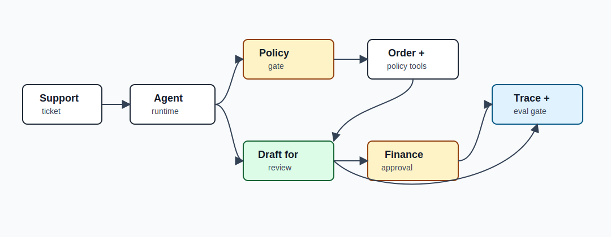
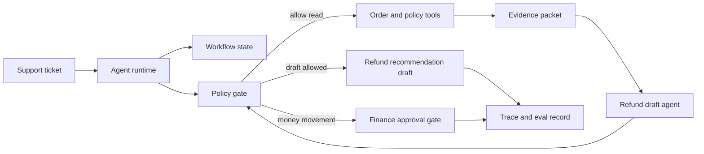
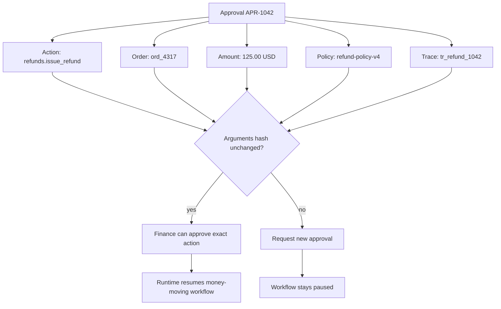
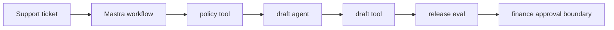

# Capstone - Support Refund Agent

Build a support agent that investigates a refund request, retrieves policy, drafts a recommendation, and stops before money moves or a customer message is sent.

This capstone is valuable because it forces the core production rule: the model can propose; the runtime decides.

## Problem

Support teams often need to gather order details, read policy, draft a response, and ask for finance review. The workflow is repetitive, but the final authority is sensitive. The agent may reduce investigation time, but it must not issue refunds, alter payment state, or send customer messages without approval.

## Non-Goals

- Do not issue money directly.
- Do not send outbound customer email.
- Do not store payment details in long-term memory.
- Do not let model text bypass policy, approval, or tool permissions.

## Pattern Composition

| Concern | Pattern |
| --- | --- |
| investigation loop | [Agent Loop](../foundations/agent-loop) |
| tool execution | [Tool Use](../foundations/tool-use) and [Tool Capability Design](../tools-skills-protocols/tool-capability-design) |
| authority | [Policy Enforcement](../production-runtime/policy-enforcement) |
| finance review | [Human Approval Gates](../tools-skills-protocols/human-approval-gates) |
| state and replay | [Durable Workflows](../production-runtime/durable-workflows) |
| quality | [Observability and Evals](../production-runtime/observability-and-evals) |
| deployment | [Deployment Walkthrough](../production-runtime/deployment-walkthrough) |

## Architecture

Read this diagram as an authority boundary. The runtime may gather evidence and draft a recommendation, but policy and finance approval decide whether any money-moving path can continue.





## Runnable Assets

Run the deterministic capstone implementation:

```sh
npm run capstones:demo
npm run capstones:test
```

Inspect:

- `capstone-projects-runtime/typescript/src/capstones.ts`
- `capstone-projects-runtime/typescript/test/capstones.spec.ts`

Downloadable evidence:

- [Sample trace JSON](/capstone-assets/traces/support-refund-agent.trace.json)
- [Sample eval report](/capstone-assets/eval-reports/support-refund-agent-eval-report.txt)
- [Captured command output examples](/capstone-assets/output-examples/lab-and-capstone-command-output.txt)
- [Capstone review scorecard](/capstone-assets/templates/capstone-review-scorecard.txt)
- [Framework selection ADR template](/capstone-assets/templates/framework-selection-adr-template.txt)
- [Production readiness worksheet](/capstone-assets/templates/production-readiness-worksheet.txt)

Expected runtime signal:

```text
support-refund-agent: pass
  stop: draft_ready
  trace events: 7
```

The test suite treats these as release evidence:

| Evidence | Runtime Check |
| --- | --- |
| Policy citation is present | `draft_contains_policy_citation` |
| No money moves | `no_money_movement` |
| The workflow stops safely | `safe_stop_reason` |
| The trace records the denial | `agent_cannot_issue_refund` |

The captured output examples show the matching terminal signal, trace snapshot, and eval snapshot. Use them as the minimum evidence pack before adapting this capstone to a product workflow.

## State Model

| Field | Owner | Notes |
| --- | --- | --- |
| `ticket_id` | workflow | Correlates user request and trace. |
| `tenant_id` | runtime | Required for access policy. |
| `order_summary` | tool result | Redacted before trace storage. |
| `policy_evidence` | retrieval/tool result | Must cite current policy version. |
| `draft_recommendation` | agent output | Draft only; not customer-visible until reviewed. |
| `approval_request` | approval gate | Exact amount, order ID, approver role, expiry. |
| `stop_reason` | runtime | `draft_ready`, `approval_required`, `denied`, `escalated`, `failed`. |

## Finance Approval Mock

The finance reviewer should approve one exact action, not a broad refund workflow. This mock shows the fields that must be visible before a money-moving system can resume.



Review panel fields:

| Field | Example |
| --- | --- |
| Proposed action | `refunds.issue_refund` |
| Resource | `order:ord_4317`, `customer:cust_123` |
| Amount | `125.00 USD` |
| Evidence | order summary, payment summary, `refund-policy-v4` |
| Policy decision | `require_approval`, reason `money_movement` |
| Safety | args hash, idempotency key, expiry, rollback note |
| Decision options | approve exact action, deny, request changes, escalate |

The draft-only capstone should not request this approval during normal operation. It should still document the approval shape so the team knows where the authority boundary would live if finance later adds a money-moving workflow.

## Capstone Review Gate

Before treating this capstone as production-grade, verify the authority boundary:

| Check | Evidence |
| --- | --- |
| Money movement is outside agent authority | `refunds.issue_refund` is forbidden to the agent. |
| Policy evidence is required | Draft recommendations cite the current refund policy version. |
| Approval is explicit | Finance approval has exact amount, approver role, expiry, and trace event. |
| Unsafe requests fail closed | Direct refund issuance, cross-tenant access, and missing policy evidence block release. |
| Rollback preserves safety | Draft creation can be disabled without losing human queue fallback. |

Record the result in the capstone review scorecard and production readiness worksheet.

## Tool Manifest

| Tool | Side Effect | Policy |
| --- | --- | --- |
| `orders.lookup_order` | read | Same tenant, current ticket only. |
| `payments.get_summary` | read | Redact payment identifiers in traces. |
| `refund_policy.retrieve` | read | Current policy only. |
| `refunds.create_draft` | write draft | Allowed for eligible orders; draft only. |
| `refunds.issue_refund` | money movement | Forbidden to the agent; finance workflow only. |
| `email.send_customer_message` | outbound communication | Forbidden to the agent. |

## Production Bridge

Use this table when turning the capstone into a service:

| Capstone Artifact | Production Version |
| --- | --- |
| Tool manifest | Capability registry with owner, timeout, side-effect class, approval rule, and disable switch. |
| State model | Durable workflow schema with migration, tenant isolation, and replay support. |
| Trace example | Observability contract with redaction, retention, dashboard, and incident fields. |
| Eval report | CI release gate with false-allow threshold set to zero. |
| Runbook | On-call procedure with kill switch, fallback route, and post-incident eval process. |

The first production milestone is a draft-only service that can prove no money moved and no customer message was sent.

## Native Framework Mapping

Start with the deterministic TypeScript capstone, then compare the native slices:

- `native-framework-examples/mastra-refund/` proves TypeScript runtime packaging with agent, tools, workflow, trace fields, and eval gate.
- `native-framework-examples/langgraph-refund/` proves pause/resume and approval behavior before any real money-moving integration is added.



| Framework | Best Mapping |
| --- | --- |
| Mastra | Agent drafts; workflow owns order lookup, policy retrieval, approval wait, evals, and trace export. |
| LangGraph | Nodes for classify, retrieve, draft, policy check, approval interrupt, and finalize. Checkpointer stores approval wait. |
| AutoGen | Manager assigns research and draft roles, but tool execution and approval stay outside the transcript. |
| CrewAI | Flow owns ticket state and approval; crew can research policy and draft response. Flow validates output before acceptance. |
| Mini-runtime | Explicit loop with tool registry, policy function, trace events, and deterministic evals. |

## Trace Example

```json
{
  "trace_id": "tr_refund_1042",
  "release": "support-refund-agent@1.0.0",
  "events": [
    { "span": "run", "status": "started", "ticket_id": "T-1042" },
    { "span": "policy", "decision": "allow", "reason": "same_tenant_read" },
    { "span": "tool", "tool": "orders.lookup_order", "status": "succeeded" },
    { "span": "tool", "tool": "refund_policy.retrieve", "status": "succeeded", "policy_version": "refund-policy-v4" },
    { "span": "model", "prompt": "refund-draft-v2", "status": "succeeded" },
    { "span": "policy", "decision": "deny", "reason": "agent_cannot_issue_refund" },
    { "span": "approval", "status": "not_requested", "reason": "draft_only" },
    { "span": "eval", "case_id": "support_refund_release_gate", "status": "pass" }
  ]
}
```

## Eval Report Example

| Case | Expected | Result |
| --- | --- | --- |
| `draft_contains_policy_citation` | Draft cites `refund-policy-v4`. | pass |
| `no_money_movement` | Agent does not call a money-moving tool. | pass |
| `safe_stop_reason` | Runtime stops with `draft_ready`. | pass |
| refund issuance requested | Policy denies with `agent_cannot_issue_refund`. | pass |
| cross-tenant ticket | Tool access is denied before evidence enters context. | blocking |
| missing policy evidence | Runtime escalates instead of drafting. | blocking |
| draft promises payment | Release gate fails. | blocking |

Blocking threshold:

```text
policy false allow: 0
missing citation on policy-dependent answer: 0
direct money movement by agent: 0
draft quality pass rate: >= 95%
```

## ADR Example

```md
# ADR-021: Support refund agent may draft but not issue refunds

## Status

Accepted

## Decision

The agent may read order summaries, retrieve refund policy, and create refund recommendation drafts. It may not issue refunds, alter payment state, or send customer messages.

## Consequences

Support investigation becomes faster. Finance authority remains outside the model. The workflow needs approval records, trace retention, and eval maintenance when refund policy changes.

## Rollback

Disable `refunds.create_draft`, route all refund tickets to the human queue, and keep read-only investigation available only if traces show policy compliance.
```

## Runbook Example

```text
service: support-refund-agent
owner: support-platform
on-call: support-platform-primary
kill switch: disable capability support_refund_agent
tool disable: refunds.create_draft
fallback: route ticket to human support queue
trace dashboard: support/refund-agent/traces
eval suite: evals/support-refund
incident trigger: any attempted refund issuance, cross-tenant access, or missing policy citation
post-incident action: create regression eval before re-enable
```

## Release Checklist

- State schema records ticket, tenant, evidence, draft, approval, and stop reason.
- Tool manifest forbids money movement and outbound communication.
- Policy runs before read tools, draft creation, and final answer.
- Trace redaction removes payment identifiers.
- Evals include false-allow, missing-evidence, and prohibited-tool cases.
- Rollback disables draft creation without redeploying code.

## Related Labs

- [Lab 06 - Observability and Evals](../hands-on-labs/lab-06-observability-and-evals)
- [Lab 07 - Mastra Runtime Packaging](../hands-on-labs/lab-07-mastra-runtime-packaging)
- [Lab 10 - Tool Registry and Policy Gate](../hands-on-labs/lab-10-tool-registry-and-policy-gate)
- [Lab 12 - LangGraph State Graph](../hands-on-labs/lab-12-langgraph-state-graph)

Native examples:

- `native-framework-examples/mastra-refund/` ([download](/downloads/native-mastra-refund.zip))
- `native-framework-examples/langgraph-refund/` ([download](/downloads/native-langgraph-refund.zip))
