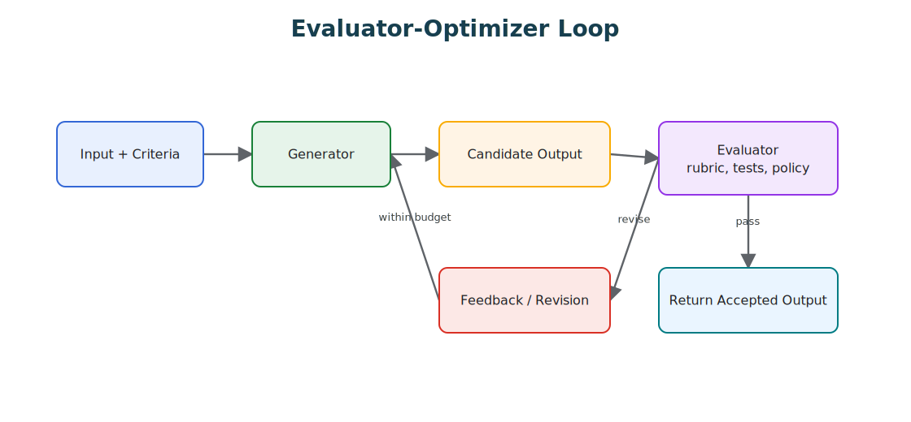

# Evaluator-Optimizer

Evaluator-Optimizer pairs a generator with an evaluator. The generator proposes; the evaluator scores; the optimizer revises or stops.

> Source and downloads
>
> - [Repository source](https://github.com/GTuritto/Agentic-Systems-Patterns/tree/main/evaluator-optimizer-pattern)
> - [Download code bundle](/downloads/evaluator-optimizer.zip)

## Intent

Evaluator-Optimizer pairs a generator with an evaluator and a bounded revision loop. The generator proposes an output. The evaluator checks it against explicit criteria. The optimizer either accepts it, asks for a targeted revision, escalates, or stops when the budget is exhausted.

The pattern is useful when quality can be judged more reliably than it can be produced in one pass. It is dangerous when the evaluator is vague, impressed by fluent prose, or allowed to approve work without checking evidence.

Reflection and Evaluator-Optimizer are related, but not identical. Reflection critiques and improves an output. Evaluator-Optimizer adds a decision boundary: pass, revise, refuse, escalate, or stop.

## Use When

- The task has explicit criteria, tests, policies, examples, or evidence requirements.
- A second pass can catch failures the generator often misses.
- Iteration is worth the extra latency, cost, and complexity.
- The evaluator can produce structured feedback, not just prose critique.
- The controller can enforce max revisions, stop reasons, and escalation rules.

## Avoid When

- The evaluator is only another vague opinion prompt.
- The evaluator cannot inspect the evidence needed to judge correctness.
- The task needs low latency and one pass is good enough.
- The revision loop can change facts, citations, policy decisions, or tool results without validation.
- The team cannot define what a false approval would look like.

## Architecture

Use this diagram to read Evaluator-Optimizer as a system boundary, not only a code shape. The key ownership question is: the loop controller owns progress, budgets, stop conditions, and recovery state.



## System Shape

- **Pattern boundary:** the controller owns criteria, revision budget, evaluator selection, stop decisions, and escalation.
- **Generator role:** propose a candidate output or plan.
- **Evaluator role:** check the candidate against criteria, evidence, policy, and expected structure.
- **Optimizer role:** turn evaluator findings into targeted revision instructions.
- **Operational promise:** improve quality without letting a weak evaluator rubber-stamp unsafe or unsupported work.

## Core Protocol

1. Receive the task, criteria, evidence requirements, and revision budget.
2. Generate the first candidate.
3. Evaluate the candidate with a rubric, tests, policy checks, and evidence checks.
4. If the candidate passes, return it with the evaluator decision.
5. If the candidate has fixable failures, produce targeted revision instructions.
6. Regenerate or patch the candidate.
7. Repeat until pass, refusal, escalation, timeout, or max revisions.
8. Record every candidate, evaluator decision, revision instruction, and stop reason.

## Implementation Notes

Make the evaluator contract explicit.

```ts
type EvaluationDecision = {
  status: 'pass' | 'revise' | 'block' | 'escalate';
  score: number;
  criteria: Array<{
    name: string;
    passed: boolean;
    evidenceRefs: string[];
    reason: string;
  }>;
  blockingFailures: string[];
  revisionInstructions: string[];
  stopReason?: 'passed' | 'max_revisions' | 'policy_block' | 'missing_evidence';
};
```

The controller should enforce the loop, not the evaluator prompt:

```ts
async function runEvaluatorOptimizer(task: Task, budget = { maxRevisions: 2 }) {
  let candidate = await generateCandidate(task);

  for (let revision = 0; revision <= budget.maxRevisions; revision += 1) {
    const decision = await evaluateCandidate(task, candidate);

    if (decision.status === 'pass') {
      return { status: 'succeeded', candidate, decision };
    }

    if (decision.status === 'block' || decision.status === 'escalate') {
      return { status: decision.status, candidate, decision };
    }

    if (revision === budget.maxRevisions) {
      return {
        status: 'failed',
        candidate,
        decision: { ...decision, stopReason: 'max_revisions' }
      };
    }

    candidate = await reviseCandidate(candidate, decision.revisionInstructions);
  }
}
```

The evaluator should not reward nicer prose if the candidate still lacks evidence. It should name the failing criterion and the evidence needed to pass.

## Failure Modes

- Rubber-stamp evaluator: approves fluent but wrong output.
- Vague rubric: evaluator cannot distinguish a real failure from a style preference.
- Self-approval: the same model prompt generates and approves the answer without independent checks.
- Tone optimization: revisions make the answer smoother but not more correct.
- Missing evidence check: evaluator scores confidence without verifying citations or tool results.
- Reward hacking: generator learns phrases that satisfy the evaluator without satisfying the task.
- Endless revision loop: each pass creates new issues because stop conditions are weak.
- Hidden disagreement: evaluator concerns are not surfaced to the caller or trace.
- Evaluation drift: a prompt, model, or rubric change silently alters pass/fail behavior.

## Evaluation Strategy

Evaluate the evaluator itself.

- Test false approvals: polished but wrong answers should fail.
- Test false rejections: correct but awkward answers should pass or receive minor revision.
- Test missing evidence: unsupported claims should block or escalate.
- Test policy failures: unsafe content should not be revised into acceptable wording.
- Test max-revision behavior: the loop must stop cleanly.
- Test adversarial candidates that flatter the evaluator or imitate rubric language.
- Test disagreement between deterministic checks and model-based evaluator judgment.
- Test regression cases from production failures.

A compact evaluator eval can look like this:

```json
{
  "case_id": "polished_unsupported_refund_answer",
  "candidate": "Yes, the customer is clearly eligible for a full refund.",
  "available_evidence": ["order_status: delivered", "policy: refund requires damage evidence"],
  "expected_decision": {
    "status": "block",
    "blocking_failures": ["missing_damage_evidence"],
    "must_not_pass": true,
    "required_revision_instruction": "ask for or retrieve damage evidence"
  }
}
```

Measure false approval rate, false rejection rate, revision success rate, max-revision rate, evaluator consistency, cost, latency, and recurrence of known failures.

## Production Checklist

- Define criteria before generation starts.
- Separate generator and evaluator prompts.
- Use deterministic checks where possible before model judgment.
- Require evidence references for factual, policy, or tool-dependent claims.
- Set max revisions, timeout, and escalation rules.
- Record candidates, scores, criteria results, blocking failures, and revision instructions.
- Version evaluator prompts, rubrics, tests, and model routes.
- Track false approvals and false rejections in production review.
- Do not let evaluator approval bypass tool policy, approval gates, or security controls.
- Convert serious evaluator misses into regression evals.

## Code Walkthrough

Read the excerpt as the smallest executable expression of the pattern. The surrounding chapter explains the design constraints; the code shows where those constraints become concrete interfaces, state, validation, or control flow.

## Source Code

This pattern currently has no dedicated code excerpt. Use the source and download links below for the full pattern folder.

## Download

- [Download source bundle](/downloads/evaluator-optimizer.zip)
- [Open source folder](https://github.com/GTuritto/Agentic-Systems-Patterns/tree/main/evaluator-optimizer-pattern)

The download bundle contains the current `evaluator-optimizer-pattern/` folder from this repository.

## Related Patterns

- [Reflection](/control-loops/reflection)
- [Agent Loop](/foundations/agent-loop)
- [Structured Output](/foundations/structured-output)
- [Production Evaluation Feedback Loops](/production-runtime/production-evaluation-feedback-loops)
- [Observability and Evals](/production-runtime/observability-and-evals)
- [Pattern Evaluation Checklist](/pattern-selection/pattern-evaluation-checklist)
