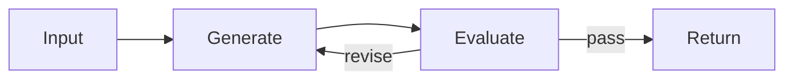

# Evaluator-Optimizer

Evaluator-Optimizer pairs a generator with an evaluator. The generator proposes; the evaluator scores; the optimizer revises or stops.

Source: [`evaluator-optimizer-pattern`](https://github.com/GTuritto/Agentic-Systems-Patterns/tree/main/evaluator-optimizer-pattern)
