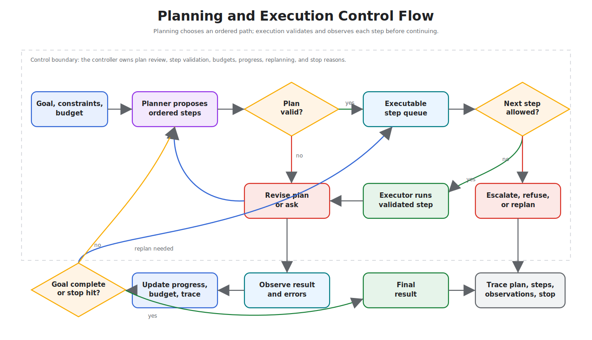

# Planning and Execution

Planning separates deciding what to do from doing it. The planner creates steps; the executor runs them, reports progress, and handles errors.

> Source and downloads
>
> - [Repository source](https://github.com/GTuritto/Agentic-Systems-Patterns/tree/main/planning-pattern)
> - [Download code bundle](/downloads/planning-and-execution.zip)

## Intent

Planning separates deciding what to do from doing it. The planner creates steps; the executor runs them, reports progress, and handles errors.

## Use When

- The task has meaningful sequencing, dependencies, or recoverable failure points.
- You want to inspect or revise the plan before execution.
- Execution can be deterministic even if planning uses a model.

## Avoid When

- The plan would always be a single step.
- The executor cannot report structured progress or failure.
- The model is allowed to execute unvalidated plans directly.

## Architecture

Use this diagram to read Planning and Execution as a system boundary, not only a code shape. The key ownership question is: the loop controller owns progress, budgets, stop conditions, and recovery state.



Read it as a controlled handoff: the planner proposes steps, the controller validates the plan, and the executor runs only validated steps with observable progress.

## System Shape

- **Pattern boundary:** a controller repeatedly chooses the next step, executes it, observes the result, and decides whether to continue.
- **State owner:** the loop controller owns progress, budgets, stop conditions, and recovery state.
- **Primary artifact:** `planning-pattern/` contains the runnable reference implementation and examples.
- **Operational promise:** Planning separates deciding what to do from doing it. The planner creates steps; the executor runs them, reports progress, and handles errors.
- **Runnable path:** start with `npm run plan:test` before adapting the pattern to a larger system.

## Core Protocol

1. Initialize goal state, constraints, budgets, and stop conditions.
2. Choose the next action from the current state instead of assuming the whole path upfront.
3. Execute the action through a validated tool, worker, or local function.
4. Observe the result and update state with evidence, errors, and remaining work.
5. Stop, retry, re-plan, or escalate according to explicit policy.

## Implementation Notes

- Keep the pattern boundary explicit: inputs, state, side effects, and outputs should be visible.
- Validate model-produced decisions before they affect tools, users, or durable state.
- Emit enough trace data to debug failures after the run.

## Failure Modes

- The pattern is applied where a simpler deterministic workflow would be better.
- State, tool calls, or model decisions are not observable enough to debug.
- The system lacks clear stop, retry, or escalation behavior.

## Evaluation Strategy

- Test success cases, partial failure, repeated failure, budget exhaustion, and bad intermediate observations.
- Assert that the loop stops for the right reason and does not hide failed steps.
- Measure completion rate, number of iterations, recovery quality, cost, and latency.
- Include cases that prove each "Use When" condition is true for this pattern.
- Include negative cases from "Avoid When" so the system chooses a simpler or safer pattern when appropriate.

## Production Checklist

- Set hard iteration, cost, and time limits.
- Persist state after meaningful steps if the run can be interrupted.
- Make retries idempotent or add compensation.
- Expose trace events for each decision, action, observation, and stop reason.
- Define human escalation for ambiguous, high-risk, or policy-blocked work.
- Keep the source bundle, generated chapter, tests, and deployment artifact in the same release.

## Run the Example

```sh
npm run plan:test
npm run plan:run -- "Compute average of [1,2,3,4]"
npm run plan:py
```

## Code Walkthrough

Read the excerpt as the smallest executable expression of the pattern. The surrounding chapter explains the design constraints; the code shows where those constraints become concrete interfaces, state, validation, or control flow.

## Source Code

These excerpts show the implementation shape. The complete code is available in the download bundle and repository source.

### `planning-pattern/typescript/src/planner.ts`

[Open full source](https://github.com/GTuritto/Agentic-Systems-Patterns/blob/main/planning-pattern/typescript/src/planner.ts)

```ts
import axios from 'axios';

const MISTRAL_API = 'https://api.mistral.ai/v1/chat/completions';

export interface PlanStep { id: string; description: string }
export interface Plan { steps: PlanStep[]; rationale: string }

function extractNumbers(goal: string): number[] {
  const bracketed = goal.match(/\[([^\]]+)\]/)?.[1];
  if (!bracketed) return [1, 2, 3, 4];

  const numbers = bracketed
    .split(',')
    .map(value => Number(value.trim()))
    .filter(Number.isFinite);

  return numbers.length > 0 ? numbers : [1, 2, 3, 4];
}

export async function planTask(goal: string, apiKey?: string): Promise<Plan> {
  if (!apiKey) {
    const numbers = extractNumbers(goal);
    // deterministic fallback plan (no network) for tests
    return { steps: [
      { id: 's1', description: `Load numbers [${numbers.join(',')}]` },
      { id: 's2', description: 'Compute average' }
    ], rationale: 'synthetic' };
  }
  const resp = await axios.post(MISTRAL_API, {
    model: 'mistral-small-latest',
    messages: [
      { role: 'system', content: 'Return JSON {steps: [{id, description}], rationale} for the goal.' },
      { role: 'user', content: goal }
    ],
    temperature: 0
  }, { headers: { Authorization: `Bearer ${apiKey}` } });
  const content = resp.data?.choices?.[0]?.message?.content || '';
  try { return JSON.parse(content); } catch { return { steps: [], rationale: content }; }
}
```

### `planning-pattern/typescript/src/executor.ts`

[Open full source](https://github.com/GTuritto/Agentic-Systems-Patterns/blob/main/planning-pattern/typescript/src/executor.ts)

```ts
export type ExecutionFailure = {
  status: "failed";
  error_type: "unsupported_step" | "missing_numbers";
  step_id: string;
  description: string;
};

export type ExecutionValue = number[] | number | ExecutionFailure;
export type ExecutionResults = Record<string, ExecutionValue>;

export async function executePlan(steps: { id: string; description: string }[], onProgress?: (pct: number, stage: string) => void): Promise<ExecutionResults> {
  const results: ExecutionResults = {};
  for (let i = 0; i < steps.length; i++) {
    const s = steps[i];
    onProgress?.(Math.round((i / steps.length) * 100), s.id);
    // trivial synthetic execution
    if (s.description.includes('Load numbers')) {
      const raw = s.description.match(/\[([^\]]+)\]/)?.[1] ?? '';
      results[s.id] = raw
        .split(',')
        .map(value => Number(value.trim()))
        .filter(Number.isFinite);
    }
    else if (s.description.includes('Compute average')) {
      const arr = Array.isArray(results['s1']) ? results['s1'] : [];
      results[s.id] = arr.length > 0
        ? arr.reduce((a:number,b:number)=>a+b,0)/arr.length
        : {
          status: "failed",
          error_type: "missing_numbers",
          step_id: s.id,
          description: s.description
        };
    } else results[s.id] = {
      status: "failed",
      error_type: "unsupported_step",
      step_id: s.id,
      description: s.description
    };
  }
  onProgress?.(100, 'done');
  return results;
}
```

### `planning-pattern/typescript/src/run.ts`

[Open full source](https://github.com/GTuritto/Agentic-Systems-Patterns/blob/main/planning-pattern/typescript/src/run.ts)

```ts
import { planTask } from './planner.ts';
import { executePlan } from './executor.ts';

async function main() {
  const goal = process.argv.slice(2).join(' ') || 'Compute average of [1,2,3,4]';
  const plan = await planTask(goal, process.env.MISTRAL_API_KEY);
  console.log('Plan:', plan);
  const results = await executePlan(plan.steps, (pct, stage) => console.log('Progress', pct, stage));
  console.log('Results:', results);
}

main();
```

## Download

- [Download source bundle](/downloads/planning-and-execution.zip)
- [Open source folder](https://github.com/GTuritto/Agentic-Systems-Patterns/tree/main/planning-pattern)

The download bundle contains the current `planning-pattern/` folder from this repository.

## Related Patterns

- [ReAct](/control-loops/react)
- [Reflection](/control-loops/reflection)
- [Evaluator-Optimizer](/control-loops/evaluator-optimizer)
- [Choosing the Right Pattern](/pattern-selection/choosing-the-right-pattern)
- [Resource-Aware Agent Design](/pattern-selection/resource-aware-agent-design)
