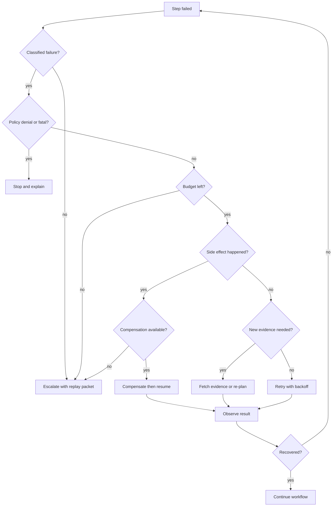

# Self-Healing Workflows

Self-healing workflows detect failed steps and recover through retry, fallback, re-planning, or escalation.

> Source and downloads
>
> - [Repository source](https://github.com/GTuritto/Agentic-Systems-Patterns/tree/main/self-healing-workflow-agent-pattern)
> - [Download code bundle](/downloads/self-healing-workflows.zip)

## Intent

Use this pattern to keep a long-running agentic workflow honest when a step fails. A self-healing workflow does not blindly try again. It records the failure, classifies it, chooses a recovery action, updates state, and stops when recovery would become unsafe or wasteful.

The goal is not perfect uptime. The goal is controlled recovery with evidence.

## Scenario

An account-support agent gathers customer context, checks policy, drafts a resolution, and updates a CRM. The CRM write fails after the draft is created. A weak workflow would rerun the whole task and risk duplicate messages or duplicate records. A self-healing workflow classifies the failure as a partial side effect, keeps the successful draft, retries only the CRM write with an idempotency key, and escalates if the retry still fails.

The important design choice is recovery scope. Recover the failed step, not the entire workflow, unless the state proves the plan is stale.

## Use When

- Failures are expected and can be classified before recovery starts.
- Steps have observable inputs, outputs, side effects, and stop reasons.
- Retries are idempotent, or compensation exists for partial side effects.
- Fallbacks reduce authority, cost, or risk instead of hiding the failure.
- Re-planning uses new evidence, changed state, or a confirmed stale plan.
- Human escalation has an owner, message, and handoff packet.

## Avoid When

- The workflow cannot tell transient, fatal, policy, and partial-side-effect failures apart.
- Retrying a step can repeat an irreversible external action.
- The system would call the model again without new evidence.
- The recovery action is more dangerous than the original failure.
- The user or operator cannot inspect why the workflow recovered or stopped.

## Architecture

Use this diagram to read Self-Healing Workflows as a system boundary, not only a code shape. The key ownership question is: the loop controller owns progress, budgets, stop conditions, and recovery state.



Read it as a recovery state machine: every retry, fallback, re-plan, compensation, escalation, and stop reason must be explicit and traceable.

## Decision Rules

Classify before recovery. The controller should choose from a small recovery vocabulary and refuse ambiguous recovery.

| Failure Class | Examples | Recovery Action | Stop Condition |
| --- | --- | --- | --- |
| Transient tool failure | timeout, temporary 5xx, connection reset | retry same step with backoff and idempotency key | retry budget exhausted |
| Rate limit or quota | 429, token quota, per-account throttle | wait, use lower-cost fallback, or reschedule | deadline or budget exhausted |
| Missing evidence | source unavailable, weak retrieval, incomplete tool output | fetch more evidence or ask for clarification | no new source can change the decision |
| Stale plan | dependency changed, previous step invalidated | re-plan from current durable state | repeated stale-plan loop |
| Policy denial | unsafe tool request, forbidden data movement | block, explain, and escalate if needed | always stop autonomous recovery |
| Partial side effect | draft created but CRM write failed | compensate, resume failed step, or escalate | compensation unavailable |
| Fatal domain error | account closed, item unavailable, invalid recipient | stop and return a clear failure | always stop retry loop |



This graph is the production contract: every edge needs a trace event, budget check, and stop reason.

## System Shape

| Component | Owns | Must Emit |
| --- | --- | --- |
| Workflow controller | current step, progress, budgets, stop conditions | selected step, attempt number, remaining budget |
| Failure classifier | failure class, severity, retryability | class, evidence, confidence, ambiguity |
| Recovery policy | retry, fallback, re-plan, compensate, escalate, stop | decision, reason, allowed authority |
| Idempotency layer | duplicate suppression for side effects | key, target, previous result |
| Compensation handler | undo or repair of partial external actions | compensation action, result, residual risk |
| Replay builder | incident packet for debugging and evals | inputs, state, tool outputs, policy version |
| Escalation channel | human owner and user-facing status | owner, summary, next action, deadline |

The controller owns the loop. Tools do not decide to retry themselves, and model calls do not silently re-plan after failure. Recovery is a policy decision over durable state.

## Contract

The smallest useful contract separates step result, failure class, recovery decision, and trace evidence.

```ts
type FailureClass =
  | "transient"
  | "rate_limit"
  | "missing_evidence"
  | "stale_plan"
  | "policy_denied"
  | "partial_side_effect"
  | "fatal";

type RecoveryAction =
  | "retry"
  | "fallback"
  | "replan"
  | "compensate"
  | "escalate"
  | "stop";

type RecoveryDecision = {
  action: RecoveryAction;
  reason: string;
  retryAfterMs?: number;
  requiresNewEvidence: boolean;
  idempotencyKey?: string;
};

type RecoveryTraceEvent = {
  workflowId: string;
  stepId: string;
  attempt: number;
  failureClass: FailureClass;
  decision: RecoveryDecision;
  budgetRemaining: number;
  stopReason?: string;
};
```

This contract prevents a common production bug: treating every failure as a retryable exception.

## Core Protocol

1. Persist workflow state before each step that can create an external side effect.
2. Execute the step through a bounded tool, worker, or model route.
3. If the step succeeds, store evidence and continue.
4. If the step fails, classify the failure with concrete evidence.
5. Check policy, retry budget, time budget, cost budget, and no-progress breaker.
6. Choose one recovery action: retry, fallback, re-plan, compensate, escalate, or stop.
7. Emit a trace event before executing the recovery action.
8. Resume from durable state, not from an optimistic in-memory plan.
9. Convert unresolved incidents into regression evals.

## Workflow Transition Map

| From | Event | To | Required Evidence |
| --- | --- | --- | --- |
| running | step succeeded | running or complete | output, validation result, updated state |
| running | transient failure | retry_wait | failure class, attempt count, backoff |
| retry_wait | timer elapsed | running | same idempotency key and unchanged target |
| running | fallback selected | running | fallback reason and reduced authority |
| running | stale plan detected | replanning | changed state or new evidence |
| replanning | valid plan produced | running | plan diff and validation result |
| running | partial side effect detected | compensating | side-effect ID and compensation rule |
| compensating | compensation succeeded | running or escalated | compensation result and residual risk |
| running | policy denial or fatal error | stopped | policy rule or fatal domain evidence |
| any active state | budget exhausted | escalated | budget values and replay packet |

## Implementation Notes

- Keep retry policy per step. A cheap read call and an outbound payment update should not share a retry rule.
- Use idempotency keys for every side-effecting call, including emails, CRM writes, ticket updates, calendar edits, and file mutations.
- Use backoff and jitter for transient infrastructure failures, not for policy failures.
- Re-plan only when state changed or new evidence arrived. Re-planning with the same facts usually burns tokens.
- Prefer lower-authority fallbacks: draft instead of send, read-only source instead of write source, cached summary instead of live mutation.
- Build replay packets automatically. An operator should not have to reconstruct state from scattered logs.
- Treat compensation as a first-class step with its own success, failure, and escalation path.

## Failure Modes

- The loop retries a policy denial until the budget is exhausted.
- A partial side effect repeats because the retry lacks an idempotency key.
- Re-planning hides the original failure instead of preserving the trace.
- A fallback returns lower-quality data without marking the answer as degraded.
- The controller escalates without enough state for a human to continue.
- No-progress loops consume budget because every iteration looks slightly different.
- Compensation fails and the system keeps acting as if rollback succeeded.
- Recovery policy lives in prompt text only and cannot be audited.

## Review Checklist

Use the [self-healing workflow review checklist](/capstone-assets/templates/self-healing-workflow-review-checklist.txt) before moving a recovery loop past prototype stage.

- Every failure class has an owner and recovery action.
- Every retryable side effect has an idempotency key.
- Every compensation path has a residual-risk message.
- Every stop condition produces a user or operator-facing explanation.
- Every production incident can become a replayable regression eval.

## Evaluation Strategy

Test recovery as behavior, not as exception handling.

| Eval Case | Expected Result |
| --- | --- |
| transient read timeout | retries with backoff, same inputs, trace event recorded |
| repeated timeout | stops or escalates when retry budget is exhausted |
| policy-denied write | does not retry, records policy rule, returns blocked status |
| partial CRM write | compensates or resumes from idempotent state without duplicate write |
| stale plan | re-plans only after evidence changes |
| degraded fallback | marks output as fallback-derived and lower confidence |
| bad classifier | fails eval because recovery action does not match failure class |
| no-progress loop | breaker stops after threshold and emits replay packet |

Measure completion rate, recovered-run rate, unsafe retry rate, duplicate side-effect rate, mean recovery latency, budget burn, escalation quality, and replay success rate.

## Production Checklist

- Define failure classes in code, not only in prompt instructions.
- Set retry, cost, time, and no-progress budgets per workflow and per step.
- Persist state before externally visible side effects.
- Store idempotency keys with action targets and results.
- Require policy denial to stop autonomous recovery.
- Emit structured trace events for failure class, recovery decision, budget, and stop reason.
- Generate replay packets for escalations and failed recoveries.
- Add dashboards for retry rate, fallback rate, compensation rate, escalation rate, and duplicate-prevention hits.
- Turn resolved incidents into regression evals before widening automation.

## Code Walkthrough

Read the excerpt as the smallest executable expression of the pattern. The surrounding chapter explains the design constraints; the code shows where those constraints become concrete interfaces, state, validation, or control flow.

## Source Code

These excerpts show the implementation shape. The complete code is available in the download bundle and repository source.

### `self-healing-workflow-agent-pattern/autogen_typescript_example/self_healing_workflow.ts`

[Open full source](https://github.com/GTuritto/Agentic-Systems-Patterns/blob/main/self-healing-workflow-agent-pattern/autogen_typescript_example/self_healing_workflow.ts)

```ts
type FailureClass =
  | "transient"
  | "rate_limit"
  | "missing_evidence"
  | "stale_plan"
  | "policy_denied"
  | "partial_side_effect"
  | "fatal";

type RecoveryAction = "retry" | "fallback" | "replan" | "compensate" | "escalate" | "stop";

type StepFailure = {
  class: FailureClass;
  message: string;
  sideEffectId?: string;
};

type StepResult =
  | { ok: true; value: string }
  | { ok: false; failure: StepFailure };

function isStepFailure(result: StepResult): result is { ok: false; failure: StepFailure } {
  return result.ok === false;
}

type WorkflowState = {
  workflowId: string;
  stepId: string;
  attempt: number;
  maxAttempts: number;
  budgetRemaining: number;
  idempotencyKey: string;
  trace: string[];
};

type RecoveryDecision = {
  action: RecoveryAction;
  reason: string;
  retryAfterMs?: number;
};

function decideRecovery(state: WorkflowState, failure: StepFailure): RecoveryDecision {
  if (failure.class === "policy_denied") {
    return { action: "stop", reason: "Policy denials are never retried." };
  }

  if (failure.class === "fatal") {
    return { action: "stop", reason: "Fatal domain failure cannot be healed." };
  }

  if (failure.class === "partial_side_effect") {
    return failure.sideEffectId
      ? { action: "compensate", reason: `Compensate partial side effect ${failure.sideEffectId}.` }
      : { action: "escalate", reason: "Partial side effect has no compensation handle." };
  }

  if (state.attempt >= state.maxAttempts || state.budgetRemaining <= 0) {
    return { action: "escalate", reason: "Recovery budget exhausted." };
  }

  if (failure.class === "stale_plan" || failure.class === "missing_evidence") {
    return { action: "replan", reason: "Recovery needs changed state or new evidence." };
  }

  if (failure.class === "rate_limit") {
    return { action: "fallback", reason: "Use lower-cost fallback after quota failure." };
  }

  return {
    action: "retry",
    reason: "Transient failure can retry with same idempotency key.",
    retryAfterMs: Math.min(30_000, 2 ** state.attempt * 250)
  };
}

async function runSelfHealingStep(
  state: WorkflowState,
  step: (idempotencyKey: string) => Promise<StepResult>
): Promise<StepResult> {
  while (state.budgetRemaining > 0) {
    const result = await step(state.idempotencyKey);
    if (result.ok) return result;
    if (!isStepFailure(result)) return result;

    const decision = decideRecovery(state, result.failure);
    state.trace.push(`${state.stepId} attempt ${state.attempt}: ${decision.action} - ${decision.reason}`);

    if (decision.action === "retry") {
      state.attempt += 1;
      state.budgetRemaining -= 1;
```

_Excerpt truncated for readability. Download the bundle or open the source file for the complete implementation._

### `self-healing-workflow-agent-pattern/langgraph_python_example/self_healing_workflow.py`

[Open full source](https://github.com/GTuritto/Agentic-Systems-Patterns/blob/main/self-healing-workflow-agent-pattern/langgraph_python_example/self_healing_workflow.py)

```py
from dataclasses import dataclass, field
from typing import Callable, Literal, Optional, Union

FailureClass = Literal[
    "transient",
    "rate_limit",
    "missing_evidence",
    "stale_plan",
    "policy_denied",
    "partial_side_effect",
    "fatal",
]
RecoveryAction = Literal["retry", "fallback", "replan", "compensate", "escalate", "stop"]

@dataclass
class StepFailure:
    failure_class: FailureClass
    message: str
    side_effect_id: Optional[str] = None

@dataclass
class StepSuccess:
    value: str

StepResult = Union[StepSuccess, StepFailure]

@dataclass
class WorkflowState:
    workflow_id: str
    step_id: str
    attempt: int
    max_attempts: int
    budget_remaining: int
    idempotency_key: str
    trace: list[str] = field(default_factory=list)

@dataclass
class RecoveryDecision:
    action: RecoveryAction
    reason: str
    retry_after_ms: Optional[int] = None

def decide_recovery(state: WorkflowState, failure: StepFailure) -> RecoveryDecision:
    if failure.failure_class == "policy_denied":
        return RecoveryDecision("stop", "Policy denials are never retried.")

    if failure.failure_class == "fatal":
        return RecoveryDecision("stop", "Fatal domain failure cannot be healed.")

    if failure.failure_class == "partial_side_effect":
        if failure.side_effect_id:
            return RecoveryDecision("compensate", f"Compensate partial side effect {failure.side_effect_id}.")
        return RecoveryDecision("escalate", "Partial side effect has no compensation handle.")

    if state.attempt >= state.max_attempts or state.budget_remaining <= 0:
        return RecoveryDecision("escalate", "Recovery budget exhausted.")

    if failure.failure_class in {"stale_plan", "missing_evidence"}:
        return RecoveryDecision("replan", "Recovery needs changed state or new evidence.")

    if failure.failure_class == "rate_limit":
        return RecoveryDecision("fallback", "Use lower-cost fallback after quota failure.")

    return RecoveryDecision(
        "retry",
        "Transient failure can retry with the same idempotency key.",
        retry_after_ms=min(30_000, 2**state.attempt * 250),
    )

def run_self_healing_step(
    state: WorkflowState,
    step: Callable[[str], StepResult],
) -> StepResult:
    while state.budget_remaining > 0:
        result = step(state.idempotency_key)
        if isinstance(result, StepSuccess):
            return result

        decision = decide_recovery(state, result)
        state.trace.append(f"{state.step_id} attempt {state.attempt}: {decision.action} - {decision.reason}")

        if decision.action == "retry":
            state.attempt += 1
```

_Excerpt truncated for readability. Download the bundle or open the source file for the complete implementation._

## Download

- [Download source bundle](/downloads/self-healing-workflows.zip)
- [Open source folder](https://github.com/GTuritto/Agentic-Systems-Patterns/tree/main/self-healing-workflow-agent-pattern)

The download bundle contains the current `self-healing-workflow-agent-pattern/` folder from this repository.

## Related Patterns

- [Planning and Execution](/control-loops/planning-and-execution)
- [ReAct](/control-loops/react)
- [Reflection](/control-loops/reflection)
- [Durable Workflows](/production-runtime/durable-workflows)
- [Circuit Breakers, Fallbacks, and Replay](/pattern-selection/circuit-breakers-fallbacks-replay)
