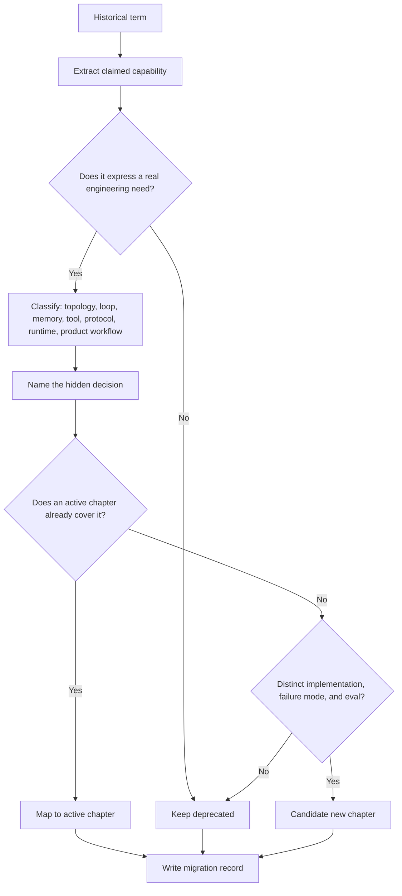

# Deprecated / Historical Patterns

Deprecated patterns are preserved in the repository but removed from the active learning path.

They are either speculative, too broad, duplicated by stronger chapters, or currently too thin to stand as active patterns.

Use this page as a translation guide. Older agent terms still appear in posts, vendor decks, and early prototypes. The active book keeps the useful ideas but moves them into chapters with clearer boundaries, code, and production checks.

Download the reusable worksheet: [historical pattern migration record](/capstone-assets/templates/historical-pattern-migration-record.txt).

## Why This Section Exists

Historical terms are not useless. They often point at real needs: coordination, memory, tool access, delegation, or adaptation. The problem is that many older labels name an aspiration instead of a design.

An online book should help readers translate that aspiration into something testable. Treat this section as a glossary with judgment:

- preserve the useful idea;
- reject the vague label;
- map the idea to the current chapter that gives boundaries, code, evals, and production checks.

Do not cite a historical term as architecture by itself. Use it only as a clue that a more precise design decision is hiding underneath.

## Migration Decision Flow

Use this flow when an old term appears in a roadmap, design review, or vendor comparison. The goal is not to preserve the label; the goal is to recover the engineering decision behind it.



## Migration Map

| Historical Term | Why It Was Deprecated | Read Instead |
| --- | --- | --- |
| Agent Marketplace | Too speculative without protocol, trust, pricing, permissions, and quality controls. | [A2A Agent Interoperability](../tools-skills-protocols/a2a-agent-interoperability), [MCP-first Tool Use](../tools-skills-protocols/mcp-first-tool-use), [Choosing Multi-Agent Topology](../multi-agent-systems/choosing-multi-agent-topology) |
| Agent Swarm | The term hides the actual topology and often implies uncontrolled coordination. | [Parallel Agents](../multi-agent-systems/parallel-agents), [Choosing Multi-Agent Topology](../multi-agent-systems/choosing-multi-agent-topology), [Resource-Aware Agent Design](../pattern-selection/resource-aware-agent-design) |
| Hybrid Agent | Too broad; almost every useful system combines model calls, tools, retrieval, and software. | [Agentic System Architecture](../systems-architecture/agentic-system-architecture), [Reference Architecture](../systems-architecture/reference-architecture) |
| Meta-Cognitive Agent | Useful ideas belong in concrete reflection, evaluation, and improvement loops. | [Reflection](../control-loops/reflection), [Evaluator-Optimizer](../control-loops/evaluator-optimizer), [Self-Improvement](../control-loops/self-improvement) |
| Recursive Agent | Recursion is an implementation technique, not a production pattern by itself. | [Planning and Execution](../control-loops/planning-and-execution), [Goals and State](../foundations/goals-and-state), [Task Delegation](../multi-agent-systems/task-delegation) |
| Distributed Agent | Too vague compared with explicit protocols, workflows, and ownership boundaries. | [A2A Agent Interoperability](../tools-skills-protocols/a2a-agent-interoperability), [Durable Workflows](../production-runtime/durable-workflows), [Reference Architecture](../systems-architecture/reference-architecture) |
| API Integration Copilot | Better treated as an applied tool-use and workflow example. | [Tool Capability Design](../tools-skills-protocols/tool-capability-design), [MCP-first Tool Use](../tools-skills-protocols/mcp-first-tool-use), [Human Approval Gates](../tools-skills-protocols/human-approval-gates) |
| Data Pipeline Orchestrator Agent | Better taught through durable workflows, state, retries, and observability. | [Durable Workflows](../production-runtime/durable-workflows), [Observability and Evals](../production-runtime/observability-and-evals), [Deployment Walkthrough](../production-runtime/deployment-walkthrough) |
| Multi-Modal Tool-Using Agent | Archived until the repository has a developed multimodal implementation and eval suite. | [Tool Capability Design](../tools-skills-protocols/tool-capability-design), [Production Evaluation Feedback Loops](../production-runtime/production-evaluation-feedback-loops) |

## Worked Translations

Use these examples when a design review starts with an older term.

| Claim | Better Translation | Design Question | Current Evidence Needed |
| --- | --- | --- | --- |
| "We need an agent swarm for research." | Run parallel specialist agents only if independent work can be merged safely. | What can run independently, who merges results, and how are conflicts resolved? | Parallel trace, merge rubric, cost budget, and disagreement eval. |
| "We need a recursive agent for planning." | Use bounded planning with explicit depth, stop reasons, and plan validation. | What is the maximum planning depth, and what rejects a bad plan? | Plan schema, stop condition, invalid-plan tests, and replay trace. |
| "We need a distributed agent architecture." | Separate services, queues, workflow state, tool gateways, and agent-to-agent messages. | Which component owns state, policy, retry, and final acceptance? | Service diagram, durable workflow record, A2A envelope, and runbook. |
| "We need a meta-cognitive agent." | Add an evaluator or reflection step only where it improves measurable outcomes. | What does the reviewer check that the first pass cannot check? | Rubric, before/after eval, stop rule, and regression case. |
| "We need an API copilot." | Build a narrow tool-using workflow with permissioned API calls and human approval for risky actions. | Which API action can execute without a human, and which must be approved? | Tool manifest, approval record, auth test, and audit log. |

The translation should make the system less mystical and easier to review. If the clearer version sounds ordinary, that is usually a good sign.

## Replacement Categories

Most deprecated terms map to one of five current design categories.

| Old Language Usually Means | Current Category | Start Here |
| --- | --- | --- |
| "Swarm", "society", "collective", "crew" | Multi-agent topology | [Choosing Multi-Agent Topology](../multi-agent-systems/choosing-multi-agent-topology) |
| "Recursive", "self-planning", "autonomous loop" | Control loop | [Planning and Execution](../control-loops/planning-and-execution) |
| "Meta-cognitive", "self-critiquing", "self-improving" | Evaluation loop | [Reflection](../control-loops/reflection), [Evaluator-Optimizer](../control-loops/evaluator-optimizer) |
| "Distributed", "marketplace", "agent network" | Protocol and service boundary | [A2A Agent Interoperability](../tools-skills-protocols/a2a-agent-interoperability), [Agents As Services](../systems-architecture/agents-as-services) |
| "Copilot", "orchestrator", "assistant for X" | Product workflow with tool permissions | [Tool Capability Design](../tools-skills-protocols/tool-capability-design), [Human Approval Gates](../tools-skills-protocols/human-approval-gates) |

If a term does not fit one category, split it until it does. A term that mixes topology, memory, tools, policy, and UX should become several design decisions, not one pattern.

## Legacy Term Triage Scorecard

Use this scorecard before adding an old term to a roadmap, slide, or architecture document. A low score means the term should stay deprecated. A medium score means the idea should map to an existing chapter. A high score means the term might deserve new pattern work.

| Criterion | 0 Points | 1 Point | 2 Points |
| --- | --- | --- | --- |
| Intent | vague aspiration | clear user or system need | distinct need not covered elsewhere |
| Boundary | no owner or state boundary | partial owner or boundary | explicit owner, state, tools, policy, and acceptance |
| Implementation | demo only or description only | one plausible implementation | runnable implementation with contracts |
| Failure modes | not named | generic risks | specific failures and avoid cases |
| Evaluation | no eval | informal examples | repeatable evals and negative cases |
| Operations | no production story | partial logging or runbook | observability, rollback, budget, and incident path |

Interpret the score:

- 0-4: keep deprecated.
- 5-8: map to existing chapters.
- 9-12: candidate new chapter, but only after code and evals exist.

This scorecard protects the book from vocabulary inflation. A term earns its way into the active path by making engineering decisions clearer.

## How To Read Old Agent Literature

When an older article uses one of these terms, translate it into production questions:

1. What topology does the author actually mean?
2. Who owns state, tools, policy, memory, and final acceptance?
3. Which step is deterministic software, and which step is model judgment?
4. What evidence, trace, or eval would prove the pattern works?
5. Which current chapter teaches the same idea with a clearer boundary?

This keeps old language useful without letting vague labels drive architecture.

## Migration Review Workflow

Use this workflow when a team brings an old pattern name into an architecture review, roadmap, or design document.

1. Classify the claim: topology, control loop, tool boundary, memory, knowledge, runtime, operations, product workflow, or domain packaging.
2. Name the decision hidden by the label: ownership, state, policy, evidence, eval, observability, cost, latency, or human approval.
3. Map the claim to the strongest current chapter.
4. Decide whether the current chapter is enough.
5. Promote a new pattern only if the old term exposes a distinct intent, failure mode, implementation shape, and evaluation method.

Most historical terms fail at step 2. They sound architectural, but they do not tell a reader what to build, test, observe, or reject.

## Do Not Promote A Term Just Because

| Weak Signal | Why It Is Not Enough |
| --- | --- |
| It appears in vendor decks. | Marketing language often compresses several engineering decisions into one vague label. |
| It has many search results. | Popular vocabulary can still be too broad for a book chapter. |
| A demo exists. | A demo proves possibility, not repeatability, boundaries, or production fitness. |
| It maps to several chapters. | If it maps everywhere, it is probably a packaging term rather than a pattern. |
| It sounds more advanced than the replacement chapter. | Better chapters make the decision clearer, not louder. |

## Migration Record

Use this short record when translating a deprecated term into the active book.

```text
legacy_term:
source:
claimed_capability:
actual_decision_needed:
current_chapter:
ownership_boundary:
required_evidence:
promotion_decision: keep_deprecated | map_to_existing | candidate_new_chapter
reason:
```

The record should make the decision auditable. A reader should be able to see why the term stayed deprecated, where the useful idea moved, and what evidence would change the decision.

Download the full version: [historical pattern migration record](/capstone-assets/templates/historical-pattern-migration-record.txt).

### Completed Example

```text
legacy_term: Agent Swarm
source: internal roadmap proposal, Q3 platform planning
claimed_capability: many agents collaborate to research incidents faster than one analyst
actual_decision_needed: whether independent investigation branches can run in parallel and be merged safely
current_chapter: Multi-Agent Systems / Parallel Agents
ownership_boundary: orchestrator owns fan-out, analysts own scoped findings, aggregator owns merge, human incident lead owns final acceptance
required_evidence: parallel trace, merge rubric, cost budget, conflict-handling eval, escalation rule
promotion_decision: map_to_existing
reason: the useful idea is bounded parallel investigation; the swarm label hides merge policy, budget, and final ownership
```

This is the standard: the migration record should replace the old label with a decision another engineer can review.

## Promotion Criteria

A deprecated pattern can return to the active learning path only when it has:

- a crisp intent that differs from existing chapters;
- a runnable reference implementation;
- a concrete code walkthrough;
- eval cases that prove when to use it and avoid it;
- production guidance for state, policy, tools, observability, and failure handling;
- links to templates or checklists readers can reuse.

Without those artifacts, the term stays here as historical vocabulary.

## Reader Value

This chapter exists to reduce confusion. Readers should leave knowing which modern chapter replaces each older term and why the book avoids vague pattern names.

Source archive: [`deprecated`](https://github.com/GTuritto/Agentic-Systems-Patterns/tree/main/deprecated)
