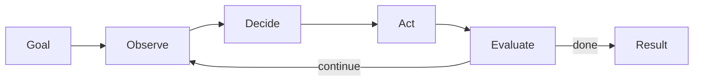

# Agent Loop

The agent loop turns a model call into an agent: observe, decide, act, evaluate, and stop.

The core engineering work is bounding the loop. Define max iterations, cost, timeout, cancellation, and success criteria before the loop starts.

Source: [`agent-loop-pattern`](https://github.com/GTuritto/Agentic-Systems-Patterns/tree/main/agent-loop-pattern)
