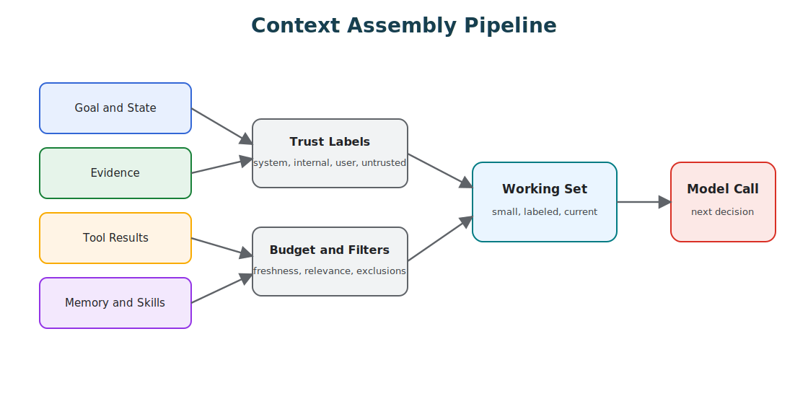

# Context Budgets And Working Sets

Context is not a storage system. It is the model's working set for the next decision, and that distinction is where a lot of agents quietly go wrong. Treat context like a box where anything potentially useful might as well be dropped in, and you get long prompts, duplicated state, stale memory, irrelevant tool output, hidden contradictions, and then missing evidence at the exact moment the model needs it. Context engineering is the discipline of deciding what the model should see right now, and nothing more.



## What You Should Be Able To Do

After this chapter, you should be able to:

- define the working set for one model call;
- separate required, relevant, available, and excluded context;
- write a context manifest that reviewers can inspect;
- explain why each context item was included or omitted;
- test context selection directly instead of guessing from the final answer.

## The Working Set

Borrow the idea from operating systems: the working set is the small set of information needed for the current step. For an agent, that usually means the active goal, the current step, the relevant constraints, compact state, the selected evidence, the tools available for this step, recent observations, any unresolved questions, and the budget and stop rules.

What it should not automatically include is everything else: the full chat history, every retrieved document, every tool result, all memories about the user, all available tools, every file in the workspace, and old plans that no longer match the current state. The model does not need everything. It needs the right things, and choosing them is the work.

## Per-Agent Working Sets

In a multi-agent system, each agent should have its own working set. Giving every agent the same prompt, the same files, the same memory, the same tools, and the same conversation history defeats the point of decomposing the system in the first place.

| Agent Type | Working Set Should Include | Should Usually Exclude |
| --- | --- | --- |
| Router | task summary, route options, policy constraints. | full evidence bundle, long history, write tools. |
| Research agent | query, source rules, retrieval tools, citation requirements. | private memory unrelated to the task, write tools. |
| Tool agent | exact operation, validated inputs, tool contract, policy result. | broad conversation history, unrelated tools. |
| Reviewer | artifact to review, rubric, evidence, acceptance criteria. | implementation scratchpad, irrelevant prior drafts. |
| Supervisor | goal, worker contracts, progress, merge criteria. | every worker's raw context unless needed. |
| Human approver | proposed action, evidence, risk, policy result, diff. | hidden intermediate model chatter. |

This is one of the strongest arguments for treating agents as services. Each agent receives the context its contract requires, not the context the whole system happens to be carrying around.

## Context Budget

Every model call has a budget, even when the context window is large. The tokens you spend break down across instructions, state, evidence, tool descriptions, memory, conversation history, the output you reserve room for, and the cost of any compression you run. A large window does not remove the need for selection. It just makes bad selection more expensive and harder to notice.

Match the budget to the decision. A routing call should not carry the full evidence bundle. A tool-selection call should not carry unrelated user history. A final synthesis call should include evidence and constraints, not every failed intermediate thought the agent had on the way there.

## Context Budget Ledger

Track the budget for each call before the prompt is assembled.

```yaml
context_budget:
  call_type: refund_policy_synthesis
  model_window_tokens: 128000
  reserved_output_tokens: 2000
  max_input_tokens: 18000
  allocation:
    instructions: 1200
    goal_and_state: 900
    policy: 3500
    evidence: 9000
    tool_results: 1800
    memory: 400
    conversation_history: 800
    safety_margin: 400
  omitted:
    - id: old_chat_turns
      reason: "not relevant to current policy decision"
    - id: full_order_history
      reason: "replaced by validated order summary"
```

The ledger should make one thing obvious: context is allocated, not accumulated. If a source has no budget line or inclusion rule, it should not enter the model call by accident.

## Context Manifests

For important agents, define a context manifest: an explicit statement of what is allowed to enter the model call.

| Manifest Field | Example |
| --- | --- |
| Required state | `goal`, `current_step`, `tenant_id`, `policy_version`. |
| Allowed evidence | policy docs, order records, approved knowledge base snippets. |
| Allowed memory | explicit user preferences for this product area. |
| Allowed tool results | read-only lookup results for the current task. |
| Excluded data | secrets, unrelated private data, stale summaries, raw untrusted instructions. |
| Maximum size | token budget by source type. |
| Freshness rule | documents must be current or marked stale. |
| Trust labels | system, user, retrieved, tool, memory, untrusted. |

A manifest turns context selection from prompt craft into system design. Once it exists, it can be reviewed, versioned, tested, and audited like any other part of the system.

In code, a working-set builder should make inclusion rules visible:

```ts
interface ContextItem {
  id: string;
  kind: 'state' | 'evidence' | 'tool_result' | 'memory' | 'instruction';
  trust: 'system' | 'internal' | 'user' | 'untrusted';
  sourceId?: string;
  relevance: number;
  freshness: 'current' | 'stale' | 'unknown';
  tokens: number;
  text: string;
}

type ContextSelection = {
  included: ContextItem[];
  omitted: { id: string; reason: string }[];
};

function buildWorkingSet(items: ContextItem[], maxTokens: number): ContextSelection {
  const required = items.filter(item => item.kind === 'state' || item.kind === 'instruction');
  const optional = items
    .filter(item => item.kind !== 'state' && item.kind !== 'instruction')
    .filter(item => item.trust !== 'untrusted' || item.kind === 'evidence')
    .filter(item => item.freshness !== 'stale')
    .sort((a, b) => b.relevance - a.relevance);

  const selected: ContextItem[] = [];
  const omitted: ContextSelection['omitted'] = [];
  let used = 0;

  for (const item of [...required, ...optional]) {
    if (used + item.tokens > maxTokens) {
      omitted.push({ id: item.id, reason: 'token_budget' });
      continue;
    }

    selected.push(item);
    used += item.tokens;
  }

  for (const item of items) {
    if (selected.includes(item) || omitted.some(omittedItem => omittedItem.id === item.id)) continue;
    if (item.freshness === 'stale') omitted.push({ id: item.id, reason: 'stale' });
    else if (item.trust === 'untrusted' && item.kind !== 'evidence') {
      omitted.push({ id: item.id, reason: 'untrusted_non_evidence' });
    }
  }

  return { included: selected, omitted };
}
```

The point is not this exact scoring function. The point is that context selection becomes inspectable behavior, not hidden prompt assembly. The omitted list matters as much as the included list, because it tells operators whether the model missed evidence, excluded stale memory, or ran out of budget.

## Sources Of Context

Context arrives from different sources, and each source carries a different level of trust.

| Source | Use | Risk |
| --- | --- | --- |
| Instructions | Defines behavior and constraints. | Too broad or contradictory. |
| Goal state | Keeps the task coherent. | Vague success criteria. |
| Working memory | Tracks progress and pending work. | Transcript dump instead of structured state. |
| Retrieved evidence | Grounds answers in sources. | Stale, irrelevant, or injected content. |
| Tool output | Reports external facts or action results. | Untrusted output treated as instruction. |
| Long-term memory | Carries prior knowledge or preferences. | Stale, private, or over-applied memory. |
| Skills | Loads procedural knowledge. | Irrelevant activation or outdated procedure. |
| Conversation history | Preserves user interaction. | Old turns override current task. |

Do not mix these into one blob. Label them, and keep the boundaries sharp: instructions are not evidence, user claims are not verified facts, and tool results are not policy.

## Context Tiers

Tiers are a simple way to decide what actually enters the model.

| Tier | Content | Default Treatment |
| --- | --- | --- |
| Required | Goal, policy, current state, stop rules. | Always include in compact form. |
| Relevant | Evidence, tool results, files, memories for the current step. | Include selectively with source labels. |
| Available | Workspace files, old messages, full documents, extra tools. | Reference by ID and retrieve only when needed. |
| Excluded | Secrets, unrelated private data, stale memory, untrusted instructions. | Keep out of context. |

The split prevents context flooding, and it makes reviews easier, because the team can always ask why a given item was included.

## Curated Context

Curated context means the system deliberately selects the smallest useful set of information before the model call. For a coding agent, that usually runs as a sequence:

1. identify the primary files;
2. search for symbols, imports, tests, and call sites;
3. rank secondary files;
4. load small relevant files directly;
5. load snippets or summaries for large files;
6. exclude unrelated files even when they sit right next to the relevant ones.

The same pattern applies well outside code. A support agent does not need every customer record. It needs the current request, the relevant account facts, the applicable policy, the recent related events, and the tools allowed for this step. Curation is not only a cost optimization. It is a reliability control, because the smaller the working set, the fewer ways the model has to be wrong.

## Progressive Disclosure

Load context in stages rather than all at once. There is no reason to load every document, memory, file, tool description, and prior run artifact at the start of a task. Begin with the minimum needed to choose the next path, then retrieve more only when the state justifies it:

1. route the task from a compact user request;
2. load the policy and state needed for that route;
3. expose read-only tools for investigation;
4. load detailed evidence only after the missing facts are known;
5. expose write tools only after eligibility and approval checks pass;
6. include final evidence for synthesis and the user-facing explanation.

Disclosing context progressively lowers token cost, reduces prompt-injection exposure, and leaves traces that are far easier to inspect afterward.

## Compression

Compression helps when context is large, but it is not free. Prefer structured state over chat summaries, source IDs over pasted documents, short cited snippets over full text, task-specific memory over global memory, and file references over full file contents. When you do summarize, keep the decisions, constraints, and unresolved questions intact.

Some things should never be compressed away: approval state, tool errors, policy constraints, source provenance, contradictions, user corrections, open questions, and stop reasons. Summaries are lossy by nature, so treat them as derived artifacts rather than as the truth of the run.

## Compaction

Compaction is not the same as ordinary summarization. Summarization produces a shorter text; compaction preserves the operational state needed to continue a run. A useful compaction keeps the active goal, the current state, the completed and pending steps, the decisions made, the evidence used and its source IDs, the tool calls and their results, the policy and approval state, the open questions, the known errors, and the stop reasons.

It should not be your primary context strategy. If every run depends on emergency compaction, the system is loading too much context too early. Use compaction as a recovery and continuation mechanism, not as permission to keep flooding the model.

## Compaction Boundaries

Context compaction should happen at stable boundaries, not in the middle of a fragile reasoning step. Good boundaries include:

- after requirements are restated;
- after discovery produces a source list;
- after a plan is accepted;
- after a commit or checkpoint;
- before handing work to another agent.

Each compaction should preserve decisions, open risks, file paths, verification evidence, and user constraints. It should remove transcript noise, not erase accountability.

## Context Minimization

Remove context once it has served its purpose. This matters most for untrusted content. After a user message, web page, email, ticket, or document has been turned into a validated intermediate artifact, the later steps often do not need the raw source text at all:

1. a user message enters as untrusted text;
2. the system extracts intent into a typed request;
3. policy validates the request;
4. later tool calls use the typed request, not the raw text.

That reduces token load and, more importantly, lowers the chance that an old untrusted instruction keeps steering later decisions. Do not minimize blindly, though. Keep enough context to preserve user intent, auditability, and correction paths. The goal is not to forget. It is to stop treating every old token as an active instruction.

## Tool Results

Tool results are context, but they are not instructions. A search result, web page, retrieved document, database row, browser observation, or command output can carry hostile or misleading text, and the model should see all of it as data from a source rather than as a new system message.

Good tool-result context arrives wrapped in its metadata: source, timestamp, trust level, scope, the raw result or excerpt, the parsed fields, any error state, and a correlation ID. Bad tool-result context just pastes the text into the prompt and hopes the model knows what to trust.

## Memory Selection

Memory should not load by default. Before pulling a memory into context, ask whether it is relevant to the current goal, whether it is fresh enough, whether it was user-provided or inferred or imported, whether it is allowed for this user and task, whether it could bias the answer incorrectly, and whether it can be corrected or deleted. Memory is powerful because it persists, and that is exactly what makes it dangerous: a wrong memory can keep failing the system long after the run that created it is gone.

## Working Set Drift

Working set drift is what happens when the context no longer matches the real task. It creeps in through familiar paths: an old plan that survives after the user changes the goal, a stale retrieval result that never leaves context, a compressed summary that drops a constraint, a tool error masked by a later success, a subagent summary that omits its own uncertainty, memory reused from a different domain, or a chat history that slowly drowns the current instructions.

Drift is hard to catch from the final answer alone, which is why you trace the context bundle for each model call rather than only the output.

## Source Trust

Every context item should carry a trust label. Useful ones include system instruction, developer instruction, user request, verified internal data, retrieved internal document, external web content, tool result, long-term memory, generated summary, human approval, and untrusted content. Labels help the model and the runtime interpret context correctly, and they help operators reconstruct why a bad decision happened.

The rule that matters most: lower-trust context must never override higher-trust governance. A retrieved document can provide evidence, but it cannot change tool permissions. A tool result can report state, but it cannot rewrite approval policy. A memory can inform personalization, but it cannot override the current user request.

## Evaluation

Evaluate context selection directly, not just final answers. Useful cases include checking that required evidence is present, that irrelevant evidence is excluded, that stale evidence is rejected, that prompt injection in retrieved text is ignored, that user corrections and tool errors are preserved, that memory is omitted when irrelevant, that summaries preserve constraints, and that the final answer cites the right sources. At the system level, also confirm that each agent's working set contains only what its contract requires, that minimization removes untrusted raw text after extraction, that compaction preserves approval state and open questions, and that the manifest actually rejects excluded data.

Worthwhile metrics include context precision and recall, source freshness, citation faithfulness, token cost, refusal rate when evidence is missing, error-preservation rate, drift rate, over-inclusion rate, missing-critical-context rate, and compaction loss rate. When an answer comes out wrong, inspect the context that produced it before blaming the model.

## Design Checklist

Before shipping a context-heavy agent, work through these questions: What is always included? What is retrieved only when needed? What is never allowed into context? How are sources labeled, and how are tool results kept separate from instructions? How is stale memory detected? How are summaries generated and validated? What context bundle was used for each model call, and can an operator replay the run with the same context? Which evals test context selection rather than only final answers? Does each agent have its own working set? Which raw untrusted inputs are removed after extraction, what does compaction preserve, and which trust labels show up in your traces?

## Design Rule

Do not maximize context. Curate the working set.

## Related Chapters

- [Context Engineering](./context-engineering)
- [What Is An Agent?](./what-is-an-agent)
- [Agent Harnesses](../agent-engineering-practice/agent-harnesses)
- [Agents As Services](../systems-architecture/agents-as-services)
- [Agent Threat Model](../agent-engineering-practice/agent-threat-model)
- [Working Memory](../memory-knowledge/working-memory)
- [Resource-Aware Agent Design](../pattern-selection/resource-aware-agent-design)
- [Semantic Recall and RAG](../memory-knowledge/semantic-recall-rag)
