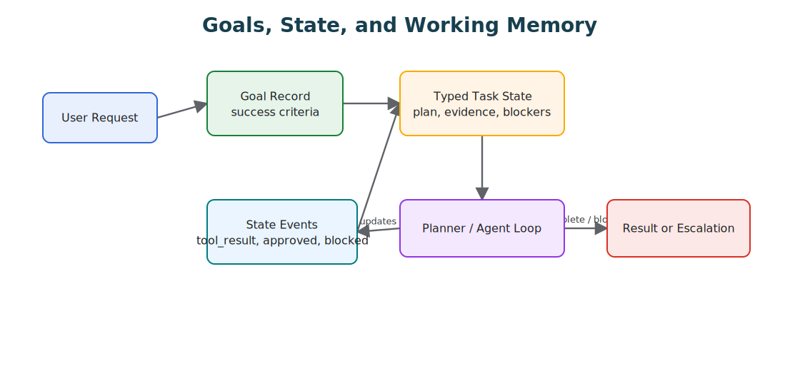

# Goals and State

Goals define success; state records progress. Together they make agent work resumable, inspectable, and easier to evaluate.

> Source and downloads
>
> - [Repository source](https://github.com/GTuritto/Agentic-Systems-Patterns/tree/main/goals-and-state-pattern)
> - [Download code bundle](/downloads/goals-and-state.zip)

## Intent

The Goals and State Pattern separates what the agent is trying to achieve from the mutable state it accumulates while working. Goals define success; state records progress, constraints, evidence, and pending work.

## Use When

- A task spans multiple turns, tools, or agents.
- You need resumable execution after failure or interruption.
- The agent must explain progress against an explicit objective.

## Avoid When

- The task is stateless and can be answered in one call.
- The goal cannot be expressed as observable success criteria.
- State would contain sensitive data you cannot store safely.

## Architecture

## System Shape

- **Pattern boundary:** a narrow agent function, class, or service boundary accepts input plus context and returns a typed answer, action, or decision.
- **State owner:** the caller or a small application service owns task state until a runtime pattern is introduced.
- **Primary artifact:** `goals-and-state-pattern/` contains the runnable reference implementation and examples.
- **Operational promise:** Goals define success; state records progress. Together they make agent work resumable, inspectable, and easier to evaluate.

## Core Protocol

1. Accept a bounded input, goal, or task request.
2. Assemble the minimum useful instructions, context, state, and tool descriptions.
3. Run the model or deterministic helper behind a typed boundary.
4. Validate the result before returning it to users, tools, or durable state.
5. Record enough evidence to explain the output later.

## Implementation Notes

- Store goals as structured records with `id`, `description`, `success_criteria`, `constraints`, `owner`, and `status`.
- Store state separately from chat history. Chat is evidence; state is the operational model.
- Update state through typed events such as `step_started`, `tool_result`, `blocked`, `approved`, and `completed`.
- Make state transitions auditable and idempotent so a workflow can retry safely.

## Failure Modes

- Goals that describe activity rather than success.
- State that becomes a transcript dump instead of a compact task model.
- Agents optimizing for local subgoals that no longer serve the parent goal.
- Lost cancellation or approval state after retries.

## Evaluation Strategy

- Use golden tasks that cover normal requests, ambiguous requests, missing context, and invalid input.
- Check that outputs match the expected shape and that unsafe or unsupported requests are rejected.
- Track accuracy, schema validity, latency, token use, and refusal quality.
- Include cases that prove each "Use When" condition is true for this pattern.
- Include negative cases from "Avoid When" so the system chooses a simpler or safer pattern when appropriate.

## Production Checklist

- Define the input, context, output, and error contract.
- Keep prompts, schemas, and tool descriptions versioned.
- Add deterministic tests for the smallest useful behavior.
- Log model decisions without leaking secrets or private user data.
- Define human escalation for ambiguous, high-risk, or policy-blocked work.
- Keep the source bundle, generated chapter, tests, and deployment artifact in the same release.

## Code Walkthrough

Read the excerpt as the smallest executable expression of the pattern. The surrounding chapter explains the design constraints; the code shows where those constraints become concrete interfaces, state, validation, or control flow.

## Source Code

This pattern currently has no dedicated code excerpt. Use the source and download links below for the full pattern folder.

## Download

- [Download source bundle](/downloads/goals-and-state.zip)
- [Open source folder](https://github.com/GTuritto/Agentic-Systems-Patterns/tree/main/goals-and-state-pattern)

The download bundle contains the current `goals-and-state-pattern/` folder from this repository.

## Related Patterns

- [Agent Loop](https://github.com/GTuritto/Agentic-Systems-Patterns/blob/main/agent-loop-pattern/README.md)
- [Planning Pattern](https://github.com/GTuritto/Agentic-Systems-Patterns/blob/main/planning-pattern/README.md)
- [Durable Workflow](https://github.com/GTuritto/Agentic-Systems-Patterns/blob/main/durable-workflow-pattern/README.md)
