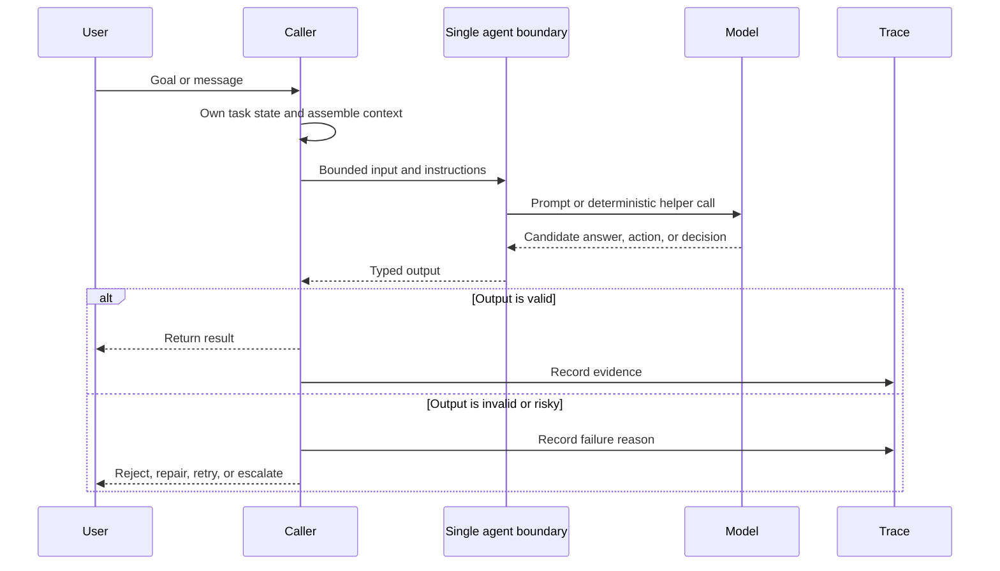

# Single Agent

A single agent receives a goal or message, consults its context, and produces an answer or action. This is the smallest useful unit in the catalog.

> Source and downloads
>
> - [Repository source](https://github.com/GTuritto/Agentic-Systems-Patterns/tree/main/single-agent-pattern)
> - [Download code bundle](/downloads/single-agent.zip)

## Intent

A single agent receives a goal or message, consults its context, and produces an answer or action. This is the smallest useful unit in the catalog.

## Scenario

A support team wants a small assistant that rewrites rough internal notes into a customer-facing reply. The input contains the ticket summary, policy excerpt, and desired tone. The output is a draft response with no tool calls, no memory writes, and no payment authority.

This is a good single-agent baseline because the task has one worker, one bounded context packet, and one typed output. The caller still owns ticket state, policy version, escalation, and final send. The agent owns only the draft.

```text
input:
  ticket_id: T-918
  customer_issue: "Package arrived two days late."
  policy_excerpt: "Late delivery may receive shipping-fee credit, not full refund."
  requested_output: "draft customer reply"

single_agent_allowed:
  - summarize issue
  - draft reply
  - explain policy-backed next step

single_agent_forbidden:
  - issue refund
  - update ticket status
  - send message to customer
  - remember customer preference
```

If the team later needs live order lookup, policy retrieval, approval, or message sending, this pattern has reached its boundary. Keep the single agent as the drafting worker and put tools, state, approval, and delivery in the surrounding workflow.

## Use When

- One model-backed worker can complete the task without delegation.
- The interaction has a narrow objective and a clear success condition.
- You want the simplest useful baseline before adding tools, memory, or orchestration.

## Avoid When

- The task needs stateful retries, external approvals, multiple specialists, or independent evaluation.
- The agent must recover from long-running failure or resume after interruption.

## Architecture



Use this as the baseline architecture. If the system needs durable retries, independent evaluation, tool orchestration, or specialist handoffs, it has moved beyond the single-agent pattern.

## System Shape

- **Pattern boundary:** a narrow agent function, class, or service boundary accepts input plus context and returns a typed answer, action, or decision.
- **State owner:** the caller or a small application service owns task state until a runtime pattern is introduced.
- **Primary artifact:** `single-agent-pattern/` contains the runnable reference implementation and examples.
- **Operational promise:** A single agent receives a goal or message, consults its context, and produces an answer or action. This is the smallest useful unit in the catalog.
- **Runnable path:** start with `npm run single-agent` before adapting the pattern to a larger system.

## Core Protocol

1. Accept a bounded input, goal, or task request.
2. Assemble the minimum useful instructions, context, state, and tool descriptions.
3. Run the model or deterministic helper behind a typed boundary.
4. Validate the result before returning it to users, tools, or durable state.
5. Record enough evidence to explain the output later.

## Implementation Notes

- Keep the pattern boundary explicit: inputs, state, side effects, and outputs should be visible.
- Validate model-produced decisions before they affect tools, users, or durable state.
- Emit enough trace data to debug failures after the run.

## Failure Modes

- The pattern is applied where a simpler deterministic workflow would be better.
- State, tool calls, or model decisions are not observable enough to debug.
- The system lacks clear stop, retry, or escalation behavior.

## Evaluation Strategy

- Use golden tasks that cover normal requests, ambiguous requests, missing context, and invalid input.
- Check that outputs match the expected shape and that unsafe or unsupported requests are rejected.
- Track accuracy, schema validity, latency, token use, and refusal quality.
- Include cases that prove each "Use When" condition is true for this pattern.
- Include negative cases from "Avoid When" so the system chooses a simpler or safer pattern when appropriate.

## Production Checklist

- Define the input, context, output, and error contract.
- Keep prompts, schemas, and tool descriptions versioned.
- Add deterministic tests for the smallest useful behavior.
- Log model decisions without leaking secrets or private user data.
- Define human escalation for ambiguous, high-risk, or policy-blocked work.
- Keep the source bundle, generated chapter, tests, and deployment artifact in the same release.

## Run the Example

```sh
npm run single-agent
```

## Code Walkthrough

Read the excerpt as the smallest executable expression of the pattern. The surrounding chapter explains the design constraints; the code shows where those constraints become concrete interfaces, state, validation, or control flow.

## Source Code

These excerpts show the implementation shape. The complete code is available in the download bundle and repository source.

### `single-agent-pattern/autogen_typescript_example/single_agent.ts`

[Open full source](https://github.com/GTuritto/Agentic-Systems-Patterns/blob/main/single-agent-pattern/autogen_typescript_example/single_agent.ts)

```ts
// Single Agent Pattern - Autogen TypeScript Example
// To run: npm install && npm run single-agent

import axios from 'axios';
import * as readline from 'readline';
import * as dotenv from 'dotenv';
dotenv.config();

const MISTRAL_API_URL = 'https://api.mistral.ai/v1/chat/completions';
const MISTRAL_API_KEY = process.env.MISTRAL_API_KEY;

async function singleAgent(userInput: string): Promise<string> {
  const response = await axios.post(
    MISTRAL_API_URL,
    {
      model: 'mistral-tiny', // or your preferred Mistral model
      messages: [{ role: 'user', content: userInput }],
    },
    {
      headers: {
        'Authorization': `Bearer ${MISTRAL_API_KEY}`,
        'Content-Type': 'application/json',
      },
    }
  );
  return response.data.choices[0].message.content;
}

async function main() {
  const idx = process.argv.indexOf('--input');
  const cliInput = idx !== -1 ? process.argv[idx + 1] : undefined;
  const nonInteractive = cliInput || process.env.NON_INTERACTIVE_INPUT;
  if (nonInteractive) {
    try {
      const agentResponse = await singleAgent(String(nonInteractive));
      console.log('Agent:', agentResponse);
    } catch (err) {
      console.error('Error:', err);
      process.exitCode = 1;
    }
    return;
  }

  const rl = readline.createInterface({ input: process.stdin, output: process.stdout });
  rl.question('User: ', async (userInput: string) => {
    try {
      const agentResponse = await singleAgent(userInput);
      console.log('Agent:', agentResponse);
    } catch (err) {
      console.error('Error:', err);
    }
    rl.close();
  });
}

main();

// duplicate block removed
```

### `single-agent-pattern/langgraph_python_example/single_agent.py`

[Open full source](https://github.com/GTuritto/Agentic-Systems-Patterns/blob/main/single-agent-pattern/langgraph_python_example/single_agent.py)

```py
# Single Agent Pattern - LangGraph Python Example

This example demonstrates the Single Agent Pattern using LangGraph and Python. The agent receives a user message, sends it to a Mistral LLM, and returns the response.

## Requirements

- Python 3.8+
- `langgraph` library
- `python-dotenv` (for .env support)
- Mistral LLM API access

## Install dependencies

``​`bash
pip install langgraph python-dotenv requests
``​`

## Example Code

``​`python
import os
from langgraph import Agent, Environment, LLM
from dotenv import load_dotenv

load_dotenv()

MISTRAL_API_KEY = os.getenv("MISTRAL_API_KEY")
MISTRAL_API_URL = "https://api.mistral.ai/v1/chat/completions"

class SimpleEnvironment(Environment):
    def get_observation(self):
        return input("User: ")
    def send_action(self, action):
        print(f"Agent: {action}")

class SingleAgent(Agent):
    def __init__(self, llm):
        self.llm = llm
    def act(self, observation):
        return self.llm.complete(observation)

llm = LLM(
    provider="mistral",
    api_key=MISTRAL_API_KEY,
    api_url=MISTRAL_API_URL,
)

env = SimpleEnvironment()
agent = SingleAgent(llm)

observation = env.get_observation()
action = agent.act(observation)
env.send_action(action)
``​`

---

- Make sure your `.env` file contains your Mistral API key as `MISTRAL_API_KEY`.
- This is a minimal, functional example.
```

## Download

- [Download source bundle](/downloads/single-agent.zip)
- [Open source folder](https://github.com/GTuritto/Agentic-Systems-Patterns/tree/main/single-agent-pattern)

The download bundle contains the current `single-agent-pattern/` folder from this repository.

## Related Patterns

- [Agent Loop](/foundations/agent-loop)
- [Goals and State](/foundations/goals-and-state)
- [Tool Use](/foundations/tool-use)
- [Choosing the Right Pattern](/pattern-selection/choosing-the-right-pattern)
- [Resource-Aware Agent Design](/pattern-selection/resource-aware-agent-design)
