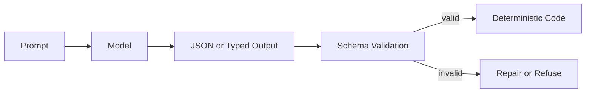

# Structured Output

Structured output constrains model responses to typed data that software can validate and consume.

> Source and downloads
>
> - [Repository source](https://github.com/GTuritto/Agentic-Systems-Patterns/tree/main/structured-output-pattern)
> - [Download code bundle](/downloads/structured-output.zip)

## Intent

The Structured Output Pattern constrains model responses to typed data that software can validate, route, store, and test. It is the boundary between natural language reasoning and deterministic application logic.

## Use When

- Model output controls a tool call, workflow branch, policy decision, or database write.
- Downstream code needs stable fields rather than prose.
- You need regression tests for model-assisted behavior.

## Avoid When

- The output is purely creative prose for human reading.
- A deterministic parser already handles the input safely.
- The schema is so broad that it no longer constrains behavior.

## Architecture

## Implementation Notes

- Define schemas close to the code that consumes them.
- Validate every model response before use, even when the provider offers structured output support.
- Prefer enums for routing decisions and discriminated unions for multi-action outputs.
- Log validation failures and repair attempts as first-class evaluation data.

## Failure Modes

- Schemas that mirror prose and provide little safety.
- Silent coercion of missing or invalid fields.
- Prompt-only formatting rules with no validator.
- Overly strict schemas that cause brittle failures on harmless variation.

## Code Walkthrough

Read the excerpt as the smallest executable expression of the pattern. The surrounding chapter explains the design constraints; the code shows where those constraints become concrete interfaces, state, validation, or control flow.

## Source Code

This pattern currently has no dedicated code excerpt. Use the source and download links below for the full pattern folder.

## Download

- [Download source bundle](/downloads/structured-output.zip)
- [Open source folder](https://github.com/GTuritto/Agentic-Systems-Patterns/tree/main/structured-output-pattern)

The download bundle contains the current `structured-output-pattern/` folder from this repository.

## Related Patterns

- [Modern Tool Use](https://github.com/GTuritto/Agentic-Systems-Patterns/blob/main/modern-tool-use-pattern/README.md)
- [LLM Router](https://github.com/GTuritto/Agentic-Systems-Patterns/blob/main/llm-router-pattern/README.md)
- [Compliance/Policy Enforcer](https://github.com/GTuritto/Agentic-Systems-Patterns/blob/main/compliance-policy-enforcer-agent/README.md)
