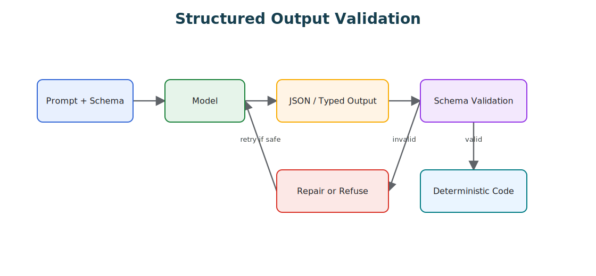

# Structured Output

Structured output constrains model responses to typed data that software can validate and consume.

> Source and downloads
>
> - [Repository source](https://github.com/GTuritto/Agentic-Systems-Patterns/tree/main/structured-output-pattern)
> - [Download code bundle](/downloads/structured-output.zip)

## Intent

The Structured Output Pattern constrains model responses to typed data that software can validate, route, store, and test. It is the boundary between natural language reasoning and deterministic application logic.

## Use When

- Model output controls a tool call, workflow branch, policy decision, or database write.
- Downstream code needs stable fields rather than prose.
- You need regression tests for model-assisted behavior.

## Avoid When

- The output is purely creative prose for human reading.
- A deterministic parser already handles the input safely.
- The schema is so broad that it no longer constrains behavior.

## Architecture



## System Shape

- **Pattern boundary:** a narrow agent function, class, or service boundary accepts input plus context and returns a typed answer, action, or decision.
- **State owner:** the caller or a small application service owns task state until a runtime pattern is introduced.
- **Primary artifact:** `structured-output-pattern/` contains the runnable reference implementation and examples.
- **Operational promise:** Structured output constrains model responses to typed data that software can validate and consume.

## Core Protocol

1. Accept a bounded input, goal, or task request.
2. Assemble the minimum useful instructions, context, state, and tool descriptions.
3. Run the model or deterministic helper behind a typed boundary.
4. Validate the result before returning it to users, tools, or durable state.
5. Record enough evidence to explain the output later.

## Implementation Notes

- Define schemas close to the code that consumes them.
- Validate every model response before use, even when the provider offers structured output support.
- Prefer enums for routing decisions and discriminated unions for multi-action outputs.
- Log validation failures and repair attempts as first-class evaluation data.
- Keep the validated output close to the next runtime action. A valid object should still pass policy, approval, and state checks before it triggers side effects.

## Failure Modes

- Schemas that mirror prose and provide little safety.
- Silent coercion of missing or invalid fields.
- Prompt-only formatting rules with no validator.
- Overly strict schemas that cause brittle failures on harmless variation.

## Evaluation Strategy

- Use golden tasks that cover normal requests, ambiguous requests, missing context, and invalid input.
- Check that outputs match the expected shape and that unsafe or unsupported requests are rejected.
- Track accuracy, schema validity, latency, token use, and refusal quality.
- Include cases that prove each "Use When" condition is true for this pattern.
- Include negative cases from "Avoid When" so the system chooses a simpler or safer pattern when appropriate.

## Production Checklist

- Define the input, context, output, and error contract.
- Keep prompts, schemas, and tool descriptions versioned.
- Add deterministic tests for the smallest useful behavior.
- Log model decisions without leaking secrets or private user data.
- Define human escalation for ambiguous, high-risk, or policy-blocked work.
- Keep the source bundle, generated chapter, tests, and deployment artifact in the same release.

## Code Walkthrough

Read the excerpt as the smallest executable expression of the pattern. The surrounding chapter explains the design constraints; the code shows where those constraints become concrete interfaces, state, validation, or control flow.

## Source Code

These excerpts show the implementation shape. The complete code is available in the download bundle and repository source.

### `structured-output-pattern/structured_decision.ts`

[Open full source](https://github.com/GTuritto/Agentic-Systems-Patterns/blob/main/structured-output-pattern/structured_decision.ts)

```ts
export type RefundDecision =
  | {
      kind: "draft_refund";
      orderId: string;
      amountCents: number;
      policyVersion: string;
      evidenceRefs: string[];
    }
  | {
      kind: "deny_refund";
      orderId: string;
      reason: string;
      policyVersion: string;
      evidenceRefs: string[];
    }
  | {
      kind: "needs_human_review";
      orderId: string;
      reason: string;
      missingEvidence: string[];
    };

export type ValidationResult =
  | { ok: true; decision: RefundDecision }
  | { ok: false; reason: string };

function isStringArray(value: unknown): value is string[] {
  return Array.isArray(value) && value.every(item => typeof item === "string");
}

export function validateRefundDecision(value: unknown): ValidationResult {
  if (!value || typeof value !== "object") {
    return { ok: false, reason: "decision_not_object" };
  }

  const record = value as Record<string, unknown>;
  if (typeof record.orderId !== "string") {
    return { ok: false, reason: "missing_order_id" };
  }

  if (record.kind === "draft_refund") {
    if (typeof record.amountCents !== "number" || record.amountCents <= 0) {
      return { ok: false, reason: "invalid_refund_amount" };
    }

    if (typeof record.policyVersion !== "string" || !isStringArray(record.evidenceRefs)) {
      return { ok: false, reason: "missing_policy_evidence" };
    }

    return { ok: true, decision: record as RefundDecision };
  }

  if (record.kind === "deny_refund") {
    if (
      typeof record.reason !== "string" ||
      typeof record.policyVersion !== "string" ||
      !isStringArray(record.evidenceRefs)
    ) {
      return { ok: false, reason: "invalid_denial_evidence" };
    }

    return { ok: true, decision: record as RefundDecision };
  }

  if (record.kind === "needs_human_review") {
    if (typeof record.reason !== "string" || !isStringArray(record.missingEvidence)) {
      return { ok: false, reason: "invalid_review_request" };
    }

    return { ok: true, decision: record as RefundDecision };
  }

  return { ok: false, reason: "unknown_decision_kind" };
}

export function nextRuntimeAction(decision: RefundDecision): "draft" | "block" | "approval" {
  if (decision.kind === "draft_refund") return "approval";
  if (decision.kind === "deny_refund") return "block";
  return "draft";
}
```

## Download

- [Download source bundle](/downloads/structured-output.zip)
- [Open source folder](https://github.com/GTuritto/Agentic-Systems-Patterns/tree/main/structured-output-pattern)

The download bundle contains the current `structured-output-pattern/` folder from this repository.

## Related Patterns

- [Modern Tool Use](https://github.com/GTuritto/Agentic-Systems-Patterns/blob/main/modern-tool-use-pattern/README.md)
- [LLM Router](https://github.com/GTuritto/Agentic-Systems-Patterns/blob/main/llm-router-pattern/README.md)
- [Compliance/Policy Enforcer](https://github.com/GTuritto/Agentic-Systems-Patterns/blob/main/compliance-policy-enforcer-agent/README.md)
