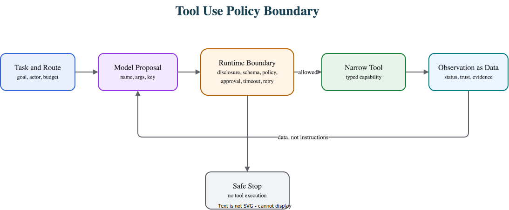

# Tool Use

Tool use gives an agent controlled access to external capability such as calculators, search, databases, files, code execution, APIs, or business systems.

> Source and downloads
>
> - [Repository source](https://github.com/GTuritto/Agentic-Systems-Patterns/tree/main/tool-using-agent-pattern)
> - [Download code bundle](/downloads/tool-use.zip)

## Intent

Tool use lets an agent cross the boundary between language and action. The model can propose a calculation, lookup, retrieval, file operation, API call, workflow step, or business action, but software still owns the real execution boundary.

The important idea is simple: the model does not "use the tool" directly. The model proposes a tool call. The runtime validates the call, checks policy, executes the tool, records the result, and decides whether the observation can influence the next step.

## Use When

- The task needs facts, computation, retrieval, or system access outside the model context.
- The tool can be expressed as a narrow capability with typed inputs and structured outputs.
- Software can validate arguments before execution.
- Permissions and policy checks can sit between model intent and tool execution.
- The result can be traced, replayed, mocked, or audited.

## Avoid When

- A deterministic function or workflow can do the job without model selection.
- The proposed tool is a broad primitive such as `run_sql`, `send_http_request`, or `execute_shell`.
- The tool can create high-risk side effects without approval.
- Tool results contain untrusted content but the system cannot separate data from instructions.
- The team cannot explain which tool calls are allowed, forbidden, retried, or escalated.

## Architecture



## System Shape

- **Pattern boundary:** an agent runtime receives a task, exposes only the tools needed for that task, validates model-proposed calls, and returns a typed result.
- **State owner:** the caller, workflow engine, or agent runtime owns task state. The model should not be the durable state store.
- **Tool owner:** each tool has an owning service or team responsible for schema, permissions, side effects, errors, and trace fields.
- **Policy boundary:** tool execution happens only after schema validation, authorization, budget checks, and approval rules.
- **Operational promise:** tool use expands agent capability without handing the model unrestricted authority.

## Core Protocol

1. Receive a bounded task with caller identity, goal, state reference, and budget.
2. Select the smallest useful tool set for the current task or phase.
3. Ask the model for the next action or final answer.
4. Validate any proposed tool call against schema, permissions, budget, and policy.
5. Execute the tool with timeout, idempotency key, and trace correlation.
6. Return the tool result as observation data, not as new instructions.
7. Stop, retry, escalate, or continue according to explicit runtime rules.

## Implementation Notes

Treat the tool registry as an authority surface. A small registry is better than a large list of vague capabilities.

```ts
type ToolName = 'read_order' | 'search_refund_policy' | 'draft_refund_request';

type ToolRequest = {
  runId: string;
  callerId: string;
  tool: ToolName;
  args: Record<string, unknown>;
  idempotencyKey: string;
};

const allowedToolsByRoute: Record<string, ToolName[]> = {
  refund_investigation: ['read_order', 'search_refund_policy', 'draft_refund_request']
};

function authorizeToolCall(route: string, request: ToolRequest) {
  const allowed = allowedToolsByRoute[route] ?? [];

  if (!allowed.includes(request.tool)) {
    return { status: 'denied', reason: 'tool_not_allowed' };
  }

  if (!request.idempotencyKey) {
    return { status: 'denied', reason: 'missing_idempotency_key' };
  }

  return { status: 'allowed' };
}
```

The model can choose among `read_order`, `search_refund_policy`, and `draft_refund_request`, but it cannot invent `issue_refund` unless the runtime exposes that tool and policy allows it.

Use structured tool results:

```ts
type ToolResult =
  | { status: 'ok'; data: unknown; evidenceRef: string }
  | { status: 'refused'; reason: string }
  | { status: 'retryable_error'; reason: string; retryAfterMs?: number }
  | { status: 'fatal_error'; reason: string };
```

Do not return plain strings for important tools. Plain strings force the model to infer whether the call succeeded, whether retry is safe, and whether the content is trusted.

## Failure Modes

- The model is allowed to call a broad tool that can perform many hidden actions.
- Tool descriptions become the only permission boundary.
- Tool arguments are not validated before execution.
- A retry duplicates a side effect because there is no idempotency key.
- Tool results containing emails, web pages, tickets, or documents are treated as instructions.
- The final answer looks correct, but the tool trajectory used a forbidden or unsafe path.
- Tool errors are vague, so the agent retries blindly or invents missing evidence.
- Traces record the final response but not the proposed call, policy decision, tool result, and stop reason.

## Evaluation Strategy

Tool-use evals should test both capability and restraint.

- Use positive cases where the agent must choose the right tool with valid arguments.
- Use negative cases where the correct behavior is to call no tool, ask for missing input, refuse, or escalate.
- Include forbidden-tool cases such as direct refund issuance, external messaging, shell execution, or private-data export.
- Mock tools so evals can inspect the trajectory without touching real systems.
- Test malformed tool results, timeouts, retryable errors, fatal errors, and untrusted instructions inside tool output.
- Measure tool-selection accuracy, invalid-argument rate, unauthorized-call rate, approval-routing accuracy, unsafe-chain prevention, cost, latency, and stop reason quality.

A minimal mocked-tool eval can look like this:

```json
{
  "case_id": "refund_missing_policy",
  "input": "Customer asks for a refund, but no refund policy is available.",
  "expected": {
    "tools_called": ["read_order", "search_refund_policy"],
    "tools_not_called": ["draft_refund_request", "issue_refund"],
    "final_status": "needs_human"
  }
}
```

The eval is not only checking the final answer. It is checking the path.

## Production Checklist

- Keep every tool narrow and named by business capability.
- Use typed input and output schemas.
- Declare capability class, side effects, permissions, approval rules, and trace fields.
- Validate arguments before execution.
- Enforce permissions outside the prompt.
- Add timeouts, retry limits, idempotency keys, and cancellation behavior.
- Treat untrusted tool output as data, not instructions.
- Log proposed tool call, policy decision, execution result, latency, cost, and stop reason.
- Mock tools in evals before connecting to production systems.
- Keep a circuit breaker for risky tools, model routes, or agent capabilities.

## Run the Example

```sh
npm run tool-using-agent
```

## Code Walkthrough

Read the excerpt as the smallest executable expression of the pattern. The surrounding chapter explains the design constraints; the code shows where those constraints become concrete interfaces, state, validation, or control flow.

## Source Code

These excerpts show the implementation shape. The complete code is available in the download bundle and repository source.

### `tool-using-agent-pattern/autogen_typescript_example/tool_using_agent.ts`

[Open full source](https://github.com/GTuritto/Agentic-Systems-Patterns/blob/main/tool-using-agent-pattern/autogen_typescript_example/tool_using_agent.ts)

```ts
// Tool-Using Agent Pattern - Autogen TypeScript Example
// To run: npm install && npm run tool-using-agent

import axios from 'axios';
import * as readline from 'readline';
import { evaluate } from 'mathjs';
import * as dotenv from 'dotenv';
dotenv.config();

const MISTRAL_API_URL = 'https://api.mistral.ai/v1/chat/completions';
const MISTRAL_API_KEY = process.env.MISTRAL_API_KEY;

function calculatorTool(input: string): string {
  try {
    const val = evaluate(input);
    return val.toString();
  } catch (e) {
    return `Error: ${e}`;
  }
}

async function toolUsingAgent(userInput: string): Promise<string> {
  if (userInput.toLowerCase().startsWith('calculate ')) {
    const expr = userInput.substring('calculate '.length);
    return calculatorTool(expr);
  } else {
    const response = await axios.post(
      MISTRAL_API_URL,
      {
        model: 'mistral-tiny',
        messages: [{ role: 'user', content: userInput }],
      },
      {
        headers: {
          'Authorization': `Bearer ${MISTRAL_API_KEY}`,
          'Content-Type': 'application/json',
        },
      }
    );
    return response.data.choices[0].message.content;
  }
}

async function main() {
  const idx = process.argv.indexOf('--input');
  const cliInput = idx !== -1 ? process.argv[idx + 1] : undefined;
  const nonInteractive = cliInput || process.env.NON_INTERACTIVE_INPUT;
  if (nonInteractive) {
    try {
      const agentResponse = await toolUsingAgent(String(nonInteractive));
      console.log('Agent:', agentResponse);
    } catch (err) {
      console.error('Error:', err);
      process.exitCode = 1;
    }
    return;
  }
  const rl = readline.createInterface({ input: process.stdin, output: process.stdout });
  rl.question('User: ', async (userInput: string) => {
    try {
      const agentResponse = await toolUsingAgent(userInput);
      console.log('Agent:', agentResponse);
    } catch (err) {
      console.error('Error:', err);
    }
    rl.close();
  });
}

main();
```

### `tool-using-agent-pattern/langgraph_python_example/tool_using_agent.py`

[Open full source](https://github.com/GTuritto/Agentic-Systems-Patterns/blob/main/tool-using-agent-pattern/langgraph_python_example/tool_using_agent.py)

```py
# Tool-Using Agent Pattern - LangGraph Python Example

This example demonstrates the Tool-Using Agent Pattern using LangGraph and Python. The agent receives a user message, determines if a tool (calculator) is needed, calls the tool if required, and returns a response. The LLM is Mistral.

## Requirements

- Python 3.8+
- `langgraph` library
- `python-dotenv` (for .env support)
- Mistral LLM API access

## Install dependencies

``​`bash
pip install langgraph python-dotenv requests
``​`

## Example Code

``​`python
import os
from langgraph import Agent, Environment, LLM, Tool
from dotenv import load_dotenv

load_dotenv()

MISTRAL_API_KEY = os.getenv("MISTRAL_API_KEY")
MISTRAL_API_URL = "https://api.mistral.ai/v1/chat/completions"

import sympy as _sp

def safe_calc(expr: str) -> str:
    try:
        return str(_sp.sympify(expr, evaluate=True))
    except Exception as e:
        return f"Error: {e}"

class CalculatorTool(Tool):
    def call(self, input_str):
        return safe_calc(input_str)

class SimpleEnvironment(Environment):
    def get_observation(self):
        return input("User: ")
    def send_action(self, action):
        print(f"Agent: {action}")

class ToolUsingAgent(Agent):
    def __init__(self, llm, tools):
        self.llm = llm
        self.tools = {tool.name: tool for tool in tools}
    def act(self, observation):
        if observation.lower().startswith("calculate "):
            expr = observation[len("calculate "):]
            return self.tools["calculator"].call(expr)
        else:
            return self.llm.complete(observation)

llm = LLM(
    provider="mistral",
    api_key=MISTRAL_API_KEY,
    api_url=MISTRAL_API_URL,
)

calc_tool = CalculatorTool(name="calculator")
env = SimpleEnvironment()
agent = ToolUsingAgent(llm, [calc_tool])

observation = env.get_observation()
action = agent.act(observation)
env.send_action(action)
``​`

---

- Type `calculate 2+2` to see the agent use the calculator tool.
- Replace credentials as needed.
```

## Download

- [Download source bundle](/downloads/tool-use.zip)
- [Open source folder](https://github.com/GTuritto/Agentic-Systems-Patterns/tree/main/tool-using-agent-pattern)

The download bundle contains the current `tool-using-agent-pattern/` folder from this repository.

## Related Patterns

- [Single Agent](/foundations/single-agent)
- [Agent Loop](/foundations/agent-loop)
- [Structured Output](/foundations/structured-output)
- [MCP-first Tool Use](/tools-skills-protocols/mcp-first-tool-use)
- [Tool Capability Design](/tools-skills-protocols/tool-capability-design)
- [Human Approval Gates](/tools-skills-protocols/human-approval-gates)
- [Pattern Evaluation Checklist](/pattern-selection/pattern-evaluation-checklist)
