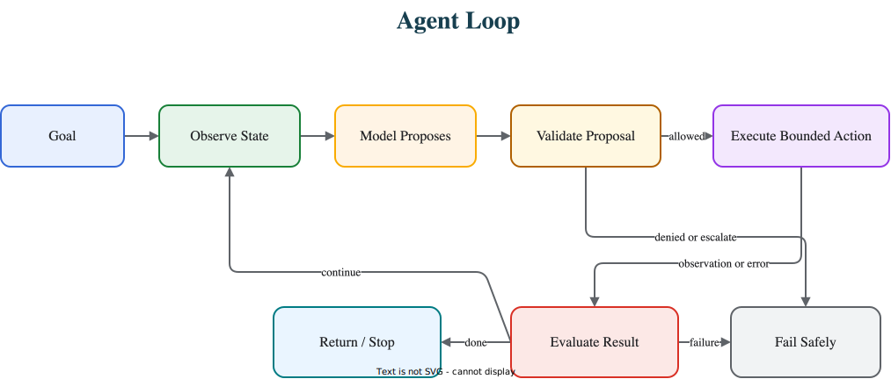

# What Is An Agent?

An agent is not magic. It is a loop with access to a model, some state, a few decisions, and sometimes tools. The loop is the part that matters; everything else is packaging.

A framework may call it a graph, a crew, a swarm, a harness, an assistant, or a runtime. Strip away the names and you usually find the same shape underneath: observe, decide, act, observe again, and eventually stop.

This chapter owns the mechanical definition of an agent. It does not define a framework, product interface, memory system, or production runtime. Those layers surround the loop, but they do not replace it.

Read this before the pattern catalog if you want the plain model first: an agent is a controlled loop, not a personality, a chat window, or a product category. After this, [Architecture Before Autonomy](../pattern-selection/architecture-before-autonomy) explains when that loop is worth using.



## The Minimal Agent

The smallest useful agent needs a goal or input, instructions, context, access to a model, a decision step, state, a rule for what happens next, and a stop condition. Tools are optional, but they are usually what makes the agent worth building.

In plain terms, that is:

```text
input
  -> build context
  -> call model
  -> parse decision
  -> answer, call a tool, ask for help, or stop
  -> update state
  -> repeat if needed
```

Most of agent engineering is making each of those arrows explicit and safe. The diagram is easy. The discipline is in deciding what the model is allowed to do at each step, and what code keeps for itself.

The smallest useful loop can be sketched like this:

```ts
type Decision =
  | { kind: 'answer'; text: string }
  | { kind: 'tool'; name: string; input: unknown }
  | { kind: 'ask_human'; question: string }
  | { kind: 'stop'; reason: string };

interface AgentState {
  goal: string;
  steps: number;
  observations: string[];
  maxSteps: number;
}

async function runAgent(state: AgentState): Promise<Decision> {
  while (state.steps < state.maxSteps) {
    const context = buildWorkingSet(state);
    const decision = await callModelForDecision(context);

    if (decision.kind === 'answer' || decision.kind === 'ask_human') {
      return decision;
    }

    if (decision.kind === 'tool') {
      const result = await callApprovedTool(decision.name, decision.input);
      state.observations.push(JSON.stringify(result));
      state.steps += 1;
      continue;
    }

    return decision;
  }

  return { kind: 'stop', reason: 'step_budget_exhausted' };
}
```

The important part is not the syntax. The model proposes a decision, software validates what can happen next, state is updated, and the loop stops for an explicit reason.

## A Model Call Is Not Yet An Agent

A model call takes input and returns text or structured output. For summarization, extraction, classification, or rewriting, that is often all you need.

An agent adds control flow around the call. It can decide whether more work is needed, whether to use a tool, whether to ask a human, whether to retry, or whether to stop. The difference is not intelligence. It is runtime shape.

| System | What It Can Do | Main Risk |
| --- | --- | --- |
| Model call | Produce one response from provided context. | No action or recovery. |
| Prompt chain | Move through known steps. | Brittle gates and unnecessary latency. |
| Workflow with LLM steps | Let code own the path while models handle judgment. | Overfitting to a fixed process. |
| Agent loop | Choose the next step from observations. | Loops, tool misuse, and hidden state drift. |

So be careful with the word. Not every model-backed feature is an agent. Reserve the term for systems that can make at least some runtime decisions about what to do next.

## Decision Trees Come Before Autonomy

Many useful agents are mostly decision trees with model calls inside them. That is not a weakness, and it is often the right design:

```text
if request is out of scope:
  refuse or redirect
else if account data is missing:
  ask a question
else if policy evidence is missing:
  retrieve documents
else if action is high risk:
  request approval
else:
  call the model to draft the recommendation
```

This is still an agentic system as long as the model is making bounded judgments inside the flow. What keeps it safe is that code owns the policy, the state, and the high-risk transitions. Add autonomy where the decision tree gets too large to maintain, or where the next step genuinely depends on something the run discovers along the way. Adding it anywhere else just buys you risk you did not need.

## Tools Make The Loop Consequential

Without tools, an agent can only produce text. With tools, it can search, calculate, retrieve, write files, browse, call APIs, run code, send messages, update tickets, or change customer data. That is where the system becomes useful, and it is the same place it becomes dangerous.

Never treat a tool call as "the model did it." The model proposed the call; software executed it. That boundary is where most of your safety lives, so it has to be real: tool names are known ahead of time, arguments are typed, permissions are checked before execution, timeouts exist, results are recorded, side effects are auditable, and risky actions wait for approval. The more powerful the tool, the less trust you should leave sitting in the prompt.

## State Makes The Loop Coherent

An agent needs state because the loop needs a memory of its own run. At a minimum, state should be able to answer what the active goal is, what context was used, what has already happened, which tools were called, what evidence was found, what errors occurred, how much budget remains, and why the run stopped.

Conversation history does not cover this. History is evidence of what was said; it is not a model of what the system knows and has done. Real state is what lets the system resume after an interruption, avoid repeating work, explain a decision after the fact, and turn a production incident into an eval case.

## Stop Conditions Are Part Of The Agent

A loop without a stop condition is not an agent. It is a cost generator. Common stop conditions include the success criteria being met, a required field being missing, a non-recoverable tool failure, a policy block, a pending human approval, a max-iteration limit, an exhausted cost or latency budget, or a user cancelling the run.

Whatever ends the run, the stop reason should be explicit. "Done" is not enough. A system worth operating records whether the agent completed, refused, escalated, failed, timed out, or stopped because a budget ran out, because every one of those needs a different response from the people watching it.

## What Frameworks Add

Frameworks do not remove the loop. They package it, and they save real work: graph execution, routing, tool registries, model adapters, memory stores, skills, subagents, durable checkpoints, streaming, human-in-the-loop interrupts, tracing, and deployment hooks. None of that is wasted effort, and rebuilding these primitives by hand is rarely a good use of a team's time.

But the framework does not change the question you have to answer: what does the loop observe, what can it decide, what can it do, and when does it stop? If your team cannot answer that without first naming a framework, it does not understand its own agent yet.

## What Makes An Agent Good

A good agent is not the one with the most autonomy. It is the one whose autonomy is useful and bounded. In practice that means clear goals, narrow tools, explicit state, typed outputs, visible decisions, bounded loops, evals that actually catch regressions, safe failure modes, and human escalation for the risky cases. Bad agents hide all of this inside a prompt and hope the model behaves.

The design rule follows from everything above: if you cannot draw the loop, the tools, the state, and the stop condition, you do not understand the agent yet, and you are not ready to give it autonomy.

The next question is not how to add more autonomy. It is whether the task needs a loop at all. Continue with [Architecture Before Autonomy](../pattern-selection/architecture-before-autonomy), then return to [Agent Loop](./agent-loop) when runtime decisions are justified.

## Related Chapters

- [Architecture Before Autonomy](../pattern-selection/architecture-before-autonomy)
- [Single Agent](./single-agent)
- [Agent Loop](./agent-loop)
- [Goals and State](./goals-and-state)
- [Tool Use](./tool-use)
- [Choosing the Right Pattern](../pattern-selection/choosing-the-right-pattern)
